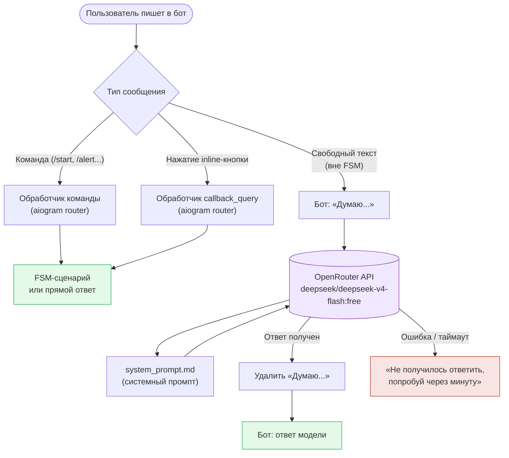
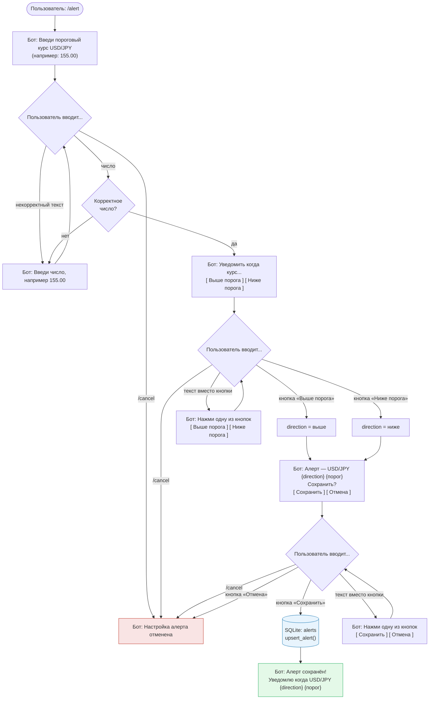
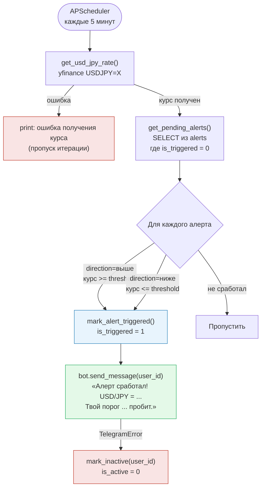
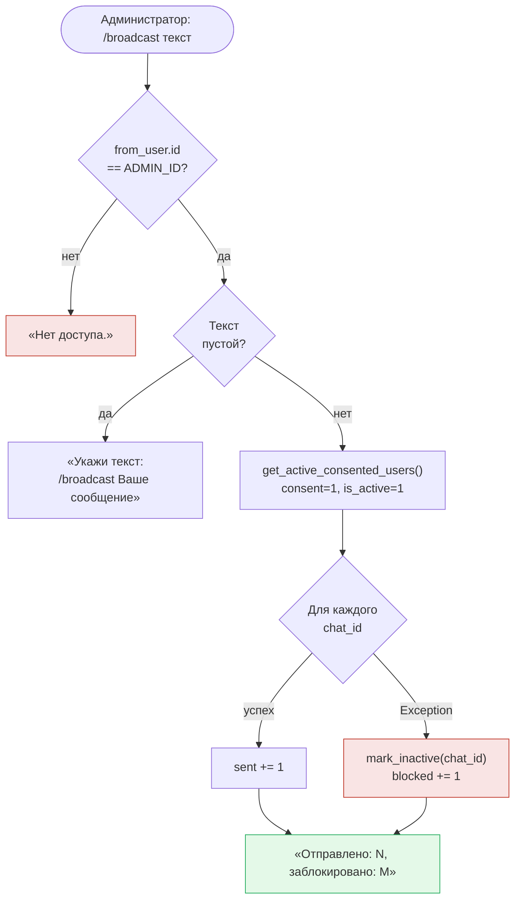
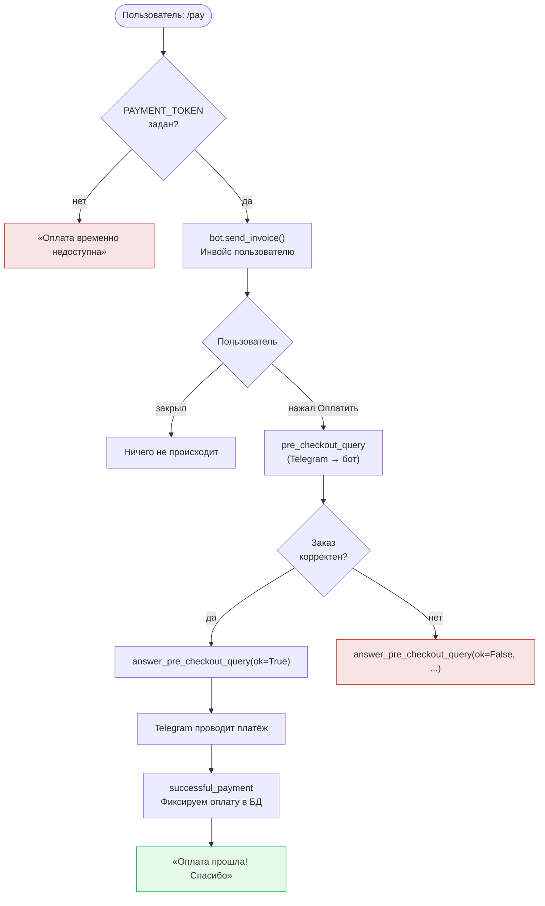

# iron-wake

Telegram-бот для мониторинга валютной пары USD/JPY.

## Что делает
- Следит за курсом USD/JPY через yfinance (тикер `USDJPY=X`)
- Позволяет настроить алерт — уведомление когда курс пробьёт заданный порог
- Уведомляет в Telegram первым (бот пишет пользователю сам)
- Обрабатывает свободный текст через LLM
- Поддерживает рассылку администратором по всем согласившимся пользователям

## Стек
- Python + aiogram 3 (FSM, inline-кнопки)
- SQLite через database.py
- APScheduler (`AsyncIOScheduler`) — фоновая проверка алертов каждые 5 минут
- yfinance — получение текущего курса USD/JPY (`USDJPY=X`)
- OpenRouter API → модель `deepseek/deepseek-v4-flash:free` — обработка свободного текста

## Структура файлов

```
iron-wake/
├── bot.py           — точка входа, все обработчики aiogram, FSM-сценарии, планировщик
├── database.py      — работа с SQLite: init_db(), upsert_alert(), save_user() и др.
├── bot.db           — SQLite-база данных (в .gitignore, создаётся автоматически)
├── system_prompt.md — системный промпт для LLM (читается при старте бота)
├── .env             — секреты: TELEGRAM_BOT_TOKEN, OPENROUTER_API_KEY, ADMIN_ID
├── .env.example     — пример переменных окружения (без значений)
├── схема.md         — схема текущего функционала бота
└── схема-алерт.md   — схема FSM-сценария /alert
```

### Таблица `alerts` (bot.db)

| Поле | Тип | Описание |
|---|---|---|
| id | INTEGER PK | Автоинкремент |
| user_id | INTEGER UNIQUE | Telegram ID пользователя |
| threshold | REAL | Пороговый курс USD/JPY |
| direction | TEXT | «выше» или «ниже» |
| created_at | TEXT | Дата и время сохранения (ISO 8601) |
| is_triggered | INTEGER DEFAULT 0 | 1 — алерт уже сработал, повторно не отправляется |

Один пользователь — один алерт. При повторном `/alert` запись обновляется, `is_triggered` сбрасывается в 0.

### Таблица `users` (bot.db)

| Поле | Тип | Описание |
|---|---|---|
| chat_id | INTEGER PK | Telegram chat_id пользователя |
| user_name | TEXT | Отображаемое имя (full_name) |
| joined_at | TEXT | Дата первого /start (ISO 8601) |
| consent | INTEGER DEFAULT 0 | 1 — пользователь дал согласие на обработку данных |
| consent_at | TEXT | Дата последнего изменения consent |
| is_active | INTEGER DEFAULT 1 | 0 — бот заблокирован пользователем |

Запись создаётся при каждом `/start`. При попытке отправить сообщение заблокировавшему пользователю — `is_active` ставится в 0.

## Принципы
- Простой и читаемый код — всё должно быть понятно без знания Python
- Модульная структура — легко добавлять новые пары и метрики
- Комментарии на русском

## LLM-интеграция

Свободный текст пользователя (всё что не команда и не кнопка) обрабатывается через **OpenRouter**.

| Параметр | Значение |
|---|---|
| Провайдер | [OpenRouter](https://openrouter.ai) |
| Модель | `deepseek/deepseek-v4-flash:free` |
| Системный промпт | `system_prompt.md` (читается при старте) |
| Переменная окружения | `OPENROUTER_API_KEY` в `.env` |
| Таймаут | 30 секунд |

Логика в `bot.py`: функция `ask_openrouter()` делает POST на `https://openrouter.ai/api/v1/chat/completions`. Пока модель думает — пользователю приходит «Думаю...», которое удаляется после ответа. При ошибке — «Не получилось ответить, попробуй через минуту».

### Маршрутизация сообщений



## Архитектура

Текущий функционал (команды, inline-меню, заметки) описан в [схема.md](схема.md).

### Сценарий настройки алерта `/alert`

Реализован через aiogram FSM (`StatesGroup` / `FSMContext`).
Полная схема — [схема-алерт.md](схема-алерт.md).



### Система уведомлений (планировщик + рассылка)

#### Проверка алертов — `check_alerts()`

Запускается автоматически каждые **5 минут** через `AsyncIOScheduler` (APScheduler), а также один раз при старте бота.



#### Управление согласием и рассылка

| Команда | Кто | Что делает |
|---|---|---|
| `/start` | любой | `save_user()` + запрос согласия (inline-кнопки) |
| `/privacy` | любой | Текст политики конфиденциальности |
| `/unsubscribe` | любой | `set_consent(chat_id, 0)` — отключает уведомления |
| `/myid` | любой | Отвечает своим `chat_id` (нужен для настройки `ADMIN_ID`) |
| `/broadcast текст` | только ADMIN_ID | Рассылка всем `consent=1, is_active=1` пользователям |

#### Переменная `ADMIN_ID` в `.env`

```
ADMIN_ID=123456789   # Telegram ID администратора
```

Читается при старте: `ADMIN_ID = int(os.getenv("ADMIN_ID"))`. Если не задана — `/broadcast` недоступен всем. Узнать свой ID: команда `/myid` в боте.

#### Логика `/broadcast`



### Планируемый функционал:


## Приём оплаты

### Общее

Telegram Payments — встроенный механизм оплаты внутри Telegram. Работает через платёжного провайдера (ЮKassa, Robokassa и др.). Бот выставляет инвойс, пользователь платит не выходя из мессенджера.

Цены передаются в **копейках** (целое число): 100 рублей = `10000`.

### Переменная `PAYMENT_TOKEN` в `.env`

```
PAYMENT_TOKEN=381764678:TEST:...   # тестовый токен от BotFather
```

- **Тестовый токен** — содержит `:TEST:` в середине. Деньги не списываются, карту можно указать любую из тестового набора Telegram.
- **Боевой токен** — получить через BotFather → Payments → выбрать провайдера (ЮKassa или Robokassa). Требуется статус самозанятого или ИП, договор с провайдером.

Читается при старте: `PAYMENT_TOKEN = os.getenv("PAYMENT_TOKEN")`. Если не задан — команда `/pay` отвечает «Оплата временно недоступна».

### Команда `/pay`

Отправляет пользователю инвойс через `bot.send_invoice()`:

| Параметр | Значение |
|---|---|
| `title` | Название продукта (например: «Премиум-подписка») |
| `description` | Краткое описание |
| `payload` | Внутренний идентификатор (например: `"premium_1month"`) |
| `provider_token` | `PAYMENT_TOKEN` из `.env` |
| `currency` | `"RUB"` |
| `prices` | Список `LabeledPrice` в копейках |

### Обработчики

| Обработчик | Тип | Что делает |
|---|---|---|
| `pre_checkout_query` | `PreCheckoutQuery` | Подтверждает корректность заказа — обязательно вызвать `answer_pre_checkout_query(ok=True)` в течение 10 сек, иначе платёж отменяется |
| `successful_payment` | `Message` (content_type=SUCCESSFUL_PAYMENT) | Фиксирует факт оплаты; `message.successful_payment` содержит детали транзакции |

### Схема флоу `/pay`



### Тестирование

В тестовом режиме (токен содержит `:TEST:`) Telegram показывает форму с тестовыми картами. Реальные деньги не списываются. Переключение на боевой режим — только замена `PAYMENT_TOKEN` в `.env`.

### Путь к боевому токену

1. Оформить статус самозанятого (приложение «Мой налог»).
2. Зарегистрироваться в ЮKassa или Robokassa и заключить договор.
3. В BotFather: **Payments** → выбрать провайдера → получить токен.
4. Заменить тестовый `PAYMENT_TOKEN` на боевой в `.env`.

## Автор
Аким — вайбкодер, трейдер, термист
