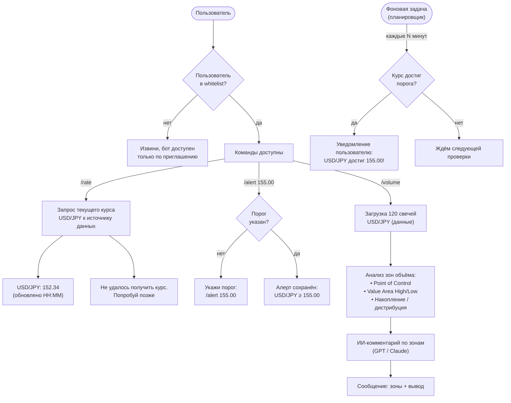

# iron-wake

Telegram-бот для мониторинга валютной пары USD/JPY.

## Что делает
- Следит за объёмами торгов по паре USD/JPY
- Отслеживает зоны маржинальности
- Уведомляет в Telegram когда происходит значимое движение

## Стек (планируемый)
- Python
- Telegram Bot API (библиотека python-telegram-bot)
- Источник данных — решается позже (возможно ccxt или yfinance)

## Принципы
- Простой и читаемый код — всё должно быть понятно без знания Python
- Модульная структура — легко добавлять новые пары и метрики
- Комментарии на русском

## Архитектура

Текущий функционал (команды, inline-меню, заметки) описан в [схема.md](схема.md).

Планируемый функционал:

## Автор
Аким — вайбкодер, трейдер, термист
