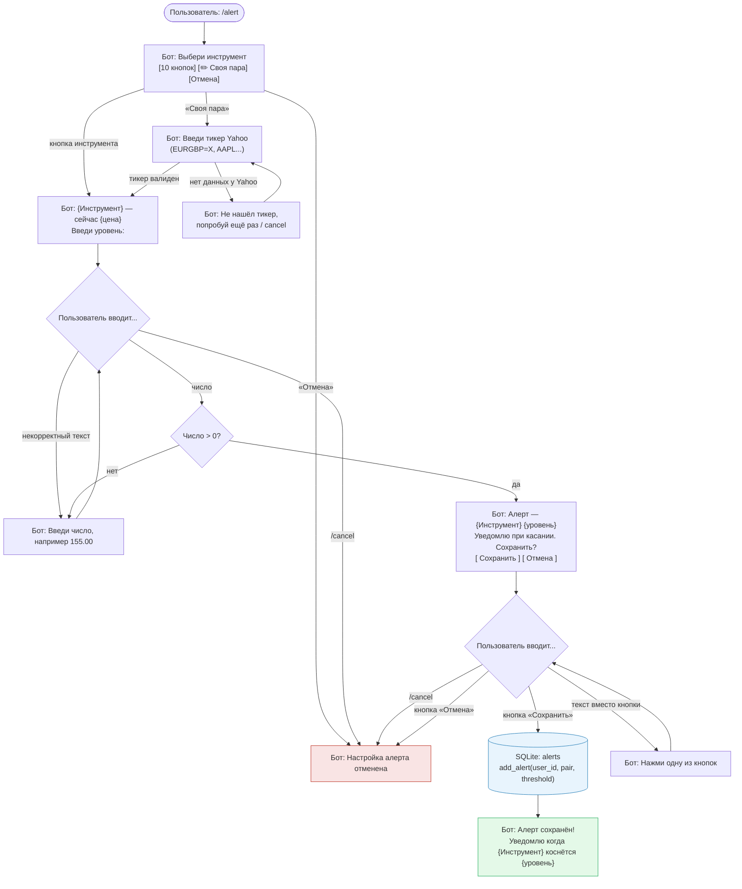
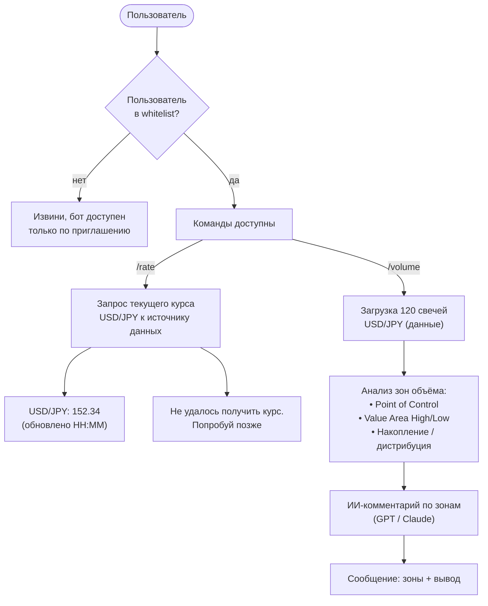

# iron-wake

Telegram-бот для мониторинга финансовых инструментов (форекс, металлы, нефть, крипта).

## Что делает
- Следит за курсами инструментов через yfinance (см. реестр `instruments.py`)
- Позволяет настроить алерт на уровень — уведомление когда цена **коснётся** заданного уровня
  (срабатывание ловится по диапазону минутных свечей, направление выбирать не нужно)
- Алертов у пользователя может быть много, на разные инструменты
- Поддерживает выбор инструмента из списка кнопок **или** ввод своего тикера Yahoo Finance
- Уведомляет в Telegram первым (бот пишет пользователю сам)
- Обрабатывает свободный текст через LLM
- Поддерживает рассылку администратором по всем согласившимся пользователям

## Стек
- Python + aiogram 3 (FSM, inline-кнопки)
- SQLite через database.py
- APScheduler (`AsyncIOScheduler`) — фоновая проверка алертов каждые 5 минут
- yfinance + pandas — котировки и минутные свечи по любому тикеру Yahoo Finance
- OpenRouter API → модель `deepseek/deepseek-v4-flash:free` — обработка свободного текста

## Структура файлов

```
iron-wake/
├── bot.py           — точка входа, все обработчики aiogram, FSM-сценарии, планировщик
├── database.py      — работа с SQLite + котировки: init_db(), add_alert(), get_price_window() и др.
├── instruments.py   — реестр инструментов (имя, тикер Yahoo, точность), fmt/infer_decimals/resolve
├── bot.db           — SQLite-база данных (в .gitignore, создаётся автоматически)
├── system_prompt.md — системный промпт для LLM (читается при старте бота)
├── .env             — секреты: TELEGRAM_BOT_TOKEN, OPENROUTER_API_KEY, ADMIN_ID
├── .env.example     — пример переменных окружения (без значений)
├── requirements.txt — зависимости для деплоя
├── схема.md         — схема текущего функционала бота
└── схема-алерт.md   — схема FSM-сценария /alert
```

### Инструменты (`instruments.py`)

Единый реестр `INSTRUMENTS` (код → имя, тикер Yahoo, число знаков после запятой). Готовых пар 10:
USD/JPY, EUR/USD, GBP/USD, USD/CAD, Золото (`GC=F`), Нефть Brent (`BZ=F`), Bitcoin, Solana,
Ethereum, Toncoin (`TON11419-USD`). Плюс «своя пара» — любой тикер Yahoo вводится вручную и
проверяется на лету. `resolve(pair)` различает реестровый код и сырой тикер; для своей пары
точность подбирается по цене (`infer_decimals`).

### Таблица `alerts` (bot.db)

| Поле | Тип | Описание |
|---|---|---|
| id | INTEGER PK | Автоинкремент |
| user_id | INTEGER | Telegram ID пользователя (НЕ unique — алертов может быть много) |
| threshold | REAL | Уровень цены |
| pair | TEXT DEFAULT 'USDJPY' | Код инструмента из реестра или сырой тикер Yahoo (своя пара) |
| start_above | INTEGER NULL | С какой стороны от уровня была цена при первой проверке (NULL → ещё не инициализирован) |
| created_at | TEXT | Дата и время сохранения (ISO 8601) |
| is_triggered | INTEGER DEFAULT 0 | 1 — алерт уже сработал, повторно не отправляется (срабатывает один раз) |

Алертов на пользователя может быть много (разные инструменты и уровни). Каждый `/alert` создаёт
новую запись. Управление — команда `/myalerts` (список + удаление).

### Таблица `users` (bot.db)

| Поле | Тип | Описание |
|---|---|---|
| chat_id | INTEGER PK | Telegram chat_id пользователя |
| user_name | TEXT | Отображаемое имя (full_name) |
| joined_at | TEXT | Дата первого /start (ISO 8601) |
| consent | INTEGER DEFAULT 0 | 1 — пользователь дал согласие на обработку данных |
| consent_at | TEXT | Дата последнего изменения consent |
| is_active | INTEGER DEFAULT 1 | 0 — бот заблокирован пользователем |

Запись создаётся при каждом `/start`. При попытке отправить сообщение заблокировавшему пользователю — `is_active` ставится в 0.

## Принципы
- Простой и читаемый код — всё должно быть понятно без знания Python
- Модульная структура — легко добавлять новые пары и метрики
- Комментарии на русском

## LLM-интеграция

Свободный текст пользователя (всё что не команда и не кнопка) обрабатывается через **OpenRouter**.

| Параметр | Значение |
|---|---|
| Провайдер | [OpenRouter](https://openrouter.ai) |
| Модель | `deepseek/deepseek-v4-flash:free` |
| Системный промпт | `system_prompt.md` (читается при старте) |
| Переменная окружения | `OPENROUTER_API_KEY` в `.env` |
| Таймаут | 30 секунд |

Логика в `bot.py`: функция `ask_openrouter()` делает POST на `https://openrouter.ai/api/v1/chat/completions`. Пока модель думает — пользователю приходит «Думаю...», которое удаляется после ответа. При ошибке — «Не получилось ответить, попробуй через минуту».

### Маршрутизация сообщений


## Архитектура

Текущий функционал (команды, inline-меню) описан в [схема.md](схема.md).

### Сценарий настройки алерта `/alert`

Реализован через aiogram FSM (`StatesGroup` / `FSMContext`).
Состояния: `waiting_pair` → (`waiting_custom_pair`) → `waiting_rate` → `waiting_confirm`.
Полная схема — [схема-алерт.md](схема-алерт.md).



При выборе инструмента (и для своей пары) бот сразу показывает **актуальную цену**. Цена
запрашивается только для выбранного инструмента — на этапе показа списка кнопок запросов к Yahoo нет.

### Система уведомлений (планировщик + рассылка)

#### Проверка алертов — `check_alerts()`

Запускается автоматически каждые **5 минут** через `AsyncIOScheduler` (APScheduler), а также один раз при старте бота.

**Логика касания вместо «выше/ниже»:** проверка идёт раз в 5 минут, поэтому ловим не одну точку,
а диапазон минутных свечей за период (`get_price_window` → low/high/last). Алерт срабатывает, если
уровень попал в `[low, high]` (цена доходила до него, хоть фитилём) ИЛИ цена перешла на другую сторону
уровня (`start_above` сменился). При первой проверке у алерта `start_above=NULL` — запоминаем сторону
и ждём следующего цикла (на этом шаге не срабатываем). Срабатывает один раз.

**Только нужные пары:** запрашиваются котировки лишь тех инструментов, на которые есть активные
алерты (по одному запросу на пару за цикл, через `asyncio.to_thread` — не блокируем event loop).

```mermaid
flowchart TD
    SCHED(["APScheduler\nкаждые 5 минут"])

    SCHED --> GET_ALERTS["get_pending_alerts()\nSELECT из alerts где is_triggered = 0"]
    GET_ALERTS --> PAIRS["Собрать distinct pair\n(только пары с алертами)"]
    PAIRS --> GET_WIN["для каждой пары:\nget_price_window(ticker)\n→ low / high / last"]
    GET_WIN -->|ошибка по паре| LOG_ERR["print ошибки\n(пропуск пары)"]

    GET_WIN --> FOR{Для каждого алерта}

    FOR -->|start_above = NULL| INIT["set_alert_side()\nзапомнить сторону, пропустить"]
    FOR -->|уровень в [low, high]\nИЛИ сторона сменилась| TRIGGERED["mark_alert_triggered()\nis_triggered = 1"]
    FOR -->|иначе| SKIP["Пропустить"]

    TRIGGERED --> SEND["bot.send_message(user_id)\n«Алерт сработал! Цена {инструм.}\nдоходила до {уровень}...»"]
    SEND -->|TelegramError| INACTIVE["(в check_alerts только лог;\nmark_inactive — в /broadcast)"]

    TRIGGERED:::db
    SEND:::bot
    LOG_ERR:::err

    classDef bot fill:#e4f9e8,stroke:#27ae60,color:#333
    classDef err fill:#f9e4e4,stroke:#c0392b,color:#333
    classDef db fill:#e8f4fd,stroke:#2980b9,color:#333
```

#### Управление согласием и рассылка

| Команда | Кто | Что делает |
|---|---|---|
| `/start` | любой | `save_user()` + запрос согласия (inline-кнопки) |
| `/privacy` | любой | Текст политики конфиденциальности |
| `/unsubscribe` | любой | `set_consent(chat_id, 0)` — отключает уведомления |
| `/myid` | любой | Отвечает своим `chat_id` (нужен для настройки `ADMIN_ID`) |
| `/broadcast текст` | только ADMIN_ID | Рассылка всем `consent=1, is_active=1` пользователям |

#### Переменная `ADMIN_ID` в `.env`

```
ADMIN_ID=123456789   # Telegram ID администратора
```

Читается при старте: `ADMIN_ID = int(os.getenv("ADMIN_ID"))`. Если не задана — `/broadcast` недоступен всем. Узнать свой ID: команда `/myid` в боте.

#### Логика `/broadcast`


### Планируемый функционал:



## Приём оплаты

### Общее

Telegram Payments — встроенный механизм оплаты внутри Telegram. Работает через платёжного провайдера (ЮKassa, Robokassa и др.). Бот выставляет инвойс, пользователь платит не выходя из мессенджера.

Цены передаются в **копейках** (целое число): 100 рублей = `10000`.

### Переменная `PAYMENT_TOKEN` в `.env`

```
PAYMENT_TOKEN=381764678:TEST:...   # тестовый токен от BotFather
```

- **Тестовый токен** — содержит `:TEST:` в середине. Деньги не списываются, карту можно указать любую из тестового набора Telegram.
- **Боевой токен** — получить через BotFather → Payments → выбрать провайдера (ЮKassa или Robokassa). Требуется статус самозанятого или ИП, договор с провайдером.

Читается при старте: `PAYMENT_TOKEN = os.getenv("PAYMENT_TOKEN")`. Если не задан — команда `/pay` отвечает «Оплата временно недоступна».

### Команда `/pay`

Отправляет пользователю инвойс через `bot.send_invoice()`:

| Параметр | Значение |
|---|---|
| `title` | Название продукта (например: «Премиум-подписка») |
| `description` | Краткое описание |
| `payload` | Внутренний идентификатор (например: `"premium_1month"`) |
| `provider_token` | `PAYMENT_TOKEN` из `.env` |
| `currency` | `"RUB"` |
| `prices` | Список `LabeledPrice` в копейках |

### Обработчики

| Обработчик | Тип | Что делает |
|---|---|---|
| `pre_checkout_query` | `PreCheckoutQuery` | Подтверждает корректность заказа — обязательно вызвать `answer_pre_checkout_query(ok=True)` в течение 10 сек, иначе платёж отменяется |
| `successful_payment` | `Message` (content_type=SUCCESSFUL_PAYMENT) | Фиксирует факт оплаты; `message.successful_payment` содержит детали транзакции |

### Схема флоу `/pay`


### Тестирование

В тестовом режиме (токен содержит `:TEST:`) Telegram показывает форму с тестовыми картами. Реальные деньги не списываются. Переключение на боевой режим — только замена `PAYMENT_TOKEN` в `.env`.

### Путь к боевому токену

1. Оформить статус самозанятого (приложение «Мой налог»).
2. Зарегистрироваться в ЮKassa или Robokassa и заключить договор.
3. В BotFather: **Payments** → выбрать провайдера → получить токен.
4. Заменить тестовый `PAYMENT_TOKEN` на боевой в `.env`.

## Автор
Аким — вайбкодер, трейдер, термист
