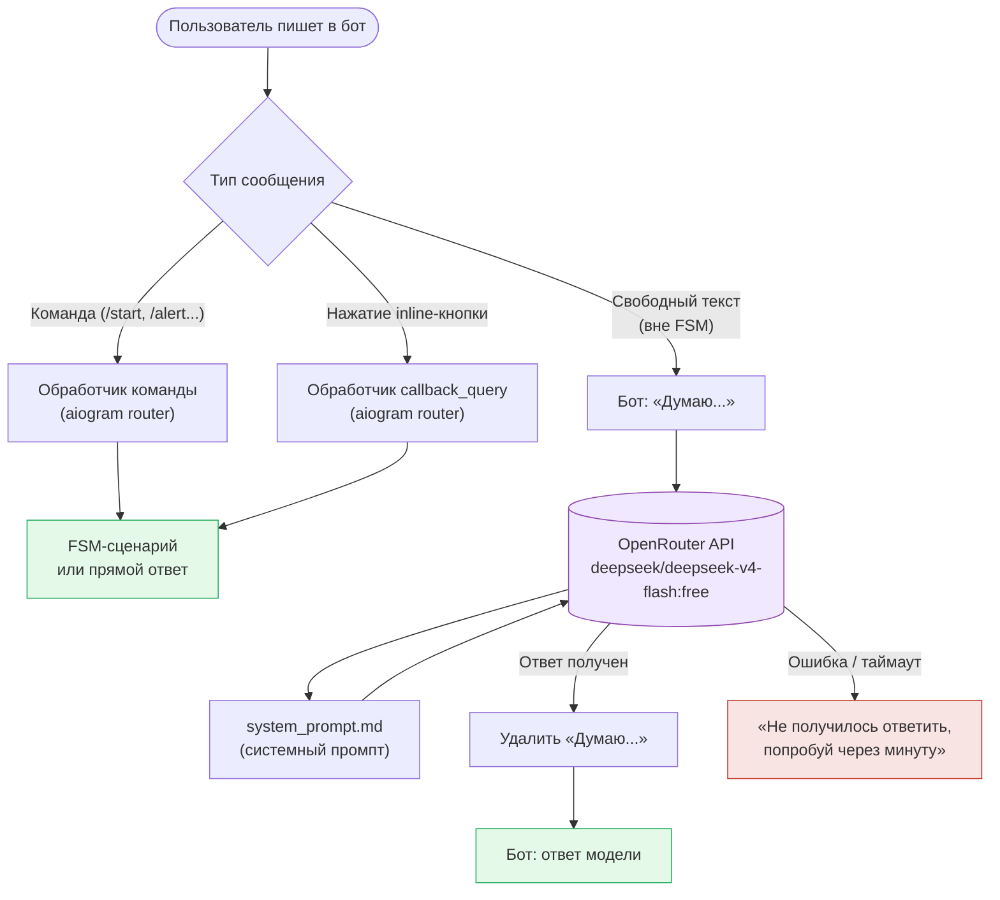
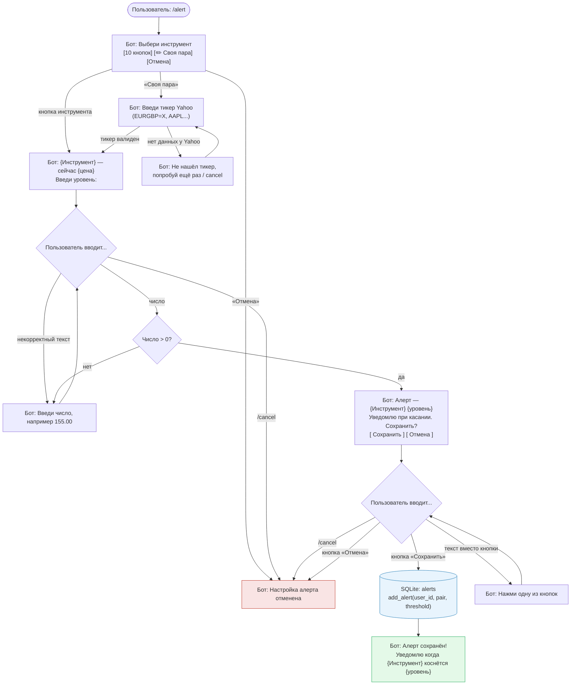
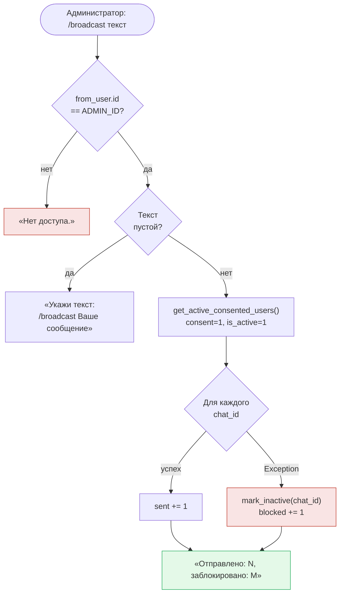
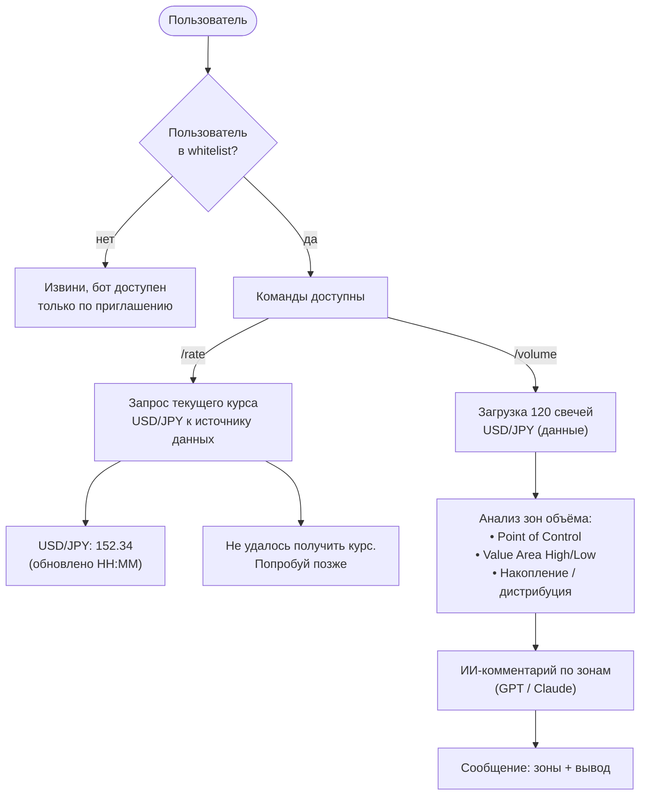
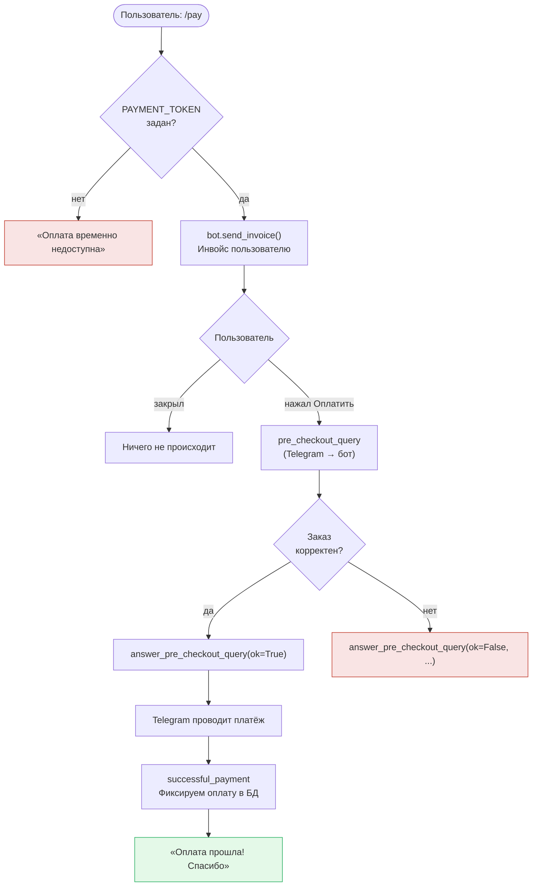

# iron-wake

Telegram-бот для мониторинга финансовых инструментов (форекс, металлы, нефть, крипта).

## Что делает
- Следит за курсами инструментов через yfinance (см. реестр `instruments.py`)
- Позволяет настроить алерт на уровень — уведомление когда цена **коснётся** заданного уровня
  (срабатывание ловится по диапазону минутных свечей, направление выбирать не нужно)
- Алертов у пользователя может быть много, на разные инструменты
- Поддерживает выбор инструмента из списка кнопок **или** ввод своего тикера Yahoo Finance
- **Торговый ассистент (VSA + Spring)** по крипте и форексу (через Kraken — там настоящий объём)
  плюс золоту и нефти (через Yahoo — частичный объём, без стакана): контекстный анализ (тренд H1 +
  уровни + зоны ликвидности + стакан/DOM где есть), авто-сигналы по паттернам ложного пробоя
  Spring/Upthrust и трекинг их исхода (дошло до цели/стопа) — см. «Торговый движок»
- Уведомляет в Telegram первым (бот пишет пользователю сам)
- Обрабатывает свободный текст через LLM
- **Закрытый доступ:** новый пользователь сначала ждёт подтверждения админом (заявка с кнопками
  одобрить/отклонить); до одобрения доступна только `/start` — см. «Доступ по подтверждению»
- Подписчик может написать админу прямо в боте (`/write`), админ отвечает обычным reply
- Поддерживает рассылку администратором по всем согласившимся пользователям

## Стек
- Python + aiogram 3 (FSM, inline-кнопки)
- SQLite через database.py
- APScheduler (`AsyncIOScheduler`) — фоновые задачи: проверка алертов (5 мин), мониторинг
  сигналов (5 мин), трекинг исхода сигналов (5 мин), трекинг сделок журнала (5 мин),
  контекстный анализ (1 час)
- yfinance + pandas — котировки и минутные свечи по любому тикеру Yahoo Finance (простые алерты);
  плюс часовые/дневные OHLCV для движка по золоту/нефти (`get_hourly_candles`/`get_daily_candles`)
- **CCXT + pandas/numpy** — биржевые OHLCV-свечи с настоящим объёмом (крипта + форекс через Kraken) для VSA/Spring
- OpenRouter API → модель из `OPENROUTER_MODEL` — свободный текст + гибридный AI-разбор `/analyze`
  + **NL-роутер команд** (текст словами → действие бота) + комментарий к авто-сигналу (см. `llm.py`)

## Структура файлов

```
iron-wake/
├── bot.py              — точка входа, обработчики aiogram, FSM-сценарии, планировщики,
│                         NL-роутер команд из свободного текста + журнал сделок (/trades)
├── llm.py              — слой OpenRouter: ask_openrouter (чат, /analyze), classify_intent
│                         (NL-роутер: текст → действие), comment_on_signal (комментарий к сигналу)
├── database.py         — SQLite + котировки yfinance: init_db(), add_alert(), get_price_window(),
│                         CRUD уровней/сигналов/подписок/настроек, журнал сделок,
│                         get_hourly_candles/get_daily_candles (Yahoo-свечи для движка)
├── instruments.py      — реестр инструментов (имя, тикер Yahoo, точность, ccxt-символ/source),
│                         fmt/infer_decimals/resolve/engine_codes/data_source/ccxt_symbol
├── config.py           — все пороги/окна/интервалы движка + настраиваемые через /settings значения
├── data_fetcher.py     — загрузка биржевых свечей и стакана (DOM) через CCXT (async) + TTL-кеш
├── analyzer.py         — контекстный анализ: тренд, уровни (D1/H4/H1), ресемпл H4 из часовых,
│                         зоны ликвидности, стакан, приоритизация
├── pattern_detector.py — детектор паттернов Spring (лонг) и Upthrust (шорт) + evaluate_signal (исход)
├── trading_week.py     — недельное окно: вход пн–чт + пятница до 12:00 МСК, гашение перед выходными
│                         (is_entry_allowed / week_close_after / realized_r)
├── scheduler.py        — фоновые задачи движка: run_analysis (1ч) + monitor_signals (5м) +
│                         track_signals (5м) + track_trades (5м, исход сделок журнала)
├── backtest.py         — бэктест движка на истории: замер MAE и сравнение вариантов стопа
│                         (--sweep stop) или порога объёма (--sweep vol, --by-source) —
│                         калибровка по факту, а не на глаз — см. «Бэктест»
├── money.py            — перевод результата из R в деньги: счёт, просадка, серии убытков,
│                         издержки (комиссия/спред). Отвечает на «что будет со счётом»
├── tests/test_engine.py— юнит-тесты аналитики и паттернов на синтетических свечах
├── tests/test_backtest.py— юнит-тесты бэктеста: MAE, сводка, честность прогона
├── tests/test_trading_week.py— юнит-тесты недельного окна: календарь, блок входов,
│                         крипта 24/7 (окно к ней не применяется),
│                         гашение сделки в пятницу, результат в R
├── bot.db              — SQLite-база данных (в .gitignore, создаётся автоматически)
├── settings.json       — рантайм-пороги от /settings (в .gitignore, создаётся при правке)
├── system_prompt.md    — системный промпт для LLM (читается при старте бота)
├── .env                — секреты: TELEGRAM_BOT_TOKEN, OPENROUTER_API_KEY, ADMIN_ID, CCXT_PROXY
│                         ⚠️ сохранять БЕЗ BOM — см. «Грабли: BOM в .env» ниже
├── .env.example        — пример переменных окружения (без значений)
├── requirements.txt    — зависимости для деплоя
├── схема.md            — схема текущего функционала бота
└── схема-алерт.md      — схема FSM-сценария /alert
```

### Инструменты (`instruments.py`)

Единый реестр `INSTRUMENTS` (код → имя, тикер Yahoo, точность, ccxt-символ). Готовых пар **20**:
форекс (EUR/USD, GBP/USD, AUD/USD, USD/CAD), Золото (`GC=F`), Нефть Brent (`BZ=F`) и **14 крипто-пар**
— BTC, ETH, SOL, TON плюс добавленные 6 августа 2026 XRP, ADA, XLM, AVAX, SUI, UNI, LTC, AAVE,
DOGE, LINK (см. «Расширение крипто-набора»). Плюс «своя пара» — любой тикер Yahoo вводится вручную
и проверяется на лету. `resolve(pair)` различает реестровый код и сырой тикер; для своей пары
точность подбирается по цене (`infer_decimals`).

**Кнопки — по 3 в ряд** (`pairs_keyboard`, `engine_keyboard`): при 20 инструментах раскладка по
два превращается в простыню, поэтому имена держим короткими («Cardano», а не «Cardano (ADA)»).
У `/subscribe` снизу два массовых действия — «Подписаться на всё» / «Отписаться от всего»
(коды инструментов заглавные, поэтому служебные `__all`/`__none` с ними не столкнутся).

**Источник объёма для движка — `data_source(code)`** (вход в движок — `engine_codes()` = у кого
источник есть):
- `"ccxt"` (поле `"ccxt"` = символ + биржа) — настоящий биржевой объём с **Kraken**: вся крипта
  (14 пар) и форекс (EUR/USD, GBP/USD, AUD/USD, USD/CAD). Kraken не блокирует РФ
  (в отличие от Binance 451 / Bybit 403), даёт объём и по крипте, и по фиат-парам, есть стакан (DOM).
- `"yahoo"` (поле `"source": "yahoo"`) — **Золото (`GC=F`), Нефть Brent (`BZ=F`)**: на Kraken-споте
  фьючерсов на металл/нефть нет, но Yahoo отдаёт по ним почасовой объём (частичный, но для VSA важен
  относительный всплеск). Свечи берёт `scheduler.fetch_candles` → `database.get_hourly_candles` /
  `get_daily_candles`. **Стакана (DOM) у Yahoo нет** → в `/analyze` блок стакана для них пропускается,
  остальное (тренд/уровни/зоны/сигналы) работает.
- `None` — своя пара (сырой тикер) и прочее без источника: только простые алерты «касание уровня».

Простые алерты «касание уровня» работают по всем парам через yfinance (`ticker`) независимо от движка.

### Таблица `alerts` (bot.db)

| Поле | Тип | Описание |
|---|---|---|
| id | INTEGER PK | Автоинкремент |
| user_id | INTEGER | Telegram ID пользователя (НЕ unique — алертов может быть много) |
| threshold | REAL | Уровень цены |
| pair | TEXT DEFAULT 'USDJPY' | Код инструмента из реестра или сырой тикер Yahoo (своя пара) |
| start_above | INTEGER NULL | С какой стороны от уровня была цена при первой проверке (NULL → ещё не инициализирован) |
| created_at | TEXT | Дата и время сохранения (ISO 8601) |
| is_triggered | INTEGER DEFAULT 0 | 1 — алерт уже сработал, повторно не отправляется (срабатывает один раз) |

Алертов на пользователя может быть много (разные инструменты и уровни). Каждый `/alert` создаёт
новую запись. Управление — команда `/myalerts` (список + удаление).

### Таблица `users` (bot.db)

| Поле | Тип | Описание |
|---|---|---|
| chat_id | INTEGER PK | Telegram chat_id пользователя |
| user_name | TEXT | Отображаемое имя (full_name) |
| joined_at | TEXT | Дата первого /start (ISO 8601) |
| consent | INTEGER DEFAULT 0 | 1 — пользователь дал согласие на обработку данных |
| consent_at | TEXT | Дата последнего изменения consent |
| is_active | INTEGER DEFAULT 1 | 0 — бот заблокирован пользователем |
| access | TEXT DEFAULT 'pending' | Доступ по подтверждению админом: `pending` / `approved` / `denied` |

Запись создаётся при каждом `/start`. При попытке отправить сообщение заблокировавшему пользователю — `is_active` ставится в 0.

**Доступ по подтверждению (`access`).** Бот закрытый: новый пользователь после `/start` получает
`access='pending'`, и до решения админа всё, кроме `/start`, блокируется middleware-гейтом
(`AccessMiddleware`). Админу (`ADMIN_ID`) приходит заявка с кнопками **✅ Одобрить / ❌ Отклонить**
(`approve_{id}` / `deny_{id}`); ожидающие заявки можно посмотреть командой `/requests` (только админ).
Полный список со статусами и управлением — `/users` (кнопка бан/доступ на каждого), снять/вернуть
доступ напрямую — `/ban <id>` / `/unban <id>`. Бан = `access='denied'` (тот же гейт блокирует).
Админ всегда `approved` и проходит гейт без проверки.

**Меню команд разное (`set_my_commands` со scope).** Обычным пользователям — пользовательское
меню (с `/write`, без админских команд и `/settings`). Админу в его чате (`BotCommandScopeChat`
по `ADMIN_ID`) — отдельное меню: админские команды (`/users`, `/requests`, `/ban`, `/unban`,
`/broadcast`, `/settings`) наверху, без `/write` (админу некому себе писать). **Миграция:** при первом добавлении колонки
`access` все, кто уже был в базе, помечаются `approved` (grandfather) — правка не выкидывает текущих
пользователей. Новые после этого — `pending`.

## Торговый движок (VSA + Spring)

Поверх простых алертов работает торговый ассистент по инструментам с **источником объёма**:
- крипта (BTC/ETH/SOL/TON) и форекс (EUR/USD, GBP/USD, AUD/USD, USD/CAD, USD/JPY) — биржевой объём
  с **Kraken** (реальный объём и по крипте, и по фиат-парам, API бесплатный без ключей, РФ не
  блокирует; OANDA не используем — из РФ недоступна);
- **золото и нефть** — почасовой/дневной объём с **Yahoo** (`source="yahoo"`), т.к. фьючерсов на
  Kraken-споте нет. Объём частичный, но для VSA важен относительный всплеск; стакана (DOM) нет.

Какой источник у инструмента — решает `instruments.data_source(code)`; свечи из нужного источника
отдаёт `scheduler.fetch_candles(code, timeframe, limit)` (единый формат DataFrame). Простые алерты
«касание уровня» при этом не тронуты — движок живёт отдельными модулями и таблицами.

### Источник данных — `data_fetcher.py` (Kraken) + Yahoo
**Крипта/форекс:** CCXT (`ccxt.async_support`), публичные эндпоинты, **без API-ключей**. Биржа и
символ заданы в `instruments.py` (поле `"ccxt"`) — для всех это **Kraken** (`BTC/USD`, `TON/USD`,
`EUR/USD`, `USD/JPY` и т.д.). **Золото/нефть:** свечи Yahoo через `database.get_hourly_candles` /
`get_daily_candles` (тот же формат столбцов). Маршрутизацию по источнику делает
`scheduler.fetch_candles`. Свечи (`get_candles(symbol, timeframe, limit, exchange)`) кешируются
в памяти на `config.CACHE_TTL` (H1 — 5 мин, D1 — 1 час). Стакан заявок
(`get_order_book(symbol, limit, exchange)`) — отдельный короткий кеш `config.ORDERBOOK_TTL`
(30 сек, стакан живой). Kraken из РФ работает без прокси; `CCXT_PROXY` оставлен в коде на случай
возврата биржи с гео-блоком (Binance → 451 / Bybit → 403), но для текущего набора не нужен.

### Стратегия №1 — контекстный анализ (`analyzer.py`)
- `get_trend(df)` — глобальный тренд по EMA20: `up`/`down`/`sideways`.
- `find_levels(df, window, timeframe)` — пики/впадины фракталом: D1 окно 5, H4 окно 4, H1 окно 3.
- `resample_h4(h1)` — четырёхчасовые свечи **ресемплом из часовых**, а не отдельным запросом.
  Три причины: у Yahoo (золото, нефть) таймфрейма 4h нет вовсе, так что один код закрывает оба
  источника; бэктест берёт H4 из уже скачанного кеша H1, то есть варианты сравниваются на **том
  же срезе данных**; лишних сетевых запросов ноль. `dropna` обязателен — у золота и нефти рынок
  закрыт часть суток, и без него в дырах появились бы пустые H4-бары.
- `find_liquidity_zones(df, mult)` — свечи с объёмом > среднего × `config.LIQUIDITY_MULT` (зоны
  Smart Money). Порог **фиксирован (1.5) и настройкой не является**: зоны видны только в отчёте
  `/analyze` и на отбор сигналов не влияют, а в меню «настройки движка сигналов» это путало.
- `analyze_order_book(ob, wall_mult)` — сводка по стакану (DOM, по инструментам движка): давление
  сторон (`buyers`/`sellers`/`balance` по дисбалансу объёмов bid/ask), спред и «стены» — крупнейшие
  заявки, чей объём > медианы стороны × `WALL_MULT` (медиана, т.к. сама стена раздувает среднее).
  Запись стакана берётся по индексу — Kraken отдаёт `[цена, объём, время]` (3 элемента). В отчёте
  `/analyze` стакан описан человеческим языком; при очень широком спреде (тонкий стакан, бывает у
  форекс-пар Kraken ночью/в выходные) DOM помечается недостоверным и «стены» не показываются.
  Подмешивается в `/analyze` (текст + AI-промпт); ошибка стакана не валит анализ.
- `prioritize_levels(d1, h1, tol, mid_levels)` — уровень H1, совпавший с D1 в пределах 0.1%, помечается
  `strong`, иначе `weak`. `mid_levels` (H4, только при `config.H4_LEVELS`) — средний слой: совпадение
  H1 с H4 тоже даёт `strong`, а сами уровни H4 добавляются торгуемыми со силой `weak` (⭐ означает
  «совпали два таймфрейма»; раздавать её одиночным H4 значило бы обесценить пометку).
  `mid_levels=None` полностью воспроизводит прежнее поведение — от этого зависит, совпадёт ли
  прогон «как было» с прежними числами.

**Рабочее окно H1 и размер выборки — разные вещи** (`H1_LIMIT`=120 против `H1_FETCH_LIMIT`=480).
Тянем 480 часовых свечей, потому что из них ресемплится H4 (120 свечей дали бы всего 30
четырёхчасовых — мало на EMA20 плюс фракталы), но уровни, тренд и детектор работают по **хвосту
в 120 свечей**, как было всегда. Ширина рабочего окна задаёт набор уровней, а через него цели и
весь набор сигналов — это отдельный рычаг, и менять его заодно со слоем H4 нельзя, иначе прогон
«как было» перестанет воспроизводить прежние числа. Сторожит `test_working_window_separate_from_fetch_window`.

### Стратегия №2 — паттерны (`pattern_detector.py`)
- `detect_spring(df, levels, trend)` — ложный пробой **поддержки** вниз (> `BREAK_PCT`), закрытие
  обратно выше уровня, **аномальный объём** свечи → сигнал **в лонг**.
- `detect_upthrust(...)` — зеркало по **сопротивлению** → сигнал **в шорт**.
- **Аномальный объём — процентиль, а не множитель** (`config.VOL_MODE="pctl"`, `_volume_ok`):
  объём свечи пробоя должен быть выше `VOL_PCTL`-го процентиля (70) за последние `VOL_WINDOW`
  (50) свечей — «один из самых высоких столбиков среди соседних», как в самой методике VSA.
  Окно кончается ПЕРЕД свечой пробоя: в свою же норму она не входит, иначе задирала бы порог,
  который сама должна перепрыгнуть. Старый режим `"mult"` (объём ≥ среднего × `VOL_MULT`)
  оставлен рабочим — на нём бэктест гоняет сравнение (`--vol-mult`). Замер и оговорки —
  в «Порог объёма» ниже и в комментарии `config.py`. Z-Score не используем: у объёма сильный
  перекос, редкие выбросы сами раздувают стандартное отклонение и портят меру.
- Проверяется последняя **закрытая** H1-свеча (`df.iloc[-2]`). Фильтр тренда — **по часовику (H1)**:
  бычий сигнал не выдаётся при H1-тренде `down`, медвежий — при `up`. Считает его
  `scheduler.monitor_signals` через `analyzer.get_trend(h1)`. Это тот же тренд, что показывает
  `/analyze` — что видно в отчёте, то и отбирает сигналы. Дневка осталась только источником
  крупных уровней (⭐ силы), направление она больше не запрещает: горизонт сделки — внутри
  недели (вход до полудня пятницы, выход к её закрытию), на нём ориентир задаёт H1.
  Точка входа = закрытие свечи.
  Приоритет `high`, если пробитый уровень `strong`.
- **Стоп — за экстремумом свечи пробоя с запасом в процентах от цены**
  (`config.STOP_MODE="pct"`, `STOP_SPREAD`=0.1%). Гипотезу «процент не годится сразу всем
  инструментам, нужен ATR» проверяли бэктестом на 12 вариантах буфера и 6 инструментах
  (~1200 сигналов) — **не подтвердилась**: процент выигрывает у ATR и по сумме R, и на
  сделку, и на каждой половине истории отдельно (0.1% → +0.282 R/сделку, ATR×0.5 → +0.136).
  Причина в том, что риск задаёт размах самой свечи пробоя (~1% цены), а не буфер за ней,
  поэтому расширение буфера срезает число сигналов сильнее, чем убытки. Цифры — в «Бэктест»
  и в комментарии `config.py`. Режим `STOP_MODE="atr"` (`STOP_ATR_MULT`, `pattern_detector._atr`)
  оставлен рабочим — на нём бэктест гоняет ATR-варианты и на него можно переключиться, если
  на новых данных картина изменится.
- **Фильтр цены входа (`MAX_RISK_ATR`) — по умолчанию ВКЛЮЧЁН (с 7 августа 2026).** Сигнал
  отбрасывается, если риск (закрытие свечи пробоя → её экстремум + запас стопа) больше
  `MAX_RISK_ATR` × ATR(14). Смысл механический: большой риск здесь означает аномально большую
  свечу пробоя, то есть вход **далеко от уровня, в конце размашистого бара**, — а пружина
  торгуется ОТ уровня, а не вдогонку. Риск от уровня не зависит (вход — закрытие, стоп —
  экстремум той же свечи), поэтому считается один раз до перебора уровней. По замеру это
  **самая результативная правка отбора**. 5 августа его выключили ради частоты (тогда было
  6 инструментов), 7 августа вернули: на наборе из 20 он стоит 12 сигналов в месяц из 58,
  а не молчащего бота — см. «Возврат к частым сигналам». Выключается кнопкой
  «Не входить вдогонку» в `/settings` (`0`/`None` отключает).
- **Фильтр дистанции до уровня (`MAX_ENTRY_DIST_ATR` = 0.5) — ПРИНЯТ 7 августа 2026.**
  Сигнал отбрасывается, если закрытие свечи пробоя дальше от **пробитого уровня**, чем
  `MAX_ENTRY_DIST_ATR` × ATR(14). Не дубль предыдущего: тот меряет **размах свечи** и от
  уровня не зависит, этот — **расстояние до конкретного уровня**, поэтому проверяется внутри
  цикла по уровням. Практическая разница: свеча может быть большой, но закрыться вплотную к
  уровню — по VSA это и есть пружина (сняли ликвидность фитилём и вернулись), и такой вход
  фильтр пропускает, а «улетели от уровня» бракует. Замер — «Дистанция входа» ниже.
- **Фильтр R:R (`MIN_RR`, по умолчанию 1:2).** Цель = ближайший противоположный уровень, но
  сигнал берётся, только если он даёт прибыль/риск ≥ `MIN_RR`; уровень ближе → сделка невыгодна,
  сигнал отбрасывается. Если впереди уровня нет — цель ставится ровно на `MIN_RR` × риск. То есть
  у каждого выданного сигнала R:R гарантированно ≥ `MIN_RR` (настраивается в `/settings`).

### Стратегия №3 — трекинг исхода сигналов (`pattern_detector.evaluate_signal_detailed`)
После выдачи сигнал живёт со статусом `pending`. По свежим H1-свечам, появившимся **строго
после** свечи пробоя (`signals.bar_time`, UTC), смотрим, куда цена дошла раньше:
- дошла до цели → `hit_tp` (плюс);
- дошла до стопа → `hit_sl` (минус);
- не дошла никуда до закрытия недели → `closed_week` (гасим по рынку, `exit_price` — цена выхода);
- за `SIGNAL_EXPIRE_HOURS` (120ч) не дошла никуда → `expired`.

**Горизонт сигнала задаёт закрытие недели, а не истечение.** От понедельника 00:00 до пятничного
закрытия максимум 117ч — меньше `SIGNAL_EXPIRE_HOURS` (120ч), поэтому сигнал понедельника
доживает до пятницы и гасится по рынку, а не «истекает» в среду. `expired` остаётся для вызовов
без недельного окна (журнал сделок) и на случай дыр в данных.

Внутри одной свечи порядок касаний неизвестен, поэтому при двусмысленности (свеча накрыла и
стоп, и цель) считаем **консервативно** — сначала стоп. Старые сигналы без `bar_time` (до 2-й
волны) не трекаются — без точки отсчёта исход не определить честно.

### Планировщик — `scheduler.py`
Тот же `AsyncIOScheduler`, что у алертов. Четыре задачи:
- `run_analysis(bot)` — раз в час: пересчёт тренда/уровней/зон → таблица `levels`.
- `monitor_signals(bot)` — каждые 5 минут: поиск Spring/Upthrust по свежим H1, запись в `signals`
  и рассылка подписчикам (с AI-комментарием, см. «LLM-интеграция»). Тренд-фильтр берёт по
  **часовику** (`get_trend(h1)`) — дневные свечи здесь не запрашиваются вовсе. Вне недельного
  окна (пт/сб/вс, хвост перед закрытием) выходит сразу, не дёргая биржу. Дедуп: один и тот же
  сигнал не чаще `SIGNAL_DEDUP_MIN` минут.
- `track_signals(bot)` — каждые 5 минут: исход открытых сигналов (`evaluate_signal_detailed` с
  `week_close=FORCE_CLOSE_AT_WEEK_END`), обновление `signals.status`/`exit_price` и уведомление
  подписчиков о цели/стопе/закрытии по неделе. Свечи берёт из общего кеша H1.
- `track_trades(bot)` — каждые 5 минут: исход открытых сделок журнала (таблица `trades`). Свечи:
  для инструментов с биржей (`ccxt_symbol`) — Kraken H1 (общий кеш), для остальных (золото/нефть/
  своя пара) — часовые свечи Yahoo. `expired` трактуется как «ещё открыта» (журнал не истекает).

`run_analysis`/`monitor_signals` работают по инструментам движка с подпиской (крипта + форекс +
золото/нефть); свечи берёт `fetch_candles` из источника инструмента (Kraken или Yahoo). `track_signals`
доводит до исхода уже открытые сигналы по любому инструменту (даже если подписку успели снять).

### Команды
| Команда | Что делает |
|---|---|
| `/analyze [код]` | Анализ инструмента **от часовика** (торговля внутри дня): рабочий тренд H1 + зоны ликвидности по H1 + часовые уровни для входа; **средний слой H4** (тренд + уровни) и дневка (тренд D1 + крупные ориентиры) идут контекстом, при расхождении H1 и D1 добавляется предупреждение «похоже на коррекцию». Слой H4 показывается **всегда**, даже когда он не участвует в отборе сигналов (`config.H4_LEVELS`) — видеть структуру полезно в любом случае. Плюс стакан (DOM: давление/спред/стены — **только у биржевых инструментов**; у золота/нефти стакана нет, блок пропускается). Поверх чисел — гибридный AI-разбор через OpenRouter (ошибка LLM не критична). |
| `/subscribe` | Вкл/выкл подписку на сигналы по инструменту (кнопки: крипта/форекс/золото/нефть, галочка = подписан). |
| `/signals` | Последние сигналы с вход/стоп/цель, приоритетом и статусом исхода (⏳ ждём / ✅ цель / 🛑 стоп / 🔚 закрыт по неделе — с фактической ценой выхода и результатом в R / ⌛ истёк). |
| `/stats` | **Сводная статистика по сигналам** (по всей таблице `signals` пользователя, не по LIMIT): винрейт (tp/(tp+sl)), итог **в R** (риск на сделку = 1R: цель даёт +факт. R:R, стоп = −1R), профит-фактор (плюсы÷минусы; «∞ без стопов»), счётчики цель/стоп/ждём/истекло/закрыто по неделе и разбивка по инструментам. По умолчанию **за 30 дней**, кнопкой переключается на «за всё время». pending/expired в винрейт и профит-фактор не входят. Закрытые по неделе (`closed_week`) входят по фактической цене выхода: их R — любой между −1R и +R:R, в винрейт попадают по знаку. Считает `bot.compute_signal_stats` над `database.get_signals_since`. |
| `/trades` | Журнал сделок пользователя: список со статусом (⏳ открыта / ✅ цель / 🛑 стоп / ☑️ закрыта) + кнопка закрытия на каждую открытую. Записываются свободным текстом через NL-роутер (см. «LLM-интеграция»). |
| `/settings` | **Персональные пороги движка под себя** (`VOL_PCTL`/`BREAK_PCT`/`MIN_RR` — чувствительность сигналов) — каждый подписчик крутит их кнопками; «↩️ Сбросить к общим» убирает личные переопределения. Админ той же командой правит **общий дефолт** (для всех, кто не настроил своё) — он сохраняется в `settings.json`. Личные пороги — в таблице `user_settings`. См. «Персональные настройки». |

### Таблица `levels` (bot.db)
| Поле | Тип | Описание |
|---|---|---|
| id | INTEGER PK | Автоинкремент |
| instrument | TEXT | Код инструмента |
| timeframe | TEXT | `D1` / `H1` |
| price | REAL | Цена уровня |
| type | TEXT | `support` / `resistance` / `liquidity` |
| strength | TEXT | `strong` / `weak` |
| is_liquidity | INTEGER | 1 — зона ликвидности (объём) |
| created_at | TEXT | ISO 8601 |

Перезаписывается целиком на каждый анализ инструмента (`save_levels`).

### Таблица `signals` (bot.db)
| Поле | Тип | Описание |
|---|---|---|
| id | INTEGER PK | Автоинкремент |
| instrument | TEXT | Код инструмента |
| pattern | TEXT | `spring` / `upthrust` |
| level_id | INTEGER NULL | Ссылка на уровень |
| direction | TEXT | `long` / `short` |
| entry_price / stop_loss / take_profit | REAL | Параметры сделки |
| priority | TEXT | `high` / `normal` |
| status | TEXT DEFAULT 'pending' | `pending` / `hit_tp` / `hit_sl` / `closed_week` / `expired` — трекинг исхода (`track_signals`) |
| exit_price | REAL NULL | Цена выхода. Только у `closed_week` (погашен по рынку перед выходными) — по ней считается итог в R. У остальных NULL: выход = цель или стоп |
| bar_time | TEXT NULL | Время свечи пробоя (UTC) — якорь для трекинга. NULL у сигналов до 2-й волны |
| user_id | INTEGER NULL | Владелец сигнала (сигналы персональные, по его порогам). NULL — старый «общий» сигнал до перехода: на исходе уведомляем всех подписчиков |
| created_at | TEXT | ISO 8601 |

### Таблица `subscriptions` (bot.db)
| Поле | Тип | Описание |
|---|---|---|
| id | INTEGER PK | Автоинкремент |
| user_id | INTEGER | Telegram ID |
| instrument | TEXT | Код инструмента |
| created_at | TEXT | ISO 8601 |
| — | UNIQUE(user_id, instrument) | Без дублей подписок |

### Таблица `user_settings` (bot.db) — персональные пороги движка
| Поле | Тип | Описание |
|---|---|---|
| user_id | INTEGER | Telegram ID |
| key | TEXT | Имя порога из `config.TUNABLE` (`VOL_PCTL` / `BREAK_PCT` / `MIN_RR`) |
| value | REAL | Личное значение порога |
| — | UNIQUE(user_id, key) | Один порог на пользователя |

Личные переопределения подписчика поверх общих значений. Чего тут нет — берётся из
общих настроек (`settings.json` / дефолтов). См. «Персональные настройки».

### Таблица `trades` (bot.db) — журнал сделок
| Поле | Тип | Описание |
|---|---|---|
| id | INTEGER PK | Автоинкремент |
| user_id | INTEGER | Telegram ID владельца сделки |
| instrument | TEXT | Код инструмента движка ИЛИ сырой тикер Yahoo (как `alerts.pair`) |
| direction | TEXT | `long` / `short` (определяется по числам: стоп/цель относительно входа) |
| entry_price / stop_loss / take_profit | REAL | Параметры сделки (все три обязательны для трекинга) |
| status | TEXT DEFAULT 'open' | `open` / `hit_tp` / `hit_sl` / `closed` (последнее — ручное закрытие) |
| bar_time | TEXT | Момент записи (UTC ISO) — якорь для трекинга исхода по свечам |
| note | TEXT NULL | Заметка (зарезервировано) |
| opened_at / closed_at | TEXT | Даты открытия и закрытия (ISO 8601) |

Записывается свободным текстом через NL-роутер («взял золото по 2390, стоп 2380, цель 2410»).
Исход доводит `scheduler.track_trades` (каждые 5 мин): для инструментов движка — по Kraken-свечам
H1, для золота/нефти/своей пары — по часовым свечам Yahoo (`database.get_hourly_candles`, тот же
формат столбцов, что у биржевых). **Журнал не истекает** (в отличие от сигналов): `expired` от
`evaluate_signal` трактуется как «ещё открыта» — сделка висит до цели/стопа/ручного закрытия.

### Настройки движка — `config.py`
Все «магические числа» (таймфреймы, глубина истории, окна пиков, EMA, пороги объёма/пробоя,
интервалы планировщика, TTL кеша) — в одном месте. Часть (`VOL_PCTL`, `BREAK_PCT`,
`MIN_RR`) меняется на лету через `/settings` и хранится в `settings.json`
(`config.get(key)` / `config.set_value(key, value)`). Это **общие значения по умолчанию**
(их правит админ). `config.TUNABLE` — список переопределяемых ключей; `config.effective(overrides)`
накладывает персональные пороги пользователя поверх общих (см. ниже).

### Меню `/settings` — три решения вместо сырых чисел

Владелец — трейдер, а не программист: «процентиль объёма 70» ему ничего не говорит. Поэтому
пороги спрятаны за понятные названия, и под каждым написано, что оно меняет на практике.

| кнопка | что двигает | на чём основано |
|---|---|---|
| 🎚 **Частота сигналов** (реже / средне / чаще) | `VOL_PCTL` = 80 / 70 / 60 (`config.SENSITIVITY`) | перебор `--sweep vol`: плюсом на обеих половинах держится только P60–P80 |
| 🎯 **Прибыль к риску** (1:1.5 / 1:2 / 1:2.5) | `MIN_RR` | 1:2 выигрывает у всего диапазона 1:1…1:3 — см. «Прибыль/риск» ниже. Оптимум стоит В СЕРЕДИНЕ ряда кнопок, а не с краю |
| 🚫 **Не входить вдогонку** (вкл/выкл) | `MAX_RISK_ATR` = 1.0 / 0, **по умолчанию ВКЛ** | был зашит намертво, а это самая понятная настройка. Выключался 5 августа 2026 ради частоты (тогда 6 инструментов), включён обратно 7 августа: на наборе из 20 стоит 12 сигналов в месяц из 58, но разворачивает проверочную половину с −5.8R на +31.1R — см. «Возврат к частым сигналам» |

- **Глубина пробоя убрана из меню**, но пресет чувствительности записывает её явно (0.05%).
  Не лень: по замеру 0.05% лучше и 0.03%, и 0.1%, связывать её с частотой оснований нет,
  а записывать надо — иначе старое личное значение продолжало бы действовать невидимо.
- **Выключение фильтра пишет 0, а не `None`**: в колонку `user_settings.value` (REAL) `None`
  не положить. Детектор трактует 0 как «выключено» (`if atr > 0 and max_risk_atr`).
- `config.sensitivity_of(eff)` определяет, какому пресету соответствуют действующие пороги —
  по нему меню ставит галочку. Ничему не соответствуют (личное значение вне пресетов) → 'mid'.

### Персональные настройки (сигналы под себя)
Каждый подписчик может крутить чувствительность **своих** сигналов: `/settings` доступна всем.
- **Подписчик** меняет личные пороги (`VOL_PCTL`/`BREAK_PCT`/`MIN_RR`) — они
  пишутся в таблицу `user_settings` (`database.set_user_setting`). «↩️ Сбросить к общим»
  (`reset_user_settings`) убирает личные → снова действуют общие. В тексте `/settings` личные
  помечены «(личное)».
- **Админ** той же командой правит **общий дефолт** для всех, кто не настроил своё
  (`config.set_value` → `settings.json`). Личных порогов у админа нет (он и есть общие).
- **Действующие пороги** = `config.effective(database.get_user_settings(user_id))` — личные
  значения поверх общих. В колбэке id берётся из `call.from_user` (`call.message.from_user` —
  это бот).
- **Миграция при смене набора порогов.** `database.init_db` удаляет из `user_settings` строки
  с ключами вне `config.TUNABLE`. Так ушли личные `LIQUIDITY_MULT` (перестал быть настройкой)
  и `VOL_MULT` (сменилась сама шкала — с множителя на процентиль, старое число смысла не имеет).
  Личные `BREAK_PCT`/`MIN_RR` при этом сохраняются.

Сигналы теперь **персональные**: `scheduler.monitor_signals` по каждому инструменту прогоняет
детект `detect_spring`/`detect_upthrust(..., settings)` **отдельно для каждого подписчика** с его
порогами. Свечи/уровни/тренд считаются один раз на инструмент (детект — чистый CPU по кешу),
AI-комментарий — один раз на одинаковый сигнал в цикле (кеш по паттерн+направление+цель). Сигнал
пишется в `signals` с `user_id`, дедуп персональный (`recent_signal_exists(..., user_id)`), исход
(`track_signals`) уведомляет владельца. `/signals` показывает сигналы пользователя
(`get_recent_signals(user_id)`).

### Недельное окно торговли (`trading_week.py`)

Сделка должна укладываться в торговую неделю: **вход пн–чт плюс пятница до полудня по
Москве, дальше и все выходные — сигналов нет**, а до выходных ничего не переносится.
Причина — гэп: у форекса/золота/нефти рынок физически закрыт, и в понедельник цена
открывается разрывом, который может перепрыгнуть стоп.

**Крипта под окно НЕ попадает (с 7 августа 2026).** 14 крипто-пар торгуются 24/7,
включая выходные, и к пятничному закрытию не гасятся. Гэпа выходного дня у крипты нет —
рынок работает непрерывно, блокировать нечего. Прежний довод («на выходных тонкая
ликвидность и рваные движения») владелец счёл своим риском: рынок открыт, значит и бот
должен работать.
- Признак — **явное поле `"round_clock": True`** в `instruments.INSTRUMENTS`, читается
  через `instruments.trades_round_clock(code)`. Почему не вывод из `data_source`:
  источник `ccxt` **одинаков у крипты и у форекса** (обе группы на Kraken), а выходные у
  них разные — у EUR/USD межбанк в субботу закрыт, и котировка Kraken этого не меняет.
- Общий выключатель — `config.CRYPTO_ROUND_CLOCK`; `False` возвращает всех под окно.
  Бэктест меряет цену решения флагом `--no-round-clock`.
- `trading_week.is_entry_allowed(ts, round_clock=...)` — функции модуля реестр **не
  читают** сами, признак им передаёт вызывающий код (`scheduler`, `backtest`). Так
  модуль остаётся чистым и тестируемым.
- Детектор получает признак через `settings["ROUND_CLOCK"]`.
- **Следствие, о котором надо помнить:** у крипто-сигнала больше нет статуса
  `closed_week` — он живёт до цели, стопа или истечения `SIGNAL_EXPIRE_HOURS` (120ч).
  Статус `expired` по крипте теперь встречается, а раньше почти не мог.
- **ЦЕНА РЕШЕНИЯ ИЗМЕРЕНА И ОНА ВЫСОКАЯ.** Правка принята владельцем ДО замера
  (он попросил не ждать), прогон досчитался после. Один срез данных, один рычаг:

  | конфигурация | сделок | в мес. | R/сделку | нетто R | калибр. | проверка | оба+ | лимитом | по рынку | просадка |
  |---|---|---|---|---|---|---|---|---|---|---|
  | крипта под окном | 793 | 44.1 | +0.349 | **+78.7** | +37.5 | **+41.2** | да | **4 338$** | 911$ | **57%** |
  | крипта 24/7 (в бою) | 1100 | 61.0 | +0.240 | **−6.4** | +6.2 | **−12.6** | нет | 2 355$ | 258$ | **85%** |

  Выходные добавили 307 сделок (+38% частоты), и эти 307 в сумме стоят **−85R** —
  около −0.28R на каждую добавленную. Проверочная половина уходит в минус, просадка
  растёт с 57% до 85%. Это тот же результат, что дали все прочие ослабления отбора
  (см. «Возврат к частым сигналам»): частота растёт, качество падает быстрее.

  **Что именно измерено — важно.** В строке смешаны ДВА эффекта одного решения:
  появились входы в выходные И крипто-сделки перестали гаситься к пятнице (живут до
  цели/стопа/120ч). Прогон их не разделяет. Разделимо: оставить выходные, но вернуть
  пятничное гашение (`FORCE_CLOSE_AT_WEEK_END` применять и к круглосуточным) — это
  отдельный вариант, который никто не мерил.

  Откат — `CRYPTO_ROUND_CLOCK = False`. Решение оставлено за владельцем: он хочет
  видеть сетапы и фильтровать сам, а замер — довод, а не приказ.
- `scheduler.monitor_signals` проверяет окно **поинструментно**, а не один раз на цикл:
  общий ранний выход глушил бы крипту вместе с форексом. Цена — на выходных цикл всё
  равно ходит на биржу за крипто-свечами.

- **Блок входов — двойной.** `pattern_detector._detect` проверяет время свечи пробоя
  (это же видит бэктест), а `scheduler.monitor_signals` дополнительно проверяет текущее
  время: иначе сигнал по свече четверга 23:00 ушёл бы подписчику в пятницу 00:05 и
  вход по факту оказался бы пятничным. Плюс запас `MIN_HOURS_BEFORE_CLOSE` — если до
  закрытия недели осталось меньше, вход не даём (сделка не успеет отработать).
- **Границу пятницы задаёт не календарь, а запас времени.** `NO_ENTRY_WEEKDAYS` = сб/вс,
  а пятницу обрезает `MIN_HOURS_BEFORE_CLOSE` = 12ч: 21:00 UTC − 12ч = **09:00 UTC =
  12:00 МСК**. В 12:00 МСК сигнал ещё придёт, в 12:05 — уже нет. Два числа связаны:
  меняешь час закрытия или запас — граница едет. До 5 августа 2026 пятница была закрыта
  целиком (`NO_ENTRY_WEEKDAYS` содержал 4), владелец вернул её первую половину.
- **Закрытие недели** — пятница `WEEK_CLOSE_HOUR`:00 UTC (17:00 по Нью-Йорку, закрытие
  форекса и фьючерсов; оно же **00:00 МСК субботы** — «гасим до полуночи пятницы»).
  `week_close_after(ts)` считает ближайшее.
- **Гашение по рынку.** Сигнал, не дошедший ни до цели, ни до стопа к закрытию недели,
  получает статус `closed_week` и цену выхода в `signals.exit_price`; владельцу уходит
  уведомление. Итог такой сделки в R считает `trading_week.realized_r` (любое значение
  между −1R и +R:R) — он учитывается и в `/signals`, и в `/stats` (в винрейт входит по
  знаку: плюсовой выход — удача, минусовой нет).
- **Горизонт сделки задаёт закрытие недели, а не истечение** — но только у инструментов
  ПОД окном. `SIGNAL_EXPIRE_HOURS` = 120ч (вся неделя: от понедельника 00:00 до пятничного
  закрытия максимум ~117ч), поэтому сигнал понедельника по форексу/золоту доживает до
  пятницы и гасится по рынку, а не помечается «истёк» посреди недели. **У крипты недели
  нет**, и эти 120ч стали её реальным горизонтом: статуса `closed_week` по крипте больше
  не бывает, зато появился `expired`.
- **Журнал сделок (`trades`) окно не трогает** — `track_trades` зовёт `evaluate_signal`
  с `week_close=False`. Это ручные записи пользователя, он закрывает их сам.
- Настройки — в `config.py`: `WEEK_CLOSE_HOUR`, `NO_ENTRY_WEEKDAYS`,
  `MIN_HOURS_BEFORE_CLOSE`, `FORCE_CLOSE_AT_WEEK_END`, `CRYPTO_ROUND_CLOCK`.

**Тесты синтетических свечей теперь зависят от дня недели.** `tests/test_engine.py`
строит свечи от 2024-01-01 — это понедельник, и сигналы проходят окно. Сдвиг стартовой
даты на пятницу/выходные обрушит тесты паттернов. Само окно проверяет
`tests/test_trading_week.py`.

### Бэктест — `backtest.py` (калибровка порогов по истории)

Отвечает на вопросы «не слишком ли узкий стоп» и «не слишком ли строгий порог объёма»
замером, а не подкруткой на глаз. Гоняет **боевой** детектор (`pattern_detector`) по
историческим H1-свечам бар за баром.

```
python backtest.py BTC
python backtest.py BTC ETH SOL GOLD --bars 8760 --vol-pctl 80 --break-pct 0.0004 --min-rr 1.5
python backtest.py --all --csv отчёт.csv     # --user <id> — взять личные пороги из БД
python backtest.py --all --sweep vol         # перебрать порог объёма (а не стоп)
python backtest.py --all --sweep vol --by-source   # то же отдельно по Kraken и Yahoo
python backtest.py BTC --vol-mult 1.5        # старое правило объёма (множитель) — «как было»
python backtest.py BTC --trend-d1            # фильтр по дневному тренду вместо часового
python backtest.py BTC --no-week             # без недельного окна — «как было»
python backtest.py BTC --entry-days 0,1,2    # вход только пн–ср (0 = понедельник)
python backtest.py BTC --no-risk-filter      # выключить фильтр цены входа — «как было»
python backtest.py BTC --risk-filter         # принудительно включить его же (= как в бою)
python backtest.py --all --sweep dist        # дистанция входа до пробитого уровня
python backtest.py --all --sweep tf          # слой H4: тренд-фильтр и уровни H4
python backtest.py --all --sweep d1          # дневка как контекст (мягкий гейт против жёсткого)
python backtest.py --all --no-cache          # скачать историю заново, минуя .backtest_cache/
```

**Что перебирать — задаёт `--sweep`.** `stop` (по умолчанию) — запас стопа, `vol` — порог
аномального объёма, `dist` — дистанция входа до уровня, `tf` — слой H4, `d1` — дневной
контекст. Вариант меняет ровно один рычаг, остальное держится боевым: иначе
непонятно, что именно дало разницу. В переборе объёма **обязательно участвуют и множители
послабее** (`VOL_MULTS`) — без них нельзя отличить «процентиль лучше как мера» от «мы просто
ослабили фильтр». По той же причине в `--sweep d1` обязателен **жёсткий** режим: без него
не видно, отличается ли мягкий гейт от простого запрета контртренда, а вся идея именно в
этом различии. `--by-source` показывает то же сравнение отдельно по источнику объёма
(Kraken против Yahoo) — так и вскрылось, что старый порог был убыточен на крипте.

Флаги сравнения — чтобы правки движка проверялись замером, а не на глаз: `--trend-d1`
возвращает прежний дневной тренд-фильтр, `--no-week` — прежнее отсутствие недельного окна,
`--risk-filter` / `--no-risk-filter` принудительно включают и выключают фильтр цены входа,
`--vol-mult` — прежнее правило объёма множителем, `--entry-days` двигает границы окна входа.
По умолчанию прогон идёт ровно как в бою (тренд H1 + окно пн–чт с пятницей до полудня МСК +
объём по процентилю + фильтр входа ВКЛючён + дистанция ≤ 0.5×ATR + «поглощение», H4 и
дневной гейт выключены). Шапка отчёта печатает все действующие значения — по ней видно,
что мерили.

**Флаги фильтра входа — трёхпозиционные, и это важно.** Без флага значение берётся **из
боевых настроек** (`config.effective`), а не зашито в бэктест: иначе после смены дефолта
в бою бэктест продолжил бы мерить конфигурацию, которой уже нет. Так и было до
5 августа 2026 — строка `settings["MAX_RISK_ATR"] = config.MAX_RISK_ATR` игнорировала
`_DEFAULTS`. Шапка отчёта печатает действующее значение, и по ней видно, что мерили.
С 7 августа фильтр в бою включён, поэтому «как было» — это `--no-risk-filter`.

**Сравнивать варианты нужно на одном срезе данных** —
для этого история кешируется в `.backtest_cache/` (в `.gitignore`): иначе разница вариантов
смешивается с разницей выборок, а биржа ещё и банит за повторные закачки.

**Что считает.**
- **MAE** (maximum adverse excursion) — насколько цена уходит против входа, прежде чем дойти
  до цели. Меряется от экстремума свечи пробоя (оттуда же отсчитывается запас стопа), в % от
  цены и в ATR(14). Считается по сигналам, которые **без стопа дошли бы до цели** — то есть
  ровно по тем, где стоп либо спас, либо зря выбил. Перцентили MAE = ответ «какой буфер нужен,
  чтобы пережить N% свипов».
- **Сравнение вариантов стопа** (`STOP_VARIANTS`: проценты 0.1–1.2% и ATR×0.25…3.0) —
  каждый вариант прогоняется целиком заново, т.к. ширина стопа меняет риск → цель → фильтр R:R
  → сам набор сигналов. Сравнение по **итогу в R** (не по винрейту: широкий стоп всегда
  поднимает винрейт и всегда увеличивает цену ошибки). Рядом печатается **±погрешность** от
  размера выборки — варианты, различающиеся меньше чем на неё, на этих данных неразличимы.
- **«Выбило-и-поехало»** — сколько сделок стоп закрыл в минус, хотя без него цена дошла бы до
  цели. Прямая цена узкого стопа.
- **Сводная таблица по всем инструментам** — вариант, выигравший на одном и проигравший на трёх,
  это подгонка, а не находка.
- **Недельное окно учитывается** (как в бою): входы пн–чт и утро пятницы, сделка гасится пятничным
  закрытием (колонка «нед.», результат считается по цене выхода). Флаг `--no-week` отключает
  окно — прогон «как было», чтобы измерить, во что фильтр обходится.

**Честность прогона (без заглядывания в будущее).** Уровни считаются по окну, кончающемуся на
самой свече пробоя (в бою окно на бар длиннее — здесь строже); дневная свеча текущего дня
собирается из H1-баров до сигнального включительно (`_d1_view`), а не берётся готовой; исход
считает тот же `evaluate_signal` (при двусмысленности внутри свечи — стоп первым); сигналы,
у которых до конца истории меньше горизонта, в статистику не попадают.

**Проверка на устойчивость (`report_split`) — главный блок отчёта.** Выбирать буфер по лучшему
итогу на всей истории нельзя: перебор из десятка вариантов даст «победителя» случайно. Поэтому
история делится пополам, и рядом печатается итог на калибровочной половине и на проверочной,
которую выбор не видел. **Правило выбора: вариант должен обойти текущий на обеих половинах
по отдельности**, и берётся не максимум, а лучший худший результат (устойчивость, не пик).
Ещё одна защита от обрезанного перебора: **если победил крайний вариант списка, сетку надо
расширять** — оптимум может лежать за границей. Так в сетку и добавились 1.2% и ATR×1.5…3.0.

**Результат калибровки (август 2026, 6 инструментов с сигналами, ~1200 сделок).** Прогон
`--all --bars 8760`; крипта год (Bitfinex), золото/нефть ~1.5 года (Yahoo); форекс на 720
свечах Kraken сигналов не даёт вовсе и в выводах не участвует.

| вариант | сделок | сумма R | R/сделку | 1-я половина | 2-я половина |
|---|---|---|---|---|---|
| **0.1% (принят)** | 274 | +77.3 | **+0.282** | +0.457 | +0.122 |
| 0.3% | 143 | +41.4 | +0.289 | +0.433 | +0.148 |
| ATR×0.25 | 209 | +46.3 | +0.222 | +0.391 | +0.050 |
| ATR×0.5 | 112 | +15.3 | +0.136 | +0.279 | −0.006 |
| 0.5% и шире, ATR×1.0 и шире | 18–84 | от −1.4 до −11.9 | минус | — | — |

Вывод: **текущие 0.1% менять не на что**. Расширение буфера убирает «выбило-и-поехало»
(с 39% до нуля), но вместе с потерями уносит и прибыль — риск на сделку задаёт размах свечи
пробоя (~1% цены), а не запас за ней. Гипотеза «нужен ATR, потому что свип у биткоина 0.32%,
а у золота 0.10%» на прибыли не подтвердилась.

**Проверены ещё два рычага (тем же прогоном, на одном срезе данных):**
- **тренд H1 против D1** (`--trend-d1`): H1 +77.3R / 274 сделки против D1 +10.6R / 399. У D1
  вдобавок *ни один* вариант не плюсовой на обеих половинах. Часовой фильтр принят;
- **окно входа пн–чт против пн–ср** (`--entry-days 0,1,2`): пн–чт +77.3R, пн–ср +48.1R.
  Четверг приносит деньги — сужать окно не стали.

### Фильтр цены входа — что дало лечение отбора

Порог стопа оказался тупиком (см. выше), поэтому чинили **отбор**: разбирали сделки по
признакам, известным НА МОМЕНТ ВХОДА (иначе это заглядывание в будущее), и искали такие,
у которых есть механическое объяснение, а не только красивая статистика. Нашёлся один:
риск сделки в долях ATR. Большой риск = аномально большая свеча пробоя = вход далеко от
уровня, вдогонку за улетевшей ценой (`config.MAX_RISK_ATR`).

Сквозной прогон через боевой детектор, один и тот же срез данных, буфер 0.1%:

| прогон | сделок | сумма R | калибровка (1-я пол.) | проверка (2-я пол.) | плюсовых вариантов стопа |
|---|---|---|---|---|---|
| `--no-risk-filter` (как было) | 274 | +77.3 | +72.1 ±26 | **+5.2 ±22** | 2 из 12 |
| **фильтр вкл. (принято)** | 212 | **+91.7** | +72.1 ±24 | **+19.6 ±21** | 5 из 12 |

**Почему это не подгонка.** Фильтр *увеличивает* суммарный итог, одновременно убирая четверть
сделок — подгонка обычно делает наоборот (режет выборку ради среднего). Калибровочная половина
осталась ровно та же (+72.1R): выброшенные там 36 сделок в сумме давали ноль. А из проверочной
половины, которой отбор не видел, ушли 33 сделки стоимостью −14.4R. То есть фильтр убрал мусор
именно там, где его нельзя было подсмотреть. Контрольный прогон с `--no-risk-filter`
воспроизводит прежние числа до последней цифры — значит между вариантами изменился ровно
один фактор.

**Оговорка.** +19.6 ±21 всё ещё задевает ноль: это уже не «неотличимо от нуля» (было +5.2 ±22),
но и не доказанная прибыльность. Год истории по крипте и полтора по золоту — мало для сильных
утверждений. Из инструментов ETH остаётся единственным стабильным минусом (−11.2R); выбрасывать
его по одному году данных не стали — это был бы отбор инструментов под историю.

**Отклонённая гипотеза: `MIN_RR` = 3 вместо 2.** По нарезке CSV сделки с фактическим R:R > 3
выглядели заметно лучше остальных (+0.627 против +0.066 R/сделку), но сквозной прогон
`--min-rr 3.0` идею **не подтвердил**: 98 сделок вместо 212, сумма +72.9R вместо +91.7R,
проверочная половина +10.6R вместо +19.6R. R на сделку действительно выше (+0.744 против
+0.433), но общий итог и главное — результат вне выборки хуже. Причина в том, что «отобрать
сделки, у которых R:R вышел > 3» и «требовать R:R ≥ 3 заранее» — **разные операции**: порог
двигает и сами цели (в том числе запасную `MIN_RR × риск`), а не просто отсеивает часть
сигналов. Хороший пример, почему кандидатов нельзя принимать по нарезке готового CSV —
только сквозным прогоном через боевой детектор. `MIN_RR` оставлен 2.0.

**Чего проверка НЕ показала — устойчивого эджа.** У принятого варианта вторая половина
истории даёт +0.122 R/сделку при сопоставимом разбросе, то есть почти ноль: годовой плюс
заработан преимущественно в первой половине и не повторился. Это «не хуже прочего из
перебора», а не доказанная прибыльность. Порогом стопа тут ничего не лечится — лечить надо
отбор (режим рынка, набор инструментов).

### Порог объёма — процентиль вместо множителя (август 2026)

Множитель «объём ≥ среднего × 1.5» — один и тот же для всех, а объём у золота с нефтью
приходит с Yahoo неполным. Проверяли заменой на процентиль: «объём выше P-го за последние
N свечей». Прогон `--sweep vol` — 23 варианта (множители ×1.0…×1.5 и процентили P50…P95
по окнам 20/50/100) на одном срезе данных, 6 инструментов.

**Множители послабее в перебор включены обязательно.** Без них сравнение нечестное:
процентиль P70 пропускает больше сделок, чем ×1.5, а у этого движка ослабление порога само
по себе улучшает итог. Контроль отвечает на нужный вопрос — выигрывает ли процентиль у
множителя **при сопоставимом числе сделок**.

| вариант | сделок | сумма R | R/сделку | калибровка | проверка |
|---|---|---|---|---|---|
| ×1.5 (было) | 212 | +91.7 | +0.433 | +72.1 | +19.6 |
| **P70 / 50 свечей (принято)** | 306 | **+138.6** | **+0.453** | +89.8 | **+48.7** |
| ×1.1 (контроль) | 308 | +124.6 | +0.405 | +76.6 | +48.1 |
| P70 / 100 свечей | 323 | +132.7 | +0.411 | +81.9 | +50.8 |

**Что вскрыл разрез по источнику (`--by-source`).** Старый порог ×1.5 был **убыточен на
крипте** на проверочной половине истории (−11.3R на 63 сделках), а общий плюс делали золото
с нефтью (+30.9R) — в сводной таблице одно закрывало другое. С P70 крипта даёт +14.1R.

**Гипотеза «дело в качестве объёма у Yahoo» — отклонена, она оказалась перевёрнутой.**
На золоте и нефти ×1.5 давал лучший R на сделку среди мягких вариантов (+0.860), и там
плюсовыми на обеих половинах были **все 23 варианта** — порог объёма почти ничего не решает.
Страдала от строгого порога **крипта**, где объём как раз полный и биржевой.

**Разный порог по источнику НЕ нужен.** Общее значение существует на обеих шкалах: крипте
нужно ≤×1.1 или P60–P80, золото/нефть принимают что угодно. Делать порог зависимым от
`data_source()` значило бы подгонять второй свободный параметр по ~100 сделок в группе;
у Yahoo собственный оптимум ещё и противоречив (по сумме R лучший P50, по R на сделку — P95),
а это признак, что настраивать там нечего.

**Оговорка, без которой цифры переоценят.** Преимущество процентиля как МЕРЫ — внутри
погрешности: ×1.1 даёт почти то же (+48.1 против +48.7 на проверке). Основной измеренный
выигрыш — от **ослабления порога вообще**, а не от процентиля. P70/50 обходит ×1.1 на 11
разрезах из 12, но каждый раз с отрывом меньше ±. За процентиль говорит второй довод, не
статистический: «верхние 30% свежих свечей» значат одно и то же для золота с Yahoo и для
биткоина с Kraken, а «×1.1» — разное, потому что зависит от формы распределения объёма.
`P70/100` от `P70/50` статистически неотличим; взято 50, т.к. бот держит 120 часовых свечей
и окно в 100 съело бы почти весь буфер.

### Фильтр «поглощение» — был принят, 5 августа 2026 снят (`config.MAX_BODY_RATIO`)

> **Сейчас `MAX_BODY_RATIO = None` — фильтр выключен.** Замер ниже верен и не отменён;
> решение принято не по нему, а по практике: 3.8 сделки в месяц означали, что бот молчит
> неделями. Владелец предпочёл видеть сетапы сам. Как вернуть и что это даст — в разделе
> «Возврат к частым сигналам».

Тело свечи пробоя должно быть маленьким относительно её размаха:
`|close − open| / (high − low) ≤ 0.15`. По VSA это признак, что крупный игрок принял весь
объём: цена сходила далеко, а закрылась там же, откуда открылась.

| тело ≤ | сделок | в мес. | R/сделку | нетто R | калиб. нетто | проверка нетто | просадка |
|---|---|---|---|---|---|---|---|
| выкл (было) | 306 | 17.1 | +0.453 | +60.8 | +49.9 | +10.9 | 22% |
| **0.15 (принято)** | 66 | 3.8 | **+1.164** | +58.9 | +35.0 | **+24.0** | **5%** |
| 0.2 | 85 | 4.9 | +1.027 | +63.8 | +43.6 | +20.1 | 6% |

**Строгое правило «обойти текущий на обеих половинах» фильтр НЕ проходит** — на калибровочной
он хуже (+35.0 против +49.9 нетто), выигрывает только на проверочной, и обе разницы внутри
погрешности. Принят по трём другим основаниям:

1. **Издержки — арифметика, а не гипотеза.** 66 сделок платят комиссию 66 раз, 306 — триста
   шесть. Счёт 1000$ при тарифе Kraken 0.32%: без фильтра остаётся **309$**, с фильтром — **1192$**.
2. **Просадка падает с 22% до 5%.**
3. **Качество сигнала растёт, а не только количество.** На проверочной половине +31.8R ±13 на
   30 сделках против +48.7R ±26 на 154: отношение результата к разбросу выросло с 1.9 до **2.45**,
   то есть результат стал МЕНЕЕ похож на случайность при вчетверо меньшей выборке. Ослабление
   фильтров такого не даёт никогда.

Порог 0.15 — середина сетки (0.1…0.8), не край: 0.1 проверен и хуже на обеих половинах.
Стоп 0.1% под новым набором сделок перепроверен и снова выиграл (+35.0/+24.0 нетто).

### Прибыль/риск (`MIN_RR`) — 1:2 подтверждён полным диапазоном

Прежний перебор сравнивал только 1:2 / 1:2.5 / 1:3, и выиграла **нижняя граница сетки** —
значит оптимум мог лежать ниже и просто не был проверен (правило «победитель на краю →
сетку расширить»). Прогон `--sweep rr` вниз до 1:1:

| мин. R:R | сделок | в мес. | сумма R | нетто R | калибр. | проверка | счёт «по рынку» | просадка |
|---|---|---|---|---|---|---|---|---|
| 1:1 | 140 | 7.8 | +77.9 | +43.3 | +25.9 | +17.4 | 1 473$ | 10% |
| 1:1.5 | 97 | 5.5 | +75.5 | +50.2 | +29.3 | +20.9 | 1 589$ | 7% |
| 1:1.75 | 78 | 4.5 | +73.2 | +52.5 | +32.8 | +19.7 | 1 637$ | 5% |
| **1:2 (принято)** | 66 | 3.8 | +76.8 | **+58.9** | **+35.0** | **+24.0** | **1 751$** | **5%** |
| 1:2.5 | 41 | 2.4 | +56.7 | +44.1 | +26.5 | +17.6 | 1 536$ | 5% |
| 1:3 | 27 | 1.5 | +44.8 | +36.1 | +21.7 | +14.4 | 1 420$ | 7% |

1:2 выигрывает по нетто, на обеих половинах по отдельности, в деньгах и по просадке.
Оптимум теперь **внутренний**, не на краю: снизу проверены 1.75/1.5/1.25/1.0.

**Урок из колонки «сумма R».** От 1:1 до 1:2 грязная сумма почти не меняется (+77.9 … +76.8),
а нетто разъезжается с +43.3 до +58.9. Вся разница между этими настройками — **комиссии,
а не качество сделок**: при 1:1 сделок вдвое больше, и каждая платит. Ещё один довод в пользу
того, что выбирать надо по нетто.

### Возврат к частым сигналам (5 августа 2026) — решение владельца против замера

Движок докалибровали до 3.8 сделок в месяц, и он стал молчать неделями. Владелец
попросил вернуть частоту: **оба фильтра отбора выключены** (`MAX_BODY_RATIO = None`,
`MAX_RISK_ATR` по умолчанию 0), недельное окно, тренд H1, процентиль объёма и меню
`/settings` оставлены как были. Плюс пятница открыта до полудня по Москве (было —
закрыта целиком).

Замер того же среза данных (`--all --bars 8760 --sweep body --money`, счёт 1000$, риск 1%):

| конфигурация | сделок | в мес. | R/сделку | нетто R | калибр. нетто | проверка нетто | счёт «по рынку» | просадка |
|---|---|---|---|---|---|---|---|---|
| оба фильтра (было до 5 авг) | 77 | 4.4 | +1.022 | +58.8 | +38.5 | **+20.3** | **1 737$** | **7%** |
| только фильтр входа | 324 | 18.1 | +0.409 | +50.0 | +42.1 | **+7.9** | 1 395$ | 25% |
| **оба выключены (сейчас)** | 420 | 23.4 | +0.275 | +17.0 | +31.7 | **−14.8** | 976$ | 44% |

**Что из этого важно знать, а не спорить.** Сигналов не хватало из-за «поглощения»:
снятие одного этого фильтра поднимает частоту с 4.4 до **18.1 сделок в месяц** — вчетверо, —
и результат при этом остаётся плюсовым на обеих половинах истории (проверочная +7.9R нетто).
Снятие второго фильтра добавляет всего 5 сделок в месяц сверху, но уводит проверочную
половину в минус (−14.8R), удваивает просадку (25% → 44%) и обнуляет годовой итог
(1 395$ → 976$). То есть **фильтр входа частоту почти не ограничивал** — он резал
конкретно убыточные входы вдогонку.

**Оговорка в обе стороны.** Прибыльной ни одну строку таблицы называть нельзя: при
издержках «по рынку» даже лучшая даёт +74% за 18 месяцев на 7% просадки, а на свежей
половине разброс сопоставим с результатом. Но разница между строками измерена на одном
срезе данных при одном изменённом рычаге — ей верить можно.

**Решение развёрнуто 7 августа 2026: фильтр входа снова ВКЛЮЧЁН** (`_DEFAULTS`
`MAX_RISK_ATR` = 1.0). Причина не в новом замере, а в том, что довод, по которому его
снимали, исчез сам: тогда в движке было 6 инструментов и фильтр резал частоту с 18 до
4 сигналов в месяц, теперь их 20 — и с фильтром выходит **45.8 сигнала в месяц против
57.8 без него**. Он стоит 12 сигналов из 58, а не молчащего бота, при этом
разворачивает проверочную половину истории с −5.8R на +31.1R и снижает просадку с 81%
до 62% (таблица в «Расширении крипто-набора» ниже).

Заодно это чинит смысл флагов бэктеста: обычный прогон снова меряет боевую
конфигурацию, а «как было» стало `--no-risk-filter`. `MAX_BODY_RATIO` остался
выключенным — его снятие и давало ту самую частоту, ради которой всё затевалось.

### Расширение крипто-набора (6 августа 2026) — как получить больше сигналов честно

Владельцу нужно больше сигналов. Все способы ослабить отбор уже перемерены и **все
убыточны** (таблица в разделе выше). Остаётся единственный путь, не трогающий планку
качества: **расширить поле поиска** — больше инструментов, те же фильтры. Добавлено
10 крипто-пар: XRP, ADA, XLM, AVAX, SUI, UNI, LTC, AAVE, DOGE, LINK.

**Отбор пар — по признакам, известным ЗАРАНЕЕ, а не по результату на истории.** Три условия:
1. **есть на Kraken** — боевой источник свечей и стакана;
2. **есть на Bitfinex с годовой почасовой историей** — иначе пару нечем проверить
   (отсеялись ATOM, OP, INJ, TIA);
3. **оборот не ниже TON** (~1.1 млн $/сутки — самая тонкая из уже принятых пар). Не
   вкусовщина: на USD/JPY мы обожглись именно на тонкой ликвидности — застрявшая цена и
   плоские свечи, а VSA по плоским свечам не работает. Не прошли: TRX, NEAR, BCH, DOT,
   POL, ALGO, FIL, ARB, SEI, ETC, APT.

Живая проверка на Kraken: у всех десяти 120 из 120 часовых свечей нормальные —
**0% плоских, 0% с нулевым объёмом**. Это тот самый тест, который заваливали USD/JPY и
Yahoo-крипта (там половина свечей была с нулевым объёмом).

**Результат (год истории, «поглощение» выключено везде):**

| набор | фильтр входа | сигн./мес | R/сделку | нетто R | калибр. | проверка | оба+ | по рынку | лимитом | просадка |
|---|---|---|---|---|---|---|---|---|---|---|
| 6 инструментов | вкл | 18.1 | +0.409 | +50.0 | +42.1 | +7.9 | да | 1 395$ | 2 342$ | 25% |
| **16 инструментов** | **вкл** | **45.8** | +0.328 | **+68.6** | +37.5 | **+31.1** | **да** | 809$ | **3 960$** | 62% |
| 16 инструментов | **выкл (как в бою)** | 57.8 | +0.213 | −5.0 | +0.8 | −5.8 | **нет** | 355$ | 2 096$ | **81%** |
| 16 инстр. + тело ≤ 0.2 | вкл | 10.9 | +0.582 | +62.5 | +53.6 | +8.9 | да | **1 554$** | 2 253$ | **20%** |

**Третья строка — то, что реально работает в боте сейчас**, и её надо читать целиком:
57.8 сигнала в месяц, но нетто −5.0R, обе половины истории около нуля, просадка 81%.
Расширение набора само по себе частоту дало, а прибыльность — нет. Разница между второй
и третьей строкой — **одна кнопка** «🚫 Не входить вдогонку»: она стоит 12 сигналов в
месяц и превращает −5.8R на проверочной половине в +31.1R, а просадку 81% — в 62%.
Чем больше инструментов, тем эта кнопка важнее: на 6 инструментах она давала +42R
разницы, на 16 — почти +74R.

**Главное, что дало расширение, — устойчивость, а не количество.** Проверочная половина
истории выросла с +7.9R до +31.1R нетто, то есть результат вне выборки стал вчетверо
увереннее. Диверсификация сделала то, чего не смогло ни одно ослабление фильтров: раньше
итог держался на золоте с нефтью, и стоило им сбавить — весь набор проваливался.

**Новый ограничитель — издержки, а не качество сигнала.** При 45.8 сделках в месяц выбор
способа входа решает больше, чем любая настройка движка: рыночным ордером счёт идёт в
809$, лимитным (мейкерским) — в 3 960$. Разница вчетверо на одних и тех же сделках.

**Отдельные пары НЕ отбирали по результату, и это принципиально.** Из десяти новых шесть
в плюсе (LTC +44.9R, UNI +34.6, AVAX +30.5, AAVE +25.0, XLM +23.9, SUI +8.3), четыре в
минусе (XRP −19.6, ADA −4.7, DOGE −2.9, LINK −2.5). Выкинуть минусовые по одному году
данных — это подгонка набора под историю, ровно то, чего мы не стали делать с ETH.
Ликвидность, кстати, результат не предсказывает: худшая пара XRP — самая ликвидная из всех.

Перепроверять: `python backtest.py --all --bars 8760 --sweep body --money`
(с 7 августа 2026 фильтр входа включён в бою, поэтому флаг не нужен; `--no-risk-filter`
даёт третью строку таблицы — «как было»).

### Дистанция входа до уровня — принята 7 августа 2026 (`MAX_ENTRY_DIST_ATR` = 0.5)

Предложение владельца: вместо тупого «большая свеча = отказ» проверять, **на каком
расстоянии от уровня мы входим**. Это оказалось единственным по-настоящему новым
механизмом из трёх предложенных — такой проверки в движке не было вовсе.

**Чем он отличается от фильтра «вдогонку», хотя оба «про большую свечу».** `MAX_RISK_ATR`
меряет РАЗМАХ свечи (закрытие → её экстремум + запас стопа) и от уровня не зависит,
поэтому считается один раз до перебора уровней. Этот меряет РАССТОЯНИЕ до конкретного
уровня и живёт внутри цикла: один и тот же бар может быть «у уровня» для ближнего и
«вдогонку» для дальнего. Практически: свеча может быть большой, но закрыться вплотную к
уровню — по VSA это и есть пружина, и такой вход проходит.

Прогон `--all --bars 8760 --money --sweep dist`, 20 инструментов, один срез данных:

| дистанция | сделок | в мес. | R/сделку | нетто R | калибр. | проверка | лимитом | по рынку | просадка |
|---|---|---|---|---|---|---|---|---|---|
| выкл (было) | 823 | 45.8 | +0.328 | +68.6 | +37.5 | +31.1 | 3 960$ | 809$ | 62% |
| ≤ 0.1 ATR | 377 | 21.1 | **+0.501** | +77.5 | +33.4 | +44.0 | 3 165$ | **1 340$** | **37%** |
| ≤ 0.15 ATR | 512 | 28.5 | +0.420 | +71.4 | +14.3 | +57.1 | 3 358$ | 1 101$ | 48% |
| ≤ 0.2 ATR | 612 | 34.1 | +0.395 | +76.1 | +24.5 | +51.6 | 3 797$ | 1 049$ | 49% |
| ≤ 0.25 ATR | 664 | 36.9 | +0.400 | **+89.9** | +34.5 | +55.4 | **4 488$** | 1 138$ | 50% |
| ≤ 0.35 ATR | 741 | 41.2 | +0.348 | +67.9 | +29.1 | +38.8 | 3 802$ | 853$ | 56% |
| **≤ 0.5 ATR (принято)** | 793 | 44.1 | +0.349 | +78.7 | **+37.5** | **+41.2** | 4 338$ | 911$ | 57% |
| ≤ 0.75 ATR | 821 | 45.7 | +0.331 | +70.7 | +38.5 | +32.2 | 4 041$ | 826$ | 61% |

**Убедительна не отдельная строка, а колонка «R/сделку».** Она растёт МОНОТОННО по мере
ужесточения порога: 0.328 → 0.331 → 0.349 → 0.348 → 0.400 → 0.395 → 0.420 → **0.501** —
восемь порогов подряд, две микроинверсии внутри шума. Так выглядит зависимость
«доза — эффект», а не удачное ведро в переборе. Это и есть главный довод: механизм
реальный, а не подогнанный под историю.

**Почему 0.5, а не 0.25 с лучшей суммой.** Правило проекта — «лучший ХУДШИЙ результат»,
а не пик. У 0.5 худшая половина даёт +37.5R (лучшее значение в таблице), и он не уступает
прежнему варианту ни на одной половине: равенство на калибровке, +10.1R на проверке.
У 0.25 сумма выше (+89.9R), но калибровочная половина ХУЖЕ прежней (+34.5 против +37.5) —
строгое правило он не проходит. Плюс 0.5 почти не стоит частоты: 44.1 сделки в месяц
против 45.8, тогда как 0.25 срезает до 36.9.

**Сетка кончается на 1.0 не по лени, а по арифметике.** Дистанция всегда МЕНЬШЕ риска
(для лонга риск = закрытие − минимум + буфер, дистанция = закрытие − уровень, а пробой
уводит минимум ПОД уровень), поэтому включённый фильтр «вдогонку» на 1×ATR уже держит
дистанцию ниже единицы. В первом прогоне варианты 1.0/1.5/2.0/3.0 дали строку «выкл» до
последнего знака — работать этому фильтру есть где только ниже 1 ATR. Первая сетка
(0.25…3.0) победителем дала свой нижний край, и по правилу «победитель на краю → расширяем»
её продлили вниз до 0.1; после этого оптимум стал внутренним.

**Оговорка.** Разница между СОСЕДНИМИ порогами лежит внутри погрешности (±44/±49 на
грязном R). Верить стоит монотонности всей колонки, а не конкретному числу у 0.5.
Если понадобится качество ценой частоты, 0.25 даёт +0.400 R/сделку, 4 488$ лимитом и
просадку 50% — это правка одной строки в `config.py`.

### Отклонённая гипотеза: слой H4 между дневкой и часом (7 августа 2026)

Предложение владельца: сделать три слоя вместо двух — дневка задаёт режим, **H4 держит
структуру** (тренд, уровни), час даёт вход. Механизм реализован целиком
(`analyzer.resample_h4`, `config.H4_LEVELS`, `config.TREND_TF`, прогон `--sweep tf`) и
**в отборе сигналов выключен**: замер идею не подтвердил ни в одной из двух ролей.

Прогон `--all --bars 8760 --money --sweep tf`, 20 инструментов, один срез данных:

| конфигурация | сделок | в мес. | R/сделку | нетто R | калибр. | проверка | оба+ | лимитом | просадка |
|---|---|---|---|---|---|---|---|---|---|
| **тренд H1 (принято)** | 823 | 45.8 | **+0.328** | **+68.6** | +37.5 | **+31.1** | да | **3 960$** | **62%** |
| тренд H4 | 1009 | 55.9 | +0.263 | +22.1 | +45.2 | −23.1 | нет | 2 888$ | 75% |
| тренд D1 | 1297 | 71.8 | +0.267 | +40.0 | +74.3 | −34.3 | нет | 4 320$ | 84% |
| уровни H4 в отборе | 886 | 49.3 | +0.244 | +1.2 | −35.1 | +36.2 | нет | 2 119$ | 81% |
| тренд H4 + уровни H4 | 1008 | 55.8 | +0.269 | +26.4 | +5.4 | +21.0 | да | 2 993$ | 76% |
| тренд D1 + уровни H4 | 1301 | 72.0 | +0.223 | −15.8 | +21.6 | −37.4 | нет | 2 404$ | 89% |

**Главное, что показал замер, — часовой тренд делает НАСТОЯЩИЙ отбор, а не формальность.**
Переход на более медленный таймфрейм пропускает на 20–60% больше сделок, и каждая хуже
(+0.328 → +0.263/+0.267 R на сделку). Это тот же вывод, что дала отклонённая гипотеза
входа по откату: эдж движка — во входе по ФАКТУ состоявшегося разворота внутри дня,
а не в контексте старшего таймфрейма. Старший ТФ отвечает «куда рынок идёт вообще»,
а движок торгует «кто только что не смог продавить уровень».

**Уровни H4 в отборе вредны отдельно** (нетто +1.2R против +68.6). Причина механическая
и уже знакомая по зонам ликвидности: лишние уровни попадают не только в пробой, но и в
выбор ЦЕЛИ — ближайшая цель оказывается ближе, R:R не дотягивает до порога, часть хороших
сигналов отсеивается, а часть пограничных добавляется.

**Ещё один наглядный провал калибровки.** Дневной тренд даёт лучший результат на
калибровочной половине из всей таблицы (+74.3R нетто) и худший на проверочной (−34.3R).
По одной половине его приняли бы с энтузиазмом. Заодно это независимо переподтвердило
прежний вывод H1 > D1 — теперь на 20 инструментах, а не на 6.

**Что от слоя H4 осталось в боте:** он показывается в `/analyze` отдельным блоком (тренд +
уровни) **всегда**, независимо от `H4_LEVELS`. Стоит это ноль — ресемпл из уже скачанных
часовых свечей, — а структуру видеть полезно. Просто сигналить по нему движок не будет.

### Отклонённая гипотеза: дневка как мягкий контекст режима (7 августа 2026)

Предложение владельца: прежний замер зря похоронил дневку, потому что сравнивал её с
часовиком как **жёсткие вето**. Правильнее — «дневка задаёт направление, час даёт вход,
а контртрендовые сделки берём только с сильным подтверждением». Возражение справедливое:
разницу между «отобрать сделки с признаком X» и «требовать X заранее» мы уже проходили на
`MIN_RR`, и там результаты вышли противоположные. Поэтому гибрид померили отдельно
(`config.D1_GATE`, `D1_CONFIRM`, прогон `--sweep d1`). **Не подтвердился.**

| режим дневки | сделок | в мес. | R/сделку | нетто R | калибр. | проверка | оба+ | по рынку | просадка |
|---|---|---|---|---|---|---|---|---|---|
| **выкл (принято)** | 823 | 45.8 | +0.328 | **+68.6** | +37.5 | **+31.1** | да | 809$ | 62% |
| мягкий: сильный уровень | 518 | 28.8 | +0.331 | +44.3 | +30.3 | +14.0 | да | 899$ | 52% |
| мягкий: объём P85 | 665 | 37.0 | +0.303 | +39.6 | +42.3 | −2.7 | нет | 733$ | 60% |
| мягкий: R:R ≥ 3 | 664 | 36.9 | +0.331 | +51.0 | +25.8 | +25.2 | да | 767$ | 58% |
| жёсткий запрет контртренда | 501 | 27.9 | **+0.347** | +50.5 | +37.9 | +12.6 | да | 974$ | 51% |

**Ни один вариант не обошёл текущий на обеих половинах** — правило приёма не пройдено.

**Дневной тренд информацию несёт, но слабую.** Жёсткий запрет даёт лучший R на сделку
(+0.347 против +0.328) — то есть контртрендовые сделки действительно чуть хуже. Но разница
в 6% лежит внутри разброса, а платить за неё приходится 40% сделок. Мягкие формы дают то
же самое: качество чуть выше, суммарно хуже.

**Учебный пример, зачем нужно правило обеих половин.** Жёсткий гейт на калибровочной
половине ОБХОДИТ текущий вариант (+37.9 против +37.5) — по одной половине его бы приняли.
На проверочной он проваливается втрое (+12.6 против +31.1). Подтверждение объёмом P85 ещё
нагляднее: лучший результат на калибровке и минус на проверке.

**Честная оговорка в пользу гейта.** При РЫНОЧНЫХ издержках гейт даёт больший счёт (899$ и
974$ против 809$) и просадку 51–52% вместо 62% — просто потому, что сделок вдвое меньше.
Но при дешёвом исполнении лимитом всё наоборот: 3 960$ без гейта против 2 437$ и 2 556$
с ним. Гейт не добавляет эджа, он снижает оборот — и помогает только в том режиме издержек,
где стратегия и так убыточна.

### Отклонённая гипотеза: вход по откату к уровню вместо закрытия свечи

Идея: сигнал ищем на H1 как обычно, но вместо входа по закрытию свечи пробоя ставим
отложенную заявку на возврате к пробитому уровню — стоп и цель те же, значит вход ближе
к стопу даёт больший R:R. Реализовано (`pattern_detector.pullback_entry`,
`config.ENTRY_PULLBACK`/`ENTRY_WAIT_BARS`, прогон `--sweep entry`), **в бою выключено**.

**Меряется на H1-данных, 15-минутки не нужны.** Чтобы узнать, дошла ли цена до заявки,
достаточно `low`/`high` часовой свечи. Неизвестен только порядок событий внутри часа,
поэтому каждый вариант считается в двух границах: **осторожной** (свеча накрыла и заявку,
и цель → считаем, что цель была раньше, вход пропущен) и **оптимистичной** (заявка успела).
Вывод одинаков на обеих границах, значит от невидимого нам порядка он не зависит.

| вход | сделок | пропущено | R/сделку | нетто R | калибр. | проверка | счёт | просадка |
|---|---|---|---|---|---|---|---|---|
| **по закрытию (принято)** | 66 | 0 | **+1.164** | **+58.9** | +35.0 | +24.0 | 1 751$ | 5% |
| откат 0.25 оптимист. | 58 | 12% | +0.899 | +35.4 | +22.9 | +12.5 | 1 388$ | 5% |
| откат 1 оптимист. | 51 | 23% | +0.988 | +31.8 | +11.2 | +20.6 | 1 319$ | 9% |
| откат 0.5 осторожно | 47 | 29% | +0.572 | +12.9 | +3.3 | +9.6 | 1 093$ | 11% |

**Почему не сработало — важнее самих цифр.** Упало не только число сделок, но и результат
НА СДЕЛКУ (+1.164 → +0.899 в лучшем случае), хотя вход стал объективно дешевле, а R:R выше.
Значит **откат работает как отбор наоборот**: сильный сетап не откатывается (пружина
сработала, крупный принял объём, цена пошла), откатывается тот, где давления не хватило.
Дожидаясь отката, систематически берём слабые сделки и отдаём сильные. Нагляднее всего
на золоте: +21.1R → +0.5R — вся его прибыль сделана движениями, ушедшими сразу.
Просадка при этом выросла с 5% до 7–14%: выигрыши ушли, убытки остались.

**Это же закрывает вопрос о переходе поиска сигналов на M15.** Обе идеи опираются на одну
предпосылку — «войти ближе к уровню выгоднее». На этом движке она неверна: вход по закрытию
часовой свечи не компромисс, а часть отбора — он берёт сделки по ФАКТУ состоявшегося
разворота, а не в надежде на возврат. (Отдельно: у Yahoo 15-минутки доступны только за
60 дней, так что по золоту и нефти — тем, кто делает 3/4 прибыли, — полный переход на M15
и не проверить.)

### Отклонённая гипотеза: зоны ликвидности как уровни для пробоя

**Претензия была верная.** `/analyze` регулярно пишет «сильных часовых уровней нет, ориентируйся
на зоны ликвидности» и называет по ним точки входа, а детектор зоны игнорировал (отбирал уровни
по типу support/resistance, а зоны лежали с типом `liquidity`). Бот советовал одно, а сигналил
по другому. Механизм реализован (`analyzer.liquidity_levels`, `config.LIQ_LEVELS`) и остаётся
рабочим — проверяется прогоном `--sweep liq`, — но **в бою выключен**: замер идею не подтвердил.

**Сначала померили не то.** В первой реализации зоны попали в общий список уровней, а он
используется и для пробоя, и для выбора цели (`_nearest`). Зон много, ближайшая цель оказывалась
слишком близко, R:R не дотягивал до порога — и сигналы отбрасывались: число сделок упало с 306
до 156. Поймали по несостыковке: «добавили уровни, а сделок стало вдвое меньше» невозможно, если
меняется только пробой. Отсюда `config.LIQ_AS_TARGET=False` — зоны не участвуют в выборе цели.

**Изолированный замер (`--sweep liq`), зоны только для пробоя:**

| вариант | сделок | сумма R | R/сделку | калибровка | проверка |
|---|---|---|---|---|---|
| **выкл (принято)** | 306 | +138.6 | **+0.453** | +89.8 ±28 | +48.7 ±26 |
| середина, пробой | 996 | +154.2 | +0.155 | +90.8 ±44 | +63.3 ±47 |
| край, пробой | 851 | +147.3 | +0.173 | +86.0 ±40 | +61.3 ±41 |
| середина + цели | 282 | +10.6 | +0.038 | +9.6 | +1.0 |
| край + цели | 156 | +56.2 | +0.360 | +55.7 | +0.5 |

**Почему отклонено, хотя правило «плюс на обеих половинах» формально пройдено.** 690 добавленных
сделок дали +15.6R — это **+0.023 R на добавленную сделку**, практически ноль, а профит-фактор
у BTC и ETH уходит ниже 1.0. Средний риск сделки 0.487% от цены, то есть 1R ≈ полпроцента
движения, и комиссия в этой шкале весит 0.205R даже при щадящих 0.1% туда-обратно:

| вариант | брутто R | нетто при 0.1% | нетто при 0.52% (розничный тариф Kraken) |
|---|---|---|---|
| выкл | +138.6 | **+75.8** | −188.1 |
| середина, пробой | +154.2 | **−29.3** | −799.7 |
| край, пробой | +147.3 | **−18.0** | −712.1 |

Каждая добавленная сделка приносит +0.023R и стоит 0.205R — прибыльный вариант превращается
в убыточный. **Урок общего характера: на этом движке нельзя выбирать вариант по сумме R, не
посмотрев на R/сделку и издержки** — сумму всегда можно нарастить, добавив пограничных сделок.

**Что делать с исходным разрывом.** Чинить надо не движок, а совет: торговать от зон этот
движок прибыльно не умеет, значит `/analyze` не должен предлагать по ним входы. Зоны — это
информация о том, куда тянется цена, а не точка входа.

**Источники истории.** Kraken отдаёт максимум 720 часовых свечей (30 дней) — для статистики мало,
поэтому крипта грузится постранично по `since` со списком запасных бирж (`HISTORY_EXCHANGE`:
Bitfinex → Bitstamp → KuCoin). Запасные обязательны: биржа временно банит по рейт-лимиту, и без
них инструмент молча выпадает из прогона, а выводы делаются по половине набора. Золото/нефть —
Yahoo (до 730 дней, тот же источник, что у движка). Форекс — только Kraken (720 свечей), бэктест
печатает предупреждение о тонкой выборке. Yahoo по крипте намеренно не используется: там
**половина часовых свечей с нулевым объёмом**, а объём — основа VSA-фильтра. Скачанное лежит
в `.backtest_cache/` — не только ради скорости: варианты надо сравнивать на одном срезе данных,
иначе разница вариантов смешается с разницей выборок. `--no-cache` качает заново.

**Связанная правка в `pattern_detector`:** запас стопа можно переопределить через settings —
`STOP_SPREAD` (доля от цены) или `STOP_ABS` (абсолютное число, например k×ATR; главнее процента).
Явное переопределение всегда важнее `config.STOP_MODE`. Это и позволяет бэктесту гонять варианты
через боевой код, а не через копию — и поэтому его результат переносится в бой один в один
(`pattern_detector._atr` численно совпадает с `backtest._atr`).

### Тесты
`python tests/test_engine.py` — 77 юнит-тестов аналитики, паттернов, трекинга исхода, стакана,
фильтра цены входа (пропускает аккуратную пружину, бракует размашистую, зеркалит для шорта,
**включён по умолчанию**), фильтра дистанции до уровня (**включён**, 0.5×ATR; отдельный тест
`test_entry_distance_is_not_the_chase_filter` сторожит, что два фильтра цены входа не
выродились в копии друг друга), ресемпла H4 и разделения рабочего окна с выборкой, мягкого
дневного гейта, порога объёма по процентилю, фильтра «поглощение», зон ликвидности и
пресетов `/settings`.
`python tests/test_backtest.py` — 23 теста бэктеста: замер MAE, сводка в R, ATR-стоп и его
переопределение, реконструкция дневной свечи без будущего, сборка новых переборов
(дистанция, слой H4, дневной гейт с обязательным жёстким контролем).
`python tests/test_trading_week.py` — 30 тестов недельного окна: календарь закрытия, пятница
до полудня по Москве и запрет после, выходные, гашение сделки по рынку, результат в R,
крипта 24/7 (вход в выходные разрешён ей и запрещён остальным, выключатель
`CRYPTO_ROUND_CLOCK`, ровно 14 круглосуточных пар в реестре).
`python tests/test_money.py` — 17 тестов денежной симуляции: результат сделки в R, цена
издержек в R (растёт при более тесном стопе), сложный процент, просадка, серия убытков.
Итого 147. Всё на синтетических данных (сети не требуют, запускаются и под pytest).

**Консоль Windows и юникод.** `test_trading_week.py`, `test_backtest.py` и `test_money.py`
печатают результат значками ✓/✗, а cp1251 их не кодирует — прогон падает с
`UnicodeEncodeError` в самом выводе, и это выглядит как провал тестов, хотя они прошли.
Запускать `PYTHONIOENCODING=utf-8 python tests/...`.

**Про фильтр «поглощение» в фикстурах.** В бою он сейчас выключен (`MAX_BODY_RATIO=None`),
но фикстуры его и так проходят: свечи пробоя закрываются рядом с открытием (тело 0.06–0.13
размаха) — так пружина и выглядит по VSA. Если фильтр вернут в бой, тесты останутся рабочими.
Свою фикстуру с большим телом при включённом фильтре надо будет отключать явно
(`{"MAX_BODY_RATIO": None}`).

**Про режим объёма в фикстурах.** По умолчанию действует процентиль (`VOL_MODE="pctl"`), и
фикстуры под него подходят: свеча пробоя нарисована объёмом 300 против 100 у соседей, то есть
выше любого процентиля. Тест, который проверяет ИМЕННО старый множитель, задаёт режим явно
(`{"VOL_MODE": "mult", "VOL_MULT": 1.5}`) — иначе он молча проверял бы не то, что написано
в его названии.

**Про `MAX_RISK_ATR: None` в фикстурах.** Синтетические свечи пробоя нарисованы с нарочно
большим фитилём — так паттерн однозначен. Такой вход бракует фильтр цены входа, поэтому
тестам, которые проверяют ДРУГУЮ логику (тренд, объём, R:R, стоп, недельное окно), фильтр
отключён явно. У самого фильтра свои тесты с реалистичной фикстурой
(`_tight_spring_df`), плюс `test_chase_filter_on_by_default` сторожит боевой дефолт —
не убирай их заодно с отключением.

**Тест, который нельзя удалять при рефакторинге фильтров.**
`test_entry_distance_is_not_the_chase_filter` проверяет, что «вдогонку» и «дистанция» на
одной и той же свече расходятся: у размашистой пружины риск 1.85×ATR (первый бракует), а
закрытие стоит в 0.58×ATR от уровня (второй пропускает). Если он упадёт, значит один из
фильтров выродился в копию другого — а весь смысл второго в том, что он меряет другое.

**Про сторожевые тесты дефолтов.** У каждого механизма есть тест, фиксирующий его боевое
состояние: `test_chase_filter_on_by_default`, `test_entry_distance_on_by_default`,
`test_d1_gate_off_by_default`, `test_working_window_separate_from_fetch_window` (для пары
`H1_LIMIT`/`H1_FETCH_LIMIT`). Они существуют не ради покрытия, а чтобы боевой дефолт не
поехал незаметно: менять его можно только по результату прогона, и тогда тест
переворачивается осознанно — как это было с обоими фильтрами цены входа 7 августа 2026.

**`NO_ENTRY_FILTERS` в `tests/test_engine.py`** (и одноимённые ключи в `BASE` у
`test_backtest.py` / `test_trading_week.py`) — отключают ОБА фильтра цены входа сразу.
Фикстуры нарисованы с нарочно большим фитилём и закрытием примерно в 0.6 ATR от уровня,
то есть за боевым порогом обоих; тестам ДРУГОЙ логики (тренд, объём, R:R, стоп, окно,
дневной гейт) они отключаются явно. Добавляя третий фильтр цены входа, дописывай его
в эту константу, а не в каждый тест отдельно.

### Грабли: BOM в `.env` — бот не стартует вообще

**Симптом:** `TokenValidationError: Token is invalid! It must be 'str' type instead of
<class 'NoneType'>` при запуске. Остальные переменные при этом читаются нормально.

**Причина:** файл сохранён в UTF-8 **с BOM** (три байта `EF BB BF` в начале). Блокнот
Windows и часть редакторов делают это молча. `python-dotenv` берёт первую строку целиком,
и имя первой переменной становится `TELEGRAM_BOT_TOKEN` — то есть
`os.getenv("TELEGRAM_BOT_TOKEN")` возвращает `None`. **Портится только ПЕРВАЯ строка**,
поэтому симптом выглядит как «пропал именно токен», а `ADMIN_ID` и ключ OpenRouter на месте.

**Проверка и лечение:**
```python
raw = open(".env", "rb").read()
print(raw[:3] == b"\xef\xbb\xbf")        # True → BOM есть
open(".env", "wb").write(raw.lstrip(b"\xef\xbb\xbf"))
```
Так и случилось 6 августа 2026 (файл лежал с BOM с 18 июня). Значение токена при этом
целое — ломается только имя переменной. Правя `.env`, сохраняй в UTF-8 **без** BOM.
`.gitignore` закрывает `.env`, `.env.local`, `.env.*.local`, но **не** `.env.bak` —
резервные копии секретов клади вне репозитория.

## Принципы
- Простой и читаемый код — всё должно быть понятно без знания Python
- Модульная структура — легко добавлять новые пары и метрики
- Комментарии на русском

## LLM-интеграция

Свободный текст пользователя (всё что не команда и не кнопка) обрабатывается через **OpenRouter**.

| Параметр | Значение |
|---|---|
| Провайдер | [OpenRouter](https://openrouter.ai) |
| Модель | `deepseek/deepseek-v4-flash:free` |
| Системный промпт | `system_prompt.md` (читается при старте) |
| Переменная окружения | `OPENROUTER_API_KEY` в `.env` |
| Таймаут | 30 секунд |

Логика в `llm.py`: функция `ask_openrouter()` делает POST на `https://openrouter.ai/api/v1/chat/completions` (вынесена туда из `bot.py`, чтобы её мог использовать и `scheduler.py`). Пока модель думает — пользователю приходит «Думаю...», которое удаляется после ответа. При ошибке — «Не получилось ответить, попробуй через минуту».

### NL-роутер команд (текст словами → действие)

Свободный текст сначала проходит через `llm.classify_intent()` — это отдельный вызов модели с
жёстким системным промптом (`ROUTER_PROMPT`), который возвращает **строгий JSON** `{action, …}`.
Парсер (`_extract_json`) снимает ```-ограждения и достаёт `{…}`; любая осечка (сеть, кривой JSON,
нет `action`) безопасно сводится к `{"action": "chat"}` — тогда сообщение уходит в обычный чат,
как раньше. Диспетчер в `bot.py` (`free_text`) по `action` вызывает существующие обработчики:

| action | Что делает | Подтверждение |
|---|---|---|
| `set_alert` | алерт на уровень (instrument, level) | да — кнопка ✅/❌ (FSM `NLConfirm`) |
| `log_trade` | запись сделки в журнал (instrument, direction, entry/stop/target) | да — кнопка ✅/❌ |
| `analyze` / `signals` / `stats` / `my_alerts` / `my_trades` | анализ / списки / сводная статистика по сигналам | нет (только чтение) |
| `subscribe` / `unsubscribe` | подписка на сигналы | нет (обратимо) |
| `chat` | обычный AI-ответ (вопросы, разбор пересланного) | — |

Меняющие состояние действия (`set_alert`, `log_trade`) переспрашиваются кнопкой — защита от
неверно распознанного числа. Направление сделки берётся **по числам** (стоп/цель относительно
входа), а не по словам модели. Инструмент модель отдаёт кодом из реестра (синонимы в промпте);
для своей пары — сырым тикером, который валидируется через `get_price_window`.

### Комментарий к авто-сигналу

К каждому найденному сигналу `scheduler._notify` добавляет 1–2 предложения от LLM
(`llm.comment_on_signal`, промпт `SIGNAL_PROMPT`): почему сетап важен по тренду, силе уровня и
стакану. Комментарий считается один раз на сигнал (не на каждого подписчика); если LLM недоступен
— сигнал всё равно уходит, просто без комментария (ошибка не критична).

### Маршрутизация сообщений


```mermaid
flowchart TD
    U(["Пользователь пишет в бот"])

    U --> TYPE{Тип сообщения}

    TYPE -->|"Команда (/start, /alert...)"| CMD["Обработчик команды\n(aiogram router)"]
    TYPE -->|"Нажатие inline-кнопки"| CB["Обработчик callback_query\n(aiogram router)"]
    TYPE -->|"Свободный текст\n(вне FSM)"| THINK["Бот: «Думаю...»"]

    CMD --> FSM["FSM-сценарий\nили прямой ответ"]
    CB --> FSM

    THINK --> OR[("OpenRouter API\ndeepseek/deepseek-v4-flash:free")]
    OR --> SYS["system_prompt.md\n(системный промпт)"]
    SYS --> OR
    OR -->|"Ответ получен"| DEL["Удалить «Думаю...»"]
    OR -->|"Ошибка / таймаут"| ERR["«Не получилось ответить,\nпопробуй через минуту»"]
    DEL --> REPLY["Бот: ответ модели"]

    FSM:::bot
    REPLY:::bot
    ERR:::err
    OR:::llm

    classDef bot fill:#e4f9e8,stroke:#27ae60,color:#333
    classDef err fill:#f9e4e4,stroke:#c0392b,color:#333
    classDef llm fill:#f0e8ff,stroke:#8e44ad,color:#333
```

## Архитектура

Текущий функционал (команды, inline-меню) описан в [схема.md](схема.md).

### Сценарий настройки алерта `/alert`

Реализован через aiogram FSM (`StatesGroup` / `FSMContext`).
Состояния: `waiting_pair` → (`waiting_custom_pair`) → `waiting_rate` → `waiting_confirm`.
Полная схема — [схема-алерт.md](схема-алерт.md).


```mermaid
flowchart TD
    START(["Пользователь: /alert"])

    START --> ASK_PAIR["Бот: Выбери инструмент\n[10 кнопок] [✏️ Своя пара] [Отмена]"]

    ASK_PAIR -->|кнопка инструмента| SHOW_PRICE
    ASK_PAIR -->|«Своя пара»| ASK_TICKER["Бот: Введи тикер Yahoo\n(EURGBP=X, AAPL...)"]
    ASK_PAIR -->|«Отмена»| CANCELLED["Бот: Настройка алерта отменена"]

    ASK_TICKER -->|тикер валиден| SHOW_PRICE
    ASK_TICKER -->|нет данных у Yahoo| ERR_TICKER["Бот: Не нашёл тикер,\nпопробуй ещё раз / cancel"]
    ERR_TICKER --> ASK_TICKER

    SHOW_PRICE["Бот: {Инструмент} — сейчас {цена}\nВведи уровень:"]
    SHOW_PRICE --> INPUT_RATE{Пользователь вводит...}

    INPUT_RATE -->|"/cancel"| CANCELLED
    INPUT_RATE -->|число| VALIDATE{Число > 0?}
    INPUT_RATE -->|некорректный текст| ERR_RATE["Бот: Введи число, например 155.00"]
    ERR_RATE --> INPUT_RATE

    VALIDATE -->|нет| ERR_RATE
    VALIDATE -->|да| CONFIRM["Бот: Алерт — {Инструмент} {уровень}\nУведомлю при касании. Сохранить?\n[ Сохранить ] [ Отмена ]"]

    CONFIRM --> INPUT_CONFIRM{Пользователь вводит...}

    INPUT_CONFIRM -->|"/cancel"| CANCELLED
    INPUT_CONFIRM -->|кнопка «Сохранить»| DB[("SQLite: alerts\nadd_alert(user_id, pair, threshold)")]
    INPUT_CONFIRM -->|кнопка «Отмена»| CANCELLED
    INPUT_CONFIRM -->|текст вместо кнопки| ERR_CONFIRM["Бот: Нажми одну из кнопок"]
    ERR_CONFIRM --> INPUT_CONFIRM

    DB --> SAVED["Бот: Алерт сохранён!\nУведомлю когда {Инструмент} коснётся {уровень}"]

    CANCELLED:::cancel
    SAVED:::success
    DB:::db

    classDef cancel fill:#f9e4e4,stroke:#c0392b,color:#333
    classDef success fill:#e4f9e8,stroke:#27ae60,color:#333
    classDef db fill:#e8f4fd,stroke:#2980b9,color:#333
```

При выборе инструмента (и для своей пары) бот сразу показывает **актуальную цену**. Цена
запрашивается только для выбранного инструмента — на этапе показа списка кнопок запросов к Yahoo нет.

### Система уведомлений (планировщик + рассылка)

#### Проверка алертов — `check_alerts()`

Запускается автоматически каждые **5 минут** через `AsyncIOScheduler` (APScheduler), а также один раз при старте бота.

**Логика касания вместо «выше/ниже»:** проверка идёт раз в 5 минут, поэтому ловим не одну точку,
а диапазон минутных свечей за период (`get_price_window` → low/high/last). Алерт срабатывает, если
уровень попал в `[low, high]` (цена доходила до него, хоть фитилём) ИЛИ цена перешла на другую сторону
уровня (`start_above` сменился). При первой проверке у алерта `start_above=NULL` — запоминаем сторону
и ждём следующего цикла (на этом шаге не срабатываем). Срабатывает один раз.

**Только нужные пары:** запрашиваются котировки лишь тех инструментов, на которые есть активные
алерты (по одному запросу на пару за цикл, через `asyncio.to_thread` — не блокируем event loop).

```mermaid
flowchart TD
    SCHED(["APScheduler\nкаждые 5 минут"])

    SCHED --> GET_ALERTS["get_pending_alerts()\nSELECT из alerts где is_triggered = 0"]
    GET_ALERTS --> PAIRS["Собрать distinct pair\n(только пары с алертами)"]
    PAIRS --> GET_WIN["для каждой пары:\nget_price_window(ticker)\n→ low / high / last"]
    GET_WIN -->|ошибка по паре| LOG_ERR["print ошибки\n(пропуск пары)"]

    GET_WIN --> FOR{Для каждого алерта}

    FOR -->|start_above = NULL| INIT["set_alert_side()\nзапомнить сторону, пропустить"]
    FOR -->|уровень в [low, high]\nИЛИ сторона сменилась| TRIGGERED["mark_alert_triggered()\nis_triggered = 1"]
    FOR -->|иначе| SKIP["Пропустить"]

    TRIGGERED --> SEND["bot.send_message(user_id)\n«Алерт сработал! Цена {инструм.}\nдоходила до {уровень}...»"]
    SEND -->|TelegramError| INACTIVE["(в check_alerts только лог;\nmark_inactive — в /broadcast)"]

    TRIGGERED:::db
    SEND:::bot
    LOG_ERR:::err

    classDef bot fill:#e4f9e8,stroke:#27ae60,color:#333
    classDef err fill:#f9e4e4,stroke:#c0392b,color:#333
    classDef db fill:#e8f4fd,stroke:#2980b9,color:#333
```

#### Управление согласием и рассылка

| Команда | Кто | Что делает |
|---|---|---|
| `/start` | любой | `save_user()` + запрос согласия (inline-кнопки) |
| `/privacy` | любой | Текст политики конфиденциальности |
| `/unsubscribe` | любой | `set_consent(chat_id, 0)` — отключает уведомления |
| `/myid` | любой | Отвечает своим `chat_id` (нужен для настройки `ADMIN_ID`) |
| `/write` | одобренный | Написать админу: бот пересылает сообщение в чат `ADMIN_ID`. Админ отвечает обычным **reply** на это сообщение в боте — ответ уходит автору (адресат ищется по `(id …)` в тексте пересланного сообщения) |
| `/requests` | только ADMIN_ID | Список ожидающих заявок на доступ с кнопками одобрения/отклонения |
| `/users` | только ADMIN_ID | Список всех пользователей со статусами (⏳ ждёт / ✅ одобрен / 🚫 отклонён, 🔇 — заблокировал бота) + кнопка на каждого: бан одобренному / выдать доступ остальным |
| `/ban <id>` | только ADMIN_ID | Снять доступ у пользователя (`access='denied'`), уведомить его |
| `/unban <id>` | только ADMIN_ID | Вернуть доступ (`access='approved'`), уведомить пользователя |
| `/broadcast текст` | только ADMIN_ID | Рассылка всем `consent=1, is_active=1` пользователям |

#### Переменная `ADMIN_ID` в `.env`

```
ADMIN_ID=123456789   # Telegram ID администратора
```

Читается при старте: `ADMIN_ID = int(os.getenv("ADMIN_ID"))`. Если не задана — `/broadcast` недоступен всем. Узнать свой ID: команда `/myid` в боте.

#### Логика `/broadcast`


```mermaid
flowchart TD
    BC(["Администратор: /broadcast текст"])

    BC --> CHECK_ADMIN{from_user.id\n== ADMIN_ID?}
    CHECK_ADMIN -->|нет| DENY["«Нет доступа.»"]
    CHECK_ADMIN -->|да| CHECK_TEXT{Текст\nпустой?}
    CHECK_TEXT -->|да| HINT["«Укажи текст:\n/broadcast Ваше сообщение»"]
    CHECK_TEXT -->|нет| LOAD["get_active_consented_users()\nconsent=1, is_active=1"]

    LOAD --> LOOP{Для каждого\nchat_id}
    LOOP -->|успех| SENT["sent += 1"]
    LOOP -->|Exception| BLOCK["mark_inactive(chat_id)\nblocked += 1"]

    SENT --> REPORT
    BLOCK --> REPORT
    REPORT["«Отправлено: N, заблокировано: M»"]

    DENY:::err
    BLOCK:::err
    REPORT:::bot

    classDef bot fill:#e4f9e8,stroke:#27ae60,color:#333
    classDef err fill:#f9e4e4,stroke:#c0392b,color:#333
```

### Планируемый функционал:


```mermaid
flowchart TD
    U(["Пользователь"])

    %% Whitelist
    U --> WL{Пользователь\nв whitelist?}
    WL -->|нет| DENY["Извини, бот доступен\nтолько по приглашению"]
    WL -->|да| CMD["Команды доступны"]

    %% /rate
    CMD -->|"/rate"| RATE["Запрос текущего курса\nUSD/JPY к источнику данных"]
    RATE --> RATE_OK["USD/JPY: 152.34\n(обновлено HH:MM)"]
    RATE --> RATE_ERR["Не удалось получить курс.\nПопробуй позже"]

    %% /volume
    CMD -->|"/volume"| VOL["Загрузка 120 свечей\nUSD/JPY (данные)"]
    VOL --> VOL_CALC["Анализ зон объёма:\n• Point of Control\n• Value Area High/Low\n• Накопление / дистрибуция"]
    VOL_CALC --> VOL_AI["ИИ-комментарий по зонам\n(GPT / Claude)"]
    VOL_AI --> VOL_OUT["Сообщение: зоны + вывод"]
```

## Приём оплаты

### Общее

Telegram Payments — встроенный механизм оплаты внутри Telegram. Работает через платёжного провайдера (ЮKassa, Robokassa и др.). Бот выставляет инвойс, пользователь платит не выходя из мессенджера.

Цены передаются в **копейках** (целое число): 100 рублей = `10000`.

### Переменная `PAYMENT_TOKEN` в `.env`

```
PAYMENT_TOKEN=381764678:TEST:...   # тестовый токен от BotFather
```

- **Тестовый токен** — содержит `:TEST:` в середине. Деньги не списываются, карту можно указать любую из тестового набора Telegram.
- **Боевой токен** — получить через BotFather → Payments → выбрать провайдера (ЮKassa или Robokassa). Требуется статус самозанятого или ИП, договор с провайдером.

Читается при старте: `PAYMENT_TOKEN = os.getenv("PAYMENT_TOKEN")`. Если не задан — команда `/pay` отвечает «Оплата временно недоступна».

### Команда `/pay`

Отправляет пользователю инвойс через `bot.send_invoice()`:

| Параметр | Значение |
|---|---|
| `title` | Название продукта (например: «Премиум-подписка») |
| `description` | Краткое описание |
| `payload` | Внутренний идентификатор (например: `"premium_1month"`) |
| `provider_token` | `PAYMENT_TOKEN` из `.env` |
| `currency` | `"RUB"` |
| `prices` | Список `LabeledPrice` в копейках |

### Обработчики

| Обработчик | Тип | Что делает |
|---|---|---|
| `pre_checkout_query` | `PreCheckoutQuery` | Подтверждает корректность заказа — обязательно вызвать `answer_pre_checkout_query(ok=True)` в течение 10 сек, иначе платёж отменяется |
| `successful_payment` | `Message` (content_type=SUCCESSFUL_PAYMENT) | Фиксирует факт оплаты; `message.successful_payment` содержит детали транзакции |

### Схема флоу `/pay`


```mermaid
flowchart TD
    PAY(["Пользователь: /pay"])

    PAY --> CHECK_TOKEN{PAYMENT_TOKEN\nзадан?}
    CHECK_TOKEN -->|нет| UNAVAIL["«Оплата временно недоступна»"]
    CHECK_TOKEN -->|да| INVOICE["bot.send_invoice()\nИнвойс пользователю"]

    INVOICE --> USER_ACTION{Пользователь}
    USER_ACTION -->|закрыл| DONE["Ничего не происходит"]
    USER_ACTION -->|нажал Оплатить| PRE["pre_checkout_query\n(Telegram → бот)"]

    PRE --> VALIDATE{Заказ\nкорректен?}
    VALIDATE -->|да| OK["answer_pre_checkout_query(ok=True)"]
    VALIDATE -->|нет| FAIL["answer_pre_checkout_query(ok=False, ...)"]

    OK --> PAYMENT["Telegram проводит платёж"]
    PAYMENT --> SUCCESS["successful_payment\nФиксируем оплату в БД"]
    SUCCESS --> CONFIRM["«Оплата прошла! Спасибо»"]

    FAIL:::err
    UNAVAIL:::err
    CONFIRM:::success

    classDef success fill:#e4f9e8,stroke:#27ae60,color:#333
    classDef err fill:#f9e4e4,stroke:#c0392b,color:#333
```

### Тестирование

В тестовом режиме (токен содержит `:TEST:`) Telegram показывает форму с тестовыми картами. Реальные деньги не списываются. Переключение на боевой режим — только замена `PAYMENT_TOKEN` в `.env`.

### Путь к боевому токену

1. Оформить статус самозанятого (приложение «Мой налог»).
2. Зарегистрироваться в ЮKassa или Robokassa и заключить договор.
3. В BotFather: **Payments** → выбрать провайдера → получить токен.
4. Заменить тестовый `PAYMENT_TOKEN` на боевой в `.env`.

## Автор
Аким — вайбкодер, трейдер, термист
