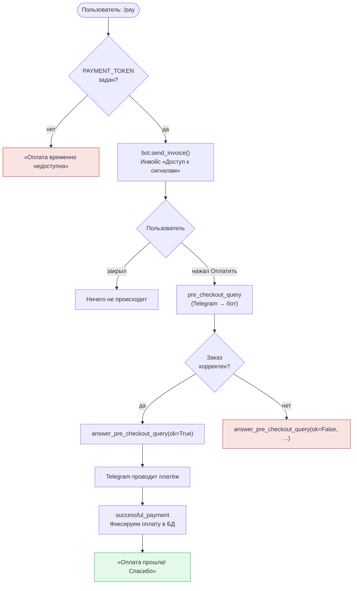

# iron-wake

Telegram-бот — торговый ассистент по бессрочным фьючерсам BingX (крипта, золото, нефть).

## Что делает
- **Торговый ассистент (VSA + Spring)** по 16 бессрочным фьючерсам **BingX** (14 крипты +
  золото + нефть — везде настоящий объём и стакан): контекстный анализ (тренд D1 + уровни +
  зоны ликвидности + стакан/DOM), авто-сигналы по паттернам ложного пробоя Spring/Upthrust,
  **цена лимитной заявки на вход** и трекинг сигнала по двум ступеням (исполнилась ли заявка,
  а потом — дошло ли до цели/стопа) — см. «Торговый движок».
  **Фильтра R:R 1:2 больше нет** (29 августа 2026): цель — ближайший встречный уровень, какой
  есть. Это возврат логики первого движка и главный источник частоты сигналов.
  **Все пороги детектора — в долях ATR**, а не в процентах цены.
  **Форекс из движка выведен** 29 августа: пары остались в реестре ради алертов, журнала и
  NL-роутера, но сигналов по ним нет — см. «Форекс выведен из движка»
- `/analyze` объясняет **расклад глазами движка**: те же пять условий, по которым он решает,
  и чего именно не хватает до сигнала — см. «Команда /analyze»
- `/settings` крутит **строгость отбора** (два ATR-фильтра) — см. «Строгость отбора»
  Замер этих кнопок пересчитан 29 августа: на движке без фильтра R:R прежние подписи
  не действуют
- **Алерты «касание уровня»** (`/alert`, `/myalerts`): «скажи, когда цена дойдёт сюда».
  Ставятся колокольчиком прямо в отчёте `/analyze` (уровни движок уже посчитал) или руками
  по любому уровню и любой паре. Проверяются по биржевой цене — см. «Алерты»
- Ведёт **журнал сделок** пользователя (`/trades`): сделка записывается свободным текстом, бот
  сам доводит её до цели или стопа. В журнале разрешён любой бессрочный контракт BingX
  («своя пара» — их на бирже 874 против 21 в реестре)
- Уведомляет в Telegram первым (бот пишет пользователю сам)
- Обрабатывает свободный текст через LLM
- **Закрытый доступ:** новый пользователь сначала ждёт подтверждения админом (заявка с кнопками
  одобрить/отклонить); до одобрения доступна только `/start` — см. «Доступ по подтверждению»
- Подписчик может написать админу прямо в боте (`/write`), админ отвечает обычным reply
- Поддерживает рассылку администратором по всем согласившимся пользователям

## Стек
- Python + aiogram 3 (FSM, inline-кнопки)
- SQLite через database.py
- APScheduler (`AsyncIOScheduler`) — фоновые задачи движка (планировщик один, в `scheduler.py`):
  мониторинг сигналов (5 мин), трекинг исхода сигналов (5 мин), трекинг сделок журнала (5 мин),
  контекстный анализ (1 час)
- **Источник данных ровно один — биржа BingX.** Yahoo Finance (yfinance) убран из бота
  целиком 26 августа 2026 вместе с полем `ticker` в реестре и ветками `data_source ==
  "yahoo"`. Причина — в разделе «Yahoo убран»
- **CCXT + pandas/numpy** — биржевые OHLCV-свечи и стакан с настоящим объёмом:
  **бессрочные фьючерсы BingX** (тип `swap`), 21 инструмент реестра, из них 16 в движке
- OpenRouter API → модель из `OPENROUTER_MODEL` — свободный текст + гибридный AI-разбор `/analyze`
  + **NL-роутер команд** (текст словами → действие бота) + комментарий к авто-сигналу (см. `llm.py`)

## Структура файлов

```
iron-wake/
├── bot.py              — точка входа, обработчики aiogram, отчёт /analyze, меню /settings,
│                         NL-роутер команд из свободного текста + журнал сделок (/trades)
├── alerts.py           — алерты «касание уровня»: правило срабатывания (hit/side_of/
│                         window_from_candles) — чистые функции, тестируются без сети
├── llm.py              — слой OpenRouter: ask_openrouter (чат, /analyze), classify_intent
│                         (NL-роутер: текст → действие), comment_on_signal (комментарий к сигналу)
├── database.py         — только SQLite: init_db(), CRUD уровней/сигналов/подписок/
│                         настроек, алерты, журнал сделок. Котировок тут больше нет
├── instruments.py      — реестр инструментов (имя, точность, ccxt-символ BingX),
│                         fmt/infer_decimals/resolve/engine_codes/data_source/ccxt_symbol
├── config.py           — все пороги/окна/интервалы движка; через /settings крутятся ровно
│                         два ключа (MAX_ENTRY_DIST_ATR, MAX_RISK_ATR), остальное — константы
├── data_fetcher.py     — загрузка биржевых свечей и стакана (DOM) через CCXT (async) +
│                         TTL-кеш + find_symbol (поиск контракта по вводу человека)
├── analyzer.py         — контекстный анализ: тренд, уровни, зоны ликвидности, стакан, приоритизация
├── pattern_detector.py — детектор Spring (лонг) и Upthrust (шорт), ATR (_atr) и два фильтра
│                         строгости, цена лимитной заявки (limit_price), исполнение заявки
│                         (evaluate_fill), исход (evaluate_signal), разбор для /analyze (explain)
├── scheduler.py        — фоновые задачи (единственный планировщик): run_analysis (1ч) +
│                         monitor_signals (5м) + track_signals (5м) + track_trades (5м) +
│                         check_alerts (5м, алерты по минутным свечам биржи)
├── tests/test_engine.py— юнит-тесты аналитики и паттернов на синтетических свечах
├── bot.db              — SQLite-база данных (в .gitignore, создаётся автоматически)
├── settings.json       — общие значения двух ATR-фильтров от /settings (в .gitignore)
├── system_prompt.md    — системный промпт для LLM (читается при старте бота)
├── .env                — секреты: TELEGRAM_BOT_TOKEN, OPENROUTER_API_KEY, ADMIN_ID, CCXT_PROXY
├── .env.example        — пример переменных окружения (без значений)
├── requirements.txt    — зависимости для деплоя
└── схема.md            — схема текущего функционала бота
```

### Инструменты (`instruments.py`)

Единый реестр `INSTRUMENTS` (код → имя, точность, ccxt-символ BingX). Инструментов 21:
пять валютных (EUR/USD, GBP/USD, AUD/USD, USD/CAD, USD/JPY), золото, нефть Brent и
14 крипто-пар. **В ДВИЖКЕ из них 16** — валютные пары выведены 29 августа 2026
(см. «Форекс выведен из движка»), но в реестре остались: алерты, журнал сделок и
NL-роутер по ним работают как работали.

Кто в движке — решает `engine_codes()`, и условий там теперь ДВА: есть биржевой источник
И это не валютная пара (флаг `"fx"`). Признак именно флаг, а не отсутствие источника:
источник форексу нужен, просто не движку.

**Человеку бот везде показывает БИРЖЕВОЙ ТИКЕР, а не имя** (26 августа 2026): BTC, GOLD,
BRENT, EURUSD — в сигналах, /signals, /stats, /analyze, журнале, алертах и на кнопках выбора
инструмента. Отдаёт его `instruments.short(pair)`: для реестра это сам код (он и есть тикер
биржи), для своей пары — монета из символа контракта («WIF/USDT:USDT» → «WIF»). `resolve()`
кладёт его в ключ `"short"`.

Полное имя («Bitcoin», «Золото») осталось в поле `"name"` и нужно ровно в одном месте —
`llm._instrument_catalog`, каталог для NL-роутера: по слову «золото» модель должна найти код
GOLD. Это ВХОД для модели, а не текст для человека. Промпты `ANALYST_PROMPT` и
`SIGNAL_PROMPT` отдельно требуют от модели называть инструмент тикером — иначе бот пишет
«BTC», а ИИ-комментарий под ним «Bitcoin».

**«Своя пара» — любой из 874 бессрочных контрактов BingX**, не только эти 21. Человек пишет
как умеет («wif», «PEPE», «ETH/USDC:USDC»), `data_fetcher.find_symbol` превращает это в символ
контракта, и в базу пишется уже символ. `resolve(pair)` различает реестровый код и символ; для
своей пары показывается монета до «/», точность подбирается по цене (`infer_decimals`).

**Источник объёма — `data_source(code)`**; вход в движок — `engine_codes()` (источник есть
И не форекс):
- `"ccxt"` (поле `"ccxt"` = символ + биржа) — **бессрочные фьючерсы BingX**, 21 инструмент.
  В движке 16: BTC, ETH, SOL, TON, XRP, ADA, XLM, AVAX, SUI, UNI, LTC, AAVE, DOGE, LINK,
  GOLD, BRENT. Валютные EURUSD, GBPUSD, AUDUSD, USDCAD, USDJPY (символы `NCFX*`) источник
  имеют, но в движок не входят.
  Символы вида `BTC/USDT:USDT`, тип `swap` (см. `data_fetcher._get_exchange` — без
  `defaultType: swap` ccxt ищет символ на споте и не находит).
- `None` — источника нет. Так выглядят только СТАРЫЕ записи журнала с тикерами Yahoo,
  оставшиеся до 26 августа 2026: читаются, но не ведутся. Ветки `"yahoo"` больше нет.

Валютные пары остаются в реестре **ради алертов, журнала сделок и NL-роутера** (чтобы
«поставь алерт EURUSD 1.17» и «взял EURUSD по …» распознались и сработали). Ни анализа,
ни сигналов по ним нет.

**Осторожно с выходными:** синтетические контракты `NCFX*` BingX ставит на паузу вне
форекс-сессии, и запрос цены отвечает `symbol is pause currently`. Алерт по валютной паре
в субботу молча не проверится (`check_alerts` ловит ошибку по паре и идёт дальше). Это
поведение биржи, а не бота, и оно было и до вывода форекса из движка.

**Почему BingX-фьючерсы, а не спот.** Комиссия. У движка средний риск сделки около 0.5% от
цены, то есть 1R ≈ полпроцента движения, и round-trip вычитается прямо из этой половины:

| площадка | мейкер | тейкер | round-trip мейкером |
|---|---|---|---|
| **BingX фьючерсы** | **0.02%** | 0.05% | **0.04%** |
| BingX спот | 0.10% | 0.10% | 0.20% |
| Bitfinex спот | 0.10% | 0.20% | 0.20% |
| Kraken спот (было до 19.08.2026) | 0.25% | 0.40% | 0.50% |

Денежная симуляция (счёт 1000$, риск 1%): при round-trip 0.06% счёт растёт, при 0.15% теряет
три четверти, при 0.3% обнуляется. **На споте стратегия мертва при любых настройках.** Bybit
проверен и закрыт: `api.bybit.com`, `api.bytick.com`, `api.bybit.nl` — все три отдают 403
CloudFront по стране, прокси в проекте нет.

**Плата за фьючерсы** — фандинг (платёж каждые 4–8 часов) и плечо. И то и другое считает
`money.py` в лаборатории замера, см. «Бэктест и лаборатория».

**TON на BingX называется GRAMTON** (переименование TON → Gram). Тождество проверено по цене:
Bitfinex `TON/USD` = 1.3177 против BingX `GRAMTON/USDT` = 1.323, расхождение 0.4%. Записи
`TON/USDT`, `TONCOIN/USDT`, `GRAM/USDT` в списке рынков ccxt есть, но API отвечает по ним
`symbol is not found` — мёртвые записи. **Код инструмента в реестре остался `TON`**: на него
ссылаются подписки, сигналы и сделки в боевой БД.

**Золото и нефть** — синтетические товарные бессрочные контракты BingX (`NCCOGOLD2USD`,
`NCCO1OILBRENT2USD`). Это апгрейд: на Yahoo объём по ним приходил частичным, а стакана не было
вовсе (блок DOM в `/analyze` для них пропускался). На BingX есть и объём, и стакан.

**Форекс: снят 19 августа, возвращён 21-го, снова выведен 29-го.** История такая. Снимали
из-за молчания: боевые пороги заданы в процентах цены и на валютных парах не срабатывают —
12 сигналов за год против 207 с порогами в ATR. Возвращали с порогами в ATR по просьбе
владельца («максимум сигналов»), зная, что экономика отрицательная. Вывели 29 августа —
по тем же деньгам, теперь уже как решение: −1.385 R на сделку, из них 1.153 R издержки.
Раздел «Попытка вылечить форекс» ниже разбирает механизм полностью и остаётся в силе.

Отдельных порогов у форекса больше нет: с 29 августа **все** пороги детектора заданы в
долях ATR, и вторая мерка стала не нужна.

**На BingX форекс-фьючерсы ЕСТЬ** — тут доку правил 20 августа 2026, раньше здесь было написано
«его на BingX и нет», и это неправда. Синтетических валютных бессрочных контрактов `NCFX*` там
41 штука, активен 21, включая все четыре наши пары и USD/JPY:

| пара | символ | спред | история D1 | объём |
|---|---|---|---|---|
| EUR/USD | `NCFXEUR2USD/USDT:USDT` | 0.014% | 358 дн | есть |
| GBP/USD | `NCFXGBP2USD/USDT:USDT` | 0.014% | 353 дн | есть |
| AUD/USD | `NCFXAUD2USD/USDT:USDT` | 0.021% | 357 дн | есть |
| USD/CAD | `NCFXUSD2CAD/USDT:USDT` | 0.019% | 357 дн | есть |
| USD/JPY | `NCFXUSD2JPY/USDT:USDT` | 0.013% | — | есть |

Данные полноценные: настоящий объём (нулевых свечей нет), стакан на 50 уровней, спред **уже,
чем у TON и ADA** из текущего набора, история длиннее, чем у GOLD. Отличие одно — расписание:
торгуются по форекс-сессии, суббота пустая, воскресенье частичное, разрывы в H1 до 47 часов
(у крипты и золота разрывов нет).

**Но решение это не меняет, и оба блокиратора перемерены прямо на этих контрактах** (20 августа
2026, 1000 часовых свечей BingX — то есть уже не на старых данных Bitstamp/Kraken):

| инструмент | размах H1 | `BREAK_PCT` 0.05% в долях размаха | `STOP_SPREAD` 0.1% в ATR |
|---|---|---|---|
| EUR/USD | 0.088% | **0.57×** | **1.41×** |
| GBP/USD | 0.091% | 0.55× | 1.32× |
| USD/CAD | 0.074% | **0.68×** | 1.49× |
| AUD/USD | 0.120% | 0.42× | 0.93× |
| GOLD | 0.301% | 0.17× | 0.33× |
| BTC | 0.416% | 0.12× | 0.28× |
| ADA | 1.042% | 0.05× | 0.13× |

Форексной свече надо проколоть уровень на половину-две трети собственного размаха и в тот же час
закрыться обратно (биткоину — на 0.12 размаха), а запас стопа 0.1% цены сам по себе даёт риск
больше 1 ATR — поэтому четыре кнопки `/settings` из пяти (`MAX_RISK_ATR` ≤ 0.75) бракуют
форекс-сигнал механически, ещё до всякой оценки качества.

#### Попытка вылечить форекс — замер 20 августа 2026

Раз контракты есть, форекс перемерен на них целиком: четыре пары, год (5900–5975 часовых
свечей на пару), настоящий объём, честные издержки (спред по 6 снимкам, фандинг по истории
платежей — 8ч, ставка 0.00004, вдвое дешевле крипты). Лечение — **перевод ОБОИХ порогов из
процентов цены в доли ATR**: в лабораторию добавлен режим `BREAK_MODE = "atr"`
(`BREAK_ATR_MULT`), стоп в ATR там уже был.

**Молчание вылечилось, деньги — нет.**

| конфигурация | сделок/год | брутто R/сдел | **цена сделки в R** | нетто R/сдел | риск % цены |
|---|---|---|---|---|---|
| боевое (пробой 0.05% цены, стоп 0.1%) | 12 | −0.333 | 0.394 | −0.728 | 0.27% |
| пробой 0.02 ATR / стоп 0.25 ATR | **207** | −0.232 | **1.153** | −1.385 | 0.09% |
| пробой 0.05 ATR / стоп 0.5 ATR | 112 | −0.413 | 0.879 | −1.293 | 0.11% |
| пробой 0.1 ATR / стоп 1 ATR | 28 | −0.499 | 0.592 | −1.091 | 0.19% |
| пробой 0.02 ATR / стоп 1.5 ATR | 11 | +0.186 | 0.361 | −0.175 | 0.30% |
| пробой 0.02 ATR / стоп 6 ATR | 5 | −0.200 | 0.122 | −0.322 | 0.86% |
| *крипта, `main`, для сравнения* | *2397* | *−0.044* | *0.198* | *−0.242* | *0.50%* |

Сигналов стало 12 → 207, то есть порог в ATR действительно чинит молчание. Но **ни одна из
21 конфигурации не вышла в нетто-плюс ни на одной половине года.**

**Механизм — тот же «издержки в R», что и у крипты, только втрое злее.** Издержки одинаковы
в процентах ЦЕНЫ, а делятся на риск сделки. ATR у EUR/USD ≈ 0.071% цены против ≈0.42% у BTC:
форекс в шесть раз спокойнее при той же комиссии, поэтому та же сделка стоит в R в шесть раз
дороже. Отсюда ловушка: **лечение работает против собственной цели** — чем чувствительнее
порог, тем больше сигналов, но тем уже стоп, тем меньше риск в процентах цены и тем ДОРОЖЕ
сделка в R. Это один рычаг, а не два: 207 сделок по 1.15 R против 11 сделок по 0.36 R.

**Край кривой проверен отдельно** (стопы 1.5–6 ATR, горизонты 48ч и 168ч). Цена сделки
действительно падает до 0.122 R — дешевле, чем у крипты. Но там остаётся **4–5 сделок в год
и винрейт 0%**: при `MIN_RR` 2 цель уезжает на 4–12 ATR, а форекс столько за горизонт не
проходит. Недельный горизонт не помог, а местами ухудшил. Фильтра «минимум 20 сделок» не
прошла ни одна конфигурация с широким стопом.

**Вывод: форекс в этой стратегии не лечится порогами.** Чтобы выйти в ноль, ему нужен брутто
не ниже цены сделки — от +0.36 R (редкие настройки) до +1.15 R (частые). Лучший брутто за всю
калибровку крипты — +0.139 R. То есть форексу надо быть в 2.6–8 раз лучше лучшего, что движок
показывал где-либо, только чтобы не терять. Единственная плюсовая по брутто строка (+0.186)
стоит на 11 сделках за год — это шум, и она тоже нетто-минусовая.

**Лучшая настройка ПО БРУТТО (без издержек) — отдельный вопрос, тоже отвечен** (`fx_brutto.py`,
сетка пробой × стоп × `MIN_RR` = 65 конфигураций на горизонтах 72/120/168ч):

```
глубина пробоя 0.05 ATR · запас стопа 1.5 ATR · MIN_RR 1.0 · горизонт 120ч
117 сделок/год на 4 парах, винрейт 46%, ПФ 1.07, брутто +0.035 R/сделку,
обе половины года в плюсе (+1.2 / +2.9)
```

Три вещи в этом результате важнее самой строки:
- **боевой `MIN_RR` 2 не попал в топ ни разу, ни на одном горизонте** — на форексе цель 1:2 не
  доходит, ему нужна близкая цель;
- **горизонт 120ч — внутренний максимум** (72ч и 168ч хуже), то есть это не упор в границу
  перебора: 72ч → 3 плюсовых конфигурации из 52 и ни одной устойчивой, 120ч → 6 и две,
  168ч → 5 и одна;
- **и всё равно это ноль, а не эдж:** +4.1 R за год при разбросе **±12.1 R**. Погрешность
  втрое больше результата — «+0.035 R/сделку» и «ровно ноль» на этих данных не различимы.
  В нетто строка даёт ≈ −0.33 R/сделку (сделка при стопе 1.5 ATR стоит ~0.36 R): эдж и
  издержки различаются в десять раз.

#### Форексная настройка НА КРИПТЕ — замер 20 августа 2026 (`crypto_fx.py`)

Связку «широкий стоп + близкая цель» проверили на крипте: 14 инструментов (13 монет + золото),
**год** истории (тот же период, что у форекса), издержки «лимитом», счёт 1000$ при риске 1%.

| настройка | сдел/мес | эдж (брутто/сд) | **цена сделки** | нетто/сд | счёт через год | просадка |
|---|---|---|---|---|---|---|
| боевое (как в `main`) | 93 | **+0.067** | 0.202 | −0.135 | 178 $ | 84% |
| боевое + RR1 | 195 | +0.025 | 0.164 | −0.139 | 29 $ | 97% |
| форексная (0.05/1.5/RR1) | 54 | −0.002 | **0.063** | **−0.065** | **634 $** | 46% |
| форексная, но RR2 | 8 | −0.228 | 0.046 | −0.274 | 772 $ | 31% |
| только стоп 1.5 ATR | 8 | −0.245 | 0.046 | −0.290 | 765 $ | 32% |
| форексная, стоп 1.0 ATR | 92 | −0.029 | 0.080 | −0.109 | 282 $ | 74% |

**ГЛАВНОЕ: широкий стоп решает проблему издержек в лоб.** Цена сделки упала ВТРОЕ — с 0.202 R
до 0.063 R, лучший показатель за все замеры проекта. Механизм обратен августовской ловушке:
там фильтры отбирали сделки с УЗКИМ риском и тем дорожали, здесь стоп 1.5 ATR специально
растит риск в процентах цены, а комиссия в процентах цены та же — значит в R она делится
на большее число.

**Но эдж при этом исчезает:** +0.067 R → −0.002 R. Винрейт растёт (25% → 43%), однако при цели
1:1 нужно больше 50%, и его не хватает. Получается пара, где решение одной беды ломает другую:
- узкий стоп + далёкая цель → эдж есть (+0.067), комиссия съедает (0.202);
- широкий стоп + близкая цель → комиссия не мешает (0.063), эдж пропал (−0.002).

Ни одна конфигурация не плюсовая ни на одной половине года. Горизонт на крипте почти не влияет
(48ч и 120ч дают одно и то же) — в отличие от форекса, потому что медианная сделка живёт 2 часа.
Строки с 8 сделками в месяц выглядят лучше по деньгам только потому, что почти не торгуют.

**Практический смысл для будущих попыток:** если когда-нибудь искать прибыльную конфигурацию,
стоп 1.5 ATR — правильная отправная точка по ИЗДЕРЖКАМ, и искать надо эдж при таком стопе
(другой триггер входа, другой отбор уровней), а не крутить стоп обратно в узкую сторону.

Замеры живут в лаборатории (`fx_cure.py`, `fx_cure2.py`, `fx_brutto.py`, `crypto_fx.py`);
в `main` из них не переносится ничего. Что было починено по дороге и осталось полезным для будущих замеров: пагинация
истории для форекса (он проваливался в ветку без неё и давал 29 дней вместо 358) и таблицы
спреда/фандинга NCFX в `money.py`.

### Алерты «касание уровня» (убраны 20 августа 2026, вернулись 26 августа)

Алерт — это «скажи, когда цена дойдёт сюда». Он ничего не советует и с движком не связан:
сигналы Spring/Upthrust живут отдельно и по своим правилам. Убирались вместе со всем, что
не движок; возвращены по просьбе владельца — уже на биржевой цене.

**Главное отличие от прежней версии — источник цены.** Раньше касание проверялось по
минутным свечам Yahoo, а движок с 19 августа считает уровни по фьючерсам BingX. Это разные
графики: у золота, TON и валютных пар на BingX синтетические контракты (`NCCOGOLD2USD`,
`GRAMTON`, `NCFX*`), у Yahoo — свои котировки. Алерт на уровень из `/analyze` срабатывал бы
не там, где этот уровень нарисован. Теперь цена берётся тем же путём, что и уровни:

| инструмент | источник цены алерта |
|---|---|
| все 21 инструмента реестра | минутные свечи BingX (`config.ALERT_TIMEFRAME`) |
| «своя пара» (любой контракт BingX) | минутные свечи BingX по её символу |

Обе строки ведут в `scheduler.alert_window(pair)`, он же используется и в UI: показать одну
цену, а сработать по другой было бы враньём. С уходом Yahoo (26 августа, тот же день) развилка
внутри исчезла совсем — источник остался один.

**Как поставить — два пути:**
- **колокольчик в `/analyze`** — под отчётом кнопка на каждый показанный уровень, в тексте
  у каждой цены стоит 🔔 (или ✅, если алерт уже стоит). Число вводить не надо: движок эти
  уровни уже посчитал. Повторное нажатие снимает алерт. Цена едет в `callback_data`
  (`alrt:{код}:{цена}`), оттуда же берётся при перерисовке клавиатуры — пересчитывать весь
  отчёт ради одной галочки незачем;
- **вручную `/alert`** — FSM как был: инструмент (или своя пара — любая монета с BingX) →
  уровень → подтверждение. Плюс словами через NL-роутер: «алерт золото 2400», «мои алерты».

Список и удаление — `/myalerts`. Сработавший алерт снимается сам (`is_triggered = 1`).

**Правило срабатывания — `alerts.py`, и оно не про последнюю цену.** Проверка идёт раз в
5 минут; если цена за это время сходила к уровню фитилём и вернулась, точка это пропустит.
Поэтому смотрим ДИАПАЗОН минутных свечей за период: `touched` — уровень побывал внутри
[low; high]; `crossed` — цена оказалась по другую сторону, чем была (запасной признак на
разрыв, у валютных пар после выходных такое бывает).

**Первая проверка алерт ВЗВОДИТ, а не срабатывает** (`start_above IS NULL` → запоминаем
сторону цены). Это не задержка ради задержки: окно свечей смотрит назад, и без такого шага
свежий алерт сработал бы на диапазоне, который был ДО его постановки. Плата — касание в
первые 5 минут жизни алерта не поймается.

**Таблица `alerts` в боевой базе цела с прошлого раза** — её тогда намеренно не дропали
(`DROP` необратим), поэтому старые записи на месте, а `CREATE TABLE IF NOT EXISTS` их не
трогает. На свежей базе таблица создаётся заново.

**Доавгустовские алерты погашены разовой миграцией** (`init_db`, решение владельца): шесть
дней их никто не проверял, а сторона цены (`start_above`) записана у них ещё по котировкам
Yahoo — на биржевой цене половина сработала бы в первую же минуту после деплоя и завалила
людей уведомлениями по забытым уровням. Гасим (`is_triggered = 1`), а не удаляем: строки
остаются, `DELETE` так же необратим, как `DROP`. Условие `created_at < 2026-08-26` делает
миграцию самоограниченной — задеть алерт, поставленный после возврата функции, она не может,
поэтому спокойно выполняется при каждом старте и не нуждается во флаге «уже отработала».

### Yahoo убран из бота целиком (26 августа 2026)

Источник данных остался ровно один — **биржа BingX**. Ушли: пакет `yfinance` из зависимостей,
четыре функции котировок в `database.py` (`get_price_window`, `get_hourly_candles`,
`get_daily_candles`, `_normalize_yahoo`), поле `ticker` из всех 21 записи реестра, значение
`"yahoo"` у `data_source` и обе развилки «биржа или Yahoo» — в `fetch_candles` и `alert_window`.

**Что заменило Yahoo — `data_fetcher.find_symbol`.** Раньше «своя пара» значила «любой тикер
Yahoo»; теперь — **любой из 874 активных бессрочных контрактов BingX**. Человек пишет как умеет,
функция ищет по фиксированному порядку попыток: символ целиком → монета к USDT → монета к USDC →
мем-коины с множителем (`PEPE` → `1000PEPE/USDT:USDT`, на бирже они торгуются пачками). Не нашли —
честно говорим, что такого контракта нет, вместо того чтобы записать сделку, которую нечем вести.

**Что бот на этом потерял:** всё, чего на BingX нет, — акции (AAPL), экзотические кроссы
(EURGBP=X), индексы. Раньше их можно было завести в журнал и в алерты через Yahoo. Это
осознанный размен: у Yahoo нет ни настоящего объёма, ни стакана, данные приходят с задержкой,
и держать ради них второй источник — значит держать код, который никто не проверяет.

**Старые записи в боевой базе не тронуты.** В `trades.instrument` могут лежать тикеры Yahoo от
прежних сделок. Они читаются и показываются как раньше, но вести их больше не по чему:
`track_trades` пишет в лог `нет биржевого источника для AAPL`, сделка остаётся открытой и
закрывается кнопкой в `/trades`. Алертов это не касается — доавгустовские погашены миграцией.

Что осталось независимо от этого:
- **валютные пары** в реестре нужны движку (с 21 августа они в нём), журналу и NL-роутеру.

### Таблица `alerts` (bot.db)
| Поле | Тип | Описание |
|---|---|---|
| id | INTEGER PK | Автоинкремент |
| user_id | INTEGER | Telegram ID владельца алерта |
| threshold | REAL | Уровень, при касании которого уведомляем |
| pair | TEXT | Код инструмента реестра ИЛИ символ контракта BingX (как `trades.instrument`) |
| start_above | INTEGER NULL | С какой стороны уровня была цена при взводе: 1 — выше, 0 — ниже. NULL — алерт ещё не взведён (первая проверка проставит) |
| created_at | TEXT | ISO 8601 |
| is_triggered | INTEGER | 1 — сработал и снят |

### Таблица `users` (bot.db)

| Поле | Тип | Описание |
|---|---|---|
| chat_id | INTEGER PK | Telegram chat_id пользователя |
| user_name | TEXT | Отображаемое имя (full_name) |
| joined_at | TEXT | Дата первого /start (ISO 8601) |
| consent | INTEGER DEFAULT 0 | 1 — пользователь дал согласие на обработку данных |
| consent_at | TEXT | Дата последнего изменения consent |
| is_active | INTEGER DEFAULT 1 | 0 — бот заблокирован пользователем |
| access | TEXT DEFAULT 'pending' | Доступ по подтверждению админом: `pending` / `approved` / `denied` |

Запись создаётся при каждом `/start`. При попытке отправить сообщение заблокировавшему пользователю — `is_active` ставится в 0.

**Доступ по подтверждению (`access`).** Бот закрытый: новый пользователь после `/start` получает
`access='pending'`, и до решения админа всё, кроме `/start`, блокируется middleware-гейтом
(`AccessMiddleware`). Админу (`ADMIN_ID`) приходит заявка с кнопками **✅ Одобрить / ❌ Отклонить**
(`approve_{id}` / `deny_{id}`); ожидающие заявки можно посмотреть командой `/requests` (только админ).
Полный список со статусами и управлением — `/users` (кнопка бан/доступ на каждого), снять/вернуть
доступ напрямую — `/ban <id>` / `/unban <id>`. Бан = `access='denied'` (тот же гейт блокирует).
Админ всегда `approved` и проходит гейт без проверки.

**Меню команд разное (`set_my_commands` со scope).** Обычным пользователям — пользовательское
меню (с `/write`, без админских команд и `/settings`). Админу в его чате (`BotCommandScopeChat`
по `ADMIN_ID`) — отдельное меню: админские команды (`/users`, `/requests`, `/ban`, `/unban`,
`/broadcast`, `/settings`) наверху, без `/write` (админу некому себе писать). **Миграция:** при первом добавлении колонки
`access` все, кто уже был в базе, помечаются `approved` (grandfather) — правка не выкидывает текущих
пользователей. Новые после этого — `pending`.

## Торговый движок (VSA + Spring)

Весь бот — это торговый ассистент по 16 **бессрочным фьючерсам BingX**:
14 крипто-пар (BTC, ETH, SOL, TON, XRP, ADA, XLM, AVAX, SUI, UNI, LTC, AAVE, DOGE, LINK)
плюс золото и нефть Brent (синтетические товарные контракты). У всех настоящий биржевой
объём и стакан.

**Пороги детектора у всех одни и те же и заданы в долях ATR** — глубина прокола
`BREAK_ATR` 0.05 и запас стопа `STOP_ATR` 0.25. Отдельной мерки для отдельных
инструментов больше нет.

**Стоп уходит за ДАЛЬНИЙ из двух часовых экстремумов** — свечи свипа и предыдущей
(`STOP_STRUCT_BARS` 1), плюс запас в долях ATR. Сетап это пара свечей, а не одна.

**Заявка ставится по закрытию свечи** (`ENTRY_PULLBACK` 0): это по-прежнему лимитная
мейкерская заявка, но ждать отката к уровню не нужно — с близкой целью ожидание
отсекало в первую очередь выигрышные сделки.

**Фильтра R:R нет.** Цель — ближайший встречный уровень, какой есть; `FALLBACK_RR` 2.0
ставит цель только тогда, когда впереди уровня нет вовсе.

Кто входит в движок — решает `instruments.engine_codes()` (источник есть И не валютная
пара); свечи отдаёт `scheduler.fetch_candles(code, timeframe, limit)` (единый формат
DataFrame).

### Источник данных — `data_fetcher.py` (BingX, фьючерсы)
CCXT (`ccxt.async_support`), публичные эндпоинты, **без API-ключей**. Биржа и символ заданы в
`instruments.py` (поле `"ccxt"`) — для всех это **BingX** (`BTC/USDT:USDT`, `GRAMTON/USDT:USDT`,
`NCCOGOLD2USD/USDT:USDT` и т.д.).

**Тип `swap` обязателен:** `data_fetcher._get_exchange` передаёт BingX
`options={"defaultType": "swap"}`. Без этого ccxt ищет символ на СПОТЕ — половины наших символов
там просто нет (GRAMTON, NCCOGOLD2USD), а у остальных другие цена и объём.

Свечи (`get_candles(symbol, timeframe, limit, exchange)`) кешируются в памяти на
`config.CACHE_TTL` (H1 — 5 мин, D1 — 1 час). Стакан заявок (`get_order_book(symbol, limit,
exchange)`) — отдельный короткий кеш `config.ORDERBOOK_TTL` (30 сек, стакан живой).

**Осторожно с `ORDERBOOK_LIMIT`:** BingX принимает не любое число уровней. Работают 5, 10, 20,
50, 100, 500, 1000; на **25** биржа отвечает `Invalid parameters, err:limit`. Текущее значение
50 проверено живым запросом по всем инструментам движка.

BingX из РФ работает без прокси; `CCXT_PROXY` оставлен в коде на случай возврата биржи с
гео-блоком (Binance → 451, Bybit → 403), но для текущего набора не нужен.

### Стратегия №1 — контекстный анализ (`analyzer.py`)
- `get_trend(df)` — глобальный тренд по EMA20: `up`/`down`/`sideways`.
- `find_levels(df, window, timeframe)` — пики/впадины фракталом: D1 окно 5, H1 окно 3.
- `find_liquidity_zones(df, mult)` — свечи с объёмом > среднего × `LIQUIDITY_MULT` (зоны Smart Money).
- `analyze_order_book(ob, wall_mult)` — сводка по стакану (DOM, по инструментам движка): давление
  сторон (`buyers`/`sellers`/`balance` по дисбалансу объёмов bid/ask), спред и «стены» — крупнейшие
  заявки, чей объём > медианы стороны × `WALL_MULT` (медиана, т.к. сама стена раздувает среднее).
  Запись стакана берётся по индексу — некоторые биржи отдают `[цена, объём, время]` (3 элемента),
  BingX отдаёт `[цена, объём]`. В отчёте `/analyze` стакан описан человеческим языком; при очень
  широком спреде DOM помечается недостоверным и «стены» не показываются (у тонких пар набора —
  TON 0.15%, ADA 0.29% — это штатная ситуация, у BTC и золота спред околонулевой).
  Подмешивается в `/analyze` (текст + AI-промпт); ошибка стакана не валит анализ.
- `prioritize_levels(d1, h1, tol)` — уровень H1, совпавший с D1 в пределах 0.1%, помечается
  `strong`, иначе `weak`.

### Стратегия №2 — паттерны (`pattern_detector.py`)
- `detect_spring(df, levels, trend)` — ложный пробой **поддержки** вниз (глубже
  `BREAK_ATR` × ATR), закрытие обратно выше уровня, объём свечи > среднего за 20 свечей ×
  `VOL_MULT` → сигнал **в лонг**.
- `detect_upthrust(...)` — зеркало по **сопротивлению** → сигнал **в шорт**.
- Проверяется последняя **закрытая** H1-свеча (`df.iloc[-2]`). Фильтр тренда: бычий сигнал не
  выдаётся в `down`, медвежий — в `up`. Приоритет `high`, если пробитый уровень `strong`.
- **Стоп — за ДАЛЬНИМ из двух часовых экстремумов** (29 августа 2026): свечи свипа и
  предыдущей, плюс запас `STOP_ATR` × ATR. Сколько свечей перед свипом брать, задаёт
  `config.STOP_STRUCT_BARS` (1 — пара; 0 — прежнее поведение, только свеча свипа).
  Экстремум отдаёт общий помощник `_stop_extreme(df, pos, side)` — общий для `_detect`
  и `explain` по той же причине, что `_stop_buffer` и `_break_depth`.
  Смысл правила, словами владельца: стоп должен стоять за часовым поглощением или за
  фитилём, которым перед ним вынесло по стопам. У этого движка свеча свипа и есть тот
  фитиль, а структура сетапа образована парой соседних баров — стоп внутри пары сносится
  собственным шумом сетапа.
- **Пороги — в долях ATR, а не в процентах цены** (29 августа 2026). «0.05% цены» у биткоина
  и у золота значат разное: у золота волатильность в процентах ниже, и прежний порог требовал
  от него прокола **в 2.6 раза глубже в его же ATR**. Замер по кешу (20000 часовых свечей на
  инструмент) дал такую картину прежних порогов в долях ATR:

  | инструмент | ATR, % цены | пробой 0.05% в ATR | стоп 0.1% в ATR |
  |---|---|---|---|
  | SUI | 1.397% | 0.036 | 0.072 |
  | ADA | 1.130% | 0.044 | 0.089 |
  | BTC | 0.607% | 0.082 | 0.165 |
  | GOLD | 0.389% | 0.129 | 0.257 |
  | **медиана по 16** | | **0.049** | **0.097** |

  Отсюда `BREAK_ATR` 0.05 и запас стопа 0.10 — **ровно медиана набора**: «в среднем по
  движку» отбор остался прежним, а перекос между инструментами ушёл. Значения не назначены,
  а взяты по эквиваленту — это важно, потому что позволяет сравнивать новые числа со старыми.

  **Запас стопа потом расширен до `STOP_ATR` 0.25** — уже не по эквиваленту, а по замеру
  (см. «Стоп „за дальним из двух“»): 0.10 оказался самой дорогой точкой кривой. Глубина
  прокола осталась эквивалентной, её перебор ничего не дал.
- **Вход ЛИМИТНОЙ заявкой, а не по рынку** (`limit_price`). Смысл в комиссии: рыночная
  заявка это тейкер 0.05%, лимитная — мейкер 0.02% плюс экономия половины спреда.
  **`ENTRY_PULLBACK` = 0 с 29 августа 2026** — заявка ставится РОВНО ПО ЗАКРЫТИЮ свечи
  свипа. Это всё ещё лимитная мейкерская заявка (она стоит там, где цена, и исполняется
  сразу), просто отката к уровню больше не ждём.
  Было 0.5. Замер 19 августа выбрал 0.5 честно — но на конфигурации с фильтром R:R, то
  есть с ДАЛЁКОЙ целью. После снятия фильтра цель встала близко, и ожидание отката стало
  отсекать в первую очередь выигрышные сделки: не исполнялось **45% заявок против 13%**,
  брутто обваливалось −0.067 → −0.212. Оба замера верны, каждый для своего движка.
  **Отбор считается ОТ ЗАКРЫТИЯ свечи, а не от цены заявки** — и риск, и цель.
  Так набор сигналов не зависит от `ENTRY_PULLBACK`: заявка меняет только цену входа. Иначе замер
  «что даёт лимитный вход» смешал бы эффект входа с эффектом отбора.
  В сигнале поле `entry_price` — это цена ЗАЯВКИ, `signal_price` — закрытие свечи пробоя.
- **Фильтра R:R БОЛЬШЕ НЕТ** (снят 29 августа 2026). Цель = ближайший противоположный
  уровень, **какой есть**: сигнал берётся независимо от того, много ли до него места.
  Раньше порог `MIN_RR` 1:2 отбрасывал такие сигналы, и это резало около 80% сетапов.
  Константа осталась под именем **`FALLBACK_RR`** и делает теперь ровно одно — ставит цель
  на 2 × риск, когда впереди нет ни одного уровня. Эту половину механизма убирать нельзя:
  без неё у части сигналов не было бы цели вовсе.
  Уровень по построению лежит по нужную сторону от закрытия (`_nearest`), поэтому цели
  «в ноль или в минус» тут возникнуть не может.
- **Два ATR-фильтра строгости отбора** (`MAX_ENTRY_DIST_ATR`, `MAX_RISK_ATR`) — единственное,
  что крутится через `/settings`. По умолчанию оба выключены (`0`). Подробности и замер — в
  разделе «Строгость отбора». Где они стоят в коде — важно:
  - `MAX_RISK_ATR` считается **один раз до цикла** по уровням: риск сделки (закрытие → экстремум
    свечи + запас стопа) от уровня не зависит;
  - `MAX_ENTRY_DIST_ATR` — **внутри цикла** по уровням, и там `continue`, а не `return`:
    расстояние у каждого уровня своё, следующий может оказаться ближе.
  ATR (`_atr`, период `config.ATR_PERIOD` = 14) считается **только после фильтра объёма** —
  на каждом баре подряд это была бы лишняя работа. Но нужен он теперь **ВСЕГДА**, а не только
  при включённых фильтрах: в долях ATR заданы и глубина прокола, и запас стопа. Нет ATR
  (плоские свечи) — **сигнала нет**, и отката на проценты цены не происходит: это была бы
  тихая подмена порогов на другие. Оба фильтра меряют от **закрытия свечи**, а не от цены
  заявки, по той же причине, что и цель.
- **`explain(df, levels, trend, settings)`** — те же пять условий, но вместо «сигнал / не сигнал»
  возвращает разбор: на каком именно условии всё встало. На нём построен отчёт `/analyze`.
  Функция живёт рядом с `_detect` намеренно: разъедутся — и `/analyze` начнёт врать про то, чего
  движок ждёт. На согласие есть тест `test_explain_agrees_with_detector`.

### Форекс выведен из движка (29 августа 2026)

Валютные пары пробыли в движке восемь дней — с 21 по 29 августа. Выведены по деньгам,
решением владельца, вместе с возвратом логики первого движка. Инструментов в движке
стало 16.

**Что именно сделано.** Пять пар `NCFX*` остались в реестре и с полем `"ccxt"`:
алерты, журнал сделок и NL-роутер по ним работают как работали. Из движка их выводит
`instruments.engine_codes()` по флагу `"fx"` — то есть признак принадлежности к движку,
а не отсутствие данных. Убрать источник было бы проще, но тогда сломались бы и алерты,
и журнал, чего никто не просил.

**Почему по флагу, а не удалением записи.** Смысл флага при этом ПОМЕНЯЛСЯ, и это
записано в docstring `is_fx()`: раньше он значил «у пары свои пороги детектора», теперь —
«пара не входит в движок». Старый смысл исчез вместе с отдельными порогами.

**Отдельных порогов у форекса больше нет.** Константы `FX_BREAK_ATR`, `FX_STOP_ATR` и
`FX_IGNORE_ATR_FILTERS` удалены. Они существовали ровно затем, чтобы задать валютным
парам пороги в долях ATR, пока у всех остальных пороги были в процентах цены. С 29 августа
в ATR считают все (`BREAK_ATR` / `STOP_ATR`), и вторая мерка стала не нужна — вместе с
веткой `fx` в `_detect` и `explain`.

**Что это меняет для крипты: ничего.** Фильтры строгости `/settings` теперь действуют на
все 16 инструментов одинаково — раньше форекс их обходил (`FX_IGNORE_ATR_FILTERS`).

**Почему выведен — деньги, и они были известны заранее.** Конфигурация выбиралась по числу
сигналов, а не по прибыли: −1.385 R на сделку, из которых **1.153 R — издержки**. Механизм:
комиссия одинакова в процентах цены, а делится на риск сделки; у форекса риск 0.09% цены
против 0.50% у крипты, поэтому та же сделка стоит в R на порядок дороже. Ни одна из 21
проверенной конфигурации не вышла в плюс ни на одной половине года — подробности в
«Попытка вылечить форекс», раздел остаётся в силе целиком.

**Старые подписки на форекс в боевой базе не тронуты.** Они просто перестают давать
сигналы: `scheduler._subscribed_engine()` спрашивает `engine_codes()`, а не «есть ли
источник». Уже открытые форекс-сигналы `track_signals` доводит до исхода как раньше — он
ходит по `get_open_signals()`, а не по составу движка. Так и надо: бросать открытую
позицию без итога нельзя.

**Данные у форекса при этом хорошие, и дело не в них.** Настоящий объём, стакан на 50
уровней, спред 0.013–0.021% — уже, чем у TON и ADA из крипто-набора. Причина ровно одна:
на этой стратегии он не окупает издержки.

### Стратегия №3 — трекинг сигнала в ДВЕ ступени (`pattern_detector`)

С лимитным входом у сигнала появилось состояние ДО сделки: заявка может не исполниться, и тогда
сделки не было вовсе. Поэтому трекинг идёт двумя ступенями, и путать их нельзя.

**Ступень 1 — исполнение заявки (`evaluate_fill`).** Сигнал рождается со статусом `waiting_fill`.
По свечам строго после свечи пробоя (`signals.bar_time`, UTC), в пределах `ENTRY_WAIT_BARS` часов:
- цена дошла до заявки → `filled`, момент записывается в `signals.fill_time`;
- цена ушла к цели, не откатившись к заявке → `expired_unfilled` (сделки не было);
- за `ENTRY_WAIT_BARS` часов не дошла → `expired_unfilled`.

Порядок событий внутри часовой свечи неизвестен, поэтому если свеча накрыла и заявку, и цель,
считаем **осторожно**: заявка НЕ исполнилась. Это не даёт приписать себе сделку, которой могло не
быть. А вот «заявка и стоп на одной свече» однозначны: стоп лежит дальше заявки, значит сначала
вход, потом стоп.

**Ступень 2 — исход сделки (`evaluate_signal`).** По свечам после **`fill_time`** (а не после
свечи пробоя — между сигналом и входом проходит до `ENTRY_WAIT_BARS` часов, и приписывать себе
то, что случилось до входа, нельзя):
- дошла до цели → `hit_tp` (плюс);
- дошла до стопа → `hit_sl` (минус);
- за `SIGNAL_EXPIRE_HOURS` (48ч) не дошла никуда → `expired`.

Внутри одной свечи при двусмысленности (накрыла и стоп, и цель) считаем **консервативно** —
сначала стоп. Сигналы без якоря вовсе не трекаются — без точки отсчёта исход не определить честно.

**`expired_unfilled` — это не нулевой результат, а отсутствие сделки.** В винрейт и профит-фактор
`/stats` он не входит: считать несостоявшуюся сделку нулём значило бы разбавлять статистику
событиями, которых не было. Показывается отдельным счётчиком — по нему видно, не слишком ли
далеко от рынка стоят заявки.

### Планировщик — `scheduler.py`
Единственный `AsyncIOScheduler` в проекте (`scheduler.setup`). Пять задач:
- `run_analysis(bot)` — раз в час: пересчёт тренда/уровней/зон → таблица `levels`.
- `monitor_signals(bot)` — каждые 5 минут: поиск Spring/Upthrust по свежим H1, запись в `signals`
  и рассылка подписчикам (с AI-комментарием, см. «LLM-интеграция»). Дедуп: один и тот же сигнал
  не чаще `SIGNAL_DEDUP_MIN` минут.
- `track_signals(bot)` — каждые 5 минут: ведёт сигнал по двум ступеням (см. «Стратегия №3») —
  сначала исполнение заявки (`evaluate_fill`), потом исход сделки (`evaluate_signal`). Обновляет
  `signals.status`/`fill_time` и пишет владельцу: «заявка исполнена», «заявка снята» или итог
  цель/стоп. Свечи берёт из общего кеша H1 (без лишних запросов к бирже).
- `track_trades(bot)` — каждые 5 минут: исход открытых сделок журнала (таблица `trades`).
  Свечи — BingX H1 для всех, включая свою пару (она хранится символом контракта). `expired`
  трактуется как «ещё открыта» (журнал не истекает).
- `check_alerts(bot)` — каждые 5 минут: алерты «касание уровня». По одному запросу цены на
  инструмент за цикл (на одной паре у разных людей свои уровни), правило — `alerts.hit`.

`run_analysis`/`monitor_signals` работают по инструментам движка с подпиской; свечи берёт
`fetch_candles` из источника инструмента. `track_signals` доводит до исхода уже открытые сигналы
по любому инструменту (даже если подписку успели снять).

### Команды
| Команда | Что делает |
|---|---|
| `/analyze [код]` | **Расклад глазами движка**, а не описание рынка вообще: те же пять условий и в том же порядке, в каком их проверяет детектор. См. «Команда /analyze». Плюс зоны ликвидности и стакан (DOM — у всех 16 инструментов движка) и AI-разбор поверх (ошибка LLM не критична). |
| `/alert` | Поставить алерт «уведоми при касании уровня»: инструмент (или своя пара — любая монета с BingX) → уровень → подтверждение. Быстрее — колокольчиком в `/analyze`. См. «Алерты». |
| `/myalerts` | Список активных алертов + кнопка удаления на каждый. Сработавший снимается сам. |
| `/subscribe` | Вкл/выкл подписку на сигналы по инструменту (кнопки по всем 16 инструментам движка, галочка = подписан). Валютных пар в списке нет — они выведены из движка. |
| `/signals` | Последние сигналы с ценой заявки/стоп/цель, приоритетом и состоянием (📥 заявка стоит / ⏳ в сделке / ⏹ заявка снята / ✅ цель / 🛑 стоп / ⌛ истёк). |
| `/stats` | **Сводная статистика по сигналам** (по всей таблице `signals` пользователя, не по LIMIT): винрейт (tp/(tp+sl)), итог **в R** (риск на сделку = 1R: цель даёт +факт. R:R, стоп = −1R), профит-фактор (плюсы÷минусы; «∞ без стопов»), счётчики цель/стоп/ждём/истекло, **отдельный счётчик неисполненных заявок** и разбивка по инструментам. По умолчанию **за 30 дней**, кнопкой переключается на «за всё время». Ждём/истекло в винрейт и профит-фактор не входят (исход не определён), неисполненные — тоже, но по другой причине: сделки не было вовсе. Считает `bot.compute_signal_stats` над `database.get_signals_since`. |
| `/trades` | Журнал сделок пользователя: список со статусом (⏳ открыта / ✅ цель / 🛑 стоп / ☑️ закрыта) + кнопка закрытия на каждую открытую. Записываются свободным текстом через NL-роутер (см. «LLM-интеграция»). |
| `/settings` | **Строгость отбора сигналов** — действует на все 16 инструментов движка одинаково: два ATR-фильтра (`MAX_ENTRY_DIST_ATR` — «вход у уровня», `MAX_RISK_ATR` — «не входить вдогонку»), каждый включается независимо, `0` = выключен. Подписчик крутит свои значения (таблица `user_settings`), админ — общий дефолт (`settings.json`). В тексте меню сразу показан замер и честная оговорка, что прибыльным движок это не делает. См. «Строгость отбора». |

### Команда `/analyze` — расклад глазами движка

До 20 августа 2026 отчёт описывал рынок вообще: тренд, списки уровней D1 и H1, зоны, стакан.
Полезно, но не отвечало на вопрос, который на самом деле волнует: **что здесь происходит с точки
зрения движка и чего не хватает для сигнала.** Теперь отвечает.

Отчёт идёт по тем же ПЯТИ условиям и в том же порядке, в каком их проверяет `_detect`:

1. **Тренд дневки** и что он разрешает — «восходящий ↑ — движок берёт только ЛОНГИ».
2. **Ближайшие уровни** сверху и снизу (по три), с пометкой силы (⭐ = сильный), таймфрейма
   и **расстоянием в ATR**. Именно в ATR, а не в процентах: «0.1% от цены» у биткоина и у золота
   значит разное, а «0.1 ATR» — одно и то же. В этой же мерке заданы оба фильтра из `/settings`,
   так что владелец видит ту величину, которую сам и крутит.
3. **Объём последней закрытой свечи** против порога — «0.7× среднего (нужно ×1.5) ❌».
4. **Ложный пробой**: был ли прокол уровня и вернулась ли цена обратно — отдельно по лонгу и по
   шорту (для сторон, которые разрешает тренд).
5. **R:R при входе прямо сейчас** — с риском в ATR и с целью. С 29 августа 2026 это
   **справка, а не порог**: ни галочки, ни слова «нужно» там больше нет, потому что фильтра
   R:R у движка нет. Число всё равно полезно — по нему видно, тесно впереди или просторно.

Ниже — **итог**: либо «СИГНАЛ ЕСТЬ» с ценой заявки, стопом и целью, либо список того, чего именно
не хватает («объём 0.7× среднего — порог ×1.5», «свеча не заходила за уровень», «риск сделки
1.85 ATR — фильтр «вдогонку» пускает до 0.5»). Затем строка о текущих фильтрах пользователя и
о порогах самого движка (прокол и стоп в ATR), зоны ликвидности и стакан.

Блокер «до ближайшей цели всего 1:X» из этого списка **убран** вместе с фильтром R:R. Зато
добавлен блокер «ATR нулевой»: в детекторе это ранний выход, значит и в разборе обязан быть
блокер — иначе отчёт скажет «условия сложились» там, где движок молчит.

**Колокольчики (26 августа 2026).** У каждой цены в пункте 2 стоит 🔔, а под отчётом — кнопка
на этот уровень: нажал и получишь уведомление, когда цена до него дойдёт. Уровни движок уже
посчитал, поэтому число не вводится руками. Если алерт на уровень уже стоит, вместо 🔔 стоит ✅,
и нажатие его снимет. Порядок кнопок и строк даёт общий `bot._alert_levels(ex)` — чтобы кнопка
и строка над ней не разъехались. Подробности — в разделе «Алерты».

**Как это устроено в коде.** Считает `pattern_detector.explain(df, levels, trend, settings)` —
те же проверки, те же числа, но вместо «сигнал / не сигнал» возвращается разбор с блокерами.
Формат отчёта — `bot._format_engine_view`, промпт для AI — `bot._analysis_prompt`.

Две страховки от того, чтобы `/analyze` начал врать:
- `explain` живёт в одном файле с `_detect` — правка условий там обязана отражаться здесь;
- тест `test_explain_agrees_with_detector` гоняет обе функции на одних данных при разных фильтрах
  и сверяет вердикт;
- вдобавок `_do_analyze` вызывает **настоящий детектор** и при сигнале печатает ЕГО числа
  (заявка/стоп/цель), а не собственные пересчёты.

**AI-разбор** (`llm.ANALYST_PROMPT`) переписан под этот отчёт: модели запрещено пересказывать
числа (пользователь их только что прочитал) — её просят объяснить расклад: далеко ли инструмент
от сетапа, какое событие его создаст (какой уровень проколоть, с каким объёмом), что его отменит
и стоит ли вообще сейчас держать инструмент на виду.

### Таблица `levels` (bot.db)
| Поле | Тип | Описание |
|---|---|---|
| id | INTEGER PK | Автоинкремент |
| instrument | TEXT | Код инструмента |
| timeframe | TEXT | `D1` / `H1` |
| price | REAL | Цена уровня |
| type | TEXT | `support` / `resistance` / `liquidity` |
| strength | TEXT | `strong` / `weak` |
| is_liquidity | INTEGER | 1 — зона ликвидности (объём) |
| created_at | TEXT | ISO 8601 |

Перезаписывается целиком на каждый анализ инструмента (`save_levels`).

### Таблица `signals` (bot.db)
| Поле | Тип | Описание |
|---|---|---|
| id | INTEGER PK | Автоинкремент |
| instrument | TEXT | Код инструмента |
| pattern | TEXT | `spring` / `upthrust` |
| level_id | INTEGER NULL | Ссылка на уровень |
| direction | TEXT | `long` / `short` |
| entry_price / stop_loss / take_profit | REAL | Параметры сделки |
| priority | TEXT | `high` / `normal` |
| status | TEXT DEFAULT 'waiting_fill' | `waiting_fill` (заявка выставлена) → `filled` (исполнилась) → `hit_tp` / `hit_sl` / `expired`; либо `expired_unfilled` — заявка не исполнилась, сделки не было. Ведёт `track_signals` |
| bar_time | TEXT NULL | Время свечи пробоя (UTC) — от него отсчитывается срок жизни заявки |
| fill_time | TEXT NULL | Момент исполнения заявки (UTC) — якорь для трекинга ИСХОДА |
| signal_price | REAL NULL | Закрытие свечи пробоя (от него считался отбор; `entry_price` — цена заявки) |
| user_id | INTEGER NULL | Владелец сигнала (сигналы персональные, по его порогам). NULL — старый «общий» сигнал до перехода: на исходе уведомляем всех подписчиков |
| created_at | TEXT | ISO 8601 |

### Таблица `subscriptions` (bot.db)
| Поле | Тип | Описание |
|---|---|---|
| id | INTEGER PK | Автоинкремент |
| user_id | INTEGER | Telegram ID |
| instrument | TEXT | Код инструмента |
| created_at | TEXT | ISO 8601 |
| — | UNIQUE(user_id, instrument) | Без дублей подписок |

### Таблица `user_settings` (bot.db) — личные фильтры строгости
| Поле | Тип | Описание |
|---|---|---|
| user_id | INTEGER | Telegram ID |
| key | TEXT | Имя ключа из `config.TUNABLE` (`MAX_ENTRY_DIST_ATR` / `MAX_RISK_ATR`) |
| value | REAL | Личное значение (`0` = фильтр выключен) |
| — | UNIQUE(user_id, key) | Один ключ на пользователя |

Личные переопределения подписчика поверх общих значений. Чего тут нет — берётся из общих
настроек (`settings.json` / дефолтов). См. «Строгость отбора».

**Старые ключи остаются лежать** в этой таблице у тех, кто крутил `VOL_MULT`, `MIN_RR` и прочее
до 20 августа 2026. Вреда нет: `config.effective()` игнорирует всё, чего нет в `_DEFAULTS`.

### Таблица `trades` (bot.db) — журнал сделок
| Поле | Тип | Описание |
|---|---|---|
| id | INTEGER PK | Автоинкремент |
| user_id | INTEGER | Telegram ID владельца сделки |
| instrument | TEXT | Код инструмента движка ИЛИ символ контракта BingX (как `alerts.pair`). Старые записи с тикерами Yahoo читаются, но не ведутся |
| direction | TEXT | `long` / `short` (определяется по числам: стоп/цель относительно входа) |
| entry_price / stop_loss / take_profit | REAL | Параметры сделки (все три обязательны для трекинга) |
| status | TEXT DEFAULT 'open' | `open` / `hit_tp` / `hit_sl` / `closed` (последнее — ручное закрытие) |
| bar_time | TEXT | Момент записи (UTC ISO) — якорь для трекинга исхода по свечам |
| note | TEXT NULL | Заметка (зарезервировано) |
| opened_at / closed_at | TEXT | Даты открытия и закрытия (ISO 8601) |

Записывается свободным текстом через NL-роутер («взял золото по 2390, стоп 2380, цель 2410»).
Исход доводит `scheduler.track_trades` (каждые 5 мин) по часовым свечам BingX — и для
инструментов реестра, и для своей пары. **Журнал не истекает** (в отличие от сигналов):
`expired` от `evaluate_signal` трактуется как «ещё открыта» — сделка висит до цели/стопа/
ручного закрытия.

### Настройки движка — `config.py`
Все «магические числа» (таймфреймы, глубина истории, окна пиков, EMA, пороги объёма/пробоя,
интервалы планировщика, TTL кеша, `ATR_PERIOD`) — в одном месте, обычными константами.

Через `/settings` крутятся **ровно два ключа** — `MAX_ENTRY_DIST_ATR` и `MAX_RISK_ATR`
(`config._DEFAULTS`, хранятся в `settings.json`, читаются через `config.get`/`config.set_value`).
`config.TUNABLE` — их список; `config.effective(overrides)` накладывает личные значения
пользователя поверх общих.

**`VOL_MULT`, `BREAK_PCT`, `LIQUIDITY_MULT` и `MIN_RR` из меню убраны 20 августа 2026** и стали
константами с теми же значениями (1.5 / 0.05% / 1.5 / 2.0). Причина не в том, что они не
работают, а в том, что крутить их наугад бессмысленно: все варианты уже перебраны на 833 днях
истории и ни один не вывел движок в плюс. `LIQUIDITY_MULT` заодно перестал быть персональным —
`/analyze` показывает зоны по общей константе.

`config._load()` **отбрасывает чужие ключи** из `settings.json`
(`{**_DEFAULTS, **{k: v for k, v in saved.items() if k in _DEFAULTS}}`): в боевом файле остались
убранные пороги, и без фильтра они вернулись бы в `_runtime` и всплыли в `all_settings()`.
Старые личные переопределения в таблице `user_settings` тоже остаются лежать — `config.effective`
игнорирует ключи вне `_DEFAULTS`, так что вреда от них нет.

### Строгость отбора (два ATR-фильтра, `/settings`)
`/settings` доступна всем и теперь про одно: **насколько редко и насколько качественно** бот
присылает сигналы. Оба фильтра включаются независимо, `0` = выключен.

| фильтр | что делает |
|---|---|
| `MAX_ENTRY_DIST_ATR` — «вход у уровня» | не берём сигнал, если закрытие свечи пробоя ушло от пробитого уровня дальше N×ATR |
| `MAX_RISK_ATR` — «не входить вдогонку» | не берём сигнал, если риск сделки (закрытие → экстремум свечи + запас стопа) больше N×ATR |

**Кнопки в меню — это ЦЕЛЫЕ конфигурации, а не два независимых ползунка** (`bot.FILTER_CHOICES`).
На каждой подписано, что получишь: `вход 0.075+риск 0.5 · 13/мес · +0.16R`. Работает ровно ОДНА
кнопка — нажал новую, прежняя выключилась (колбэк пишет ОБА ключа сразу). Отсюда два следствия:
пользователь видит цену выбора прямо на кнопке, и включить сочетание, которого никто не мерил,
невозможно в принципе — в списке только реально прогнанные строки.

**Кнопок ЧЕТЫРЕ** (было пять до 29 августа 2026). Ограничение прежнее: на телефоне подпись
длиннее 38 знаков обрезается посреди числа, проверено на живом экране. Самая длинная сейчас —
35 знаков.

**Замер пересчитан 29 августа 2026** (`filters_new.py`), потому что прежние подписи мерились
на движке С фильтром R:R и с порогами в процентах цены — от него не осталось ничего. Якорь
прогона воспроизвёл боевую конфигурацию `main` (2397 сигналов, −0.044 R), значит строкам
можно верить.

**Сетка порогов «вдогонку» взята другая, и это не произвол.** Стоп стал вдвое шире и
структурным, типичный риск сделки теперь 0.6–1.8 ATR вместо прежних долей. Пороги 0.5 и 0.75
на нём резали бы почти всё, и сравнение выродилось бы в сравнение пустых выборок.

**Четыре кнопки — ЛЕСТНИЦА по брутто.** Сверху вниз сигналов меньше, средняя сделка лучше,
монотонно и без исключений:

| кнопка | сигн./мес | брутто R | цена сделки | нетто R | свежая половина |
|---|---|---|---|---|---|
| выкл | 466 | −0.050 | 0.086 | **−0.136** | −863.5 R |
| вход 0.075 | 83 | −0.040 | 0.122 | −0.162 | −171.1 R |
| вход 0.05 | 55 | −0.029 | 0.123 | −0.151 | −76.4 R |
| вход 0.075 + риск 1 | 38 | −0.017 | 0.190 | −0.207 | −103.3 R |

Критерий отбора прежний — **отсутствие доминируемых строк** (другой вариант даёт И больше
сигналов, И лучшую среднюю сделку). Из шестнадцати прогнанных строк доминируемыми оказались
двенадцать, и среди них **все одиночные пороги «вдогонку»**: риск 0.75 (66/мес, −0.089),
риск 1 (130, −0.063), риск 1.25 (190, −0.063), риск 1.5 (245, −0.068), риск 2 (340, −0.062) —
каждый хуже «выкл» и по частоте, и по сделке. Туда же «вход 0.1», «вход 0.15», «вход 0.25»
и три сочетания из четырёх.

**И ГЛАВНОЕ, чего не было в прежней таблице: по НЕТТО выигрывает «выкл», и с отрывом.**
Лестница существует только до издержек. После них любой фильтр хуже: цена сделки растёт
0.086 → 0.12–0.19 R ровно тогда же, когда растёт качество отбора. Механизм тот же, что и
всегда — фильтры отбирают сделки у самого уровня, у них узкий риск, а издержки берутся в
процентах цены и делятся на риск. Это седьмое воспроизведение закона «издержки в R».

Поэтому текст меню теперь говорит прямо: включать фильтр имеет смысл, только если веришь,
что исполняешь лучше модели издержек.

**Список кнопок может меняться.** Если у подписчика сохранена конфигурация, которой в списке уже
нет, галочки не будет ни на одной кнопке — поэтому `settings_text` в этом случае добавляет строку
«этой кнопки в списке больше нет», а колбэк на устаревшую кнопку из старого сообщения отвечает
«открой /settings заново», а не «не понял настройку».

- **Подписчик** правит личные значения → таблица `user_settings` (`database.set_user_setting`).
  «↩️ Сбросить к общим» (`reset_user_settings`) убирает личные. Действующая конфигурация отмечена
  галочкой на кнопке и продублирована строкой «Сейчас: …» вверху меню.
- **Админ** той же командой правит **общий дефолт** (`config.set_value` → `settings.json`).
- **Действующие значения** = `config.effective(database.get_user_settings(user_id))`. В колбэке
  id берётся из `call.from_user` (`call.message.from_user` — это бот).
- **По умолчанию оба выключены** — это то, что крутится в бою, и точка отсчёта всех замеров.

Текст меню объясняет смысл обоих фильтров и даёт честную оговорку: **прибыльным движок это НЕ
делает.** Плюс на свежей половине есть, но на калибровочной половине все эти пороги в минусе, и
по всей истории целиком — тоже. Механизм: фильтры отбирают сделки у самого уровня, а у них узкий
стоп; издержки берутся в процентах от цены и делятся на риск, поэтому цена сделки в R растёт
ровно тогда же, когда растёт качество отбора. Полная таблица — в комментарии к `config._DEFAULTS`
и в разделе «Замер 20 августа 2026: сочетание фильтров».

Сигналы **персональные**: `scheduler.monitor_signals` по каждому инструменту прогоняет детект
`detect_spring`/`detect_upthrust(..., settings)` **отдельно для каждого подписчика** с его
фильтрами. Свечи/уровни/тренд считаются один раз на инструмент (детект — чистый CPU по кешу),
AI-комментарий — один раз на одинаковый сигнал в цикле (кеш по паттерн+направление+цель). Сигнал
пишется в `signals` с `user_id`, дедуп персональный (`recent_signal_exists(..., user_id)`), исход
(`track_signals`) уведомляет владельца. `/signals` показывает сигналы пользователя
(`get_recent_signals(user_id)`).

### Замер 20 августа 2026 — сочетание двух фильтров

Порознь оба ATR-фильтра были измерены 19 августа, **вместе — нет**, а в меню они включались
независимо. Ожидание было такое: дистанция до уровня арифметически всегда меньше риска сделки
(риск = закрытие → экстремум + запас, а пробой требует, чтобы экстремум ушёл за уровень), значит
«вход ≤ 0.075» намного строже «риска ≤ 0.5» и при обоих включённых будет доминировать первый.

**Ожидание не подтвердилось.** Перебор `--sweep both` (добавлен в лабораторию, та же конвенция
издержек, что у `dist2`/`risk2`; три общие строки воспроизвелись до третьего знака):

| конфигурация | сигналов | сигн./мес | брутто R/сделку | нетто на свежей половине |
|---|---|---|---|---|
| выкл | 2397 | 88 | −0.044 | −198.6 R |
| только вход ≤ 0.075 | 683 | 25 | +0.139 | +9.2 R |
| только риск ≤ 0.5 | 765 | 28 | +0.084 | +11.5 R |
| вход 0.05 + риск 0.5 | 251 | 9 | +0.145 | +28.1 R |
| вход 0.075 + риск 0.5 | 366 | 13 | +0.164 | +21.5 R |
| вход 0.1 + риск 0.5 | 451 | 16 | +0.161 | +32.7 R |
| вход 0.075 + риск 0.75 | 533 | 19 | **+0.179** | +24.8 R |

Фильтры **не вложены** друг в друга: порознь они оставляют 683 и 765 сделок, вместе — 366. То
есть «риск ≤ 0.5» срезает примерно половину того, что пропускает «вход ≤ 0.075», и наоборот.
Причина в том, что арифметическое неравенство (дистанция ≤ риск) ничего не говорит о порогах,
заданных на разных шкалах: свеча может закрыться вплотную к уровню и при этом иметь огромный
фитиль, то есть большой риск.

Сочетания дали **лучшую среднюю сделку во всём замере** (+0.179 R) и лучший итог на свежей
половине (+32.7 R). Поэтому в `/settings` они присутствуют отдельными кнопками.

**Но вывод от этого не меняется.** Колонка «оба нетто+» — «нет» у всех строк без исключения: ни
одна конфигурация не выходит в плюс после издержек на ОБЕИХ половинах истории. По всей истории
целиком лучшая строка даёт −52 R. Фильтры делают сигналы реже и качественнее — прибыльной
стратегию они не делают.

### Тесты
`python tests/test_engine.py` — 62 юнит-теста аналитики, паттернов, ATR и двух фильтров
строгости, лимитного входа, трекинга исхода, стакана, разбора `explain()`, **порогов в
долях ATR** и **правила срабатывания алертов** на синтетических данных (сети не требуют,
запускаются и под pytest). Шесть тестов алертов проверяют именно то, ради чего правило
смотрит диапазон, а не точку: касание фитилём без закрытия за уровнем, разрыв через уровень
и то, что окно берёт экстремумы всего периода, а не последней свечи.

**Что изменилось 29 августа 2026.** Семь форексных тестов заменены пятью на единую мерку
в ATR — их предмет (отдельные пороги для валютных пар) исчез. Фикстура осталась той же
и продолжает ОТЛИЧАТЬ правила: прокол в ней мельче, чем требовал прежний `BREAK_PCT`
(0.05% от 1.1 = 0.00055), но крупнее, чем требует `BREAK_ATR` (0.05 × ATR 0.00099 =
0.00005). Раньше на этих свечах сигналил только форекс — теперь сигналят все, и тест
падает, если правило подменить обратно.

Тест на отбраковку по R:R **инвертирован**: `test_spring_takes_close_target_without_rr_filter`
гоняет те же свечи, где цель даёт всего 1:0.6, и требует, чтобы сигнал БЫЛ, а цель встала
ровно на этот уровень. Вторая половина механизма проверяется отдельно
(`test_spring_fallback_target_when_no_level_ahead`): нет уровня впереди — цель на
`FALLBACK_RR` × риск. Держать эти два теста порознь обязательно: снять фильтр и случайно
снести запасную цель — ровно та ошибка, от которой они страхуют.

`test_fx_pairs_are_not_in_engine` проверяет вывод форекса с двух сторон сразу: пары НЕ в
`engine_codes()`, но `ccxt_symbol` у них есть — то есть алерты и журнал не сломаны.

### Бэктест и лаборатория замера

**Бэктеста в этом репозитории НЕТ, и это осознанно.** `backtest.py` и `money.py` живут в ветке
`august-2026` вместе со всей августовской калибровкой, которую владелец с боя откатил. Если
принести их в `main`, они потянут за собой `trading_week.py`, процентильный объём, дневной гейт
и слой H4 — то есть ровно то, от чего откатывались. Поэтому замер живёт **отдельной папкой рядом
с репозиторием**, со своими копиями всех модулей.

Развернуть лабораторию заново:

```bash
mkdir ../iron-wake-lab
git archive august-2026 -o ../iron-wake-lab/a.tar && (cd ../iron-wake-lab && tar -xf a.tar && rm a.tar)
cp -r .backtest_cache ../iron-wake-lab/          # если кеш уже скачан
```

Что в лаборатории поменяно против `august-2026` (это и есть «замерная» часть работы 19 августа):
- `HISTORY_EXCHANGE` → **BingX-фьючерсы** вместо спота Bitfinex. Это не косметика: у спота и
  фьючерса разный ОБЪЁМ с разным распределением, а объём — основа фильтра отбора. Калибровать
  порог на Bitfinex, чтобы торговать на BingX, — подбирать ключ к другому замку;
- `_fetch_paged` умеет шагать окно вперёд, если запрошенное начало раньше появления контракта
  (у синтетики BingX на золото и нефть история короткая, иначе они молча выпадали из прогона);
- `money.py` переписан под фьючерсы: комиссия **по ролям** (мейкер/тейкер на каждой ноге
  отдельно), **фандинг** отдельной статьёй по времени удержания, спред для рыночных заявок,
  отчёт по **плечу и ликвидации**;
- рыночный вход помечается флагом `market_entry` и платит тейкера даже в сценарии «лимитом» —
  иначе статус-кво получал бы мейкерскую цену при стопроцентном исполнении, чего в жизни нет;
- отчёт по **неисполненным заявкам** с их «теневым» исходом: без него замер лимитного входа
  недостоверен (лимитка пропускает в первую очередь выигрышные сделки);
- переборы `--sweep stoprr` (двумерная сетка стоп × MIN_RR) и `--sweep risk` (доза фильтра
  «не входить вдогонку»);
- перебор `--sweep both` (добавлен 20 августа) — два ATR-фильтра ПОРОЗНЬ и ВМЕСТЕ, в той же
  конвенции издержек, что `dist2`/`risk2`. Отдельным перебором, а не строками в `COMBOS`,
  намеренно: у `combo` своя конвенция (рыночный вход платит тейкера, лимитка может не
  исполниться), и сравнивать сочетания надо с теми числами, рядом с которыми они печатаются.
  Первые три варианта повторяют уже опубликованные строки — если они сходятся, прогон настроен
  так же, и остальным строкам можно верить;
- `config.py` выставлен в **боевую конфигурацию `main`** (объём множителем ×1.5, тренд с дневки,
  фильтры выключены, горизонт 48ч) — замер обязан стартовать от того, что реально крутится в бою.
- `momentum.py` (добавлен 21 августа) — отдельная стратегия, а не перебор порогов: продолжение
  импульса после пробоя (см. ниже). Свой детектор, свои отчёты, но переиспользует загрузку
  истории, реконструкцию уровней (`_d1_view`/`_levels_at`) и модель издержек `money.py` —
  чтобы числа были сравнимы с остальными замерами. Флаг `--check-mirror` гоняет зеркальный
  режим и требует, чтобы каждый сигнал боевого `pattern_detector` нашёлся тем же уровнем;
  это регрессия на реконструкцию уровней и окон.
- `stop_struct.py` (добавлен 29 августа) — замер стопа «за дальним из двух часовых
  экстремумов». Главное в нём — КОНТРОЛЬНЫЕ строки: просто широкий стоп от свечи свипа
  той же средней ширины. Без них замер выродился бы в «широкий стоп дешевле», что и так
  известно. Потребовал ключа настроек `STOP_STRUCT_BARS` в лабораторном детекторе.
- `filters_new.py` (добавлен 29 августа) — пересчёт кнопок `/settings` на движке ветки.
  Сетка порогов «вдогонку» взята другая (0.75–2.0 вместо 0.5–0.75): стоп стал вдвое шире,
  и на прежних порогах выборки выродились бы в пустые. Печатает готовый вердикт по
  доминируемости, чтобы отбор кнопок не делался на глаз.
- `fill_real.py` (добавлен 29 августа) — сколько заявок НА САМОМ ДЕЛЕ не исполняется при
  откате 0. Показал 39% при осторожном счёте внутри бара — из-за этого в боте и появилось
  мгновенное исполнение при нулевом откате (см. «Заявка по закрытию»).
- `rr_off.py` (добавлен 29 августа) — замер ветки `first-engine-atr`: снятие фильтра R:R
  и перевод порогов в доли ATR. Меряет два рычага **и вместе, и порознь** (сетка 2×2) —
  мерить их только вместе значило бы не знать, который что сделал. Первый вариант, «якорь»,
  обязан воспроизвести опубликованные числа боевой конфигурации, и воспроизводит: BTC даёт
  206 сигналов и −0.069 R, ровно как в `per_pair.csv`. Прогоняется в двух конвенциях —
  вход по закрытию (та, в которой напечатаны все таблицы проекта) и лимитная заявка с
  откатом 0.5 (та, что работает в боте), с колонкой неисполненных заявок.
  Потребовал одной правки лабораторного детектора: ключ настроек **`RR_FILTER`**. Он
  разделяет две половины `MIN_RR` — отбраковку и запасную цель. Без такого разделения
  замер «сняли фильтр» заодно снёс бы и цель, и мерил бы не то.
- `volume_retest.py` + `probe_stop.py` + `tz_atr.py` (добавлены 28 августа) — замер ТЗ v3
  «объём → откат → подтверждение» (см. ниже). `tz_atr.py` вынесен общим намеренно: ATR(D1)
  по правилам ТЗ нужен и разведке, и замеру, а две копии разъехались бы при первой правке.
  У `volume_retest.py` три стратегии в одном прогоне (`tz`, `sweep_confirm`, `anchor` —
  последняя обязана воспроизвести 2397 сигналов и −0.044 R, иначе прогон настроен не так),
  `--sweep stop` сравнивает три стопа на ОДНОЙ выборке сетапов, `--ladder` проходит лестницу
  ослабления раздела 8 ТЗ, `--self-test` проверяет перерисовку, заглядывание вперёд в ATR и
  симметрию лонга/шорта.

**Глубина истории BingX неодинакова** (замер 19 августа 2026):

| инструменты | история | годится для калибровки |
|---|---|---|
| 13 крупных монет | 844 дня (с 2024-04-27) | да |
| GOLD (`NCCOGOLD2USD`) | 309 дней | да, но выборка вдвое тоньше |
| BRENT (`NCCO1OILBRENT2USD`) | 166 дней | **нет** |
| TON (`GRAMTON`) | 47 дней | **нет** |

Торговать BRENT и TON можно (данные живые, объём есть), но **пороги на них не калибруются** и в
сводные таблицы замера они не входят: четыре месяца и полтора — это не выборка, а совпадение.

### Замер 29 августа 2026 — снятие фильтра R:R и пороги в ATR (`rr_off.py`)

Замер ветки `first-engine-atr`. Два рычага меряны **и вместе, и порознь** (сетка 2×2) —
мерить их только вместе значило бы не знать, который что сделал.

**Якорь сошёлся точно:** боевая конфигурация дала 2397 сигналов и −0.044 R брутто,
−0.242 нетто — ровно опубликованные числа. Прогон настроен так же, остальным строкам
можно верить.

14 инструментов (13 монет + GOLD), 20000 часовых свечей, горизонт 48ч. Конвенция
издержек — вход по закрытию мейкером, та же, что у всех таблиц проекта.

| конфигурация | сдел | /мес | вин | брутто | цена сделки | нетто |
|---|---|---|---|---|---|---|
| якорь: бой как есть | 2397 | 88 | 23% | −0.044 | 0.199 | −0.242 |
| **только снят R:R** | 12608 | **461** | 56% | −0.065 | **0.105** | **−0.170** |
| только пороги в ATR | 2517 | 92 | 22% | −0.045 | 0.248 | −0.293 |
| ВЕТКА: и то и другое | 12752 | 466 | 55% | −0.067 | 0.123 | −0.190 |

**Рычаг №1 — снятие R:R — сработал лучше, чем ожидалось.** Сигналов стало в 5.2 раза
больше (88 → 461 в месяц; замер первого движка предсказывал 500 — сошлось), и при этом
**сделка стала вдвое дешевле в R** (0.199 → 0.105). Механизм — та же ловушка «издержки
в R», только развёрнутая в нашу пользу: порог 1:2 отбирал сделки с УЗКИМ риском (им легче
дотянуться до цели в два риска), а узкий риск дорог в R. Сняли порог — средний риск
вырос, издержки на него делятся, цена упала.

**Рычаг №2 — перевод в ATR — сам по себе УХУДШИЛ** (−0.242 → −0.293). Цена сделки выросла
0.199 → 0.248. Причина арифметическая: `STOP_ATR` 0.10 — это медиана набора, а у крупных
монет прежний стоп был шире (у BTC 0.165 ATR), и им стоп затянуло. Перевод выравнивает
инструменты между собой — но выравнивает их по медиане, а не в лучшую сторону.

Вместе (−0.190) выходит хуже, чем один снятый R:R (−0.170): второй рычаг отъедает часть
выигрыша первого.

**ГЛАВНОЕ ЧИСЛО ЗАМЕРА — ширина стопа.** На той же выборке из 12752 сигналов:

| запас стопа | вин | брутто | цена сделки | нетто |
|---|---|---|---|---|
| 0.10 ATR (эквивалент прежнего) | 55% | −0.067 | 0.123 | −0.190 |
| 0.25 ATR | 59% | −0.054 | 0.095 | −0.150 |
| 0.5 ATR | 63% | −0.042 | 0.071 | −0.113 |
| 1.0 ATR | 70% | −0.031 | 0.048 | −0.079 |
| 1.5 ATR | 74% | −0.022 | 0.036 | −0.058 |
| **2.0 ATR** | 78% | **−0.012** | **0.029** | **−0.042** |

**0.029 R за сделку — самая дешёвая сделка за всю историю проекта** (прежний рекорд 0.046
у `--sweep stop` 28 августа, до него 0.062 и 0.063). Закон «издержки в R» воспроизвёлся
в шестой раз подряд и на этой конфигурации работает сильнее, чем где-либо: нетто улучшается
вчетверо с лишним, а число сделок НЕ падает вовсе — 12752 при любой ширине стопа, потому
что отбор от стопа больше не зависит (фильтра R:R нет).

Это отличает замер от всех прежних: раньше широкий стоп улучшал нетто ценой обвала числа
сделок (2462 → 92 в замере 28 августа). Здесь платить нечем — частота не меняется.

**И всё же брутто отрицательный на всех строках без исключения**, и обе половины истории
в минусе везде. Эджа не появилось: движок стал сильно дешевле, но по-прежнему не выигрывает.

#### Стоп «за дальним из двух»: работает, но за счёт ШИРИНЫ, а не структуры

Отдельный прогон (`stop_struct.py`) на той же выборке из 12752 сигналов. Число сделок
от стопа не зависит вовсе — фильтра R:R нет, ATR-фильтры выключены, — поэтому все
варианты считаются на ОДНОЙ выборке, и сравнение чистое.

Якорей два, оба воспроизвелись: боевая конфигурация дала 2397 и −0.044, прежний
вариант ветки (стоп за свечой свипа, запас 0.10 ATR) — 12752 и −0.190.

| вариант | риск, % цены | вин | брутто | цена сделки | нетто |
|---|---|---|---|---|---|
| свеча свипа · 0.10 ATR (было) | 1.34% | 55% | −0.067 | 0.123 | −0.190 |
| **дальний из 2 · 0.10 ATR** | 1.56% | 58% | −0.058 | 0.108 | **−0.167** |
| дальний из 3 · 0.10 ATR | 1.70% | 59% | −0.058 | 0.102 | −0.160 |
| дальний из 5 · 0.10 ATR | 1.85% | 61% | −0.056 | 0.096 | −0.151 |
| дальний из 2 · 0.25 ATR | 1.72% | 61% | −0.050 | 0.086 | −0.136 |
| дальний из 2 · 0.50 ATR | 1.98% | 65% | −0.042 | 0.065 | −0.106 |
| *контроль: свип · 0.50 ATR* | *1.76%* | *63%* | *−0.042* | *0.071* | *−0.113* |
| *контроль: свип · 1.00 ATR* | *2.28%* | *70%* | *−0.031* | *0.048* | *−0.079* |
| *контроль: свип · 1.50 ATR* | *2.80%* | *74%* | *−0.022* | *0.036* | *−0.058* |

**Правило владельца работает: −0.190 → −0.167** против стопа, который оно заменило.
Винрейт 55% → 58%, цена сделки 0.123 → 0.108 R. По сравнению с тем, что было, лучше
по всем колонкам сразу.

**НО контрольные строки отвечают на главный вопрос, и ответ отрицательный.** Контроль —
это ПРОСТО широкий стоп от свечи свипа, без всякой структуры. Сравнивать надо при
СОПОСТАВИМОЙ ширине, иначе сравнение выродится в «широкий стоп дешевле», что и так
известно шестью замерами подряд:

| при ширине ≈1.7% цены | брутто | нетто |
|---|---|---|
| дальний из 2 · 0.25 ATR (структура) | −0.050 | −0.136 |
| **свип · 0.50 ATR (просто шире)** | **−0.042** | **−0.113** |

При одной и той же средней ширине **простой широкий стоп идёт чуть ЛУЧШЕ структурного** —
и по брутто, и по нетто. То же на паре «дальний из 5 · 0.10» (1.85%) против «свип ·
0.50» (1.76%). То есть весь выигрыш правила «за дальним из двух» объясняется тем, что
оно делает стоп ШИРЕ, а не тем, что структура сетапа что-то знает о будущем.

Это не отменяет правило: как способ получить стоп, который сам подстраивается под
размах конкретного сетапа, оно нормальное и лучше прежнего. Но записывать его в
источник эджа нельзя — эджа в нём не измерено.

**Брутто отрицательный во всех девяти строках.** Винрейт растёт до 74%, и это снова
не улучшение: при широком стопе и близкой цели высокий винрейт — арифметическое
следствие, а не признак качества.

#### Лимитная заявка и снятый R:R конфликтуют — это НЕ было очевидно

Второй блок прогона считает то, что реально делает бот: лимитную заявку с откатом 0.5.

| конфигурация | сдел | /мес | брутто | цена | нетто | не исполнено |
|---|---|---|---|---|---|---|
| якорь: бой как есть | 2075 | 76 | −0.122 | 0.248 | −0.370 | 322 (**13%**) |
| только снят R:R | 6941 | 254 | −0.203 | 0.168 | −0.372 | 5667 (45%) |
| ВЕТКА: и то и другое | 7012 | 256 | −0.212 | 0.198 | **−0.410** | 5740 (**45%**) |

**Заявка перестаёт исполняться: 13% → 45%.** И сделка становится ХУЖЕ якоря (−0.410
против −0.370), хотя при входе по закрытию она была ЛУЧШЕ (−0.190 против −0.242).

Причина — адверс-селекция, усиленная близкой целью. Без фильтра R:R цель ставится на
ближайший уровень, часто совсем рядом. Цена доходит до неё, не успев откатиться к заявке
на полпути, — и именно ВЫИГРЫШНЫЕ сделки проходят мимо. Брутто обваливается −0.067 → −0.212.

**Практический вывод: `ENTRY_PULLBACK` 0.5 был измерен на конфигурации с далёкой целью и
на конфигурацию с близкой целью не переносится.** Откат 0 (заявка ровно по закрытию —
это по-прежнему мейкер, просто без ожидания) даёт −0.190 и ноль неисполненных заявок.
Замер 19 августа, где откат 0.5 выигрывал, остаётся верным для СВОЕЙ конфигурации.

#### Заявка по закрытию: стадии ожидания у неё нет (и почему это важно)

`ENTRY_PULLBACK` = 0 значит «заявка по цене закрытия свечи» — то есть ровно там, где
рынок стоит в момент сигнала. В жизни такая заявка исполняется за секунды.

**Но `evaluate_fill` восстанавливает события по ЧАСОВЫМ свечам**, и при неоднозначности
внутри бара считает осторожно: если бар накрыл и заявку, и цель — значит цель была
раньше, и сделки не было. Для заявки, которая ЖДЁТ отката, это правильно: порядок
событий внутри часа действительно неизвестен. Для заявки по текущей цене ответ заведомо
неверен, и с близкой целью он срабатывает сплошь и рядом.

Замер (`fill_real.py`, 14 инструментов) показал цену этой ошибки:

| счёт исполнения | сделок | не исполнено | винрейт | нетто |
|---|---|---|---|---|
| осторожный (как считал бот) | 7782 | **4970 (39%)** | 40% | −0.320 |
| заявка исполняется сразу | 12713 | 0 | 56% | −0.136 |

**Отсеивались в первую очередь выигрышные сделки** — винрейт оставшихся падает 56% → 40%.
Бот сообщал бы «заявка снята» по сделкам, которые на самом деле открылись, и терял бы
две пятых статистики.

Поэтому с 29 августа при нулевом откате `monitor_signals` помечает сигнал `filled` сразу,
с якорем на свече сигнала. Это ровно конвенция «вход по закрытию», в которой посчитаны
все таблицы проекта, — бот и замер снова описывают одно и то же. Первая ступень трекинга
сохранена: она работает при ненулевом откате и для старых записей в базе.

**Грабли, на которые я наступил по дороге** (записано, чтобы не повторить). Увидев
расхождение, я сначала «починил» лабораторию — убрал из `pullback_entry` ранний выход при
`frac=0`. Стало хуже: цикл переносит `bar_time` на свечу ИСПОЛНЕНИЯ, исход начинает
считаться со следующего бара, и брутто уехало −0.050 → −0.117 чисто от сдвига якоря.
Откачено. Правило: **ранний выход при `frac=0` в лаборатории трогать нельзя** — он и есть
верная модель «вход по закрытию».

**Что остаётся честной оговоркой.** Модель считает такой вход мейкерским. Заявка по
последней цене исполняется быстро, но роль мейкера не гарантирована: если она пересечёт
спред, будет тейкер. Верхняя граница этого оптимизма измерена отдельно — 0.248 R против
0.346 R у прежней конфигурации, то есть около 0.10 R на сделку.

#### Кнопки `/settings`: лестница перевернулась целиком

**Числа ниже — про промежуточную конфигурацию** (стоп 0.10 ATR от свечи свипа). После
расширения стопа до 0.25 ATR и перехода на структурный экстремум кнопки пересчитаны
заново, и лестница ВЕРНУЛАСЬ — см. «Строгость отбора». Раздел оставлен, потому что он
объясняет механизм: без фильтра R:R строгость отбора начинает работать против себя.

| кнопка | /мес | брутто | цена | нетто |
|---|---|---|---|---|
| выкл | 466 | −0.067 | 0.123 | −0.190 |
| риск 0.75 | 134 | −0.071 | 0.257 | −0.328 |
| вход 0.1 | 108 | −0.076 | 0.197 | −0.273 |
| вход 0.075 | 83 | −0.063 | 0.201 | −0.264 |
| вход 0.075 + риск 0.75 | 42 | −0.047 | 0.314 | −0.361 |

**По собственному критерию проекта все четыре кнопки стали ДОМИНИРУЕМЫМИ:** «выкл» даёт
И больше сигналов, И лучшую среднюю сделку одновременно. Выбирать любую из них незачем
никогда. Причина та же, что и у всего замера: фильтры отбирают сделки у самого уровня, а
у них узкий риск — и издержки на него делятся.

Раньше это компенсировалось ростом брутто (+0.179 у лучшей кнопки), потому что порог R:R
уже отсеял мусор и фильтры работали по «чистой» выборке. Без него они отсеивают не мусор,
а просто широкие сделки — то есть ровно те, что дешевле.

### Замер 21 августа 2026 — ПЕРВЫЙ ДВИЖОК на данных BingX (`first_engine.py`)

Этот замер полтора месяца не был записан в документацию — внесён 29 августа, когда
владелец попросил вернуть логику первого движка. Без него разговор шёл бы вслепую.

`../iron-wake-lab/first_engine.py` — копия коммита **`c855660` (22 июня 2026)** один в
один: VSA + Spring/Upthrust, ещё без фильтра R:R, без ATR-фильтров, без лимитного входа
и без двухступенчатого трекинга. Вход по рынку (закрытие свечи пробоя), стоп за экстремум
± `STOP_SPREAD`, цель — **ближайший встречный уровень БЕЗ всякой проверки R:R**, а если
уровня впереди нет — запасная цель ровно 2R. Прогон на фьючерсах BingX, 21 инструмент,
перебор 1296 конфигураций (объём × глубина пробоя × запас стопа × горизонт), выбор по
деньгам при счёте 1000$ и риске 1%.

**Боевая конфигурация первого движка (объём ×1.5, пробой 0.05%, стоп 0.1%, горизонт 48ч):**

```
13600 сделок за 27 мес = 500/мес · винрейт 57%
брутто −0.057 R · издержки 0.197 R · нетто −0.254 R
счёт 1000$ → 0$, просадка 100% · место 1277 из 1296 в переборе
```

Для сравнения нынешний `main` в той же лаборатории: 2397 сделок = 88/мес, брутто −0.044,
нетто −0.242. **Цена сделки почти та же, а сигналов впятеро-вшестеро больше** — и это
целиком заслуга отсутствия фильтра `MIN_RR`. Именно поэтому возврат первого движка —
решение про ЧАСТОТУ, а не про качество: убыток за период растёт во столько же раз, во
сколько растёт число сделок.

**Винрейт 57% против 23% у `main` — не улучшение.** Без порога 1:2 цель ставится на
ближайший уровень, а он часто рядом: сделки чаще доходят до цели, но приносят мало.
Это надо помнить, читая `/stats`: высокий винрейт здесь ничего не говорит о деньгах.

**В плюс вышли 65 конфигураций из 1296 (5%), и все они — артефакт.** Лучшая по деньгам
(объём ×8, пробой 0.20%, **стоп 12% цены**, горизонт 120ч) даёт 212 сделок за 27 месяцев,
винрейт 98% и счёт 1067$. Стоп в 12% от цены — это не стоп, а его отсутствие: сделка почти
всегда доживает до цели. Отчёт печатает отдельную таблицу «лучшие там, где стоп остаётся
стопом» (запас ≤ 0.5% цены) — **все строки в ней отрицательные**, лучшая даёт 986$.
Сам скрипт про свою лучшую строку пишет честно: «выбрано из 1296 перебранных конфигураций
— при таком переборе несколько значимых плюсов появляются и на случайных данных».

**Что из этого замера пригодилось.** Он дал число, ради которого стоило его найти: сколько
именно стоит снятие фильтра R:R. Пятикратный рост частоты при неизменной цене сделки —
это и есть цена решения, и она была названа владельцу до того, как он его принял.

### Замер 21 августа 2026 — продолжение импульса после пробоя (отклонено)

Проверялась гипотеза владельца — **зеркало движка**. Сейчас движок торгует РАЗВОРОТ: свеча
проколола уровень и вернулась (ложный пробой). Здесь наоборот: пробой НАСТОЯЩИЙ — свеча
закрылась за уровнем и там осталась, — дальше откат к пробитому уровню и вход на этом откате
В СТОРОНУ пробоя, стоп за уровнем. Риск считается ОТ ТОЧКИ ВХОДА после отката.

Прогон: 14 инструментов BingX, 833 дня, 12 364 сделки, `momentum.py`. В `main` не перенесено
ничего. Критерий приёмки объявлялся ДО прогона (нетто > 0 на обеих половинах, эффект > 2×SE,
не меньше 100 сделок) — не прошла ни одна конфигурация.

**Ответ на вопрос «докуда доходит», при стопе 2 ATR (лучший по нетто во всей сетке):**

| цель | дошло раньше стопа | случайное блуждание | брутто R/сделку |
|---|---|---|---|
| 1R | 48.9% | 50% | +0.004 |
| 1.5R | 37.6% | 40% | +0.002 |
| 2R | 29.2% | 33.3% | −0.018 |
| 3R | 18.4% | 25% | −0.082 |

Колонка «случайное блуждание» — вероятность дойти до +kR раньше −1R у блуждания без сноса,
то есть `1/(1+k)`. **Замер совпадает с ней в пределах погрешности, а с ростом цели идёт ниже.**
Это утверждение сильнее обычного «нетто в минусе»: минусовать может и стратегия с эджем, если
издержки велики. Здесь эджа нет ДО издержек — после пробоя с объёмом и отката цена ведёт себя
как монетка.

**Издержки при этом ПОЧИНЕНЫ — это отдельный, положительный результат замера.** Ширина стопа
двигает цену сделки ровно так, как предсказывает арифметика «издержки ÷ риск»:

| стоп | винрейт (2R) | брутто | цена сделки | нетто | ср. риск, % цены |
|---|---|---|---|---|---|
| под уровнем | 21% | −0.360 | 0.416 R | −0.776 | 0.35% |
| 0.5 ATR | 30% | −0.102 | 0.210 R | −0.312 | 0.55% |
| за свечой пробоя | 33% | −0.020 | 0.096 R | −0.116 | 1.50% |
| 1 ATR | 33% | **−0.003** | 0.106 R | −0.109 | 1.11% |
| **2 ATR** | 33% | −0.018 | **0.060 R** | **−0.078** | 2.22% |
| 3 ATR | 31% | −0.046 | 0.045 R | −0.091 | 3.32% |

0.045–0.060 R на сделку — **дешевле, чем где-либо в проекте** (прежний рекорд 0.063). То есть
издержки перестали быть блокиратором. Не хватает не дешевизны доступа к рынку, а самого эджа.

**Откат импульсу ВРЕДИТ — в отличие от разворота.** Зависимость монотонная по обеим осям
(стоп под уровнем, цель 2R):

| вход | винрейт | риск, % цены | цена сделки | нетто |
|---|---|---|---|---|
| по рынку, без отката | 29% | 0.66% | 0.448 R | −0.572 |
| откат 0.25 | 24% | 0.49% | 0.323 R | −0.617 |
| откат 0.5 (как в бою) | 21% | 0.35% | 0.416 R | −0.776 |
| откат 0.75 | 17% | 0.21% | 0.586 R | −1.071 |
| откат ровно на уровне | 10% | 0.10% | 1.089 R | −1.786 |

Механизм: откат подводит вход ближе к стопу, риск в процентах цены падает вшестеро, а издержки
на него делятся — и дорожают вчетверо. Одновременно узкий стоп чаще свипают. **Переносить
лимитный вход с разворота на импульс нельзя:** у разворота вход ОТ уровня — это суть сетапа,
у импульса он режет ровно ту величину, на которую делятся издержки.

**Сетка «стоп × откат» прогнана целиком** (12 конфигураций), потому что мерить два рычага
порознь и делать вывод о сочетании — та самая ошибка, на которой сгорела калибровка августа.
Лучшее брутто во всей сетке — `1 ATR × вход по рынку`, +0.022 R/сделку, и это меньше 2×SE,
то есть неотличимо от нуля. Лучшее нетто — `2 ATR × откат 0.5`, −0.078 R/сделку. Плюсовых
нетто нет ни в одной клетке ни на одной половине истории.

**Что ещё намерено:**
- **откат приходит почти всегда** — 87% пробоев дают откат до половины пути к уровню, медиана
  1 час. Наблюдение владельца «откат хорошо срабатывает» верно; ломается не оно;
- стоп под уровнем выбивает **94%** сделок при медианном ходе в плюс **0.00 R**;
- фильтр дневного тренда не даёт ничего (−0.360 против −0.361 без него);
- горизонт не даёт ничего: 24ч и 168ч неразличимы — сделки умирают быстрее, чем он наступает;
- ждать отката дольше 4 часов бессмысленно (24ч против 2ч: нетто −0.743 против −0.793).

**Вывод.** И разворот (Spring/Upthrust), и продолжение импульса на ОДНИХ И ТЕХ ЖЕ уровнях-пивотах
H1 дают ноль брутто. Значит дело не в направлении сделки и не в механике входа: **уровни-пивоты
H1 в этом наборе не несут информации о будущем ходе цены.** Следующая гипотеза, если она будет,
должна менять источник уровней или таймфрейм, а не сторону сделки.

**Осторожно с этим замером — первый прогон был недействителен.** Детектор считал пробоем любой
уровень НИЖЕ закрытия (условия `high > уровень` и `close > уровень` выполняются для каждого
такого уровня) и брал первый из списка — часто пивот в 7% под рынком. Поймано по одному числу:
средний риск сделки вышел 6.59% от цены, столько не бывает. Исправление — требовать СВЕЖЕЕ
пересечение (до свечи цена была под уровнем) и брать ближайший к закрытию из пробитых.
**Урок на будущее: у любого нового детектора первым делом печатать средний риск в процентах
цены и сверять с ориентиром (0.2–1.5% на H1-крипте).** Ошибка сидела в определении события,
а не в арифметике отчёта, и регрессия `--check-mirror` её не ловила — та проверяет
реконструкцию уровней, а не условие срабатывания. Нужны обе проверки.

### Замер 28 августа 2026 — ТЗ v3 «объём → откат → подтверждение» (отклонено)

Владелец написал ТЗ на стратегию, ПРОТИВОПОЛОЖНУЮ боевой: не ложный пробой, а вход по
направлению движения после отката, с подтверждением свечой поглощения. Мотив, названный
словами: **стоп должен стоять за часовым поглощением или за часовым фитилём, которым
вынесло по стопам перед ним.** Плюс отдельным документом — предложение добавить
фрактальный слой M15 внутри H1-отката. Замер живёт в лаборатории (`volume_retest.py`,
`probe_stop.py`, `tz_atr.py`), в `main` не перенесено ничего.

**Две поправки к ТЗ, установленные ревизией кода до всякого замера.** Стоп в `main` УЖЕ
часовой (`pattern_detector` ставит его за экстремум часовой свечи пробоя), а M5 в боте нет
вообще — претензия ТЗ «сделка задумывалась по часовой логике, а стоп ставился по
пятиминутке» к текущему коду не относится. И «лимитки висят без ограничения времени»
устарело: заявка снимается через `ENTRY_WAIT_BARS` = 4 часа. Из 20 блоков ТЗ полностью
готовы три (фильтр 3 = `MIN_RR`, лимитка со сроком жизни, тейк по R:R), семь частично,
десять отсутствуют; ядро — машина состояний «импульс → откат → подтверждение» — не
существует, нынешний движок принципиально без памяти.

**Фильтр 2 оказался НЕ блокиратором — вопреки ожиданию.** `probe_stop.py` замерил
`ATR(D1)/ATR(H1) = 5.06`, и величина почти не гуляет по инструментам (4.85–5.32 на всех 14).
Значит связывающая проверка «дневной ход вмещает 5 стопов» пропускает стоп шириной
**≈1.0 ATR(H1)**, а стоп нынешнего движка (0.81 ATR) проходит её в 78% случаев. Заодно
закрыта двусмысленность ТЗ: правило выброса паранормальных дней меняет ATR(D1) ровно в
1.000 раза, то есть не значит ничего.

**ГЛАВНОЕ: ТЗ v3 не даёт НИ ОДНОЙ сделки за 833 дня на 14 инструментах.** Воронка:

```
16008  всплеск объёма > mean+2σ
 8810  тело >= 50% размаха
 3537  тренд D1 не FLAT
  907  тренд H1 == D1          <- самый крупный срез, 74%
  709  закрытие по тренду
  238  уровень в 0.5 ATR = СЕТАПОВ СОЗДАНО
    5  дожили до рабочей зоны  (205 отменены, 33 истекли)
    0  подтверждений -> 0 СДЕЛОК
```

**Пройдена вся лестница ослабления раздела 8 ТЗ, накопительно до последней ступени —
по-прежнему ноль.** Сетапов становится 319, до зоны доживают 22, подтверждений ноль на
каждой ступени. Ослабления шли в порядке, заданном автором ТЗ заранее, — это выполнение
задания, а не подбор.

**Внутри ТЗ найдено арифметическое противоречие.** Условие отката требует, чтобы средний
объём просел ниже `0.7 × mean(50)`, а отмена срабатывает уже при среднем выше `1.0 × mean(50)`.
Импульсная свеча аномальна по объёму (`mean+2σ`), объём автокоррелирован, поэтому среднее
стартует около 2.0 и до 0.7 не успевает осесть. Замер распределения: **лучшее (минимальное)
значение за жизнь сетапа имеет медиану 1.38, p10 = 0.75, p90 = 2.98 — порог 0.7 лежит ниже
десятого перцентиля достижимого.** Ступень 2 лестницы (0.7 → 0.9) на порядок мала: чтобы
условие вообще начало срабатывать, порог должен быть около 1.4. ТЗ пунктом 11 раздела 10 уже
правило это условие (сравнение с объёмом импульса было всегда-ИСТИННЫМ) и промахнулось в
другую сторону — сделав всегда-истинной отмену.

**Просьба владельца про стоп проверена отдельно и она работает** (`--strategy sweep_confirm`):
нынешний Spring/Upthrust, но вход не на закрытии свечи свипа, а после часового поглощения,
стоп за ДАЛЬНИМ из {поглощение, фитиль свипа}. 103 сделки за 833 дня.

| вариант стопа | ширина ATR(H1) | риск % цены | **цена сделки R** | нетто/сделку | счёт 1000$ |
|---|---|---|---|---|---|
| боевой движок (якорь) | 0.81 | 0.92% | **0.190** | −0.233 | 2 $ |
| фикс. 1.5 ATR | 1.50 | 2.00% | 0.107 | −0.097 | 900 $ |
| за поглощением | 2.23 | 2.81% | 0.096 | −0.010 | 976 $ |
| **за дальним из двух** | **3.82** | **5.25%** | **0.062** | **+0.054** | **1008 $** |

**Закон «издержки в R» воспроизвёлся на четырёх точках подряд, включая якорь:** чем шире
стоп, тем дешевле сделка в R. Это ЗАРАНЕЕ отвечает на главный вопрос обратной связи про
M15-стоп: более узкий структурный стоп с M15 будет ДОРОЖЕ, а не выгоднее. Пункт «меньший
риск на единицу движения» подан там как выгода, но на этом проекте это измеренная ловушка.
Стоп владельца («за дальним») — лучший из трёх по всем колонкам сразу.

**И всё же sweep_confirm ОТКЛОНЁН по объявленному ДО прогона порогу.** Требовалось: нетто > 0
на обеих половинах, эффект > 2×SE, не меньше 100 сделок. Факт: половины +7.4 и −2.3
(на свежей минус), эффект +5.2 R при разбросе ±12.6 R (0.4×SE, неотличимо от нуля), сделок 95.
Провалены все три. Разброс по инструментам это подтверждает: DOGE +7.1 R, SOL −7.6 R, ADA
−5.5 R — на 5–12 сделках каждый, то есть шум.

**Корректность прогона проверена тремя тестами** (`--self-test`), и все они содержательные,
а не сравнение нуля с нулём: ATR(D1) не заглядывает вперёд (точное совпадение на 813 днях
при урезанной истории), перерисовки нет (12 входов против 12 на общем участке), симметрия
сходится (11 лонговых сетапов ↔ 11 зеркальных шортовых). Проверка вменяемости
переформулирована: сверять надо не риск в процентах цены (широкий стоп законно выбивает
любой абсолютный порог), а **риск на один ATR** — у обеих стратегий вышло 1.14–1.26%, в норме.

**СНЯТИЕ ПРАВИЛ ОТМЕНЫ (просьба владельца) — и три противоречия внутри ТЗ.** Отмены сняли
по одной, чтобы видеть цену каждой (`--cancels`):

| вариант | сетапов | до зоны | баров в зоне | подтверждений | сделок |
|---|---|---|---|---|---|
| как в ТЗ (все отмены) | 238 | 5 | 22 | 0 | 0 |
| без отмены по объёму | 231 | 6 | 30 | 0 | 0 |
| без отмен вовсе | 218 | 9 | 88 | 0 | 0 |
| без отмен + порог объёма 1.4 | 218 | **60** | **591** | **0** | **0** |

Возможностей стало в 27 раз больше — подтверждений по-прежнему ноль. Разбор 591 бара:
52 поглощения по тренду, 28 из них внутри зоны, **0 с объёмом выше mean+2σ**. Отсюда три
взаимно блокирующих требования, каждого из которых хватает по отдельности:

1. **откат на пониженном объёме против отмены по объёму** — вход требует < 0.7×mean(50),
   отмена срабатывает при > 1.0×mean(50), достижимая медиана 1.38;
2. **тихий откат против двухсигмовой свечи подтверждения внутри него** — на M5 короткий
   всплеск внутри тихого часа возможен, на H1 свеча подтверждения И ЕСТЬ бар отката: она не
   может быть одновременно тихой и аномальной. Это цена решения перенести подтверждение с M5
   на часовку;
3. **вход после импульса и отката против фильтра 1** — стратегия по построению входит поздно
   в дневном ходе, а фильтр 1 именно это и запрещает. Когда требование объёма с подтверждения
   сняли, появился 21 сигнал — и **все 21 забракованы фильтрами**: фильтр 1 девять, фильтр 2
   шесть, фильтр 3 шесть.

**Есть ли эдж на дне этой кучи — проверено отдельно.** Сняли ВСЁ: отмены, требование объёма
с подтверждения, все три фильтра Верстика. Осталась голая конструкция «импульс → откат →
поглощение»: **21 сделка за 833 дня на 14 инструментах** (0.75 в месяц), нетто от −5.1 до
+4.1 R при разбросе ±8.0–8.9 R. Весь плюс собран двумя инструментами по две сделки (XRP и
BTC, обе прибыльные), остальные двенадцать в минусе. Это шум, а не эдж.

**Вывод.** Архитектура ТЗ требует совпадения слишком многих редких событий в окне 12–24
часов и не работает даже после полного ослабления по собственной инструкции. Ценное из
замера — не стратегия, а стоп: «за дальним из двух» даёт самую дешёвую сделку в R за всю
историю проекта (0.062 против прежнего рекорда 0.063 у `crypto_fx.py`), но эджа при нём
по-прежнему нет. Фаза 2 (закачка M15 и фрактальный слой) НЕ начата: строить её над
стратегией, не давшей ни одной сделки, нечем оправдать.

### Замер 28 августа 2026 — один рычаг: ширина стопа на боевом движке

Продолжение замера ТЗ v3. Из всего ТЗ единственным, что держалось на каждом прогоне, оказался
стоп: вариант «за дальним из двух» давал самую дешёвую сделку в R за всю историю проекта.
Владелец попросил строить вокруг него. Поэтому боевой вход оставлен как есть, и меняется
РОВНО ОДИН рычаг — запас стопа (`backtest.py --sweep stop`, 12 вариантов, 21 инструмент,
20 000 часовых свечей, каждый вариант с полным пересчётом детектора: широкий стоп меняет риск,
значит меняет цель и фильтр R:R, значит и набор сделок у него свой).

| стоп | сделок | брутто/сд | нетто/сд | **цена сделки R** | выбило-и-поехало | счёт 1000$ |
|---|---|---|---|---|---|---|
| **0.1% (боевой)** | 2462 | −0.052 | −0.254 | **0.202** | **914 (37%)** | 2 $ |
| 0.3% | 1663 | −0.059 | −0.189 | 0.130 | 497 (30%) | 34 $ |
| ATR×0.5 | 1225 | −0.064 | −0.201 | 0.137 | 300 (24%) | 89 $ |
| ATR×1.0 | 460 | −0.164 | −0.255 | 0.091 | 60 (13%) | 316 $ |
| ATR×1.5 | 222 | −0.252 | −0.317 | 0.065 | 9 (4%) | 500 $ |
| ATR×2.0 | 137 | −0.158 | −0.211 | 0.053 | 1 (1%) | 754 $ |
| **ATR×3.0** | 92 | −0.081 | −0.127 | **0.046** | **0 (0%)** | 896 $ |

**Интуиция владельца про стоп подтвердилась полностью — в своей механической части.**
Широкий стоп делает ровно две обещанные вещи, и обе монотонно:

- **убирает выбивание шумом**: «выбило-и-поехало» (стоп закрыл в минус сделку, которая без
  него дошла бы до цели) падает с 914 сделок (37%) до НУЛЯ;
- **делает сделку дешевле**: цена в R падает с 0.202 до 0.046 — вчетверо с лишним, новый
  рекорд проекта (прежний 0.062 у `sweep_confirm`, до него 0.063 у `crypto_fx.py`).

**И этого не хватает.** Брутто на сделку отрицательно при ЛЮБОЙ ширине стопа: от −0.052 у
боевой до −0.252 у ATR×1.5, без единого плюсового варианта. Нетто улучшается (−624 R → −11.7 R),
но не потому, что появился эдж, а потому что сделок становится в 27 раз меньше: 2462 → 92.
Счёт растёт с 2 $ до 896 $ — то есть вариант просто медленнее теряет, а выше стартовой тысячи
не поднимается ни один. **Колонка «оба нетто+» — «нет» у всех двенадцати вариантов.**

**Заодно закрыт вопрос про `sweep_confirm`.** Его +0.116 брутто на 95 сделках выглядели
лучшим результатом дня, но при сопоставимой ширине стопа боевой вход даёт −0.158 (ATR×2.0,
137 сделок) и −0.081 (ATR×3.0, 92 сделки). Разница лежит внутри разброса (±12.6 R у
`sweep_confirm`), то есть преимущество подтверждения поглощением на этих данных НЕ УСТАНОВЛЕНО.

**Вывод, и он про стратегию, а не про стоп.** Издержки как блокиратор закрыты окончательно:
0.046 R за сделку — это дешевле, чем где-либо в проекте, и дальше снижать нечего. Остаётся
голый факт: **у Spring/Upthrust на уровнях-пивотах H1 отрицательный брутто при любой ширине
стопа.** Это согласуется с выводом замера 21 августа, где разворот и продолжение импульса на
ТЕХ ЖЕ уровнях дали ноль брутто каждый. Менять надо источник уровней или таймфрейм, а не
стоп и не сторону сделки — стоп теперь измерен и исчерпан.

### Замер 19 августа 2026 — что показал переезд на BingX

Прогон: 14 инструментов (13 монет по 833 дня + GOLD 309 дней), 20 000 часовых свечей на
инструмент, боевая конфигурация `main` как точка отсчёта. TON и BRENT в выводы не входят —
у них 47 и 166 дней истории. Семь переборов, каждый — полный прогон детектора на каждый вариант.

**Издержки оказались вчетверо дешевле по фандингу и вдвое дороже по комиссии, чем ожидалось.**

| статья | цена | доля |
|---|---|---|
| комиссия + спред (мейкер 0.02% вход и цель, тейкер 0.05% стоп) | 0.183 R/сделку | 96% |
| фандинг | 0.007 R/сделку | 4% |

Фандинг мал не из-за ставки, а из-за времени удержания: **медианная сделка живёт 2 часа**
(среднее 6ч), а платёж идёт раз в 4–8 часов — чаще всего период просто не наступает. Зато
комиссия дороже наивной оценки «0.04% round-trip мейкером»: выход по стопу это стоп-маркет,
то есть **тейкер**, а стопов у движка вчетверо больше, чем целей.

**Плечо и ликвидация — опасности нет.** При риске 1% счёта нужно плечо 1.2×–3.1×; ликвидация
оказалась бы ближе стопа только на плече 133×–154× (поддерживающая маржа 0.5%, считано по
самой узкой сделке каждого инструмента). Запас двухпорядковый.

**Главный результат — арифметика, а не мнение: цена сделки в R растёт ровно тогда же, когда
растёт эдж.** Оба фильтра дают чистую зависимость «доза — эффект» по брутто, но каждый
отбирает сделки с МЕНЬШИМ риском, а издержки делятся на риск.

Таблица ниже — ВЕРХНЯЯ ГРАНИЦА: в ней заявка считается мейкерской и исполняющейся всегда.
Так сделано нарочно, чтобы колонки сравнивались между собой при одной конвенции; абсолютные
числа в жизни хуже (см. строку с честной ценой под таблицей).

| конфигурация | сделок | брутто R/сделку | цена сделки в R | нетто R/сделку |
|---|---|---|---|---|
| `main` как есть | 2397 | −0.044 | 0.198 | −0.242 |
| дистанция ≤ 0.15 ATR | 1133 | +0.055 | 0.255 | −0.200 |
| дистанция ≤ 0.10 ATR | 848 | +0.094 | 0.263 | −0.169 |
| дистанция ≤ 0.075 ATR | 683 | **+0.139** | 0.265 | −0.126 |
| дистанция ≤ 0.05 ATR | 466 | +0.121 | 0.273 | −0.152 |
| риск ≤ 0.5 ATR | 765 | +0.084 | 0.297 | −0.213 |
| риск ≤ 0.3 ATR | 210 | +0.112 | 0.377 | −0.265 |
| риск ≤ 0.2 ATR | 47 | +0.494 | 0.424 | **+0.070** |

Колонка «цена сделки» растёт монотонно сверху вниз. Эдж прибавляет 0.10–0.18 R, издержки
съедают 0.20–0.42 R. **Разрыв не закрывается ничем из проверенного.**

Честная цена (отдельный прогон, где рыночный вход платит тейкера, а лимитная заявка может не
исполниться): у `main` 0.346 R на сделку при входе по рынку и 0.248 R при лимитном входе с
откатом 0.5. То есть лимитный вход снимает примерно **0.10 R с каждой сделки** — это и есть
весь выигрыш от перехода в мейкеры, и его недостаточно.

**Что проверено и отвергнуто:**

| рычаг | вердикт | почему |
|---|---|---|
| процентиль объёма P60–P80 вместо ×1.5 | **нет** | брутто растёт (+186R у P60), нетто рушится (−1239R): втрое больше сделок, втрое больше комиссии. На спотовых данных августа вывод был обратный |
| `MAX_RISK_ATR` («не входить вдогонку») | эдж есть, нетто нет | монотонно улучшает брутто, но отбирает мелкий риск и тем дорожает |
| `MAX_ENTRY_DIST_ATR` (вход от уровня) | эдж есть, нетто нет | лучший брутто во всём замере (+0.139 при 0.075 ATR), нетто всё равно −0.126 |
| сетка стоп × `MIN_RR` (20 клеток, ATR×0.5…×2.0 на R:R 2…4) | **нет** | оптимум внутренний (ATR×0.5), не на краю — и он отрицательный. Широкий стоп не «спасает», он просто сокращает число сделок |
| комбинации фильтров | **нет** | взаимно уничтожаются: широкий стоп + `MIN_RR` 3 оставляют 19 сделок за 833 дня |
| августовская конфигурация целиком | **нет** | брутто +165R (+0.059/сделку), нетто −939R: `MAX_RISK_ATR` тянет её в самые мелкие риски |

**Ни одна конфигурация не вышла в плюс нетто на обеих половинах истории.** Единственная
плюсовая по нетто в целом — `риск ≤ 0.2 ATR` (+3.3R) — это 47 сделок за 833 дня (1.7 в месяц)
при разбросе ±11R, и на калибровочной половине она в минусе. Это шум, а не находка.

Счёт 1000$ при риске 1% по сценарию «лимитом»: `main` → 0$, лучшая конфигурация
(дистанция 0.1 + лимит 0.5) → 80$. В колонке «идеал» (издержек нет) та же конфигурация даёт
1816$ — ровно тот случай, про который в отчёте написано «живой только в идеале — это не
стратегия, а иллюзия».

**Вывод.** Переезд на фьючерсы BingX снизил издержки впятеро против Kraken-спота, лимитный
вход снизил их ещё, и обе меры сделали ровно то, что обещали. Но стратегия проигрывает не
из-за площадки: **у неё нет эджа, достаточного, чтобы платить даже за самый дешёвый доступный
доступ к рынку.** Разрыв не в 5–10%, а в два-три раза.

## Принципы
- Простой и читаемый код — всё должно быть понятно без знания Python
- Модульная структура — легко добавлять новые пары и метрики
- Комментарии на русском

## LLM-интеграция

Свободный текст пользователя (всё что не команда и не кнопка) обрабатывается через **OpenRouter**.

| Параметр | Значение |
|---|---|
| Провайдер | [OpenRouter](https://openrouter.ai) |
| Модель | `deepseek/deepseek-v4-flash:free` |
| Системный промпт | `system_prompt.md` (читается при старте) |
| Переменная окружения | `OPENROUTER_API_KEY` в `.env` |
| Таймаут | 30 секунд |

Логика в `llm.py`: функция `ask_openrouter()` делает POST на `https://openrouter.ai/api/v1/chat/completions` (вынесена туда из `bot.py`, чтобы её мог использовать и `scheduler.py`). Пока модель думает — пользователю приходит «Думаю...», которое удаляется после ответа. При ошибке — «Не получилось ответить, попробуй через минуту».

### NL-роутер команд (текст словами → действие)

Свободный текст сначала проходит через `llm.classify_intent()` — это отдельный вызов модели с
жёстким системным промптом (`ROUTER_PROMPT`), который возвращает **строгий JSON** `{action, …}`.
Парсер (`_extract_json`) снимает ```-ограждения и достаёт `{…}`; любая осечка (сеть, кривой JSON,
нет `action`) безопасно сводится к `{"action": "chat"}` — тогда сообщение уходит в обычный чат,
как раньше. Диспетчер в `bot.py` (`free_text`) по `action` вызывает существующие обработчики:

| action | Что делает | Подтверждение |
|---|---|---|
| `log_trade` | запись сделки в журнал (instrument, direction, entry/stop/target) | да — кнопка ✅/❌ (FSM `NLConfirm`) |
| `set_alert` | алерт на уровень (instrument, level) | да — кнопка ✅/❌ (FSM `NLConfirm`) |
| `my_alerts` | список активных алертов | нет (только чтение) |
| `analyze` / `signals` / `stats` / `my_trades` | разбор / списки / сводная статистика по сигналам | нет (только чтение) |
| `subscribe` / `unsubscribe` | подписка на сигналы | нет (обратимо) |
| `chat` | обычный AI-ответ (вопросы, разбор пересланного) | — |

Меняющее состояние действие (`log_trade`) переспрашивается кнопкой — защита от неверно
распознанного числа. Направление сделки берётся **по числам** (стоп/цель относительно
входа), а не по словам модели. Инструмент модель отдаёт кодом из реестра (синонимы в промпте);
для своей пары — сырым тикером, который валидируется через `get_price_window`.

### Комментарий к авто-сигналу

К каждому найденному сигналу `scheduler._notify` добавляет 1–2 предложения от LLM
(`llm.comment_on_signal`, промпт `SIGNAL_PROMPT`): почему сетап важен по тренду, силе уровня и
стакану. Комментарий считается один раз на сигнал (не на каждого подписчика); если LLM недоступен
— сигнал всё равно уходит, просто без комментария (ошибка не критична).

### Маршрутизация сообщений


```mermaid
flowchart TD
    U(["Пользователь пишет в бот"])

    U --> TYPE{Тип сообщения}

    TYPE -->|"Команда (/start, /analyze...)"| CMD["Обработчик команды\n(aiogram router)"]
    TYPE -->|"Нажатие inline-кнопки"| CB["Обработчик callback_query\n(aiogram router)"]
    TYPE -->|"Свободный текст\n(вне FSM)"| THINK["Бот: «Думаю...»"]

    CMD --> FSM["FSM-сценарий\nили прямой ответ"]
    CB --> FSM

    THINK --> OR[("OpenRouter API\ndeepseek/deepseek-v4-flash:free")]
    OR --> SYS["system_prompt.md\n(системный промпт)"]
    SYS --> OR
    OR -->|"Ответ получен"| DEL["Удалить «Думаю...»"]
    OR -->|"Ошибка / таймаут"| ERR["«Не получилось ответить,\nпопробуй через минуту»"]
    DEL --> REPLY["Бот: ответ модели"]

    FSM:::bot
    REPLY:::bot
    ERR:::err
    OR:::llm

    classDef bot fill:#e4f9e8,stroke:#27ae60,color:#333
    classDef err fill:#f9e4e4,stroke:#c0392b,color:#333
    classDef llm fill:#f0e8ff,stroke:#8e44ad,color:#333
```

## Архитектура

Текущий функционал (команды, inline-меню) описан в [схема.md](схема.md).

### Система уведомлений (планировщик + рассылка)

Фоновых задач у бота теперь ровно четыре, и все они принадлежат движку (`scheduler.setup`) —
своего планировщика у `bot.py` больше нет. Подробности — в разделе «Планировщик».

#### Управление согласием и рассылка

| Команда | Кто | Что делает |
|---|---|---|
| `/start` | любой | `save_user()` + запрос согласия (inline-кнопки) |
| `/privacy` | любой | Текст политики конфиденциальности |
| `/unsubscribe` | любой | `set_consent(chat_id, 0)` — отключает уведомления |
| `/myid` | любой | Отвечает своим `chat_id` (нужен для настройки `ADMIN_ID`) |
| `/write` | одобренный | Написать админу: бот пересылает сообщение в чат `ADMIN_ID`. Админ отвечает обычным **reply** на это сообщение в боте — ответ уходит автору (адресат ищется по `(id …)` в тексте пересланного сообщения) |
| `/requests` | только ADMIN_ID | Список ожидающих заявок на доступ с кнопками одобрения/отклонения |
| `/users` | только ADMIN_ID | Список всех пользователей со статусами (⏳ ждёт / ✅ одобрен / 🚫 отклонён, 🔇 — заблокировал бота) + кнопка на каждого: бан одобренному / выдать доступ остальным |
| `/ban <id>` | только ADMIN_ID | Снять доступ у пользователя (`access='denied'`), уведомить его |
| `/unban <id>` | только ADMIN_ID | Вернуть доступ (`access='approved'`), уведомить пользователя |
| `/broadcast текст` | только ADMIN_ID | Рассылка всем `consent=1, is_active=1` пользователям |

#### Переменная `ADMIN_ID` в `.env`

```
ADMIN_ID=123456789   # Telegram ID администратора
```

Читается при старте: `ADMIN_ID = int(os.getenv("ADMIN_ID"))`. Если не задана — `/broadcast` недоступен всем. Узнать свой ID: команда `/myid` в боте.

#### Логика `/broadcast`


```mermaid
flowchart TD
    BC(["Администратор: /broadcast текст"])

    BC --> CHECK_ADMIN{from_user.id\n== ADMIN_ID?}
    CHECK_ADMIN -->|нет| DENY["«Нет доступа.»"]
    CHECK_ADMIN -->|да| CHECK_TEXT{Текст\nпустой?}
    CHECK_TEXT -->|да| HINT["«Укажи текст:\n/broadcast Ваше сообщение»"]
    CHECK_TEXT -->|нет| LOAD["get_active_consented_users()\nconsent=1, is_active=1"]

    LOAD --> LOOP{Для каждого\nchat_id}
    LOOP -->|успех| SENT["sent += 1"]
    LOOP -->|Exception| BLOCK["mark_inactive(chat_id)\nblocked += 1"]

    SENT --> REPORT
    BLOCK --> REPORT
    REPORT["«Отправлено: N, заблокировано: M»"]

    DENY:::err
    BLOCK:::err
    REPORT:::bot

    classDef bot fill:#e4f9e8,stroke:#27ae60,color:#333
    classDef err fill:#f9e4e4,stroke:#c0392b,color:#333
```

### Планируемый функционал:


```mermaid
flowchart TD
    U(["Пользователь"])

    %% Whitelist
    U --> WL{Пользователь\nв whitelist?}
    WL -->|нет| DENY["Извини, бот доступен\nтолько по приглашению"]
    WL -->|да| CMD["Команды доступны"]

    %% /rate
    CMD -->|"/rate"| RATE["Запрос текущего курса\nUSD/JPY к источнику данных"]
    RATE --> RATE_OK["USD/JPY: 152.34\n(обновлено HH:MM)"]
    RATE --> RATE_ERR["Не удалось получить курс.\nПопробуй позже"]

    %% /volume
    CMD -->|"/volume"| VOL["Загрузка 120 свечей\nUSD/JPY (данные)"]
    VOL --> VOL_CALC["Анализ зон объёма:\n• Point of Control\n• Value Area High/Low\n• Накопление / дистрибуция"]
    VOL_CALC --> VOL_AI["ИИ-комментарий по зонам\n(GPT / Claude)"]
    VOL_AI --> VOL_OUT["Сообщение: зоны + вывод"]
```

## Приём оплаты

### Общее

Telegram Payments — встроенный механизм оплаты внутри Telegram. Работает через платёжного провайдера (ЮKassa, Robokassa и др.). Бот выставляет инвойс, пользователь платит не выходя из мессенджера.

Цены передаются в **копейках** (целое число): 100 рублей = `10000`.

### Переменная `PAYMENT_TOKEN` в `.env`

```
PAYMENT_TOKEN=381764678:TEST:...   # тестовый токен от BotFather
```

- **Тестовый токен** — содержит `:TEST:` в середине. Деньги не списываются, карту можно указать любую из тестового набора Telegram.
- **Боевой токен** — получить через BotFather → Payments → выбрать провайдера (ЮKassa или Robokassa). Требуется статус самозанятого или ИП, договор с провайдером.

Читается при старте: `PAYMENT_TOKEN = os.getenv("PAYMENT_TOKEN")`. Если не задан — команда `/pay` отвечает «Оплата временно недоступна».

### Команда `/pay`

Отправляет пользователю инвойс через `bot.send_invoice()`:

| Параметр | Значение |
|---|---|
| `title` | Название продукта («Доступ к сигналам») |
| `description` | Краткое описание |
| `payload` | Внутренний идентификатор (`"signals_access_30d"`) |
| `provider_token` | `PAYMENT_TOKEN` из `.env` |
| `currency` | `"RUB"` |
| `prices` | Список `LabeledPrice` в копейках |

### Обработчики

| Обработчик | Тип | Что делает |
|---|---|---|
| `pre_checkout_query` | `PreCheckoutQuery` | Подтверждает корректность заказа — обязательно вызвать `answer_pre_checkout_query(ok=True)` в течение 10 сек, иначе платёж отменяется |
| `successful_payment` | `Message` (content_type=SUCCESSFUL_PAYMENT) | Фиксирует факт оплаты; `message.successful_payment` содержит детали транзакции |

### Схема флоу `/pay`


```mermaid
flowchart TD
    PAY(["Пользователь: /pay"])

    PAY --> CHECK_TOKEN{PAYMENT_TOKEN\nзадан?}
    CHECK_TOKEN -->|нет| UNAVAIL["«Оплата временно недоступна»"]
    CHECK_TOKEN -->|да| INVOICE["bot.send_invoice()\nИнвойс «Доступ к сигналам»"]

    INVOICE --> USER_ACTION{Пользователь}
    USER_ACTION -->|закрыл| DONE["Ничего не происходит"]
    USER_ACTION -->|нажал Оплатить| PRE["pre_checkout_query\n(Telegram → бот)"]

    PRE --> VALIDATE{Заказ\nкорректен?}
    VALIDATE -->|да| OK["answer_pre_checkout_query(ok=True)"]
    VALIDATE -->|нет| FAIL["answer_pre_checkout_query(ok=False, ...)"]

    OK --> PAYMENT["Telegram проводит платёж"]
    PAYMENT --> SUCCESS["successful_payment\nФиксируем оплату в БД"]
    SUCCESS --> CONFIRM["«Оплата прошла! Спасибо»"]

    FAIL:::err
    UNAVAIL:::err
    CONFIRM:::success

    classDef success fill:#e4f9e8,stroke:#27ae60,color:#333
    classDef err fill:#f9e4e4,stroke:#c0392b,color:#333
```

### Тестирование

В тестовом режиме (токен содержит `:TEST:`) Telegram показывает форму с тестовыми картами. Реальные деньги не списываются. Переключение на боевой режим — только замена `PAYMENT_TOKEN` в `.env`.

### Путь к боевому токену

1. Оформить статус самозанятого (приложение «Мой налог»).
2. Зарегистрироваться в ЮKassa или Robokassa и заключить договор.
3. В BotFather: **Payments** → выбрать провайдера → получить токен.
4. Заменить тестовый `PAYMENT_TOKEN` на боевой в `.env`.

## Автор
Аким — вайбкодер, трейдер, термист
