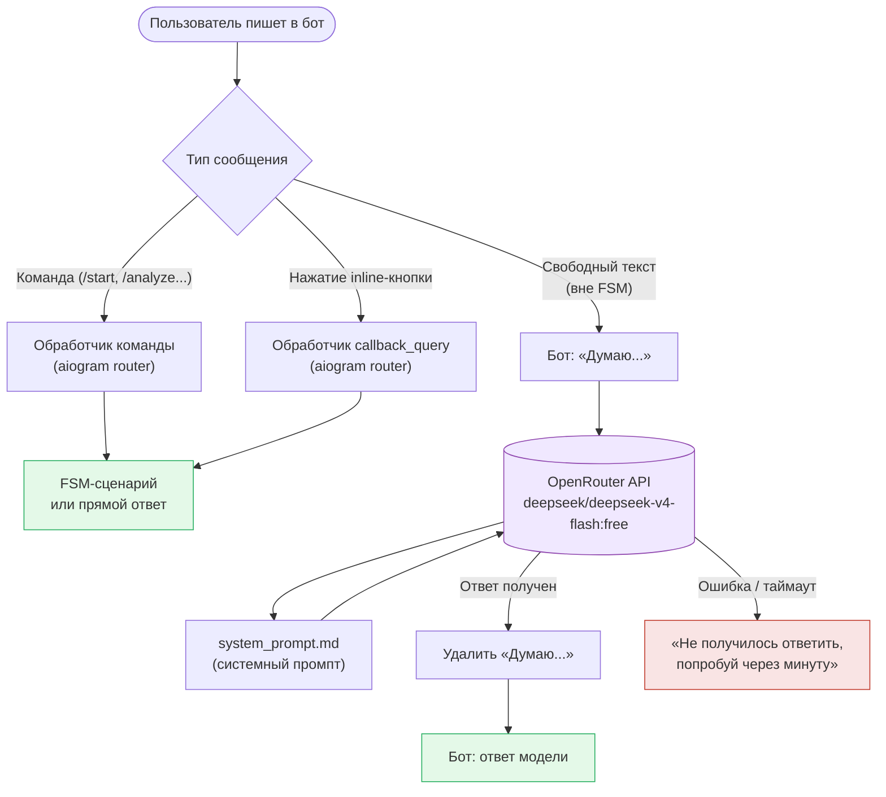

# LLM-интеграция (OpenRouter)

> Ссылки внутри текста вида «см. раздел „…“» ведут на разделы старого CLAUDE.md.
> Теперь они лежат в `памятки/` — ищи раздел по названию (обычно в
> `памятки/журнал-экспериментов.md`).

## LLM-интеграция

Свободный текст пользователя (всё что не команда и не кнопка) обрабатывается через **OpenRouter**.

| Параметр | Значение |
|---|---|
| Провайдер | [OpenRouter](https://openrouter.ai) |
| Модель | `deepseek/deepseek-v4-flash:free` |
| Системный промпт | `system_prompt.md` (читается при старте) |
| Переменная окружения | `OPENROUTER_API_KEY` в `.env` |
| Таймаут | 30 секунд |

Логика в `llm.py`: функция `ask_openrouter()` делает POST на `https://openrouter.ai/api/v1/chat/completions` (вынесена туда из `bot.py`, чтобы её мог использовать и `scheduler.py`). Пока модель думает — пользователю приходит «Думаю...», которое удаляется после ответа. При ошибке — «Не получилось ответить, попробуй через минуту».

### NL-роутер команд (текст словами → действие)

Свободный текст сначала проходит через `llm.classify_intent()` — это отдельный вызов модели с
жёстким системным промптом (`ROUTER_PROMPT`), который возвращает **строгий JSON** `{action, …}`.
Парсер (`_extract_json`) снимает ```-ограждения и достаёт `{…}`; любая осечка (сеть, кривой JSON,
нет `action`) безопасно сводится к `{"action": "chat"}` — тогда сообщение уходит в обычный чат,
как раньше. Диспетчер в `bot.py` (`free_text`) по `action` вызывает существующие обработчики:

| action | Что делает | Подтверждение |
|---|---|---|
| `log_trade` | запись сделки в журнал (instrument, direction, entry/stop/target) | да — кнопка ✅/❌ (FSM `NLConfirm`) |
| `set_alert` | алерт на уровень (instrument, level) | да — кнопка ✅/❌ (FSM `NLConfirm`) |
| `my_alerts` | список активных алертов | нет (только чтение) |
| `analyze` / `signals` / `stats` / `my_trades` | разбор / списки / сводная статистика по сигналам | нет (только чтение) |
| `subscribe` / `unsubscribe` | подписка на сигналы | нет (обратимо) |
| `chat` | обычный AI-ответ (вопросы, разбор пересланного) | — |

Меняющее состояние действие (`log_trade`) переспрашивается кнопкой — защита от неверно
распознанного числа. Направление сделки берётся **по числам** (стоп/цель относительно
входа), а не по словам модели. Инструмент модель отдаёт кодом из реестра (синонимы в промпте);
для своей пары — сырым тикером, который валидируется через `get_price_window`.

### Комментарий к авто-сигналу

К каждому найденному сигналу `scheduler._notify` добавляет 1–2 предложения от LLM
(`llm.comment_on_signal`, промпт `SIGNAL_PROMPT`): почему сетап важен по тренду, силе уровня и
стакану. Комментарий считается один раз на сигнал (не на каждого подписчика); если LLM недоступен
— сигнал всё равно уходит, просто без комментария (ошибка не критична).

### Маршрутизация сообщений



