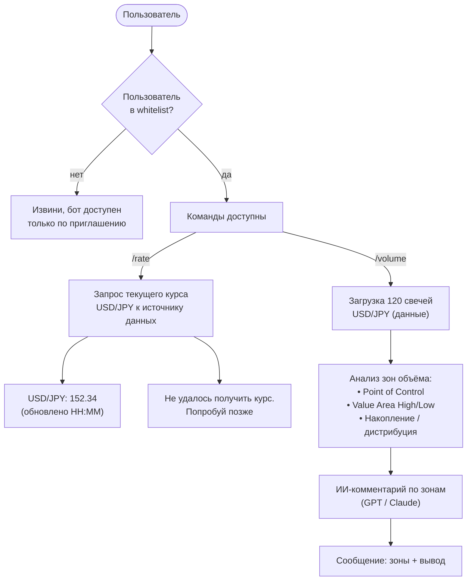

# Журнал экспериментов iron-wake

> ⚠️ **ЭТО ИСТОРИЯ, А НЕ ДЕЙСТВУЮЩИЕ ПРАВИЛА.** Числа, пороги и «вшито в бой»
> ниже — состояние на дату записи; многое с тех пор откачено или выключено.
> Что работает сейчас — только в `памятки/стратегии/`.
>
> Ссылки внутри текста вида «см. раздел „…“» ведут на разделы старого CLAUDE.md.
> Теперь они лежат в `памятки/` — ищи раздел по названию (обычно в
> `памятки/журнал-экспериментов.md`).

> Перенесено дословно из CLAUDE.md 26.09.2026, разложено по датам. Внутри одной
> даты разделы идут в порядке старого файла. Ничего не удалено.

## Апрель 2026 — первые планы (не делались)

Раздел «Планируемый функционал» старого CLAUDE.md. Whitelist заменён закрытым доступом
по подтверждению админа, /rate и /volume так и не делались.

### Планируемый функционал:




## 19 августа 2026
### Замер 19 августа 2026 — что показал переезд на BingX

Прогон: 14 инструментов (13 монет по 833 дня + GOLD 309 дней), 20 000 часовых свечей на
инструмент, боевая конфигурация `main` как точка отсчёта. TON и BRENT в выводы не входят —
у них 47 и 166 дней истории. Семь переборов, каждый — полный прогон детектора на каждый вариант.

**Издержки оказались вчетверо дешевле по фандингу и вдвое дороже по комиссии, чем ожидалось.**

| статья | цена | доля |
|---|---|---|
| комиссия + спред (мейкер 0.02% вход и цель, тейкер 0.05% стоп) | 0.183 R/сделку | 96% |
| фандинг | 0.007 R/сделку | 4% |

Фандинг мал не из-за ставки, а из-за времени удержания: **медианная сделка живёт 2 часа**
(среднее 6ч), а платёж идёт раз в 4–8 часов — чаще всего период просто не наступает. Зато
комиссия дороже наивной оценки «0.04% round-trip мейкером»: выход по стопу это стоп-маркет,
то есть **тейкер**, а стопов у движка вчетверо больше, чем целей.

**Плечо и ликвидация — опасности нет.** При риске 1% счёта нужно плечо 1.2×–3.1×; ликвидация
оказалась бы ближе стопа только на плече 133×–154× (поддерживающая маржа 0.5%, считано по
самой узкой сделке каждого инструмента). Запас двухпорядковый.

**Главный результат — арифметика, а не мнение: цена сделки в R растёт ровно тогда же, когда
растёт эдж.** Оба фильтра дают чистую зависимость «доза — эффект» по брутто, но каждый
отбирает сделки с МЕНЬШИМ риском, а издержки делятся на риск.

Таблица ниже — ВЕРХНЯЯ ГРАНИЦА: в ней заявка считается мейкерской и исполняющейся всегда.
Так сделано нарочно, чтобы колонки сравнивались между собой при одной конвенции; абсолютные
числа в жизни хуже (см. строку с честной ценой под таблицей).

| конфигурация | сделок | брутто R/сделку | цена сделки в R | нетто R/сделку |
|---|---|---|---|---|
| `main` как есть | 2397 | −0.044 | 0.198 | −0.242 |
| дистанция ≤ 0.15 ATR | 1133 | +0.055 | 0.255 | −0.200 |
| дистанция ≤ 0.10 ATR | 848 | +0.094 | 0.263 | −0.169 |
| дистанция ≤ 0.075 ATR | 683 | **+0.139** | 0.265 | −0.126 |
| дистанция ≤ 0.05 ATR | 466 | +0.121 | 0.273 | −0.152 |
| риск ≤ 0.5 ATR | 765 | +0.084 | 0.297 | −0.213 |
| риск ≤ 0.3 ATR | 210 | +0.112 | 0.377 | −0.265 |
| риск ≤ 0.2 ATR | 47 | +0.494 | 0.424 | **+0.070** |

Колонка «цена сделки» растёт монотонно сверху вниз. Эдж прибавляет 0.10–0.18 R, издержки
съедают 0.20–0.42 R. **Разрыв не закрывается ничем из проверенного.**

Честная цена (отдельный прогон, где рыночный вход платит тейкера, а лимитная заявка может не
исполниться): у `main` 0.346 R на сделку при входе по рынку и 0.248 R при лимитном входе с
откатом 0.5. То есть лимитный вход снимает примерно **0.10 R с каждой сделки** — это и есть
весь выигрыш от перехода в мейкеры, и его недостаточно.

**Что проверено и отвергнуто:**

| рычаг | вердикт | почему |
|---|---|---|
| процентиль объёма P60–P80 вместо ×1.5 | **нет** | брутто растёт (+186R у P60), нетто рушится (−1239R): втрое больше сделок, втрое больше комиссии. На спотовых данных августа вывод был обратный |
| `MAX_RISK_ATR` («не входить вдогонку») | эдж есть, нетто нет | монотонно улучшает брутто, но отбирает мелкий риск и тем дорожает |
| `MAX_ENTRY_DIST_ATR` (вход от уровня) | эдж есть, нетто нет | лучший брутто во всём замере (+0.139 при 0.075 ATR), нетто всё равно −0.126 |
| сетка стоп × `MIN_RR` (20 клеток, ATR×0.5…×2.0 на R:R 2…4) | **нет** | оптимум внутренний (ATR×0.5), не на краю — и он отрицательный. Широкий стоп не «спасает», он просто сокращает число сделок |
| комбинации фильтров | **нет** | взаимно уничтожаются: широкий стоп + `MIN_RR` 3 оставляют 19 сделок за 833 дня |
| августовская конфигурация целиком | **нет** | брутто +165R (+0.059/сделку), нетто −939R: `MAX_RISK_ATR` тянет её в самые мелкие риски |

**Ни одна конфигурация не вышла в плюс нетто на обеих половинах истории.** Единственная
плюсовая по нетто в целом — `риск ≤ 0.2 ATR` (+3.3R) — это 47 сделок за 833 дня (1.7 в месяц)
при разбросе ±11R, и на калибровочной половине она в минусе. Это шум, а не находка.

Счёт 1000$ при риске 1% по сценарию «лимитом»: `main` → 0$, лучшая конфигурация
(дистанция 0.1 + лимит 0.5) → 80$. В колонке «идеал» (издержек нет) та же конфигурация даёт
1816$ — ровно тот случай, про который в отчёте написано «живой только в идеале — это не
стратегия, а иллюзия».

**Вывод.** Переезд на фьючерсы BingX снизил издержки впятеро против Kraken-спота, лимитный
вход снизил их ещё, и обе меры сделали ровно то, что обещали. Но стратегия проигрывает не
из-за площадки: **у неё нет эджа, достаточного, чтобы платить даже за самый дешёвый доступный
доступ к рынку.** Разрыв не в 5–10%, а в два-три раза.


## 20 августа 2026
#### Попытка вылечить форекс — замер 20 августа 2026

Раз контракты есть, форекс перемерен на них целиком: четыре пары, год (5900–5975 часовых
свечей на пару), настоящий объём, честные издержки (спред по 6 снимкам, фандинг по истории
платежей — 8ч, ставка 0.00004, вдвое дешевле крипты). Лечение — **перевод ОБОИХ порогов из
процентов цены в доли ATR**: в лабораторию добавлен режим `BREAK_MODE = "atr"`
(`BREAK_ATR_MULT`), стоп в ATR там уже был.

**Молчание вылечилось, деньги — нет.**

| конфигурация | сделок/год | брутто R/сдел | **цена сделки в R** | нетто R/сдел | риск % цены |
|---|---|---|---|---|---|
| боевое (пробой 0.05% цены, стоп 0.1%) | 12 | −0.333 | 0.394 | −0.728 | 0.27% |
| пробой 0.02 ATR / стоп 0.25 ATR | **207** | −0.232 | **1.153** | −1.385 | 0.09% |
| пробой 0.05 ATR / стоп 0.5 ATR | 112 | −0.413 | 0.879 | −1.293 | 0.11% |
| пробой 0.1 ATR / стоп 1 ATR | 28 | −0.499 | 0.592 | −1.091 | 0.19% |
| пробой 0.02 ATR / стоп 1.5 ATR | 11 | +0.186 | 0.361 | −0.175 | 0.30% |
| пробой 0.02 ATR / стоп 6 ATR | 5 | −0.200 | 0.122 | −0.322 | 0.86% |
| *крипта, `main`, для сравнения* | *2397* | *−0.044* | *0.198* | *−0.242* | *0.50%* |

Сигналов стало 12 → 207, то есть порог в ATR действительно чинит молчание. Но **ни одна из
21 конфигурации не вышла в нетто-плюс ни на одной половине года.**

**Механизм — тот же «издержки в R», что и у крипты, только втрое злее.** Издержки одинаковы
в процентах ЦЕНЫ, а делятся на риск сделки. ATR у EUR/USD ≈ 0.071% цены против ≈0.42% у BTC:
форекс в шесть раз спокойнее при той же комиссии, поэтому та же сделка стоит в R в шесть раз
дороже. Отсюда ловушка: **лечение работает против собственной цели** — чем чувствительнее
порог, тем больше сигналов, но тем уже стоп, тем меньше риск в процентах цены и тем ДОРОЖЕ
сделка в R. Это один рычаг, а не два: 207 сделок по 1.15 R против 11 сделок по 0.36 R.

**Край кривой проверен отдельно** (стопы 1.5–6 ATR, горизонты 48ч и 168ч). Цена сделки
действительно падает до 0.122 R — дешевле, чем у крипты. Но там остаётся **4–5 сделок в год
и винрейт 0%**: при `MIN_RR` 2 цель уезжает на 4–12 ATR, а форекс столько за горизонт не
проходит. Недельный горизонт не помог, а местами ухудшил. Фильтра «минимум 20 сделок» не
прошла ни одна конфигурация с широким стопом.

**Вывод: форекс в этой стратегии не лечится порогами.** Чтобы выйти в ноль, ему нужен брутто
не ниже цены сделки — от +0.36 R (редкие настройки) до +1.15 R (частые). Лучший брутто за всю
калибровку крипты — +0.139 R. То есть форексу надо быть в 2.6–8 раз лучше лучшего, что движок
показывал где-либо, только чтобы не терять. Единственная плюсовая по брутто строка (+0.186)
стоит на 11 сделках за год — это шум, и она тоже нетто-минусовая.

**Лучшая настройка ПО БРУТТО (без издержек) — отдельный вопрос, тоже отвечен** (`fx_brutto.py`,
сетка пробой × стоп × `MIN_RR` = 65 конфигураций на горизонтах 72/120/168ч):

```
глубина пробоя 0.05 ATR · запас стопа 1.5 ATR · MIN_RR 1.0 · горизонт 120ч
117 сделок/год на 4 парах, винрейт 46%, ПФ 1.07, брутто +0.035 R/сделку,
обе половины года в плюсе (+1.2 / +2.9)
```

Три вещи в этом результате важнее самой строки:
- **боевой `MIN_RR` 2 не попал в топ ни разу, ни на одном горизонте** — на форексе цель 1:2 не
  доходит, ему нужна близкая цель;
- **горизонт 120ч — внутренний максимум** (72ч и 168ч хуже), то есть это не упор в границу
  перебора: 72ч → 3 плюсовых конфигурации из 52 и ни одной устойчивой, 120ч → 6 и две,
  168ч → 5 и одна;
- **и всё равно это ноль, а не эдж:** +4.1 R за год при разбросе **±12.1 R**. Погрешность
  втрое больше результата — «+0.035 R/сделку» и «ровно ноль» на этих данных не различимы.
  В нетто строка даёт ≈ −0.33 R/сделку (сделка при стопе 1.5 ATR стоит ~0.36 R): эдж и
  издержки различаются в десять раз.

#### Форексная настройка НА КРИПТЕ — замер 20 августа 2026 (`crypto_fx.py`)

Связку «широкий стоп + близкая цель» проверили на крипте: 14 инструментов (13 монет + золото),
**год** истории (тот же период, что у форекса), издержки «лимитом», счёт 1000$ при риске 1%.

| настройка | сдел/мес | эдж (брутто/сд) | **цена сделки** | нетто/сд | счёт через год | просадка |
|---|---|---|---|---|---|---|
| боевое (как в `main`) | 93 | **+0.067** | 0.202 | −0.135 | 178 $ | 84% |
| боевое + RR1 | 195 | +0.025 | 0.164 | −0.139 | 29 $ | 97% |
| форексная (0.05/1.5/RR1) | 54 | −0.002 | **0.063** | **−0.065** | **634 $** | 46% |
| форексная, но RR2 | 8 | −0.228 | 0.046 | −0.274 | 772 $ | 31% |
| только стоп 1.5 ATR | 8 | −0.245 | 0.046 | −0.290 | 765 $ | 32% |
| форексная, стоп 1.0 ATR | 92 | −0.029 | 0.080 | −0.109 | 282 $ | 74% |

**ГЛАВНОЕ: широкий стоп решает проблему издержек в лоб.** Цена сделки упала ВТРОЕ — с 0.202 R
до 0.063 R, лучший показатель за все замеры проекта. Механизм обратен августовской ловушке:
там фильтры отбирали сделки с УЗКИМ риском и тем дорожали, здесь стоп 1.5 ATR специально
растит риск в процентах цены, а комиссия в процентах цены та же — значит в R она делится
на большее число.

**Но эдж при этом исчезает:** +0.067 R → −0.002 R. Винрейт растёт (25% → 43%), однако при цели
1:1 нужно больше 50%, и его не хватает. Получается пара, где решение одной беды ломает другую:
- узкий стоп + далёкая цель → эдж есть (+0.067), комиссия съедает (0.202);
- широкий стоп + близкая цель → комиссия не мешает (0.063), эдж пропал (−0.002).

Ни одна конфигурация не плюсовая ни на одной половине года. Горизонт на крипте почти не влияет
(48ч и 120ч дают одно и то же) — в отличие от форекса, потому что медианная сделка живёт 2 часа.
Строки с 8 сделками в месяц выглядят лучше по деньгам только потому, что почти не торгуют.

**Практический смысл для будущих попыток:** если когда-нибудь искать прибыльную конфигурацию,
стоп 1.5 ATR — правильная отправная точка по ИЗДЕРЖКАМ, и искать надо эдж при таком стопе
(другой триггер входа, другой отбор уровней), а не крутить стоп обратно в узкую сторону.

Замеры живут в лаборатории (`fx_cure.py`, `fx_cure2.py`, `fx_brutto.py`, `crypto_fx.py`);
в `main` из них не переносится ничего. Что было починено по дороге и осталось полезным для будущих замеров: пагинация
истории для форекса (он проваливался в ветку без неё и давал 29 дней вместо 358) и таблицы
спреда/фандинга NCFX в `money.py`.

### Замер 20 августа 2026 — сочетание двух фильтров

Порознь оба ATR-фильтра были измерены 19 августа, **вместе — нет**, а в меню они включались
независимо. Ожидание было такое: дистанция до уровня арифметически всегда меньше риска сделки
(риск = закрытие → экстремум + запас, а пробой требует, чтобы экстремум ушёл за уровень), значит
«вход ≤ 0.075» намного строже «риска ≤ 0.5» и при обоих включённых будет доминировать первый.

**Ожидание не подтвердилось.** Перебор `--sweep both` (добавлен в лабораторию, та же конвенция
издержек, что у `dist2`/`risk2`; три общие строки воспроизвелись до третьего знака):

| конфигурация | сигналов | сигн./мес | брутто R/сделку | нетто на свежей половине |
|---|---|---|---|---|
| выкл | 2397 | 88 | −0.044 | −198.6 R |
| только вход ≤ 0.075 | 683 | 25 | +0.139 | +9.2 R |
| только риск ≤ 0.5 | 765 | 28 | +0.084 | +11.5 R |
| вход 0.05 + риск 0.5 | 251 | 9 | +0.145 | +28.1 R |
| вход 0.075 + риск 0.5 | 366 | 13 | +0.164 | +21.5 R |
| вход 0.1 + риск 0.5 | 451 | 16 | +0.161 | +32.7 R |
| вход 0.075 + риск 0.75 | 533 | 19 | **+0.179** | +24.8 R |

Фильтры **не вложены** друг в друга: порознь они оставляют 683 и 765 сделок, вместе — 366. То
есть «риск ≤ 0.5» срезает примерно половину того, что пропускает «вход ≤ 0.075», и наоборот.
Причина в том, что арифметическое неравенство (дистанция ≤ риск) ничего не говорит о порогах,
заданных на разных шкалах: свеча может закрыться вплотную к уровню и при этом иметь огромный
фитиль, то есть большой риск.

Сочетания дали **лучшую среднюю сделку во всём замере** (+0.179 R) и лучший итог на свежей
половине (+32.7 R). Поэтому в `/settings` они присутствуют отдельными кнопками.

**Но вывод от этого не меняется.** Колонка «оба нетто+» — «нет» у всех строк без исключения: ни
одна конфигурация не выходит в плюс после издержек на ОБЕИХ половинах истории. По всей истории
целиком лучшая строка даёт −52 R. Фильтры делают сигналы реже и качественнее — прибыльной
стратегию они не делают.


## 21 августа 2026
### Замер 21 августа 2026 — ПЕРВЫЙ ДВИЖОК на данных BingX (`first_engine.py`)

Этот замер полтора месяца не был записан в документацию — внесён 2 сентября, когда
владелец попросил вернуть логику первого движка. Без него разговор шёл бы вслепую.

`../iron-wake-lab/first_engine.py` — копия коммита **`c855660` (22 июня 2026)** один в
один: VSA + Spring/Upthrust, ещё без фильтра R:R, без ATR-фильтров, без лимитного входа
и без двухступенчатого трекинга. Вход по рынку (закрытие свечи пробоя), стоп за экстремум
± `STOP_SPREAD`, цель — **ближайший встречный уровень БЕЗ всякой проверки R:R**, а если
уровня впереди нет — запасная цель ровно 2R. Прогон на фьючерсах BingX, 21 инструмент,
перебор 1296 конфигураций (объём × глубина пробоя × запас стопа × горизонт), выбор по
деньгам при счёте 1000$ и риске 1%.

**Боевая конфигурация первого движка (объём ×1.5, пробой 0.05%, стоп 0.1%, горизонт 48ч):**

```
13600 сделок за 27 мес = 500/мес · винрейт 57%
брутто −0.057 R · издержки 0.197 R · нетто −0.254 R
счёт 1000$ → 0$, просадка 100% · место 1277 из 1296 в переборе
```

Для сравнения нынешний `main` в той же лаборатории: 2397 сделок = 88/мес, брутто −0.044,
нетто −0.242. **Цена сделки почти та же, а сигналов впятеро-вшестеро больше** — и это
целиком заслуга отсутствия фильтра `MIN_RR`. Именно поэтому возврат первого движка —
решение про ЧАСТОТУ, а не про качество: убыток за период растёт во столько же раз, во
сколько растёт число сделок.

**Винрейт 57% против 23% у `main` — не улучшение.** Без порога 1:2 цель ставится на
ближайший уровень, а он часто рядом: сделки чаще доходят до цели, но приносят мало.
Это надо помнить, читая `/stats`: высокий винрейт здесь ничего не говорит о деньгах.

**В плюс вышли 65 конфигураций из 1296 (5%), и все они — артефакт.** Лучшая по деньгам
(объём ×8, пробой 0.20%, **стоп 12% цены**, горизонт 120ч) даёт 212 сделок за 27 месяцев,
винрейт 98% и счёт 1067$. Стоп в 12% от цены — это не стоп, а его отсутствие: сделка почти
всегда доживает до цели. Отчёт печатает отдельную таблицу «лучшие там, где стоп остаётся
стопом» (запас ≤ 0.5% цены) — **все строки в ней отрицательные**, лучшая даёт 986$.
Сам скрипт про свою лучшую строку пишет честно: «выбрано из 1296 перебранных конфигураций
— при таком переборе несколько значимых плюсов появляются и на случайных данных».

**Что из этого замера пригодилось.** Он дал число, ради которого стоило его найти: сколько
именно стоит снятие фильтра R:R. Пятикратный рост частоты при неизменной цене сделки —
это и есть цена решения, и она была названа владельцу до того, как он его принял.

### Замер 21 августа 2026 — продолжение импульса после пробоя (отклонено)

Проверялась гипотеза владельца — **зеркало движка**. Сейчас движок торгует РАЗВОРОТ: свеча
проколола уровень и вернулась (ложный пробой). Здесь наоборот: пробой НАСТОЯЩИЙ — свеча
закрылась за уровнем и там осталась, — дальше откат к пробитому уровню и вход на этом откате
В СТОРОНУ пробоя, стоп за уровнем. Риск считается ОТ ТОЧКИ ВХОДА после отката.

Прогон: 14 инструментов BingX, 833 дня, 12 364 сделки, `momentum.py`. В `main` не перенесено
ничего. Критерий приёмки объявлялся ДО прогона (нетто > 0 на обеих половинах, эффект > 2×SE,
не меньше 100 сделок) — не прошла ни одна конфигурация.

**Ответ на вопрос «докуда доходит», при стопе 2 ATR (лучший по нетто во всей сетке):**

| цель | дошло раньше стопа | случайное блуждание | брутто R/сделку |
|---|---|---|---|
| 1R | 48.9% | 50% | +0.004 |
| 1.5R | 37.6% | 40% | +0.002 |
| 2R | 29.2% | 33.3% | −0.018 |
| 3R | 18.4% | 25% | −0.082 |

Колонка «случайное блуждание» — вероятность дойти до +kR раньше −1R у блуждания без сноса,
то есть `1/(1+k)`. **Замер совпадает с ней в пределах погрешности, а с ростом цели идёт ниже.**
Это утверждение сильнее обычного «нетто в минусе»: минусовать может и стратегия с эджем, если
издержки велики. Здесь эджа нет ДО издержек — после пробоя с объёмом и отката цена ведёт себя
как монетка.

**Издержки при этом ПОЧИНЕНЫ — это отдельный, положительный результат замера.** Ширина стопа
двигает цену сделки ровно так, как предсказывает арифметика «издержки ÷ риск»:

| стоп | винрейт (2R) | брутто | цена сделки | нетто | ср. риск, % цены |
|---|---|---|---|---|---|
| под уровнем | 21% | −0.360 | 0.416 R | −0.776 | 0.35% |
| 0.5 ATR | 30% | −0.102 | 0.210 R | −0.312 | 0.55% |
| за свечой пробоя | 33% | −0.020 | 0.096 R | −0.116 | 1.50% |
| 1 ATR | 33% | **−0.003** | 0.106 R | −0.109 | 1.11% |
| **2 ATR** | 33% | −0.018 | **0.060 R** | **−0.078** | 2.22% |
| 3 ATR | 31% | −0.046 | 0.045 R | −0.091 | 3.32% |

0.045–0.060 R на сделку — **дешевле, чем где-либо в проекте** (прежний рекорд 0.063). То есть
издержки перестали быть блокиратором. Не хватает не дешевизны доступа к рынку, а самого эджа.

**Откат импульсу ВРЕДИТ — в отличие от разворота.** Зависимость монотонная по обеим осям
(стоп под уровнем, цель 2R):

| вход | винрейт | риск, % цены | цена сделки | нетто |
|---|---|---|---|---|
| по рынку, без отката | 29% | 0.66% | 0.448 R | −0.572 |
| откат 0.25 | 24% | 0.49% | 0.323 R | −0.617 |
| откат 0.5 (как в бою) | 21% | 0.35% | 0.416 R | −0.776 |
| откат 0.75 | 17% | 0.21% | 0.586 R | −1.071 |
| откат ровно на уровне | 10% | 0.10% | 1.089 R | −1.786 |

Механизм: откат подводит вход ближе к стопу, риск в процентах цены падает вшестеро, а издержки
на него делятся — и дорожают вчетверо. Одновременно узкий стоп чаще свипают. **Переносить
лимитный вход с разворота на импульс нельзя:** у разворота вход ОТ уровня — это суть сетапа,
у импульса он режет ровно ту величину, на которую делятся издержки.

**Сетка «стоп × откат» прогнана целиком** (12 конфигураций), потому что мерить два рычага
порознь и делать вывод о сочетании — та самая ошибка, на которой сгорела калибровка августа.
Лучшее брутто во всей сетке — `1 ATR × вход по рынку`, +0.022 R/сделку, и это меньше 2×SE,
то есть неотличимо от нуля. Лучшее нетто — `2 ATR × откат 0.5`, −0.078 R/сделку. Плюсовых
нетто нет ни в одной клетке ни на одной половине истории.

**Что ещё намерено:**
- **откат приходит почти всегда** — 87% пробоев дают откат до половины пути к уровню, медиана
  1 час. Наблюдение владельца «откат хорошо срабатывает» верно; ломается не оно;
- стоп под уровнем выбивает **94%** сделок при медианном ходе в плюс **0.00 R**;
- фильтр дневного тренда не даёт ничего (−0.360 против −0.361 без него);
- горизонт не даёт ничего: 24ч и 168ч неразличимы — сделки умирают быстрее, чем он наступает;
- ждать отката дольше 4 часов бессмысленно (24ч против 2ч: нетто −0.743 против −0.793).

**Вывод.** И разворот (Spring/Upthrust), и продолжение импульса на ОДНИХ И ТЕХ ЖЕ уровнях-пивотах
H1 дают ноль брутто. Значит дело не в направлении сделки и не в механике входа: **уровни-пивоты
H1 в этом наборе не несут информации о будущем ходе цены.** Следующая гипотеза, если она будет,
должна менять источник уровней или таймфрейм, а не сторону сделки.

**Осторожно с этим замером — первый прогон был недействителен.** Детектор считал пробоем любой
уровень НИЖЕ закрытия (условия `high > уровень` и `close > уровень` выполняются для каждого
такого уровня) и брал первый из списка — часто пивот в 7% под рынком. Поймано по одному числу:
средний риск сделки вышел 6.59% от цены, столько не бывает. Исправление — требовать СВЕЖЕЕ
пересечение (до свечи цена была под уровнем) и брать ближайший к закрытию из пробитых.
**Урок на будущее: у любого нового детектора первым делом печатать средний риск в процентах
цены и сверять с ориентиром (0.2–1.5% на H1-крипте).** Ошибка сидела в определении события,
а не в арифметике отчёта, и регрессия `--check-mirror` её не ловила — та проверяет
реконструкцию уровней, а не условие срабатывания. Нужны обе проверки.


## 28 августа 2026
### Замер 28 августа 2026 — ТЗ v3 «объём → откат → подтверждение» (отклонено)

Владелец написал ТЗ на стратегию, ПРОТИВОПОЛОЖНУЮ боевой: не ложный пробой, а вход по
направлению движения после отката, с подтверждением свечой поглощения. Мотив, названный
словами: **стоп должен стоять за часовым поглощением или за часовым фитилём, которым
вынесло по стопам перед ним.** Плюс отдельным документом — предложение добавить
фрактальный слой M15 внутри H1-отката. Замер живёт в лаборатории (`volume_retest.py`,
`probe_stop.py`, `tz_atr.py`), в `main` не перенесено ничего.

**Две поправки к ТЗ, установленные ревизией кода до всякого замера.** Стоп в `main` УЖЕ
часовой (`pattern_detector` ставит его за экстремум часовой свечи пробоя), а M5 в боте нет
вообще — претензия ТЗ «сделка задумывалась по часовой логике, а стоп ставился по
пятиминутке» к текущему коду не относится. И «лимитки висят без ограничения времени»
устарело: заявка снимается через `ENTRY_WAIT_BARS` = 4 часа. Из 20 блоков ТЗ полностью
готовы три (фильтр 3 = `MIN_RR`, лимитка со сроком жизни, тейк по R:R), семь частично,
десять отсутствуют; ядро — машина состояний «импульс → откат → подтверждение» — не
существует, нынешний движок принципиально без памяти.

**Фильтр 2 оказался НЕ блокиратором — вопреки ожиданию.** `probe_stop.py` замерил
`ATR(D1)/ATR(H1) = 5.06`, и величина почти не гуляет по инструментам (4.85–5.32 на всех 14).
Значит связывающая проверка «дневной ход вмещает 5 стопов» пропускает стоп шириной
**≈1.0 ATR(H1)**, а стоп нынешнего движка (0.81 ATR) проходит её в 78% случаев. Заодно
закрыта двусмысленность ТЗ: правило выброса паранормальных дней меняет ATR(D1) ровно в
1.000 раза, то есть не значит ничего.

**ГЛАВНОЕ: ТЗ v3 не даёт НИ ОДНОЙ сделки за 833 дня на 14 инструментах.** Воронка:

```
16008  всплеск объёма > mean+2σ
 8810  тело >= 50% размаха
 3537  тренд D1 не FLAT
  907  тренд H1 == D1          <- самый крупный срез, 74%
  709  закрытие по тренду
  238  уровень в 0.5 ATR = СЕТАПОВ СОЗДАНО
    5  дожили до рабочей зоны  (205 отменены, 33 истекли)
    0  подтверждений -> 0 СДЕЛОК
```

**Пройдена вся лестница ослабления раздела 8 ТЗ, накопительно до последней ступени —
по-прежнему ноль.** Сетапов становится 319, до зоны доживают 22, подтверждений ноль на
каждой ступени. Ослабления шли в порядке, заданном автором ТЗ заранее, — это выполнение
задания, а не подбор.

**Внутри ТЗ найдено арифметическое противоречие.** Условие отката требует, чтобы средний
объём просел ниже `0.7 × mean(50)`, а отмена срабатывает уже при среднем выше `1.0 × mean(50)`.
Импульсная свеча аномальна по объёму (`mean+2σ`), объём автокоррелирован, поэтому среднее
стартует около 2.0 и до 0.7 не успевает осесть. Замер распределения: **лучшее (минимальное)
значение за жизнь сетапа имеет медиану 1.38, p10 = 0.75, p90 = 2.98 — порог 0.7 лежит ниже
десятого перцентиля достижимого.** Ступень 2 лестницы (0.7 → 0.9) на порядок мала: чтобы
условие вообще начало срабатывать, порог должен быть около 1.4. ТЗ пунктом 11 раздела 10 уже
правило это условие (сравнение с объёмом импульса было всегда-ИСТИННЫМ) и промахнулось в
другую сторону — сделав всегда-истинной отмену.

**Просьба владельца про стоп проверена отдельно и она работает** (`--strategy sweep_confirm`):
нынешний Spring/Upthrust, но вход не на закрытии свечи свипа, а после часового поглощения,
стоп за ДАЛЬНИМ из {поглощение, фитиль свипа}. 103 сделки за 833 дня.

| вариант стопа | ширина ATR(H1) | риск % цены | **цена сделки R** | нетто/сделку | счёт 1000$ |
|---|---|---|---|---|---|
| боевой движок (якорь) | 0.81 | 0.92% | **0.190** | −0.233 | 2 $ |
| фикс. 1.5 ATR | 1.50 | 2.00% | 0.107 | −0.097 | 900 $ |
| за поглощением | 2.23 | 2.81% | 0.096 | −0.010 | 976 $ |
| **за дальним из двух** | **3.82** | **5.25%** | **0.062** | **+0.054** | **1008 $** |

**Закон «издержки в R» воспроизвёлся на четырёх точках подряд, включая якорь:** чем шире
стоп, тем дешевле сделка в R. Это ЗАРАНЕЕ отвечает на главный вопрос обратной связи про
M15-стоп: более узкий структурный стоп с M15 будет ДОРОЖЕ, а не выгоднее. Пункт «меньший
риск на единицу движения» подан там как выгода, но на этом проекте это измеренная ловушка.
Стоп владельца («за дальним») — лучший из трёх по всем колонкам сразу.

**И всё же sweep_confirm ОТКЛОНЁН по объявленному ДО прогона порогу.** Требовалось: нетто > 0
на обеих половинах, эффект > 2×SE, не меньше 100 сделок. Факт: половины +7.4 и −2.3
(на свежей минус), эффект +5.2 R при разбросе ±12.6 R (0.4×SE, неотличимо от нуля), сделок 95.
Провалены все три. Разброс по инструментам это подтверждает: DOGE +7.1 R, SOL −7.6 R, ADA
−5.5 R — на 5–12 сделках каждый, то есть шум.

**Корректность прогона проверена тремя тестами** (`--self-test`), и все они содержательные,
а не сравнение нуля с нулём: ATR(D1) не заглядывает вперёд (точное совпадение на 813 днях
при урезанной истории), перерисовки нет (12 входов против 12 на общем участке), симметрия
сходится (11 лонговых сетапов ↔ 11 зеркальных шортовых). Проверка вменяемости
переформулирована: сверять надо не риск в процентах цены (широкий стоп законно выбивает
любой абсолютный порог), а **риск на один ATR** — у обеих стратегий вышло 1.14–1.26%, в норме.

**СНЯТИЕ ПРАВИЛ ОТМЕНЫ (просьба владельца) — и три противоречия внутри ТЗ.** Отмены сняли
по одной, чтобы видеть цену каждой (`--cancels`):

| вариант | сетапов | до зоны | баров в зоне | подтверждений | сделок |
|---|---|---|---|---|---|
| как в ТЗ (все отмены) | 238 | 5 | 22 | 0 | 0 |
| без отмены по объёму | 231 | 6 | 30 | 0 | 0 |
| без отмен вовсе | 218 | 9 | 88 | 0 | 0 |
| без отмен + порог объёма 1.4 | 218 | **60** | **591** | **0** | **0** |

Возможностей стало в 27 раз больше — подтверждений по-прежнему ноль. Разбор 591 бара:
52 поглощения по тренду, 28 из них внутри зоны, **0 с объёмом выше mean+2σ**. Отсюда три
взаимно блокирующих требования, каждого из которых хватает по отдельности:

1. **откат на пониженном объёме против отмены по объёму** — вход требует < 0.7×mean(50),
   отмена срабатывает при > 1.0×mean(50), достижимая медиана 1.38;
2. **тихий откат против двухсигмовой свечи подтверждения внутри него** — на M5 короткий
   всплеск внутри тихого часа возможен, на H1 свеча подтверждения И ЕСТЬ бар отката: она не
   может быть одновременно тихой и аномальной. Это цена решения перенести подтверждение с M5
   на часовку;
3. **вход после импульса и отката против фильтра 1** — стратегия по построению входит поздно
   в дневном ходе, а фильтр 1 именно это и запрещает. Когда требование объёма с подтверждения
   сняли, появился 21 сигнал — и **все 21 забракованы фильтрами**: фильтр 1 девять, фильтр 2
   шесть, фильтр 3 шесть.

**Есть ли эдж на дне этой кучи — проверено отдельно.** Сняли ВСЁ: отмены, требование объёма
с подтверждения, все три фильтра Верстика. Осталась голая конструкция «импульс → откат →
поглощение»: **21 сделка за 833 дня на 14 инструментах** (0.75 в месяц), нетто от −5.1 до
+4.1 R при разбросе ±8.0–8.9 R. Весь плюс собран двумя инструментами по две сделки (XRP и
BTC, обе прибыльные), остальные двенадцать в минусе. Это шум, а не эдж.

**Вывод.** Архитектура ТЗ требует совпадения слишком многих редких событий в окне 12–24
часов и не работает даже после полного ослабления по собственной инструкции. Ценное из
замера — не стратегия, а стоп: «за дальним из двух» даёт самую дешёвую сделку в R за всю
историю проекта (0.062 против прежнего рекорда 0.063 у `crypto_fx.py`), но эджа при нём
по-прежнему нет. Фаза 2 (закачка M15 и фрактальный слой) НЕ начата: строить её над
стратегией, не давшей ни одной сделки, нечем оправдать.

### Замер 28 августа 2026 — один рычаг: ширина стопа на боевом движке

Продолжение замера ТЗ v3. Из всего ТЗ единственным, что держалось на каждом прогоне, оказался
стоп: вариант «за дальним из двух» давал самую дешёвую сделку в R за всю историю проекта.
Владелец попросил строить вокруг него. Поэтому боевой вход оставлен как есть, и меняется
РОВНО ОДИН рычаг — запас стопа (`backtest.py --sweep stop`, 12 вариантов, 21 инструмент,
20 000 часовых свечей, каждый вариант с полным пересчётом детектора: широкий стоп меняет риск,
значит меняет цель и фильтр R:R, значит и набор сделок у него свой).

| стоп | сделок | брутто/сд | нетто/сд | **цена сделки R** | выбило-и-поехало | счёт 1000$ |
|---|---|---|---|---|---|---|
| **0.1% (боевой)** | 2462 | −0.052 | −0.254 | **0.202** | **914 (37%)** | 2 $ |
| 0.3% | 1663 | −0.059 | −0.189 | 0.130 | 497 (30%) | 34 $ |
| ATR×0.5 | 1225 | −0.064 | −0.201 | 0.137 | 300 (24%) | 89 $ |
| ATR×1.0 | 460 | −0.164 | −0.255 | 0.091 | 60 (13%) | 316 $ |
| ATR×1.5 | 222 | −0.252 | −0.317 | 0.065 | 9 (4%) | 500 $ |
| ATR×2.0 | 137 | −0.158 | −0.211 | 0.053 | 1 (1%) | 754 $ |
| **ATR×3.0** | 92 | −0.081 | −0.127 | **0.046** | **0 (0%)** | 896 $ |

**Интуиция владельца про стоп подтвердилась полностью — в своей механической части.**
Широкий стоп делает ровно две обещанные вещи, и обе монотонно:

- **убирает выбивание шумом**: «выбило-и-поехало» (стоп закрыл в минус сделку, которая без
  него дошла бы до цели) падает с 914 сделок (37%) до НУЛЯ;
- **делает сделку дешевле**: цена в R падает с 0.202 до 0.046 — вчетверо с лишним, новый
  рекорд проекта (прежний 0.062 у `sweep_confirm`, до него 0.063 у `crypto_fx.py`).

**И этого не хватает.** Брутто на сделку отрицательно при ЛЮБОЙ ширине стопа: от −0.052 у
боевой до −0.252 у ATR×1.5, без единого плюсового варианта. Нетто улучшается (−624 R → −11.7 R),
но не потому, что появился эдж, а потому что сделок становится в 27 раз меньше: 2462 → 92.
Счёт растёт с 2 $ до 896 $ — то есть вариант просто медленнее теряет, а выше стартовой тысячи
не поднимается ни один. **Колонка «оба нетто+» — «нет» у всех двенадцати вариантов.**

**Заодно закрыт вопрос про `sweep_confirm`.** Его +0.116 брутто на 95 сделках выглядели
лучшим результатом дня, но при сопоставимой ширине стопа боевой вход даёт −0.158 (ATR×2.0,
137 сделок) и −0.081 (ATR×3.0, 92 сделки). Разница лежит внутри разброса (±12.6 R у
`sweep_confirm`), то есть преимущество подтверждения поглощением на этих данных НЕ УСТАНОВЛЕНО.

**Вывод, и он про стратегию, а не про стоп.** Издержки как блокиратор закрыты окончательно:
0.046 R за сделку — это дешевле, чем где-либо в проекте, и дальше снижать нечего. Остаётся
голый факт: **у Spring/Upthrust на уровнях-пивотах H1 отрицательный брутто при любой ширине
стопа.** Это согласуется с выводом замера 21 августа, где разворот и продолжение импульса на
ТЕХ ЖЕ уровнях дали ноль брутто каждый. Менять надо источник уровней или таймфрейм, а не
стоп и не сторону сделки — стоп теперь измерен и исчерпан.


## 2 сентября 2026
### Замер 2 сентября 2026 — снятие фильтра R:R и пороги в ATR (`rr_off.py`)

Замер ветки `first-engine-atr`. Два рычага меряны **и вместе, и порознь** (сетка 2×2) —
мерить их только вместе значило бы не знать, который что сделал.

**Якорь сошёлся точно:** боевая конфигурация дала 2397 сигналов и −0.044 R брутто,
−0.242 нетто — ровно опубликованные числа. Прогон настроен так же, остальным строкам
можно верить.

14 инструментов (13 монет + GOLD), 20000 часовых свечей, горизонт 48ч. Конвенция
издержек — вход по закрытию мейкером, та же, что у всех таблиц проекта.

| конфигурация | сдел | /мес | вин | брутто | цена сделки | нетто |
|---|---|---|---|---|---|---|
| якорь: бой как есть | 2397 | 88 | 23% | −0.044 | 0.199 | −0.242 |
| **только снят R:R** | 12608 | **461** | 56% | −0.065 | **0.105** | **−0.170** |
| только пороги в ATR | 2517 | 92 | 22% | −0.045 | 0.248 | −0.293 |
| ВЕТКА: и то и другое | 12752 | 466 | 55% | −0.067 | 0.123 | −0.190 |

**Рычаг №1 — снятие R:R — сработал лучше, чем ожидалось.** Сигналов стало в 5.2 раза
больше (88 → 461 в месяц; замер первого движка предсказывал 500 — сошлось), и при этом
**сделка стала вдвое дешевле в R** (0.199 → 0.105). Механизм — та же ловушка «издержки
в R», только развёрнутая в нашу пользу: порог 1:2 отбирал сделки с УЗКИМ риском (им легче
дотянуться до цели в два риска), а узкий риск дорог в R. Сняли порог — средний риск
вырос, издержки на него делятся, цена упала.

**Рычаг №2 — перевод в ATR — сам по себе УХУДШИЛ** (−0.242 → −0.293). Цена сделки выросла
0.199 → 0.248. Причина арифметическая: `STOP_ATR` 0.10 — это медиана набора, а у крупных
монет прежний стоп был шире (у BTC 0.165 ATR), и им стоп затянуло. Перевод выравнивает
инструменты между собой — но выравнивает их по медиане, а не в лучшую сторону.

Вместе (−0.190) выходит хуже, чем один снятый R:R (−0.170): второй рычаг отъедает часть
выигрыша первого.

**ГЛАВНОЕ ЧИСЛО ЗАМЕРА — ширина стопа.** На той же выборке из 12752 сигналов:

| запас стопа | вин | брутто | цена сделки | нетто |
|---|---|---|---|---|
| 0.10 ATR (эквивалент прежнего) | 55% | −0.067 | 0.123 | −0.190 |
| 0.25 ATR | 59% | −0.054 | 0.095 | −0.150 |
| 0.5 ATR | 63% | −0.042 | 0.071 | −0.113 |
| 1.0 ATR | 70% | −0.031 | 0.048 | −0.079 |
| 1.5 ATR | 74% | −0.022 | 0.036 | −0.058 |
| **2.0 ATR** | 78% | **−0.012** | **0.029** | **−0.042** |

**0.029 R за сделку — самая дешёвая сделка за всю историю проекта** (прежний рекорд 0.046
у `--sweep stop` 28 августа, до него 0.062 и 0.063). Закон «издержки в R» воспроизвёлся
в шестой раз подряд и на этой конфигурации работает сильнее, чем где-либо: нетто улучшается
вчетверо с лишним, а число сделок НЕ падает вовсе — 12752 при любой ширине стопа, потому
что отбор от стопа больше не зависит (фильтра R:R нет).

Это отличает замер от всех прежних: раньше широкий стоп улучшал нетто ценой обвала числа
сделок (2462 → 92 в замере 28 августа). Здесь платить нечем — частота не меняется.

**И всё же брутто отрицательный на всех строках без исключения**, и обе половины истории
в минусе везде. Эджа не появилось: движок стал сильно дешевле, но по-прежнему не выигрывает.

#### Стоп «за дальним из двух»: работает, но за счёт ШИРИНЫ, а не структуры

Отдельный прогон (`stop_struct.py`) на той же выборке из 12752 сигналов. Число сделок
от стопа не зависит вовсе — фильтра R:R нет, ATR-фильтры выключены, — поэтому все
варианты считаются на ОДНОЙ выборке, и сравнение чистое.

Якорей два, оба воспроизвелись: боевая конфигурация дала 2397 и −0.044, прежний
вариант ветки (стоп за свечой свипа, запас 0.10 ATR) — 12752 и −0.190.

| вариант | риск, % цены | вин | брутто | цена сделки | нетто |
|---|---|---|---|---|---|
| свеча свипа · 0.10 ATR (было) | 1.34% | 55% | −0.067 | 0.123 | −0.190 |
| **дальний из 2 · 0.10 ATR** | 1.56% | 58% | −0.058 | 0.108 | **−0.167** |
| дальний из 3 · 0.10 ATR | 1.70% | 59% | −0.058 | 0.102 | −0.160 |
| дальний из 5 · 0.10 ATR | 1.85% | 61% | −0.056 | 0.096 | −0.151 |
| дальний из 2 · 0.25 ATR | 1.72% | 61% | −0.050 | 0.086 | −0.136 |
| дальний из 2 · 0.50 ATR | 1.98% | 65% | −0.042 | 0.065 | −0.106 |
| *контроль: свип · 0.50 ATR* | *1.76%* | *63%* | *−0.042* | *0.071* | *−0.113* |
| *контроль: свип · 1.00 ATR* | *2.28%* | *70%* | *−0.031* | *0.048* | *−0.079* |
| *контроль: свип · 1.50 ATR* | *2.80%* | *74%* | *−0.022* | *0.036* | *−0.058* |

**Правило владельца работает: −0.190 → −0.167** против стопа, который оно заменило.
Винрейт 55% → 58%, цена сделки 0.123 → 0.108 R. По сравнению с тем, что было, лучше
по всем колонкам сразу.

**НО контрольные строки отвечают на главный вопрос, и ответ отрицательный.** Контроль —
это ПРОСТО широкий стоп от свечи свипа, без всякой структуры. Сравнивать надо при
СОПОСТАВИМОЙ ширине, иначе сравнение выродится в «широкий стоп дешевле», что и так
известно шестью замерами подряд:

| при ширине ≈1.7% цены | брутто | нетто |
|---|---|---|
| дальний из 2 · 0.25 ATR (структура) | −0.050 | −0.136 |
| **свип · 0.50 ATR (просто шире)** | **−0.042** | **−0.113** |

При одной и той же средней ширине **простой широкий стоп идёт чуть ЛУЧШЕ структурного** —
и по брутто, и по нетто. То же на паре «дальний из 5 · 0.10» (1.85%) против «свип ·
0.50» (1.76%). То есть весь выигрыш правила «за дальним из двух» объясняется тем, что
оно делает стоп ШИРЕ, а не тем, что структура сетапа что-то знает о будущем.

Это не отменяет правило: как способ получить стоп, который сам подстраивается под
размах конкретного сетапа, оно нормальное и лучше прежнего. Но записывать его в
источник эджа нельзя — эджа в нём не измерено.

**Брутто отрицательный во всех девяти строках.** Винрейт растёт до 74%, и это снова
не улучшение: при широком стопе и близкой цели высокий винрейт — арифметическое
следствие, а не признак качества.

#### Лимитная заявка и снятый R:R конфликтуют — это НЕ было очевидно

Второй блок прогона считает то, что реально делает бот: лимитную заявку с откатом 0.5.

| конфигурация | сдел | /мес | брутто | цена | нетто | не исполнено |
|---|---|---|---|---|---|---|
| якорь: бой как есть | 2075 | 76 | −0.122 | 0.248 | −0.370 | 322 (**13%**) |
| только снят R:R | 6941 | 254 | −0.203 | 0.168 | −0.372 | 5667 (45%) |
| ВЕТКА: и то и другое | 7012 | 256 | −0.212 | 0.198 | **−0.410** | 5740 (**45%**) |

**Заявка перестаёт исполняться: 13% → 45%.** И сделка становится ХУЖЕ якоря (−0.410
против −0.370), хотя при входе по закрытию она была ЛУЧШЕ (−0.190 против −0.242).

Причина — адверс-селекция, усиленная близкой целью. Без фильтра R:R цель ставится на
ближайший уровень, часто совсем рядом. Цена доходит до неё, не успев откатиться к заявке
на полпути, — и именно ВЫИГРЫШНЫЕ сделки проходят мимо. Брутто обваливается −0.067 → −0.212.

**Практический вывод: `ENTRY_PULLBACK` 0.5 был измерен на конфигурации с далёкой целью и
на конфигурацию с близкой целью не переносится.** Откат 0 (заявка ровно по закрытию —
это по-прежнему мейкер, просто без ожидания) даёт −0.190 и ноль неисполненных заявок.
Замер 19 августа, где откат 0.5 выигрывал, остаётся верным для СВОЕЙ конфигурации.

#### Заявка по закрытию: стадии ожидания у неё нет (и почему это важно)

`ENTRY_PULLBACK` = 0 значит «заявка по цене закрытия свечи» — то есть ровно там, где
рынок стоит в момент сигнала. В жизни такая заявка исполняется за секунды.

**Но `evaluate_fill` восстанавливает события по ЧАСОВЫМ свечам**, и при неоднозначности
внутри бара считает осторожно: если бар накрыл и заявку, и цель — значит цель была
раньше, и сделки не было. Для заявки, которая ЖДЁТ отката, это правильно: порядок
событий внутри часа действительно неизвестен. Для заявки по текущей цене ответ заведомо
неверен, и с близкой целью он срабатывает сплошь и рядом.

Замер (`fill_real.py`, 14 инструментов) показал цену этой ошибки:

| счёт исполнения | сделок | не исполнено | винрейт | нетто |
|---|---|---|---|---|
| осторожный (как считал бот) | 7782 | **4970 (39%)** | 40% | −0.320 |
| заявка исполняется сразу | 12713 | 0 | 56% | −0.136 |

**Отсеивались в первую очередь выигрышные сделки** — винрейт оставшихся падает 56% → 40%.
Бот сообщал бы «заявка снята» по сделкам, которые на самом деле открылись, и терял бы
две пятых статистики.

Поэтому с 2 сентября при нулевом откате `monitor_signals` помечает сигнал `filled` сразу,
с якорем на свече сигнала. Это ровно конвенция «вход по закрытию», в которой посчитаны
все таблицы проекта, — бот и замер снова описывают одно и то же. Первая ступень трекинга
сохранена: она работает при ненулевом откате и для старых записей в базе.

**Грабли, на которые я наступил по дороге** (записано, чтобы не повторить). Увидев
расхождение, я сначала «починил» лабораторию — убрал из `pullback_entry` ранний выход при
`frac=0`. Стало хуже: цикл переносит `bar_time` на свечу ИСПОЛНЕНИЯ, исход начинает
считаться со следующего бара, и брутто уехало −0.050 → −0.117 чисто от сдвига якоря.
Откачено. Правило: **ранний выход при `frac=0` в лаборатории трогать нельзя** — он и есть
верная модель «вход по закрытию».

**Что остаётся честной оговоркой.** Модель считает такой вход мейкерским. Заявка по
последней цене исполняется быстро, но роль мейкера не гарантирована: если она пересечёт
спред, будет тейкер. Верхняя граница этого оптимизма измерена отдельно — 0.248 R против
0.346 R у прежней конфигурации, то есть около 0.10 R на сделку.

#### Кнопки `/settings`: лестница перевернулась целиком

**Числа ниже — про промежуточную конфигурацию** (стоп 0.10 ATR от свечи свипа). После
расширения стопа до 0.25 ATR и перехода на структурный экстремум кнопки пересчитаны
заново, и лестница ВЕРНУЛАСЬ — см. «Строгость отбора». Раздел оставлен, потому что он
объясняет механизм: без фильтра R:R строгость отбора начинает работать против себя.

| кнопка | /мес | брутто | цена | нетто |
|---|---|---|---|---|
| выкл | 466 | −0.067 | 0.123 | −0.190 |
| риск 0.75 | 134 | −0.071 | 0.257 | −0.328 |
| вход 0.1 | 108 | −0.076 | 0.197 | −0.273 |
| вход 0.075 | 83 | −0.063 | 0.201 | −0.264 |
| вход 0.075 + риск 0.75 | 42 | −0.047 | 0.314 | −0.361 |

**По собственному критерию проекта все четыре кнопки стали ДОМИНИРУЕМЫМИ:** «выкл» даёт
И больше сигналов, И лучшую среднюю сделку одновременно. Выбирать любую из них незачем
никогда. Причина та же, что и у всего замера: фильтры отбирают сделки у самого уровня, а
у них узкий риск — и издержки на него делятся.

Раньше это компенсировалось ростом брутто (+0.179 у лучшей кнопки), потому что порог R:R
уже отсеял мусор и фильтры работали по «чистой» выборке. Без него они отсеивают не мусор,
а просто широкие сделки — то есть ровно те, что дешевле.

### Сила отбоя вшита в движок (2 сентября 2026)

Единственный рычаг проекта, улучшивший брутто и нетто ОДНОВРЕМЕННО, — и первое за два
месяца изменение движка, сделанное ради эджа, а не ради издержек.

**Что требуется теперь.** Свеча свипа должна закрыться не ниже `config.MIN_CLOSE_POS`
(0.6) своего размаха, считая от нужного края. Для лонга это `(close − low) / (high − low)`,
для шорта зеркально. Свеча, еле переползшая уровень обратно, и свеча, выкупившая прокол
целиком, до этого дня были для движка одинаковы.

| | сигналов/мес | брутто | цена сделки | нетто |
|---|---|---|---|---|
| было (без отбоя) | 466 | −0.050 | 0.086 | −0.136 |
| **стало (отбой ≥ 0.6)** | **302** | **−0.030** | **0.055** | **−0.084** |

Замер, дуга доза-эффект по семи порогам и проверка значимости — в комментарии к
`config.MIN_CLOSE_POS` и в разделах «ЧТО УЛУЧШАЕТ БРУТТО» и «DISPLACEMENT и BOS».
Коротко: улучшение монотонно до 0.60 и разворачивается после, обе половины истории идут
вместе, а оставленные сделки лучше ОТБРОШЕННЫХ на 3.3 своих ошибки.

**Цена решения — треть сигналов.** 466 → 302 в месяц. Владелец ценит частоту, поэтому
это назвать надо прямо: рычаг покупает качество за частоту, как и все прежние. Отличие
в том, что прежние покупали качество за ДЕНЬГИ (нетто ухудшалось), а этот улучшает и их.

**Чего это НЕ делает.** Брутто остаётся отрицательным: −0.030 вместо −0.050, то есть
сорок процентов пути до нуля. Прибыльной стратегия не стала.

**Что поменялось в коде вместе с порогом** — всё, что иначе начало бы врать:
- `_close_pos(h, l, c, side)` — общий помощник для `_detect` и `explain`, как
  `_stop_buffer` и `_break_depth`. Разъедутся — и `/analyze` начнёт обещать сигнал,
  которого движок не даст;
- `/analyze` получил ПУНКТ 4 «Сила отбоя» и блокер «отбой 0.31 размаха свечи — порог 0.6
  (прокол выкупили вяло)», пункты про пробой и R:R сдвинулись на 5 и 6;
- строка «Пороги движка» в отчёте называет отбой рядом с проколом и объёмом;
- `llm.ANALYST_PROMPT` и `system_prompt.md` — модель обязана знать про шестое условие,
  иначе объяснит расклад по пяти и разойдётся с отчётом над собой;
- четыре теста: отбой требуется для лонга и для шорта (двигаем ТОЛЬКО закрытие — сигнал
  появляется), свеча без размаха отдаёт `None`, и `explain` называет именно эту причину.
  Все четыре падают, если порог обнулить, — проверено.

**Кнопки `/settings` пересчитаны на движке С отбоем** (`filters_new.py --rebound`):
подписи, снятые без него, описывали бы уже не тот движок, что в боте.

### Замер 2 сентября 2026 — ЧТО УЛУЧШАЕТ БРУТТО (`edge.py`, `edge_dose.py`, `edge_net.py`)

Все прежние замеры ветки двигали ЦЕНУ сделки: широкий стоп, вход по закрытию, снятый
фильтр R:R. Брутто при этом стояло около −0.05 и было отрицательным везде. Значит
рычаги были не те: они меняли, сколько сделка СТОИТ, а не сколько она приносит.

Здесь меряется только брутто и только рычаги КАЧЕСТВА СЕТАПА. Издержки не считаются
вовсе: если эджа нет, считать их незачем. Критерий объявлен ДО прогона и вшит в скрипт —
брутто лучше базы (−0.050), плюс на ОБЕИХ половинах, сделок ≥ 300, эффект отличим от нуля.
Каждый вариант меняет РОВНО ОДИН рычаг; сочетания не считаются (перебор сочетаний на
14 рычагах гарантированно найдёт «значимый» плюс и на случайном шуме).

| рычаг | сдел | /мес | брутто | 1-я пол | 2-я пол | вердикт |
|---|---|---|---|---|---|---|
| база: ветка как есть | 12752 | 466 | −0.050 | −0.065 | −0.036 | точка отсчёта |
| только сильные уровни | 450 | 16 | **−0.127** | −0.237 | −0.016 | хуже вдвое |
| уровни только D1 | 445 | 16 | −0.127 | −0.235 | −0.020 | хуже вдвое |
| уровни только H1 | 12531 | 458 | −0.049 | −0.060 | −0.038 | как база |
| объём ×2 | 7095 | 259 | −0.063 | −0.086 | −0.040 | хуже |
| объём ×3 | 2792 | 102 | −0.050 | −0.071 | −0.030 | как база |
| объём ×4 | 1287 | 47 | −0.080 | −0.110 | −0.050 | хуже |
| вход ≤ 0.02 ATR | 578 | 21 | −0.025 | −0.013 | −0.037 | t=0.5, шум |
| вход ≤ 0.05 ATR | 1501 | 55 | −0.029 | −0.094 | +0.037 | половины спорят |
| **отбой ≥ 0.5 размаха** | 9514 | 348 | **−0.036** | −0.048 | −0.024 | ✔ прошёл |
| тело ≤ 0.5 размаха | 6791 | 248 | −0.057 | −0.079 | −0.036 | хуже |

**ГЛАВНЫЙ ВЫВОД: всё, что крутится на стороне СВИПА, не даёт ничего. Единственное, что
дало, — на стороне РЕАКЦИИ**, то есть как именно свеча закрылась после прокола.

**Дополнение 3 сентября: есть и ТРЕТЬЕ место, где искать, и оно тут не проверялось.** Все
14 рычагов меняли ОТБОР сетапов. Минимальная цель (см. одноимённый раздел) не меняет отбор
вовсе — она меняет ГЕОМЕТРИЮ уже отобранной сделки, и это дало второе по величине улучшение
брутто в проекте. Значит при планировании следующих замеров стоит держать в голове три
стороны, а не две: свип, реакция и геометрия сделки (цель, стоп, горизонт).

Три результата стоит запомнить отдельно, они контринтуитивны:
- **сильные уровни ХУЖЕ слабых вдвое** (−0.127 против −0.050). Звёздочка в сигнале,
  помечающая уровень как приоритетный, по деньгам вводит в заблуждение. Отдельно
  проверено и обратное направление — «сильный → сильный», см. замер ниже: сделки
  между двумя сильными часовыми уровнями в данных практически нет;
- **дневные уровни хуже часовых**; смена источника уровней (рекомендация замера
  21 августа) отработана — ответ отрицательный;
- **вход вплотную к уровню перестал работать.** Раньше это был самый надёжный рычаг
  брутто (+0.139 с фильтром R:R). Теперь t=0.5, половины спорят. Рычаг умер вместе с
  фильтром: он работал по «чистой» выборке, которую тот уже отобрал.

#### Сила отбоя: доза — эффект, и он настоящий

Тонкая сетка (`edge_dose.py`) — проверка, механизм это или удачное ведро:

| порог | сдел | /мес | брутто | 1-я пол | 2-я пол |
|---|---|---|---|---|---|
| база | 12752 | 466 | −0.050 | −0.065 | −0.036 |
| ≥ 0.25 | 11863 | 434 | −0.047 | −0.059 | −0.035 |
| ≥ 0.35 | 11016 | 403 | −0.046 | −0.059 | −0.033 |
| ≥ 0.45 | 10042 | 367 | −0.037 | −0.047 | −0.026 |
| ≥ 0.50 | 9514 | 348 | −0.036 | −0.048 | −0.024 |
| ≥ 0.55 | 8923 | 326 | −0.033 | −0.048 | −0.018 |
| **≥ 0.60** | 8275 | 302 | **−0.030** | −0.047 | −0.012 |
| ≥ 0.70 | 6799 | 248 | −0.037 | −0.053 | −0.021 |

Улучшение МОНОТОННОЕ от базы до 0.60, обе половины идут вместе, потом разворот. Оптимум
ВНУТРЕННИЙ, а не на краю сетки — это собственный тест проекта на «механизм, а не подгонка
под диапазон перебора». Первая грубая сетка (0.5/0.66/0.8) дала «пик и провал» и едва не
привела к неверному выводу: шаг 0.05 показал плавную дугу.

**По деньгам (`edge_net.py`) — впервые рычаг тянет обе колонки в одну сторону:**

| вариант | /мес | риск, % цены | брутто | цена сделки | нетто |
|---|---|---|---|---|---|
| база | 466 | 1.72% | −0.050 | 0.086 | −0.136 |
| отбой ≥ 0.5 | 348 | 2.01% | −0.036 | 0.060 | −0.095 |
| **отбой ≥ 0.6** | 302 | 2.11% | −0.030 | **0.055** | **−0.084** |

Механизм: фильтр отбирает свечи, закрывшиеся ДАЛЕКО от своего экстремума, а стоп стоит
за экстремумом — значит риск шире, а издержки на него делятся. До сих пор все фильтры
проекта улучшали одно за счёт другого; этот единственный улучшает и то и другое.

**НО брутто по-прежнему отрицательное** (−0.030 вместо −0.050 — сорок процентов пути до
нуля). И честная оговорка: проверено 14 рычагов, прошёл один; при таком переборе одна
«значимая» находка появляется и на шуме. Защищает от этого дуга по семи точкам и то, что
поглощение (см. ниже) пришло к той же величине с другой стороны.

#### Часовое поглощение — то же самое, вчетверо дороже (`engulf.py`)

Правило владельца: сетап подтверждается ЧАСОВЫМ ПОГЛОЩЕНИЕМ (тело свечи сигнала
перекрывает тело предыдущей, закрытие в сторону сделки). Полная история, 833 дня:

| рычаг | сдел | /мес | вин | брутто | цена | нетто | 1-я | 2-я |
|---|---|---|---|---|---|---|---|---|
| база | 12752 | 466 | 61% | −0.050 | 0.086 | −0.136 | −0.065 | −0.036 |
| часовое поглощение | 2067 | **76** | 72% | −0.029 | 0.052 | −0.080 | −0.046 | −0.012 |
| поглощение строгое (размах) | 770 | 28 | 71% | −0.033 | 0.053 | −0.086 | −0.022 | −0.044 |
| отбой ≥ 0.6 | 8275 | **302** | 69% | −0.030 | 0.055 | −0.084 | −0.047 | −0.012 |
| поглощение + отбой | 1820 | 67 | 72% | −0.037 | 0.048 | −0.084 | −0.050 | −0.023 |

**Поглощение и отбой — ОДНО И ТО ЖЕ, измеренное двумя способами:** брутто −0.029 против
−0.030, половины совпадают до третьего знака. Механически понятно: свеча поглощения по
определению закрывается близко к своему краю, то есть это ПОДМНОЖЕСТВО решительного
закрытия. Разница только в цене: поглощение оставляет 76 сигналов в месяц против 302.

Сочетание хуже каждого по отдельности. Строгое поглощение — половины спорят, шум.

**Осторожно с критерием `t` в этих скриптах.** Он считается как |итог ÷ ошибка| и отвечает
на вопрос «отличим ли результат от нуля». Но итог у всех строк ОТРИЦАТЕЛЬНЫЙ, поэтому
высокое t значит «надёжно в минусе», а не «надёжно лучше». Правильный тест — разница
между рычагом и базой, а не сумма. Он НЕ ПРОГНАН; выводы выше держатся на дуге доза-эффект
и на совпадении двух независимых формулировок, а не на t.

### Замер 2 сентября 2026 — фрактальный вход M15 (отклонено по данным)

Просьба владельца: часовое поглощение создаёт сетап, дальше на M15 ловим откат и входим
на M15-поглощении в сторону сделки; если откат уходит за стоп — отбой сделки.
Реализовано целиком (`m15_entry.py`, `dl_m15.py`), включая правило отмены.

**Данных нет.** BingX отдаёт по M15 ровно **99 дней** (9600 свечей вместо запрошенных
80000) — меньше, чем у BRENT, который в проекте признан непригодным для калибровки.

Насколько этот отрезок нерепрезентативен, видно по одной строке: **база на 99 днях дала
брутто +0.003, а на 833 днях та же конфигурация даёт −0.050.** Период сам по себе
аномально удачный, все абсолютные числа завышены.

| арм (99 дней) | сдел | /мес | брутто | нетто | отменено |
|---|---|---|---|---|---|
| A. база | 1422 | 437 | +0.003 | −0.096 | — |
| B. + часовое поглощение | 203 | 62 | +0.052 | −0.016 | — |
| C. + вход по M15-поглощению | 155 | 48 | +0.053 | −0.035 | 0 |
| C2. + отмена за стопом | 142 | 44 | +0.017 | −0.049 | 30 |
| D2. + откат 0.25 | 107 | 33 | +0.010 | −0.066 | 32 |

**Слой M15 не добавляет ничего** сверх часового поглощения (брутто +0.052 → +0.053), а по
деньгам хуже: вход случается позже и ближе к стопу, риск сужается, издержки на него
делятся и дорожают (0.068 → 0.087 → 0.111 по мере ужесточения). Тот же механизм убил
откат в замере импульса 21 августа.

**Правило отмены не подтвердилось:** убрало 30 сетапов, брутто упало +0.053 → +0.017,
то есть отменённые были не хуже оставшихся. Логика правила понятна (позиции ещё нет,
терять нечего; стоп проверен рынком и устоял), но и это в пределах шума.

**Никакие различия между армами C…F2 не значимы.** При 150 сделках стандартная ошибка
средней сделки около 0.08 R, а все разницы 0.01–0.04. Ловушка, в которую я едва не попал:
на одном BTC (17 сделок) отмена перевернула арм с −0.032 на +0.032 — и это была чистая
случайность, на полном наборе знак поменялся обратно.

**Вывод: M15 не вшивать** — не потому, что идея неверна, а потому, что на доступных
данных её нельзя ни подтвердить, ни опровергнуть. Вшивать в бота память, второй поток
данных и задержку сигнала на таком основании нельзя. Если данные M15 появятся откуда-то
ещё (другая биржа, платный источник), замер готов и запускается как есть.

### Замер 2 сентября 2026 — DISPLACEMENT и BOS (отклонены, `disp_bos.py`)

Пункты 4 и 5 схемы владельца, первые два в очереди. Мерены сразу после замера брутто,
на той же выборке и с критерием, объявленным до прогона. **Оба отклонены.**

Замер устроен в ДВА БЛОКА, и это не оформление, а суть: displacement можно понимать
как свойство свечи свипа (тогда это фильтр, вход не меняется) и как событие ПОСЛЕ неё
(тогда меняется механика входа). Смешивать их нельзя — ответы получились разные.

#### Блок 1 — displacement как фильтр на свече свипа

Путь от экстремума свечи до её закрытия в долях ATR. Отличие от «отбоя» в мерке:
отбой считает ОТНОСИТЕЛЬНО размаха самой свечи, displacement — АБСОЛЮТНО, в ATR.

| рычаг | сдел | /мес | брутто | нетто | **t к отброшенным** |
|---|---|---|---|---|---|
| база: ветка как есть | 12752 | 466 | −0.050 | −0.127 | — |
| displacement ≥ 0.25 ATR | 12289 | 449 | −0.050 | −0.122 | +0.0 |
| displacement ≥ 0.5 ATR | 10715 | 392 | −0.044 | −0.104 | +1.3 |
| displacement ≥ 0.75 ATR | 8715 | 318 | −0.045 | −0.096 | +0.7 |
| displacement ≥ 1.0 ATR | 6711 | 245 | −0.041 | −0.083 | +1.2 |
| displacement ≥ 1.5 ATR | 3471 | 127 | −0.042 | −0.075 | +0.8 |
| **отбой ≥ 0.6 (сверка)** | 7685 | 281 | **−0.026** | −0.076 | **+3.3** |

Ожидание было обратным: казалось, что относительная мерка обманывается мелкой свечой,
закрывшейся на своём максимуме. **Вышло наоборот** — отбой лучше вдвое по брутто и
единственный проходит по значимости. Дозы у displacement нет: строки 0.5…1.5 стоят на
одном уровне, а не выстраиваются в дугу.

**И этим же прогоном закрыта оговорка предыдущего замера.** Там записано, что t против
нуля отвечает на вопрос «надёжно ли мы в минусе», а правильный тест — против базы — «НЕ
ПРОГНАН». Здесь он прогнан в чистом виде: оставленные сделки против ОТБРОШЕННЫХ, группы
не пересекаются, поэтому сравнение честное. **Отбой держится: +3.3 своих ошибки.**

#### Блок 2 — подтверждение с отложенным входом

Displacement и BOS как события ПОСЛЕ свипа: вход по закрытию того бара, на котором
подтверждение случилось. Стоп и цель не меняются. Если цена ушла за стоп раньше
подтверждения — сетапа нет (входить в лонг ниже собственного стопа нельзя).

**КОНТРОЛЬНЫЕ СТРОКИ ЗДЕСЬ ГЛАВНЫЕ.** Подтверждение делает две вещи сразу: отбирает
сетапы И сдвигает вход. Контроль — вход через 1/2/3 бара БЕЗ всякого условия — отделяет
одно от другого. Без него замер выродился бы в «поздний вход даёт другой риск», что и
так известно шестью замерами. Та же роль, что у контрольных строк в `stop_struct.py`.

| арм | сдел | /мес | вин | **при нулевом эдже** | брутто | нетто | **t к контролю** |
|---|---|---|---|---|---|---|---|
| якорь: вход по закрытию свипа | 12752 | 466 | 60% | 64% | −0.050 | −0.127 | — |
| контроль: +1 бар без условия | 8578 | 313 | 55% | 58% | −0.022 | −0.118 | — |
| контроль: +2 бара без условия | 7067 | 258 | 56% | 58% | −0.032 | −0.122 | — |
| контроль: +3 бара без условия | 6091 | 223 | 57% | 59% | −0.032 | −0.116 | — |
| displacement 0.25 ATR за 3ч | 6816 | 249 | 60% | 62% | −0.004 | −0.083 | +1.0 |
| displacement 0.5 ATR за 3ч | 4943 | 181 | 63% | 65% | −0.005 | −0.072 | +0.9 |
| displacement 0.75 ATR за 3ч | 3335 | 122 | 66% | 69% | −0.016 | −0.073 | +0.3 |
| displacement 1.0 ATR за 3ч | 2160 | 79 | 68% | 71% | −0.020 | −0.069 | +0.1 |
| displacement 1.0 ATR за 6ч | 2686 | 98 | 68% | 71% | −0.016 | −0.064 | +0.8 |
| BOS минорный (окно 1) за 3ч | 2038 | 74 | 69% | 72% | −0.029 | −0.090 | −0.3 |
| BOS минорный (окно 1) за 6ч | 2278 | 83 | 70% | 72% | −0.023 | −0.081 | −0.0 |
| BOS уровневый (окно 3) за 6ч | 1202 | 44 | 78% | 80% | −0.030 | −0.081 | −0.3 |

**Ни один арм не отличим от простой задержки входа** (t к контролю ≤ 1.0 при пороге 2).
И доза идёт В ОБРАТНУЮ СТОРОНУ: чем СТРОЖЕ порог displacement, тем ХУЖЕ результат
(−0.004 при 0.25 ATR → −0.020 при 1.0 ATR). Лучшая строка — там, где условие почти
ничего не отбирает, то есть работает ожидание, а не событие.

**Колонка «при нулевом эдже» — самое сильное утверждение замера.** Это винрейт, который
дало бы блуждание БЕЗ СНОСА при той же геометрии сделки, `1/(1+R:R)`. Фактический
винрейт **ниже неё во всех двенадцати строках без исключения**. Винрейт 78% у BOS не
значит ничего: при таком входе монетка дала бы 80%. Это ровно тот результат, что дал
замер продолжения импульса 21 августа, — только теперь на стороне разворота.

#### BOS отбирает В ОБРАТНУЮ СТОРОНУ — и это видно прямо

Отчёт печатает, куда делись сетапы и что они дали БЫ по базе:

```
BOS минорный за 6ч:   не подтвердилось 2686 (база-R +0.26)
BOS уровневый за 6ч:  не подтвердилось 3541 (база-R +0.32)
```

**Сетапы, НЕ давшие слома структуры, оказались лучше тех, что дали.** То есть BOS не
слабый рычаг, а рычаг с обратным знаком: дожидаясь его, мы остаёмся именно без тех
сделок, которые приносили. Механизм понятен и он общий для всего блока 2 — без фильтра
R:R цель стоит близко, и пока мы ждём подтверждения, она успевает уйти: 2100–3400
сетапов на арм, у них база-R от +0.29 до +0.46.

Симметрично, ожидание отсекает и провалы («стоп до входа», база-R от −0.76 до −1.00).
Эти два потока примерно гасят друг друга — отсюда и результат «как контроль».

**Оговорка про риск в процентах цены.** У армов блока 2 он 1.9–2.5% против ориентира
0.2–1.5%, записанного в проекте как проверка вменяемости нового детектора. Здесь это не
ошибка определения события: ориентир снимался на узком стопе (0.92% у боевого движка
августа), а у ветки стоп структурный и вдвое шире — база уже даёт 1.72%. Отложенный вход
добавляет остальное. Ориентир надо пересчитывать под ветку, а не подгонять под него стоп.

### Замер 2 сентября 2026 — ОТ СИЛЬНОГО ЧАСОВОГО К СИЛЬНОМУ ЧАСОВОМУ (`strong2strong.py`)

Просьба владельца, поставленная прямо: считать сделку от сильного часового уровня к
сильному часовому. **Отклонено, и главная причина не в деньгах.**

**Почему это НЕ повтор замера «только сильные уровни»** (тот дал −0.127 и записан в
«ЧТО УЛУЧШАЕТ БРУТТО»). Там менялся ВХОД: цель по-прежнему бралась ближайшая любая.
Здесь меняются обе стороны сделки, и вторая меняет геометрию: сильных уровней мало,
цель уезжает далеко, R:R растёт, винрейт обязан упасть сам по себе. Это другой рычаг.
Лабораторному детектору для него добавлены ключи `TARGET_STRONG_ONLY` и `TARGET_TF` —
отбор кандидатов в ЦЕЛЬ, отдельно от `STRONG_ONLY`/`LEVEL_TF` на входе. Раздельно
намеренно: иначе не узнать, какая из двух половин что сделала.

**ГЛАВНЫЙ ФАКТ ЗАМЕРА: сделки «от сильного к сильному» в данных почти не существует.**
Колонка «запасн.» — доля сделок, где сильной цели впереди НЕ НАШЛОСЬ и цель поставлена
запасная, на 2 риска (`FALLBACK_RR`). Без этой колонки замер выдал бы за «цель на
сильном уровне» обычную цель 2R:

| допуск «сильного» | сделок | брутто | ±SE | **запасн.** |
|---|---|---|---|---|
| 0.10% (боевой) | 38 | **+0.184** | 0.223 | **100%** |
| 0.50% | 155 | −0.138 | 0.104 | 95% |
| 1.00% | 268 | −0.239 | 0.075 | 85% |

На боевом допуске — 38 сделок за 833 дня на ВСЕХ 14 инструментах, то есть одна в месяц,
и **ни в одной из них цель не стояла на сильном часовом уровне**: их впереди не было
ни разу. Строка называется «сильный → сильный», а меряет «вход от сильного уровня,
цель 2R».

**Допуск ослаблялся ровно затем, чтобы проверить ИДЕЮ, а не редкость её реализации.**
Считать «сильным» совпадение в пределах 0.5% и 1% вместо 0.1% — сильных уровней
становится вчетверо и всемеро больше. И тогда видно две вещи:
- **плюс исчезает с ростом выборки, монотонно**: +0.184 (38 сделок) → −0.138 (155) →
  −0.239 (268). Знак переворачивается — так ведёт себя шум, а не эффект;
- **сильной цели впереди всё равно нет**: 100% → 95% → 85% запасных. Ослабили допуск
  вдесятеро, а доля упала на пятнадцать пунктов.

**Механизм, словами.** Сильный уровень — это редкая точка, где часовой пивот лёг в
дневной. Такие точки НЕ образуют коридор, по которому цена ходила бы от одной к другой:
между двумя сильными уровнями всегда полно обычных, и цена упирается в них. Поэтому
«ходить от сильного к сильному» — это не описание рынка, а описание рынка, каким его
удобно рисовать.

**Измеримые соседи отвечают на тот же вопрос с другой стороны — и тоже отрицательно:**

| вариант (допуск 0.1%) | сделок | вин | R:R | истекло | брутто | нетто |
|---|---|---|---|---|---|---|
| якорь: движок бота | 8275 | 69% | 0.61 | 150 | −0.030 | −0.084 |
| цель — сильный любого ТФ | 8275 | 22% | 5.51 | **1677** | −0.258 | −0.352 |
| цель — сильный H1 | 8275 | 32% | 2.11 | 1051 | −0.051 | −0.134 |
| вход — сильный H1 | 38 | 66% | 0.61 | 0 | +0.003 | −0.050 |
| сильный → сильный любого ТФ | 314 | **9%** | 6.41 | 99 | **−0.444** | −0.524 |

Последняя строка — худшая за всю историю замеров проекта. Причина видна в колонке
«истекло»: при цели в 5–6 рисков сделка за 48 часов до неё просто не доходит. Движок
живёт на БЛИЗКИХ целях — берёт мало, но часто (винрейт 69% при R:R 0.61); отодвинь
цель — и винрейт рушится быстрее, чем растёт выигрыш.

**Что осталось незакрытым и честно является ограничением замера.** Горизонт 48 часов
выбирался под близкие цели, и для цели в 5+ рисков он мал. Строка «цель — сильный
любого ТФ» с её 1677 истёкшими — это отчасти замер горизонта, а не замер целей.
Если тема вернётся, мерить надо связку «далёкая цель + длинный горизонт», а не одну
далёкую цель. Оговорка касается ТОЛЬКО строк с далёкими целями: у самой конфигурации
«сильный → сильный» истёкших почти нет, и её приговор от горизонта не зависит.


## 3 сентября 2026
### Форекс вернулся в движок (3 сентября 2026)

Валютные пары были в движке с 21 августа, 2 сентября их вывели по деньгам, а 3 сентября
вернули — решением владельца и **без замера на нынешнем движке**. Инструментов в движке
снова 21, весь реестр.

**Что именно сделано — ровно одна строка.** `instruments.engine_codes()` больше не
спрашивает про флаг `"fx"`: условие снова одно — есть биржевой источник свечей. Ни
порогов, ни веток по инструментам, ни отдельного расписания в детекторе не появилось.

**Флаг `"fx"` остался, и смысл у него ТРЕТИЙ по счёту.** До 2 сентября он значил «у пары
свои пороги детектора» (пороги стали общими, в долях ATR), с 2 по 3 сентября — «пара не
входит в движок» (форекс вернули). Сегодня это признак РАСПИСАНИЯ: контракты `NCFX*`
торгуются по форекс-сессии. На состав движка он не влияет и в `engine_codes()` не
участвует. Это записано в docstring `is_fx()` — историю смысла держать надо, иначе
следующая правка примет флаг за то, чем он был.

**Отдельных порогов у форекса нет и не вернулось.** Константы `FX_BREAK_ATR`,
`FX_STOP_ATR` и `FX_IGNORE_ATR_FILTERS` удалены 2 сентября вместе с процентами цены и
НЕ восстанавливались: в ATR считают все (`BREAK_ATR` / `STOP_ATR`), фильтры строгости
`/settings` действуют на валютные пары так же, как на крипту. Возврат форекса — это
возврат пар в набор, а не возврат прежней ветки `fx` в `_detect` и `explain`.

**ЦЕНА РЕШЕНИЯ НАЗВАНА И ЗАМЕРОМ НЕ ОТМЕНЕНА.** По замеру 20 августа форекс давал
−1.385 R на сделку, из которых **1.153 R — издержки**. Механизм: комиссия одинакова в
процентах цены, а делится на риск сделки; у форекса риск 0.09% цены против 0.50% у крипты,
поэтому та же сделка стоит в R на порядок дороже. Ни одна из 21 проверенной конфигурации
не вышла в плюс ни на одной половине года — раздел «Попытка вылечить форекс» остаётся в
силе целиком. **На нынешнем движке** (снятый R:R, пороги в ATR, структурный стоп, сила
отбоя, скользящий час) **форекс не мерился вовсе** — владелец попросил включить без замера,
и это честно надо помнить, читая `/stats`.

**Что стоило бы померить, если тема вернётся.** Ровно то же, чем меряли всё остальное:
`rr_off.py` / `filters_new.py` на парах `NCFX*` — брутто, цена сделки в R, обе половины
истории. Механизм «издержки в R» никуда не делся, а нынешний движок ставит стоп вдвое
шире прежнего — это единственное, что могло сдвинуть картину в пользу форекса, и
единственное, ради чего замер имел бы смысл.

**Подписки на форекс в боевой базе снова дают сигналы** — те самые, что молчали сутки.
`scheduler._subscribed_engine()` спрашивает `engine_codes()`, поэтому включение состава
движка их и оживило; ничего мигрировать не пришлось.

**Расписание — единственное практическое отличие от крипты.** Вне форекс-сессии BingX
держит контракт на паузе (`symbol is pause currently`), и в субботу по валютной паре
молча не отработают ни `run_analysis`, ни `monitor_signals`, ни `check_alerts`: каждая
задача ловит ошибку по инструменту и идёт дальше. Второе следствие — разрывы: скользящий
час собирается из четырёх M15 по счёту, а не по времени, поэтому на стыке сессий один
«час» может склеиться из баров по разные стороны выходных. У крипты и товаров такого нет.
Замером это не проверялось.

**Данные у форекса хорошие, и дело никогда не было в них.** Настоящий объём, стакан на
50 уровней, спред 0.013–0.021% — уже, чем у TON и ADA из крипто-набора.

### Минимальная цель в ATR (3 сентября 2026)

Второй рычаг подряд, улучшивший брутто. И первый в проекте, который **ничего не стоит по
частоте сигналов**: 302 в месяц и до, и после.

**Откуда взялся — живой сигнал, а не перебор.** Владелец прислал скриншот: ЛОНГ по золоту
2 сентября, вход 4337.30, стоп 4302.09, цель 4339.29. Риск 35 долларов ради 2, R:R 1:0.06.
Сделка выиграла (цена дошла до 4339 через час), но золото в тот же день сходило на 4401 —
мимо прошло 64 доллара. Сигнал воспроизведён в лаборатории до копейки: свеча свипа —
H1 11:00 UTC (объём ×1.48, отбой 0.97), стоп за минимумом предыдущей свечи (4306.98) минус
0.25 ATR, цель — максимум свечи 07:00.

Цель дал не сбой, а правило «ближайший встречный уровень, какой есть» — прямая цена снятия
фильтра R:R. **И это не редкость: у трети сделок цель ближе 0.2 риска, у каждой пятой —
ближе 0.1.** Медиана R:R 0.36.

**Что требуется теперь.** Уровни ближе `config.MIN_TARGET_ATR` 0.5 ATR от закрытия при
выборе цели пропускаются, цель встаёт на следующий за ними.

| | сигн./мес | вин | R:R | брутто | цена сделки | нетто |
|---|---|---|---|---|---|---|
| было | 302 | 69% | 0.61 | −0.030 | 0.055 | −0.084 |
| **стало (цель ≥ 0.5 ATR)** | **302** | 60% | 0.83 | **−0.016** | 0.061 | **−0.077** |

**ГЛАВНОЕ ОТЛИЧИЕ ОТ ФИЛЬТРА R:R — что именно отбраковывается.** Тот выбрасывал СИГНАЛ и
резал около 80% сетапов. Этот двигает ЦЕЛЬ. Отсюда встроенная самопроверка прогона: число
сделок обязано быть одинаковым во всех строках — если поехало, задет не тот рычаг и читать
таблицу нельзя (в отчёте `target_min.py` эта строка печатается явно).

**Оттуда же главное преимущество замера: выборки ПАРНЫЕ** — те же 8275 сделок с другой
геометрией. Поэтому разница считается по сделкам попарно (r_вариант − r_база), а не как
разность двух средних. Это в разы чувствительнее и не путает эффект рычага с разницей в
составе выборки — ровно того не хватало прежним замерам проекта, где приходилось сравнивать
непересекающиеся группы.

**Дуга доза-эффект — вторая сетка, а не первая.** Грубая сетка (0.25/0.5/0.75/1.0/1.5/2.0)
дала ЗИГЗАГ: 0.50 лучше, 0.75 хуже, 1.00 снова лучше. По правилам проекта это повод не
верить, а измельчить шаг. Тонкая сетка из двенадцати точек показала связную картину:

| порог | вин | R:R | брутто | нетто | к базе |
|---|---|---|---|---|---|
| нет | 69% | 0.61 | −0.030 | −0.084 | — |
| 0.30 ATR | 63% | 0.73 | −0.022 | −0.081 | t 2.0 |
| 0.35 ATR | 62% | 0.76 | −0.020 | −0.079 | t 2.4 |
| **0.45 ATR** | 61% | 0.81 | −0.017 | **−0.077** | **t 2.8** |
| **0.50 ATR** | 60% | 0.83 | **−0.016** | **−0.077** | t 2.7 |
| 0.65 ATR | 57% | 0.92 | −0.017 | −0.080 | t 2.2 |
| 0.90 ATR | 53% | 1.07 | −0.017 | −0.083 | t 1.9 |
| 1.10 ATR | 50% | 1.21 | −0.020 | −0.089 | t 1.3 |

Критерий, объявленный ДО прогона, прошли **семь порогов подряд (0.35…0.65)** — связный
диапазон, а не одиночная точка, и **оптимум по деньгам внутренний** (0.45–0.50), а не на
краю сетки. Отсюда 0.5: середина плато, угадывать точное число не нужно. Эффект размазан
по набору, а не держится на паре инструментов — **улучшилось 10 из 14**, крупнее всего у
самых ликвидных (GOLD +0.041, BTC +0.027).

**Винрейт падает 69% → 60%, и это НЕ ухудшение**, а арифметика цели: дальняя цель доходит
реже. Ровно так же высокий винрейт 69% сам по себе ничего не говорил о деньгах.

**Чего это НЕ делает.** Брутто вдвое лучше, но остаётся отрицательным. А **нетто сдвинулось
всего на 8%** (−0.084 → −0.077): при дальней цели чаще выходишь по стопу, а стоп это
тейкер — цена сделки растёт 0.055 → 0.061. Прибыльной стратегия не стала.

**На том самом сигнале по золоту рычаг пока не окупился, и это честно надо помнить.** Новая
цель встала на 4455.00 (R:R 1:3.34) — следующего пивота между 4339 и 4455 просто нет.
Цена дошла до 4448.13 и не добрала 7 долларов; стоп не задет. То есть рычаг работает
статистически, а в отдельной сделке может и промахнуться мимо близкой цели, которая
взялась бы.

**Что поменялось в коде вместе с порогом:**
- `_target_gap(atr)` — общий помощник для `_detect` и `explain`, как `_stop_buffer` и
  `_break_depth`. Разъедутся — и `/analyze` назовёт целью уровень, который движок целью
  не считает;
- `_nearest` получил параметр `min_gap`;
- строка «Пороги движка» в отчёте называет правило цели;
- в пункте 6 отчёта «цели впереди нет» стало «ПОДХОДЯЩЕЙ цели впереди нет»;
- `llm.ANALYST_PROMPT` и `system_prompt.md` — модель обязана знать правило, иначе объяснит
  человеку не тот выбор цели;
- четыре теста: близкий уровень пропускается для лонга и для шорта, сигнал при этом
  ОСТАЁТСЯ (с запасной целью), и `explain` называет ту же цель, что детектор. Все четыре
  падают при обнулении порога — проверено. Четвёртый пришлось усилить: проверки одного
  лишь согласия мало, при потере порога обеими функциями они остались бы согласованы.

### Замер 3 сентября 2026 — 15-МИНУТКИ: сигнал в момент свипа (`m15_signal.py`)

Просьба владельца, слово в слово: **«сигнал в момент жёлтого круга, а не через
45 минут»**, плюс вторая половина — «можно сигнал попробовать давать и на откате
(на затухании объёмов как признак)». Движок смотрит последнюю ЗАКРЫТУЮ часовую
свечу, поэтому между отбоем от уровня и сообщением в телефоне проходит до часа.

**ЧТО НАДО ПОНЯТЬ ДО ЧИСЕЛ: «сигнал раньше» — это НЕ тот же сигнал, присланный
быстрее.** Условие движка звучит так: часовая свеча ЗАКРЫЛАСЬ обратно за уровень,
решительно (отбой 0.6) и на объёме. Пока час не кончился, этого никто не знает.
Значит ранний сигнал — ДРУГОЙ, более слабый сигнал, и замер именно об этом:
сколько эджа стоит нетерпение и сколько цены оно экономит.

Данные: 14 инструментов, **84 дня** (2026-05-25…08-17) — пересечение M15 (у биржи
их ~99 дней) с часовым кешем проекта. Исход везде считается ПО M15, издержки
«лимитом». Абсолютные числа на таком отрезке завышены, читать надо РАЗНИЦУ между
армами.

| арм | сдел | /мес | вин | R:R | риск% | брутто | цена | нетто | итог R |
|---|---|---|---|---|---|---|---|---|---|
| A. ЯКОРЬ: вход по закрытию часа | 899 | 326 | 60% | 0.88 | 1.45% | +0.012 | 0.079 | −0.067 | −60.1 |
| **B. ТЕЛЕПОРТ: вход на раннем M15** | 899 | 326 | 61% | 1.51 | 1.17% | **+0.373** | 0.100 | **+0.273** | +245.4 |
| F. скользящий час (4 фазы) | 1611 | 584 | 58% | 0.97 | 1.33% | −0.001 | 0.089 | −0.090 | −144.8 |
| **F2. скользящий час, уровни с календарного** ← вшито 3 сен, ОТМЕНЕНО 7 сен | 1572 | 570 | 58% | 0.97 | 1.32% | **+0.011** | 0.089 | **−0.078** | −122.2 |
| C. M15-детектор, геометрия M15 | 2165 | 785 | 50% | 1.48 | 0.76% | +0.005 | 0.165 | −0.160 | −346.0 |
| D. M15-детектор, геометрия H1 | 2084 | 755 | 51% | 1.22 | 1.05% | +0.003 | 0.117 | −0.113 | −236.5 |

#### Главное: ждать конца часа ДОРОГО — но забрать эти деньги нечем

**Арм B — верхняя граница, а не стратегия.** Те же 899 сигналов, тот же стоп и та
же цель; меняется ТОЛЬКО цена входа — берётся закрытие самого раннего M15-бара
внутри часа, на котором сетап уже читался (час проколол уровень на нужную глубину
и пятнадцатиминутка закрылась обратно). Это подглядывание: в момент раннего бара
никто не знает, что час закроется хорошо.

Выборки при этом **парные**, как в замере минимальной цели, и разница считается по
сделкам попарно:

```
выигрыш во времени: медиана 30 мин, среднее 26 мин (у 18% сделок — ноль)
брутто: +0.361 R на сделку · SE 0.027 · t 13.5
нетто:  +0.340 R на сделку
```

**+0.36 R на сделку — самая большая величина за всю историю замеров проекта.**
Для сравнения: лучший рычаг эджа («сила отбоя») дал +0.020, минимальная цель
+0.014. То есть цена входа, полученная на полчаса раньше, стоит в двадцать раз
больше, чем всё, что удалось выжать отбором сетапов.

Механизм простой и он же объясняет, почему это верхняя граница: стоп и цель стоят
на месте, а вход подъезжает ближе к уровню — риск падает 1.45% → 1.17% цены, R:R
растёт 0.88 → 1.51. Сделка становится той же самой, но дешевле купленной.

#### Ни один честный ранний триггер этих денег не собирает

**Арм F — «скользящий час».** Час для движка — это ДЛИНА свечи, а не положение
стрелок. Поэтому свеча собирается заново каждые 15 минут: та же часовая свеча, но
кончающаяся на :00, :15, :30 или :45. Средний объём, ATR, размах, сила отбоя —
всё считается по свече той же длины, статистика от сдвига не меняется, а ждать
конца календарного часа больше не нужно. Задержка падает с часа до пятнадцати
минут (медиана выигрыша против якоря — ровно 15 мин на 493 совпавших сигналах).

**Две самопроверки, обе прошли:** собранный «час, кончающийся на :45» совпал с
часовыми свечами биржи СВЕЧА В СВЕЧУ (расхождение < 1e-9 на всех 14 инструментах),
а детектор на нём дал 869 сделок против 899 у якоря — разница только на разогреве
окна уровней, где у якоря история глубже.

**Арм D — честный детектор ПО M15** с часовой геометрией сделки (глубина прокола,
запас стопа и минимальная цель в ЧАСОВОМ ATR, стоп за дальним из двух часовых
экстремумов, текущий час — каким он виден к этой минуте). Подглядывания нет.

**Арм C — то же, но всё пятнадцатиминутное.** Он тут ради ловушки «издержки в R»:
на M15 всё мельче, стоп сужается (риск 0.76% цены против 1.45%), а комиссия берётся
в процентах ЦЕНЫ и делится на риск — цена сделки удваивается сама собой,
0.079 → 0.165 R. Это худшая строка замера, и причина не в идее, а в масштабе.

**Приговор ранним триггерам:**

- **C и D отклонены по объявленному критерию**: нетто хуже якоря (−0.160 и −0.113
  против −0.067) при вдвое-втрое большем числе сигналов;
- **D ловит только половину того, ради чего затевался**: из 899 часовых сигналов
  бота ранний детектор увидел бы в том же часе **458 (51%)**. А всего ранних
  сигналов 2084 — то есть **78% из них часовой движок НЕ подтвердил бы**. Это и
  есть цена нетерпения, выраженная в штуках: три четверти ранних отбоев час
  потом не подтверждает;
- **F не отклонён и не принят.** Его нетто −0.090 против −0.067 у якоря, но
  разница лежит ВНУТРИ шума этих данных (см. ниже). За неё покупается вдвое
  меньшая задержка и в 1.8 раза больше сигналов.

**АРМ F2 — ТОТ САМЫЙ ВАРИАНТ, ЧТО ПОЕХАЛ В БОТА, и мерился он отдельно.** В арме F
уровни считаются по СДВИНУТЫМ часам (так устроен `B.replay`), а бот держит уровни
на календарном часе: их раз в час пересчитывает `run_analysis`, и человек видит на
графике именно их. Разница между двумя способами оставалась незамеренной, а менять
живой движок по замеру не того варианта нельзя. Померили — **F2 оказался даже ближе
к якорю, чем F: брутто +0.011 против +0.012 у якоря, то есть совпало.** Вся разница
по нетто (−0.078 против −0.067) идёт со стороны ИЗДЕРЖЕК: скользящий час ловит сетап
раньше, структурный стоп на этот момент уже, риск 1.32% цены против 1.45% — и та же
комиссия делится на меньший риск. Знакомая ловушка «издержки в R», только в мягкой
форме.

**ВШИТО В ДВИЖОК 3 сентября 2026** (`config.ROLLING_HOUR`) решением владельца, как
и «сила отбоя» до этого: не потому, что замер выиграл, а потому, что он показал
цену решения. Цена названа прямо — 1.8× сигналов и 0.011 R нетто, что внутри шума.

**ОТМЕНЕНО 7 сентября 2026** (`ROLLING_HOUR = False`) — решением того же владельца, как
часть снятия поблажек отбору: «в 1.8 раза больше сигналов» означало, что сетап получает
четыре попытки пройти пороги вместо одной. Замер ниже остаётся в силе как замер, а его
вывод «данных, чтобы выбрать, нет» — тем более: второй замер (`step5.py`, 7 сентября)
дал ПРОТИВОПОЛОЖНОЕ направление, тоже внутри шума. См. «Скользящий час выключен».

#### Четыре фазы порознь — измеренный шум этих данных

Каждая фаза «скользящего часа» — это тот же движок с теми же правилами и просто
сдвинутыми стрелками. Значит четыре фазы дают **четыре независимые оценки ОДНОЙ И
ТОЙ ЖЕ стратегии на одном периоде**, и их разброс — прямая мера шума:

| фаза (час кончается на) | сдел | брутто | нетто |
|---|---|---|---|
| :45 — календарный час, он же якорь | 869 | +0.019 | −0.058 |
| :00 | 859 | −0.017 | −0.096 |
| :15 | 853 | −0.007 | −0.088 |
| :30 | 826 | −0.016 | −0.095 |

**Одна и та же стратегия на одном и том же периоде даёт брутто от −0.017 до
+0.019.** Это ±0.036 при ~860 сделках в строке. Отсюда практическое правило для
всего замера: на 84 днях разница меньше 0.04 R на сделку не значит ничего.
Заодно видно, что и разница F против якоря (0.023 R) в этот шум помещается
целиком — то есть **сказать, что скользящий час хуже, эти данные не позволяют;
сказать, что не хуже, — тоже**.

Календарный час вышел лучшим из четырёх, и соблазн объявить его особенным
(«на круглом часе стоят все») велик. Но он лучше остальных ровно на одну
собственную ошибку — это не результат.

#### Откат на затухании объёма — вторая просьба, отвечена отрицательно

Мерилось ДВАЖДЫ: поверх раннего сигнала (армы E, база — D) и поверх сегодняшнего
часового сигнала бота (армы G, база — A). В обоих случаях есть КОНТРОЛЬНАЯ строка:
тот же откат БЕЗ условия объёма. Без неё замер выродился бы в «поздний вход даёт
другой риск», что в проекте известно шестью замерами.

| арм | сдел | брутто | цена | нетто |
|---|---|---|---|---|
| *D. ранний сигнал, вход сразу* | *2084* | *+0.003* | *0.117* | *−0.113* |
| E0. откат 0.5 БЕЗ объёма (контроль) | 1687 | +0.003 | 0.182 | −0.180 |
| E1. откат 0.5 + объём ≤ 1.0× | 1443 | +0.012 | 0.161 | −0.149 |
| E2. откат 0.5 + объём ≤ 0.7× | 1067 | +0.035 | 0.162 | −0.126 |
| E3. откат к уровню + объём ≤ 1.0× | 1217 | +0.005 | 0.184 | −0.179 |
| *A. часовой сигнал, вход сразу* | *899* | *+0.012* | *0.079* | *−0.067* |
| G0. откат 0.5 БЕЗ объёма (контроль) | 648 | +0.018 | 0.125 | −0.107 |
| G1. откат 0.5 + объём ≤ 1.0× | 575 | +0.006 | 0.126 | −0.120 |
| G2. откат 0.5 + объём ≤ 0.7× | 521 | +0.027 | 0.123 | −0.096 |
| G3. откат к уровню + объём ≤ 1.0× | 417 | −0.007 | 0.161 | −0.168 |

**Вход сразу лучше ожидания в обеих парах, и с запасом:** −0.113 против −0.126…
−0.180 у раннего сигнала, −0.067 против −0.096…−0.168 у часового. Ни одна строка
с откатом не догнала свою базу.

**Условие объёма при этом НЕ пустое, и это стоит записать честно.** Поверх раннего
сигнала оно бьёт собственный контроль: −0.180 → −0.126, брутто +0.003 → +0.035, и
доза идёт в правильную сторону (1.0× слабее, чем 0.7×). Поверх часового сигнала
дуги нет: 1.0× хуже контроля, 0.7× чуть лучше. То есть **направление правдоподобно,
механизм не подтверждён** — на этих данных это шум того же порядка, что разброс фаз.

**Почему ожидание проигрывает — видно прямо в отчёте.** Он печатает, куда делись
сетапы:

```
E0 (контроль):      вошли 1687 · цель ушла без нас  290 · стоп до входа  63
E2 (объём ≤ 0.7×):  вошли 1067 · цель ушла без нас  523 · стоп до входа 331
```

Чем строже условие, тем чаще **цель успевает дойти без нас**: 290 → 523. Это ровно
та адверс-селекция, на которой в проекте уже сгорел лимитный вход с откатом 0.5
(«не исполнялось 45% заявок, брутто обваливалось −0.067 → −0.212»). У движка
близкие цели — фильтр R:R снят, — и пока мы ждём отката, цель уходит.

**Оговорка про встроенное правило отмены.** Вход в армах E и G — это СИГНАЛ ПО
ЗАКРЫТИЮ бара, а не лимитная заявка. Значит бар виден целиком, и если в нём задет
стоп, сетап отменяется (строка «стоп до входа»). Часть выигрыша ожидания идёт
отсюда, а не от объёма. На сравнение «объём против контроля» это не влияет —
правило одно и то же во всех четырёх строках, — но при чтении «ожидание против
входа сразу» держать в голове надо.

#### Что из этого следует

1. **Задержка — самый дорогой рычаг проекта из измеренных, и он не про отбор
   сетапов, а про цену входа.** +0.36 R на сделку лежит между «увидел» и
   «дождался конца часа». Это третья сторона, которой в дорожной карте не было:
   не свип, не реакция, не геометрия сделки, а МОМЕНТ.
2. **Собрать эти деньги нечем.** Всё, что срабатывает раньше закрытия часа,
   срабатывает и на отбоях, которые час потом не подтверждает: 78% ранних
   сигналов часовой движок забраковал бы.
3. **Скользящий час — единственный способ срезать половину задержки, ничего не
   меняя в правилах.** Цена — 1.8× сигналов и нетто на 0.023 R хуже, что внутри
   шума этих данных. Решение продуктовое, а не статистическое: данных, чтобы
   выбрать между «хуже» и «не хуже», нет и на этом отрезке не будет.
4. **Откат на затухании объёма — отклонён** как способ входа. Как ДОПОЛНИТЕЛЬНЫЙ
   сигнал (второе уведомление по той же сделке, без замены первого) он не мерился:
   это другой вопрос, продуктовый.
5. **Что мерить, если тема вернётся:** скользящий час с более строгим порогом
   (отбой 0.7, объём ×2), чтобы вернуть частоту к нынешней и посмотреть, что
   станет с качеством. Но сначала нужна история M15 длиннее 99 дней — на нынешней
   шум (±0.04 R) больше любого ожидаемого эффекта.


## 5 сентября 2026
### Свип обязан быть свипом (5 сентября 2026)

Три правки в детекторе разом. Сделаны **по разбору живых сигналов, а не по замеру** —
это починка ошибки и расширение определения сетапа, а не подбор порога. Решение
владельца, замером не проверялось; сколько сигналов это отнимет и что сделает с
брутто — не измерено (мерить надо тем же `rr_off.py` / `filters_new.py`).

Повод — два скриншота владельца, разобранных по свечам с биржи.

**GOLD 2 сентября.** Владелец показал два места на 15-минутном графике: жёлтый круг —
свип двойного дна 4293.5 с проколом до 4287.20 и полным выкупом; синий круг — где бот
дал сигнал, восемью часами позже и на тридцать долларов выше.

**BTC 6 июля.** Сигнал старого движка в 13:04 UTC по закрытию свечи 12:00 (отбой
**0.09**, то есть свеча закрылась на своём минимуме). Через пять минут свеча 13:00
сняла ликвидность по-настоящему (тень до 61303.40, отбой 0.62) и вынесла стоп, после
чего рынок ушёл на +2600 без владельца. Сегодняшний движок на свече 12:00 **молчит** —
её отсекает сила отбоя, вшитая 2 сентября; сигнал он даёт ровно на свече 13:00.

#### 1. Свежее пересечение (`FRESH_CROSS_BARS` = 3)

**Это был дефект определения события, а не настройка.** Детектор спрашивал только
«ушёл ли минимум под уровень» и «закрылись ли обратно над ним» — и не спрашивал, была
ли цена над уровнем ДО этого. Любая свеча, выкупившая уровень снизу, читалась как
пружина:

| случай | «уровень» | что было на самом деле |
|---|---|---|
| GOLD 2 сен 11:00 | 4333.74 — минимум свечи от **1 сентября** | цена пять часов закрывалась ПОД ним (4326 → 4314), потом свеча прошла его вверх |
| BTC 6 июл 15:00 | 62376.20 | свеча открылась под ним на 62019.90; стоп вышел 61575.82, **риск 3% цены** при обычных 0.5% |

Теперь требуется, чтобы хотя бы одна из трёх свечей перед свипом закрылась по нужную
сторону уровня. Обе строки выше движок больше не берёт — проверено на живых данных.

Ровно такую ошибку проект уже ловил 21 августа в лабораторном `momentum.py` («детектор
считал пробоем любой уровень ниже закрытия») и чинил там тем же требованием; в боевой
Spring исправление тогда не перенесли.

**Почему три свечи, а не одна.** Одной мало: сетап бывает двухсвечным, и тогда соседом
свечи выкупа окажется сама свеча свипа, закрывшаяся за уровнем, — сетап отбраковался бы
вместе с браком. Три — окно, в которое двухсвечный свип помещается целиком, а «цена
давно живёт под уровнем» уже нет: в обоих случаях выше цена была под уровнем 5+ часов.

**Этот довод отпал 7 сентября вместе с двухсвечным свипом** (`SWEEP_WINDOW` = 0):
свеча свипа теперь всегда сигнальная, и соседом ей быть некому. Порог `FRESH_CROSS_BARS`
при этом НЕ тронут — 3 свечи остаются более мягким требованием, чем 1, и сужать окно
значило бы менять отбор заодно с откатом. Если когда-нибудь дойдут руки мерить окно,
начинать надо отсюда.

#### 2. Пулы ликвидности — равные экстремумы (`EQUAL_EXTREME_ATR` = 0.1)

Уровни движка — фракталы с окном `H1_PIVOT_WINDOW` (3), а фрактал подтверждается
**через три свечи справа**. То есть уровень попадает в базу через три часа после того,
как сформировался, — а свип случается раньше.

Жёлтый круг по золоту именно на этом и потерялся: двойное дно 4293.57 (01:00) и 4293.53
(02:00), свип в 03:00. **Ближайшая часовая поддержка в списке движка на тот момент —
4421.50, на сто с лишним долларов выше цены.** Свипать было нечего. Уровень 4287.20
появился только к 05:00.

Фрактал с окном 1 тут не помог бы вовсе: минимум 02:00 не является локальным, потому
что 03:00 ушёл ниже. **Равные экстремумы — отдельная сущность, а не фрактал покороче.**
Считает `_pools`: два и больше края в пределах 0.1 ATR друг от друга, цена пула —
дальний из них (пробивать надо весь пул). Проверено на золоте: пул 4293.53 есть там,
где фрактала нет, и сетап встаёт ровно на него.

Пулы **не попадают в список уровней `/analyze`** (там лежит то, что видно на графике и
на что вешаются алерты) — они печатаются отдельной строкой «💧 Пулы ликвидности».

#### 3. Свип и выкуп — разные свечи (`SWEEP_WINDOW` = 1) — ОТКАЧЕНО 7 сентября

**Правило снято, боевое значение снова 0.** Разбор ниже оставлен целиком: механизм в
коде цел, включается той же константой, и цену обоих решений надо помнить. Почему
откатили — в разделе «Объём вернулся на свечу пробоя».

Рынок снимает ликвидность не по часам. Типичная последовательность: свеча А выносит
уровень длинной тенью на объёме и закрывается ПОД ним, свеча B выкупает её телом
обратно. Глазами это один сетап, а прежний движок не видел его вовсе.

Жёлтый круг на M15: 03:30 — свип до 4287.20, объём **×1.81**, закрытие 4294.49 под
пулом; 03:45 — поглощение телом втрое крупнее, закрытие 4308.49, отбой 0.97, а
собственный объём **×0.82**. Ни одна свеча по отдельности условий не проходит.

Отсюда третья правка: **объём мерится на свече СВИПА, а сила отбоя — на свече выкупа.**
Ликвидность снимают на объёме, выкупают не обязательно.

Обязательное условие, если свечи разные, — **поглощение тела** (`_engulfs`): без него
«две свечи» означало бы «любой возврат за уровень в пределах пары часов», а это уже
не свип.

**Это НЕ ожидание подтверждения.** Сигнал уходит по закрытию свечи B, ровно как раньше
уходил по закрытию свечи свипа. Отложенный вход в этом проекте измерен трижды и трижды
отклонён (`disp_bos.py`, `m15_entry.py`, `m15_signal.py`): пока ждёшь, близкая цель
уходит без тебя. Здесь ждать нечего — B уже закрылась.

#### Что это НЕ починило

**Жёлтый круг по золоту на часовом таймфрейме по-прежнему не проходит по ОБЪЁМУ.**
Пул на месте, свежее пересечение есть, отбой 0.92 — единственный блокер «объём 1.1×
среднего при пороге ×1.5». На часовой свече всплеск размазан по часу; на M15 свеча
свипа давала ×1.81. Проверено прямым прогоном: при пороге ×1.0 сигнал появляется и
встаёт на пул 4293.53 (вход 4308.49, стоп 4282.32).

То есть чтобы ловить такие сетапы, нужно либо опускать `VOL_MULT`, либо переходить на
M15 — **и то и другое отдельное решение, не измеренное.** Порог ×1.5 не тронут.

#### Что поменялось в коде вместе с правилами

- `_fresh_cross`, `_pools`, `_engulfs`, `_sweep_candidates`, `_sweep_bars` — общие
  помощники для `_detect` и `explain`, как `_stop_buffer` и `_break_depth`;
- в сигнале появилось поле `sweep_bar_time` — свеча, снявшая ликвидность (`bar_time`
  остался свечой СИГНАЛА, по ней вход и от неё трекинг);
- `explain` перебирает свечи свипа и уровни **в том же порядке, что `_detect`** — при
  включённом фильтре «вдогонку» от порядка зависит вердикт. Перебор разделён на две
  фазы: первая ищет сигнал как детектор, вторая объясняет человеку, почему его нет
  (пробой ищется без фильтра риска — фильтр снимает сигнал, но не отменяет прокол);
- `/analyze`: пункт 3 теперь «объём свечи СВИПА» и печатается по сторонам (у лонга и
  шорта кандидат на свип бывает разный), в пункте 2 добавлена строка пулов, в пункте 5
  новый блокер «уровень выкуплен, но это не свип», в «Порогах движка» названо правило
  свежего пересечения;
- `llm.ANALYST_PROMPT` и `system_prompt.md` — модель обязана знать все три правила,
  иначе объяснит расклад по старым;
- **девять тестов** (79 → 88). Каждое правило проверено снятием: `_fresh_cross`
  всегда-True, `SWEEP_WINDOW` 0, `_engulfs` всегда-True, `_pools` пустые и «объём на
  сигнальной свече» — все пять снятий валят соответствующий тест, проверено прогоном.


## 7 сентября 2026
### Объём вернулся на свечу пробоя (7 сентября 2026)

Откат третьей правки 5 сентября. `SWEEP_WINDOW` снова **0**: одна свеча обязана и
проколоть уровень, и закрыться обратно, и **аномальный объём требуется на НЕЙ же**.
Свежее пересечение и пулы равных экстремумов не тронуты — они к объёму отношения не
имеют. Решение владельца; поводом стал разбор того, как объём использовал первый
движок (коммит `c855660`, 22 июня 2026), где условие звучало ровно так: «аномальный
объём на свече пробоя».

**Три довода, все проверяемые:**

1. **Правка ловила не то, ради чего вводилась.** Её мотив — жёлтый круг по золоту
   2 сентября, но он снят на M15, а движок решает по ЧАСОВОЙ свече, и на ней тот
   сетап не проходит по объёму в любом случае: ×1.1 при пороге ×1.5. Это записано
   абзацем выше, в «Что это НЕ починило». Значит в бою правило брало какие-то ДРУГИЕ
   сетапы, и какие — никто не смотрел.
2. **Это ослабление фильтра объёма, а не усиление.** У объёма появлялся второй шанс
   пройти: сигнальная свеча ИЛИ поглощённая ею предыдущая. Наблюдение владельца, что
   июньские сигналы были сильнее, указывает туда же.
3. **Возврат — к ИЗМЕРЕННОМУ состоянию.** Все опубликованные числа проекта (302
   сигнала в месяц, брутто −0.016, нетто −0.077, подписи кнопок `/settings`) сняты с
   объёмом на свече пробоя, и лабораторный детектор устроен так же — правки 5 сентября
   в лаборатории нет вовсе. А сам двухсвечный свип не измерялся: его вводили по
   разбору живых сигналов.

**ЦЕНА ОТКАТА В ШТУКАХ — ИЗМЕРЕНА, около 12% сигналов.** Прямой прогон боевого
детектора в обоих режимах по 104 дням часовых свечей BingX (уровни пересчитываются
скользящим окном, дедуп 90 минут, как в боте):

| инструмент | окно 0 (бой) | окно 1 | из них двухсвечных |
|---|---|---|---|
| GOLD | 140 | 158 | 18 |
| BRENT | 111 | 124 | 14 |

То есть двухсвечный свип добавлял примерно **каждый восьмой сигнал**, и почти все они
ШОРТЫ (по золоту 5 из 6 в выборке, по нефти все 6). Перекос по сторонам сам по себе
подозрителен и объяснения не получил.

**ЧЕГО ЭТО НЕ ГОВОРИТ: что эти сигналы приносили.** Измерена частота, а не деньги —
обе стороны решения по деньгам не мерены, и та, что вводила правило, и та, что
откатывает. Чтобы закрыть вопрос, надо перенести все три правки 5 сентября в
лабораторию под ключами настроек (там их нет вовсе) и прогнать `rr_off.py` /
`filters_new.py` на 833 днях, порознь по каждой.

**Что поменялось в коде:**
- `config.SWEEP_WINDOW` = 0; механизм НЕ удалён — константа включает его обратно;
- `/analyze`: пункт 3 стал «Объём свечи пробоя», пометка «предыдущая свеча, эта её
  поглотила» печатается только если свип и правда не на сигнальной свече (при боевом
  значении такого не бывает); в «Порогах движка» — «объём ×1.5 на свече пробоя».
  **Обе подписи перекрыты в тот же день** следующим разделом («Ловушка может
  захлопываться не сразу»): объём мерится на свече ВОЗВРАТА, и отчёт называет её
  СИГНАЛЬНОЙ. Держать в отчёте две подписи одного правила нельзя — на этом уже
  разъехались строка «Пороги движка» и пункт 3, чинилось 10 сентября 2026;
- `llm.ANALYST_PROMPT` и `system_prompt.md` — модель знала про двухсвечный свип и
  объясняла бы человеку снятое правило;
- тесты: `test_two_candle_sweep_with_engulfing` заменён на **два** —
  `test_two_candle_sweep_not_taken_by_default` (боевое правило: двухсвечный сетап не
  берётся ни с поглощением, ни без) и `test_two_candle_sweep_works_when_window_open`
  (механизм жив: при `SWEEP_WINDOW` 1 сетап собирается целиком, а без поглощения не
  берётся). `test_explain_agrees_with_detector_on_two_candle_sweep` теперь гоняет
  **оба режима**. Тестов по-прежнему 88, все проходят.

### Ловушка может захлопываться не сразу (7 сентября 2026)

`SWEEP_WAIT_BARS = 3`. Прокол больше не обязан вернуться за уровень в свою же свечу:
цена может уйти за него и держаться там до трёх часов — если потом она возвращается
решительно и на объёме, это та же ловушка, и сигнал будет. **Первый прокол
пользователю не уходит никогда**, он остаётся внутренним состоянием.

ТЗ владельца по пунктам: подход к уровню → прокол (ещё НЕ сигнал) → фиксируем как
потенциальный sweep → ждём возврата → проверяем решительность и объём → сигнал.
Отдельным требованием: **объём проверять на сигнальной свече**, а не на предыдущей.

**ЧЕМ ЭТО НЕ ЯВЛЯЕТСЯ.** Не отложенный вход (сигнал уходит по закрытию свечи
возврата, ждать после него нечего) и не возврат `SWEEP_WINDOW` (тот мерил объём на
свече ПРОКОЛА и требовал поглощения; здесь объём — на свече ВОЗВРАТА).

**КАК ЭТО РАБОТАЕТ НА САМОМ ДЕЛЕ — не так, как звучит.** Свеча возврата всегда
открывается там, где закрылась предыдущая, то есть за уровнем, и потому сама его
прокалывает: первый путь детектора её и так видит. Настоящий эффект рычага в том,
что проверка СВЕЖЕСТИ свипа переносится со свечи возврата на свечу ПРОКОЛА. Для
свечи возврата предыдущие часы все за уровнем, и `_fresh_cross` её отбраковывает; от
свечи прокола цена ещё стояла по нужную сторону. Проще говоря, окно свежести
удлиняется на время, пока ловушка захлопывается. Поймано ТЕСТОМ, а не рассуждением —
первая версия фикстуры срабатывала не той веткой.

**Замер** (`spring_state.py`, BTC 833 дня + GOLD 309 + BRENT 166):

| вариант | сдел | /мес | вин | брутто | цена сделки | нетто |
|---|---|---|---|---|---|---|
| всё в одной свече | 1576 | 58 | 58% | −0.034 | 0.165 | −0.199 |
| ждём возврата до 1 ч | 1640 | 60 | 59% | −0.028 | 0.163 | −0.191 |
| ждём возврата до 2 ч | 1763 | 64 | 59% | −0.034 | 0.158 | −0.192 |
| **ждём возврата до 3 ч** | **1911** | **70** | 59% | −0.033 | **0.151** | **−0.184** |

**Главная строка — какими оказались ТОЛЬКО ДОБАВЛЕННЫЕ сетапы:** их 341, брутто
−0.038 против −0.034 у якоря при ошибке ±0.040. То есть они ровно такие же, как
те, что движок брал раньше, — не лучше и не хуже. Критерий, объявленный до прогона
(+20% охвата, добавленные не хуже якоря, минимум на двух инструментах), пройден:
+21%, и нетто улучшилось на всех трёх инструментах.

**Откуда улучшение нетто при неизменном брутто:** цена сделки падает 0.165 → 0.151 R.
Стоп охватывает весь сетап, от прокола до возврата, значит риск шире, а комиссия
берётся в процентах цены и делится на риск. Знакомая арифметика «издержек в R»,
в кои-то веки в нашу пользу.

**Чем этот рычаг отличается от всех прежних: он ДОБАВЛЯЕТ сигналы, а не режет.**
Сила отбоя стоила трети сигналов, фильтры `/settings` режут в разы. Этот даёт +21%
и не портит среднюю сделку. Но эджа не добавляет: брутто как было отрицательным,
так и осталось. Он добавляет ОХВАТ по той же цене.

**ГРАБЛИ ЗАМЕРА, записаны, чтобы не повторить.** Первый прогон шёл собственной копией
машины состояний рядом с боевым детектором — и не проверял свежесть свипа, которая в
коде есть. Числа вышли завышенными (+22% сетапов с брутто −0.016). После того как
правило вшили в детектор, копия стала дублировать его, и замер напечатал «добавлено
0», чем себя же и поймал. Правильный способ — **подмена константы на боевом
детекторе**, так замер и переписан.

**Что поменялось в коде:**
- `_compose(...)` — общий сборщик сигнала (стоп, цель, цена заявки) для ОБОИХ путей
  детектора: пути отличаются только тем, где найден прокол, а геометрия сделки у них
  обязана быть одна;
- вторая ветка в `_detect` и симметричная **фаза 1б** в `explain` (та же очерёдность,
  тот же порядок свечей — иначе при включённом фильтре «вдогонку» вердикты разойдутся);
- `scan()` в `explain` получил параметр `held`: для растянутой ловушки от свечи прокола
  дополнительно требуется, чтобы она сама ЗАКРЫЛАСЬ за уровнем;
- `/analyze`: пункт 3 стал «Объём сигнальной свечи», и при растянутой ловушке рядом
  печатается «уровень проколот N ч назад»;
- `llm.ANALYST_PROMPT` и `system_prompt.md`;
- **четыре теста** (88 → 92): сигнал по свече возврата, отсутствие сигнала пока
  возврата не было, соблюдение окна ожидания и согласие `explain` с детектором в обоих
  режимах. Все падают при обнулении `SWEEP_WAIT_BARS` — проверено.

### Скользящий час выключен (7 сентября 2026)

`ROLLING_HOUR = False`. Движок снова смотрит **календарную часовую свечу биржи** и даёт
сигнал по её закрытию. Решение владельца, принято в тот же день, что и возврат объёма
на свечу пробоя, и по той же логике — **снятие поблажек отбору**.

**В чём была поблажка.** Скользящий час не менял ни одного порога, но менял, сколько раз
пороги проверяются: движок смотрел сетап ЧЕТЫРЕ раза за час вместо одного. Правила те же,
а сито просеивают чаще — отсюда и «в 1.8 раза больше сигналов» в замере 3 сентября. То же
самое по смыслу, что двухсвечный свип делал с объёмом: не ужесточение, а вторая попытка.

**ЦЕНА, названная до правки:** задержка сигнала растёт с 15 минут обратно до часа
(медиана 30 минут), сигналов становится примерно вдвое меньше. Это ровно та задержка,
из-за которой скользящий час и вводили 3 сентября, — и ровно то, на что владелец
жаловался утром 7 сентября, разбирая сигнал по золоту. Обе стороны названы, решение
принято с ними обеими.

**ЗАМЕРЫ НИЧЕГО НЕ РЕШАЮТ — их два, и они противоречат друг другу:**

| замер | данные | календарный час | скользящий | шум (разброс фаз) |
|---|---|---|---|---|
| `m15_signal.py` (3 сен) | 14 инстр., 84 дня | **−0.067** | −0.090 | ±0.036 |
| `step5.py` (7 сен) | GOLD+BRENT, 29 дней | −0.303 | **−0.197** | ±0.185 |

Направления ПРОТИВОПОЛОЖНЫЕ, и обе разницы меньше собственного шума своего замера.
Календарный час, лучший из четырёх фаз в сентябре, во втором замере оказался ХУДШИМ из
двенадцати. Выбрать между «лучше» и «хуже» эти данные не позволяют; решение продуктовое,
а не статистическое, и записано таковым.

**Что в коде НЕ трогалось.** `analyzer.rolling_hours` и пять её тестов на месте, константа
включает режим обратно. Трекинг исхода (`scheduler._tracked`) уже умел оба режима: при
выключенном скользящем часе якорь — время открытия сигнальной свечи, как было до
3 сентября. `/analyze` печатал строку «свеча пересчитывается каждые 15 минут» под условием
`if config.ROLLING_HOUR` — теперь просто не печатает.

**Что поменялось в текстах:** `llm.ANALYST_PROMPT` и `system_prompt.md` запрещали модели
советовать «дождись закрытия часа» — теперь, наоборот, требуют объяснять, что до закрытия
часа сигнала не будет.


## 14 сентября 2026
#### Квант-разбор 14 сентября 2026, из которого она взялась
Промпт владельца «квант-аналитик»: найти работающую стратегию под H1 по накопленной
истории. Разбор шёл на чистых свечах новыми скриптами лаборатории (`brent_data.py`,
`brent_quant.py`, `brent_regime.py`, `eth_quant.py CODE`, `eth_robust.py`, `fx_quant.py`,
`macro_quant.py CODE`, `leverage_sim.py`). Пять классов идей — пробой канала, откат по
тренду D1, возврат к среднему, пробой азиатского диапазона, закрытие гэпа выходных (у крипты
вместо него «крайний фандинг против толпы»), у валюты и товаров ещё тренд с широким стопом
6–10 ATR. Правило отбора объявлялось до прогона: сделок ≥ 40, нетто > 0 на обеих половинах
разработки, сосед по сетке тоже в плюсе.
- **Прошла и подтвердилась** — только пробой недельного канала на ETH и SOL.
- **Возврат к среднему — в минусе на всех 11 инструментах**, ни одного плюсового варианта.
- **BTC, BNB** — ничего устойчивого; «крайний фандинг» на BTC прошёл разработку, не экзамен.
- **Валюта (5 пар)** — из 38 вариантов ни один не в плюсе на разработке ни на одной паре:
  сделка стоит ~0.12% объёма при стопе 0.24–0.5% цены.
- **Плечо не лечит**: результат в R от него не меняется, а «всё плечо в сделку» при x40 —
  ~5% депозита одной комиссией за каждую сделку; золото и нефть на x20–x40 ликвидировало на
  экзамене даже там, где стратегия была в плюсе в R. Правильный порядок — риск на сделку
  1–2%, плечо получается само (валюте x2–x4, товарам x1).
- Грабля лаборатории: индекс из `to_datetime(unit="ms")` хранится в миллисекундах, а
  `Timestamp.value` — в наносекундах; `searchsorted` без `as_unit("ns")` молча обнулял фандинг.


## 15 сентября 2026
### Ложный пробой выключен (15 сентября 2026)

**Отменено в тот же день** — см. раздел выше: ложный пробой снова в бою, по правилам 23 июня.

`config.SPRING_SIGNALS = False`. Решение владельца. Бот больше не ищет и не рассылает
сигналы Spring/Upthrust — **единственная стратегия, которая присылает сигналы, теперь
№4, тренд по недельному каналу.** Причина словами не названа; в том же разговоре
разбирали, почему у ложного пробоя узкий стоп и почему он смотрит только часовые свечи.

**Выключено ровно две задачи планировщика** — их не ставит `scheduler.jobs()`:
- `monitor_signals` — поиск и рассылка;
- `run_analysis` — часовой пересчёт уровней в таблицу `levels`. Её читает только
  `monitor_signals`; `/analyze` пересчитывает уровни сам.

**Что работает дальше:**
- `track_signals` — сигналы, открытые до выключения, доводятся до цели, стопа или
  истечения, итог уходит владельцу. Бросить их значило бы оставить в `/signals` вечное
  «в сделке»;
- `/analyze` — разбор по шести условиям остаётся справкой, но в итоге пишет, что
  уведомления не будет; то же сказано модели в `_analysis_prompt`, иначе ИИ-комментарий
  пообещает сигнал;
- меню `/settings` на следующем шаге того же дня убрано из бота целиком (см. «Строгость отбора»);
- `/signals`, `/stats` — по истории; `/subscribe` по-прежнему нужен тренду.

**Код движка не удалён**: детектор, тесты, замеры — всё на месте, `True` возвращает
стратегию без единой правки. `test_spring_switch_controls_scheduler_jobs` проверяет, что
константа снимает ровно эти две задачи и не задевает тренд, трекинг, журнал и алерты.

**Вариант на замену лежит отдельно и НЕ выбран**: локальная ветка `rr-filter-and-m15-early`
(коммит `817e3ef`, не запушена) — подпись запасной цели, фильтр R:R 1:2 и ранние ловушки
M15. Три вещи, которые надо помнить, если к нему вернуться:
- узкий стоп он не расширяет, а в среднем сужает: фильтр 1:2 отбирает сделки с узким
  риском, а ранний поток ставит стоп за пятнадцатиминутками по ATR пятнадцатиминуток;
- фильтр 1:2 оставляет 11% сигналов и глушит ранний поток до нуля (159 → 0 за 10 дней);
- ветка отходит от `8025fd7`, до стратегии №4: пробное слияние с `main` даёт конфликты в
  `CLAUDE.md`, `database.py`, `scheduler.py` и `tests/test_engine.py`. Обе стороны
  добавляют задачу в планировщик — у варианта она пойдёт в `jobs()`.

### Ложный пробой: правила 23 июня и галочки стратегий (15 сентября 2026)

Вечером того же дня, когда ложный пробой сняли с боя (раздел ниже), владелец вернул его —
**правилами 23 июня 2026**, то есть детектором первого движка (коммит `c855660`, в `5982fa4`
не менялся), — и попросил, чтобы подписчик выбирал стратегии сигналов галочками.

**Правила 23 июня** — модуль `spring_june.py` (`SPRING_SIGNALS = True`,
`SPRING_ENGINE = "june23"`). Список ниже — как их вернули 15 сентября; позже в них
вшиты стоп «фитиль + 1 ATR», минимальная цель по классам, отбор ТОЛЬКО по сильным
уровням и окно объёма 12 часов — см. разделы 17 сентября:
- последняя закрытая часовая свеча, фильтр тренда дневки;
- объём свечи ≥ среднего за 20 × `VOL_MULT` 1.5;
- прокол уровня глубже `BREAK_PCT` 0.05% **цены уровня** и закрытие обратно за него;
  берётся первый подходящий уровень в списке;
- вход — закрытие свечи, стоп — за фитилём плюс `STOP_SPREAD` 0.1% цены;
- цель — ближайший встречный уровень, какой есть, иначе `FALLBACK_RR` 2 риска.

Силы отбоя, свежего пересечения, пулов, ожидания возврата, стопа за парой свечей, порогов
в ATR, минимальной цели и фильтров строгости нет. Общее с сентябрьским движком: уровни и
тренд (`run_analysis`), дедуп, персональная запись сигнала, трекинг исхода (H1, стоп
первым, 48 ч), ИИ-комментарий и формат сообщения.

**Сентябрьский движок не тронут**: `pattern_detector.py` и все его тесты на месте. Оба
модуля отдают одинаковые `detect_spring` / `detect_upthrust` / `explain`, и
`scheduler.spring_rules()` выбирает модуль целиком — сигналы и `/analyze` не могут
разойтись по правилам. Любое значение `SPRING_ENGINE`, кроме `"june23"`, возвращает сентябрь.

**`/analyze` при правилах 23 июня** — пять пунктов вместо шести (без силы отбоя) и строка
«Правила движка — редакция 23 июня» вместо фильтров и ATR-порогов. Общая часть отчёта
(цена, ATR, уровни с колокольчиками) берётся из сентябрьского `explain`, условия по
сторонам считает `spring_june.explain` теми же помощниками, что его детектор. ИИ-разбору
правила названы в `_analysis_prompt`, чату — абзацем в `system_prompt.md`: оба промпта
описывают сентябрьские условия, и без этого модель объясняла бы чужие правила.

**ЦЕНА РЕШЕНИЯ, названная до включения** — «Замер 21 августа 2026 — ПЕРВЫЙ ДВИЖОК»: около
500 сигналов в месяц, винрейт 57%, брутто −0.057 R, нетто −0.254 R, счёт 1000$ в ноль.

Тесты (`test_june_*`, `test_spring_rules_follow_engine_switch`,
`test_subscription_is_per_instrument_and_strategy`,
`test_old_subscriptions_migrate_once_to_both_strategies`): июньский детектор берёт то, что
сентябрьский бракует (вялый отбой, выкуп уровня снизу), прокол мерится долей цены, стоп и
цель как в июне, `explain` согласен с детектором; подписка разводится по стратегиям, старые
подписки мигрируют один раз и не возвращаются после отписки.


## 16 сентября 2026
### Журнал экспериментов над ложным пробоем (16 сентября 2026)

Исследование боевых правил 23 июня БЕЗ единой правки движка: сначала зафиксирован
baseline, потом каждая гипотеза проверена отдельным рычагом. **В код не перенесено
ничего** — ни один рычаг не прошёл экзамен на данных, которых не видел подбор.
Лаборатория: `june_ab.py`, `june_be.py`, `june_be_m15.py`, `june_chase.py`,
`june_oos.py`.

**Якорь сошёлся до третьего знака** и это условие доверия ко всем таблицам ниже:
13644 сделки, винрейт 57%, брутто −0.057 R, нетто −0.254 R — ровно числа замера
21 августа. Детектор не переписывался: уровни, тренд и условие срабатывания взяты
у `first_engine.py`, сверенной с оригинальным коммитом бар за баром.

```
[✓] BASELINE воспроизведён (13644 сд, 57%, брутто −0.057, нетто −0.254)
[✗] PRIOR-SIDE / «настоящий свип» — ХУЖЕ, и знак обратный
[✗] FRESH_CROSS_BARS — в июньский движок не переносить
[✓] ВОЗВРАТ ≥ 0.60 — лучший из проверенных, брутто −0.059 → −0.037, t 3.0
[✗] …но вне выборки эдж не подтверждается (t 0.6 и 1.2) — НЕ ВШИТО
[✗] ФИЛЬТР R:R — нетто хуже, издержки взрываются
[—] ВЫБОР УРОВНЯ — не меняет ни одной сделки (рычаг пустой)
[✗] БЕЗУБЫТОК ПОСЛЕ +1R — в лучшем случае ноль, в реалистичном вредит
[✗] ВХОД ВДОГОНКУ — как правило входа отклонён (был look-ahead)
[~] ШИРОКИЙ СТОП — нетто лучше всех, но это издержки, а не эдж
```

**ГЛАВНЫЙ МЕТОДОЛОГИЧЕСКИЙ ВЫВОД, он же правило для будущих замеров.**
Улучшения одного НЕТТО недостаточно. Издержки в R делятся на риск сделки, поэтому
любой рычаг, расширяющий риск, улучшает нетто, не создавая никакого преимущества.
Судить рычаг надо СНАЧАЛА по брутто и по значимости, и только потом смотреть нетто.
В этом прогоне разница между двумя мерками оказалась решающей: у возврата 0.60
`t` по нетто 10.1, а по брутто 3.0; у глубины прокола 7.7 против 1.4. По нетто
«сработали» оба, по брутто — только первый.

**ВТОРОЕ ПРАВИЛО: никаких признаков, известных только ПОСЛЕ момента решения.**
Разложив сделки по тому, насколько цена ушла за 15 минут после закрытия часа,
получаем великолепную картину: ушла больше 0.5 ATR → винрейт 84%, нетто **+0.306**.
Это заглядывание вперёд — в момент решения ухода ещё не видно. Заплатив реальную
цену через 15 минут, весь эффект исчезает: брутто −0.017 → **−0.088**, то есть
становится хуже впятеро. Сама задержка стоит медиану −0.035 R на сделку.

#### Свежий свип оказался ХУЖЕ выкупа уровня снизу

Требование «до прокола цена стояла по нужную сторону уровня» — интуитивно
правильное и вшитое в сентябрьский движок как `FRESH_CROSS_BARS` — **измерено
впервые и работает в минус**:

| группа | сделок | вин | брутто | риск % цены | R:R | цена | нетто |
|---|---|---|---|---|---|---|---|
| свежий свип (по теории — правильный) | 9300 | 51% | −0.077 ±0.012 | 1.18% | 1.36 | 0.212 | −0.288 |
| выкуп уровня снизу («неправильный») | 3933 | 67% | **−0.022** ±0.013 | 1.78% | 0.70 | 0.120 | **−0.142** |

Обе половины истории согласны, улучшение у 9 инструментов из 14. **Механизм не
мистический:** требование свежести отбирает НЕГЛУБОКИЕ проколы, у них узкий стоп
(1.18% против 1.78%), а узкий риск и по брутто хуже, и вдвое дороже в R. Это та же
ловушка «издержки в R», что и везде. Замерялось на июньском движке; на сентябрьском
правило по-прежнему не мерено, но презумпция теперь против него.

#### Безубыток после +1R — вопрос, на который H1 не отвечает

Повод: у 19% стоповых сделок MFE доходил до +1R, то есть они успевали побывать в
плюсе на целый риск. Правило — дошли до +1R, стоп на вход; вход и цель не трогаем.

**Порядок событий внутри часовой свечи неизвестен, и ответ целиком зависит от
того, как его предположить:**

| счёт спорных свечей | брутто к базе | нетто к базе |
|---|---|---|
| в худшую сторону (консервативно) | −0.118 (17.6σ) | −0.127 |
| в пользу безубытка (оптимистично) | +0.047 (11.7σ) | +0.046 |

Знак переворачивается — значит часовые данные вопрос не решают. Пересчёт исхода
**по M15** (спорных свечей 14.4% → 6.0%, база тоже пересчитана по M15, иначе
сравнение нечестное) вилку сузил: от **−0.063 до +0.002 R** на сделку. Верхняя
граница — ровно ноль. **Вывод: безубыток в лучшем случае не делает ничего.**
Механика видна прямо: спасено от стопа 604 сделки (+608 R), но 931 сделка, дошедшая
бы до цели, срезана в ноль (−2166 R). Дойти до +1R успевают в первую очередь те,
кто дошёл бы и до цели.

Важное свойство, которое не допущение, а геометрия: **безубыток может задеть только
сделки с R:R > 1** (36% сигналов). При цели ближе одного риска заявка на цель стоит
НИЖЕ уровня +1R и на пути вверх исполняется первой.

#### Возврат 0.60: процедура устойчива, эдж вне выборки — нет

Единственный рычаг, прошедший все пять пунктов критерия на полной истории
(брутто −0.059 → −0.037, t 3.0, 8219 сделок, обе половины, дуга с внутренним
оптимумом 0.45–0.60). Совпадает с порогом `MIN_CLOSE_POS` 0.6, найденным
независимо 2 сентября на сентябрьском движке.

Экзамен ставился в двух видах, порог на экзамене не переподбирался:

| окно | сделок | брутто базы | брутто с 0.60 | **t по брутто** | нетто к базе |
|---|---|---|---|---|---|
| подбор (до 01.02.2026) | 9178 | −0.068 | −0.040 | **3.1** | +0.089 |
| экзамен (после 01.02.2026) | 3429 | −0.034 | −0.029 | **0.6** | +0.069 |
| свежие данные 20.08…14.09.2026 | 414 | −0.113 | −0.068 | **1.2** | +0.100 |

Отбор на ранней части выбирает ровно 0.60 — **процедура подбора устойчива**. Но
преимущество по брутто держится только там, где порог подбирали. Нетто улучшается
во всех трёх окнах, и это ровно то, от чего предостерегает главный вывод выше:
улучшение идёт от расширения риска (цена сделки 0.215 → 0.151), а не от отбора.

**И оно же дешевле достигается стопом, без потери трети сигналов:**

| вариант (экзаменационное окно) | сделок | вин | брутто | цена | нетто |
|---|---|---|---|---|---|
| база | 3429 | 58% | −0.034 | 0.215 | −0.249 |
| возврат 0.60 | 2187 | 65% | −0.029 | 0.151 | −0.180 |
| **стоп «фитиль + 1.5 ATR»** | **3429** | 76% | **−0.001** | 0.075 | **−0.076** |

Широкий стоп даёт лучший нетто, сохраняя ВСЕ сигналы. Но записывать его в эдж
нельзя — это седьмое подряд воспроизведение закона «издержки в R», а не открытие.

#### Что этот прогон закрыл и что оставил

Закрыто: свежесть свипа, фильтр R:R, выбор уровня, безубыток, вход вдогонку.
Осталось открытым: **есть ли у Spring преимущество на входе вообще.** Лучшее
брутто за весь прогон — −0.001 (широкий стоп, экзаменационное окно) и −0.004
(прокол ≥ 1.3 ATR, 1231 сделка), то есть ноль в пределах ошибки. Ни одна
конфигурация не дала положительного брутто на выборке, которой можно верить.

**СТАТУС НА 16.09.2026.** После baseline, серии входных фильтров, теста безубытка
и OOS-проверки ни одно изменение не показало устойчивого положительного брутто вне
выборки. **Боевой `spring_june.py` не изменять. Новые фильтры и управление стопом
не внедрять без нового независимого доказательства.**

**Что этот статус НЕ означает.** Spring-механика не опровергнута. Он означает
ровно следующее: на проверенном наборе данных и при ТЕКУЩЕМ определении уровня,
входа, стопа и цели устойчивого преимущества не обнаружено. Дальше правильный
вопрос — не «какой порог поставить», а «верно ли мы вообще определяем сделку»:
как именно цена подошла к уровню и что происходило непосредственно перед выносом.
Проверять это надо не подбором порога поверх нынешнего определения, а 2–3
альтернативными определениями самой механики, по тому же протоколу —
baseline, один рычаг за раз, критерий до прогона, экзамен вне выборки.

### Разворот от уровня: четыре независимых захода, все пустые (16 сентября 2026)

Продолжение того же дня. Journal выше закрыл вопрос «как отфильтровать Spring».
Здесь проверялось то, что осталось: **верно ли мы вообще определяем сделку** —
уровень, масштаб уровня, место внутри недельного диапазона и сама свеча
поглощения. Боевой код не тронут ни разу. Лаборатория: `june_mech.py`,
`june_levels.py`, `june_week.py`, `june_inside.py`, `june_engulf2.py`.

**ДВА ИНСТРУМЕНТА, ПОЯВИВШИЕСЯ ЗДЕСЬ И ГОДНЫЕ ДЛЯ ЛЮБЫХ БУДУЩИХ ЗАМЕРОВ:**

- **СНОС вместо винрейта и R.** Средний нереализованный ход в долях ATR через
  1/4/12 часов после события. Не зависит от того, где стоят стоп и цель, поэтому
  отделяет наличие преимущества от геометрии сделки. Считается мгновенно.
  Определение с нулевым сносом можно дальше не тестировать вовсе — ни одна
  расстановка выходов преимущества не создаст.
- **ПЛАЦЕБО-КОНТРОЛЬ перестановкой.** Рядом с каждым классом событий считается
  то же условие прокола, но против СЛУЧАЙНОЙ линии: расстояние берётся от другого
  события той же стороны (перестановка), поэтому распределение расстояний то же,
  а связь со структурой разорвана. Без него нельзя отличить «уровень значим» от
  «так ведёт себя любая свеча с длинной тенью». **Первая версия контроля была
  негодной** — плацебо ставилось на том же расстоянии, что и настоящий уровень,
  то есть в ту же цену; поймано глазами, до публикации чисел.

#### Этап 5 — уровень не несёт информации ни на каком масштабе (`june_levels.py`)

Событие «прокол уровня → закрытие обратно» на фрактальных пивотах трёх
масштабов, окно фрактала ОДНО для всех (3), иначе сравнивался бы не масштаб.
**244 868 реальных событий против 205 438 контрольных.**

| класс | событий | снос 1ч | снос 12ч | развороты |
|---|---|---|---|---|
| все реальные | 244868 | −0.004 ±0.002 | −0.027 ±0.006 | 49% |
| все ПЛАЦЕБО | 205438 | −0.006 ±0.002 | −0.033 ±0.006 | 49% |
| H1 / его плацебо | 160909 | −0.004 / −0.006 | −0.024 / −0.032 | 49% / 49% |
| H4 / его плацебо | 72292 | −0.002 / −0.004 | −0.033 / −0.036 | 49% / 49% |
| D1 / его плацебо | 11667 | −0.014 / −0.013 | −0.034 / −0.021 | 50% / 50% |

Нулевая гипотеза объявлена заранее: снос 0, разворотов 50%. **Уровень
неотличим от случайной линии на каждом масштабе**, роста с масштабом нет.
Совпадение таймфреймов не помогает (H1+D1 −0.016, H4+D1 −0.008, разворотов
48–49%). Четыре естественных признака уровня — возраст (4…720 ч), число прошлых
реакций (0…130), импульс образования (0.1…118 ATR), расстояние закрытия до
уровня — разбиты на квартили: **ни в одной из 16 групп снос не отличается от
нуля, а развороты от 50%.**

#### Этап 6 — ложный пробой НЕДЕЛЬНОГО экстремума (`june_week.py`)

Просьба владельца: уровни по 168 последним часовым свечам (то же окно, что у
стратегии №4), сигнал там, где был ложный пробой и цена вернулась. Уровень —
сам экстремум недели, а не фрактал внутри окна; окно считается по свечам ДО
сигнальной, иначе минимум задавала бы сама сигнальная свеча.

| класс | событий | снос 1ч | снос 12ч | развороты |
|---|---|---|---|---|
| недельный экстремум | 6122 | −0.031 ±0.010 | −0.101 ±0.033 | 49% |
| ПЛАЦЕБО | 4398 | −0.023 ±0.012 | −0.087 ±0.038 | 49% |
| …из них лонги (прокол низа) | 2892 | −0.002 | **+0.084** | 51% |
| …из них шорты (прокол верха) | 3230 | −0.058 | **−0.267** | 47% |

От плацебо снова неотличимо. Но **снос значимо отрицательный сам по себе**
(3.1 ошибки): после прокола недельного экстремума цена в среднем ПРОДОЛЖАЕТ идти
туда, куда пробивала. И это целиком заслуга верхней стороны: ложный пробой
недельного максимума уверенно продолжается вверх.

**Это ровно тезис стратегии №4, только с другой стороны.** Недельное окно
работает — но как канал для входа ПО пробою, а не как уровень для ловли
разворота. №4 на том же окне в плюсе на ETH (+66R) и SOL (+35R).

По деньгам (июньские правила, подменён только набор уровней): **40 сигналов в
месяц на все 14 инструментов против 462** — недельный экстремум один, прокалывают
его редко. Брутто у всех вариантов цели неотличимо от нуля (±0.04…0.10 при самих
числах 0.03–0.08), нетто не лучше базы. Второе прочтение запроса — фракталы в
окне 168 вместо нынешних 120 — это просто нынешний движок с чуть более широким
окном: 119 сигналов в месяц, брутто −0.034 ±0.024, нетто −0.195, в пределах ошибки.

#### Этап 7 — место внутри недельного канала (`june_inside.py`)

Тот самый **последний неизмеренный пункт схемы владельца** («свип на краю
диапазона, а не в середине»). Все 12607 боевых сигналов разложены по положению
внутри недельного канала; 0 = сделка от ближнего к ней края (лонг у низа недели,
шорт у верха).

| положение от своего края | сделок | развороты | брутто | вин | нетто |
|---|---|---|---|---|---|
| 0.00–0.10 (у края) | 698 | 50% | −0.136 ±0.059 | 29% | −0.382 |
| 0.10–0.25 | 1679 | 49% | −0.090 | 47% | −0.295 |
| 0.25–0.50 | 3564 | 49% | −0.053 | 56% | −0.245 |
| 0.50–0.75 | 4282 | 49% | −0.048 | 60% | −0.228 |
| 0.75–1.00 (у чужого края) | 2170 | 48% | −0.057 | 62% | −0.210 |

**Разворот не становится чаще нигде:** 48–51% в двадцати с лишним группах — по
положению от своего края, по абсолютному положению, порознь по лонгам и шортам,
по ширине канала. Нулевая гипотеза 50%.

**Пункт схемы опровергнут со ЗНАКОМ МИНУС: край — худшее место, а не лучшее.**
У края брутто −0.136 и винрейт 29%, в середине −0.048 и винрейт 60%. Механика
видна в колонках: доля разворотов везде одна, а деньги разные, потому что у края
встречного уровня рядом нет, цель далеко, R:R большой и до неё не доходят. Это
геометрия сделки, а не преимущество.

Худшая отдельная клетка — **шорт у недельного максимума** (брутто −0.190 ±0.082,
снос −0.175, разворотов 47%), что согласуется с этапом 6. Единственный намёк в
обратную сторону — лонг у недельного минимума (снос +0.096 ±0.094, разворотов
53%), но это 352 сделки и одна собственная ошибка.

#### Этап 8 — свечи поглощения: портрета нет (`june_engulf2.py`)

Просьба владельца: найти часовые поглощения, после которых пошло движение, и
посмотреть, что у них общего. **Ловушка названа до прогона:** отобрать события по
исходу и потом искать общее — способ найти закономерность и в случайных данных.
Поэтому сработавшие сравнивались с НЕ сработавшими на одном наборе.

**46 675 поглощений, 123 в месяц на инструмент.** Доля «пошло движение» ложится
точно на нулевую гипотезу при ЛЮБОМ определении, и ни разу выше:

| определение | факт | у блуждания | отклонение |
|---|---|---|---|
| +1 ATR раньше −1 ATR | 49.5% | 50.0% | −2.1 σ |
| +2 ATR раньше −1 ATR | 33.0% | 33.3% | −1.4 σ |
| +3 ATR раньше −1 ATR | 24.1% | 25.0% | −4.3 σ |
| +2 ATR раньше −2 ATR | 47.9% | 50.0% | −9.3 σ |

Часть отставания — консервативная конвенция (обе цели в одной свече = неудача).

**Восемнадцать признаков, и ни один не различает** сработавшие и несработавшие:
тело, размах, кратность поглощения, число поглощённых тел, положение закрытия,
обе тени, объём свечи и предыдущей, режим ATR, ход против неё за 6 и 24 часа,
серия свечей до неё, положение в недельном канале, расстояние до края недели,
снятие суточного экстремума, согласие с трендом дневки, час суток. Разница
средних в долях общего разброса у всех **|d| ≤ 0.03** при пороге «хоть что-то»
0.10. По квинтилям любого признака доля сработавших 31.8–34.5% при ошибке ±0.5.

Портрета нет, потому что портретировать нечего: «сработало» здесь — подбрасывание
монеты, а у монетки нет примет. Сходится с замером 2 сентября (`engulf.py`), где
часовое поглощение как фильтр для Spring дало брутто −0.029 против −0.030 у базы.

#### СТАКАН ЗАДНИМ ЧИСЛОМ ПРОВЕРИТЬ НЕЛЬЗЯ

Владелец просил посмотреть, не подскажет ли стакан, где происходит выкуп.
**Исторического стакана нет ни одного файла** — ни в лаборатории, ни в кеше, и
взять его неоткуда: биржа через публичный API отдаёт только ТЕКУЩИЙ стакан.
Снимки прошлого продают отдельные поставщики (Tardis, Kaiko), у проекта их нет.

Единственный путь — начать писать стакан сейчас: задача планировщика, которая на
закрытии каждого часа сохраняет сводку стакана (давление сторон, спред, крупные
заявки и их расстояние до цены) по инструментам движка. При нынешних ~460
сигналах в месяц на первый разбор данных накопится примерно за три недели, на
полноценный — за пару месяцев. В бою ничего не меняет, только копит.

#### Итог четырёх этапов

Четыре независимых захода в одну точку, и каждый садится ровно на нулевую
гипотезу: **ложный пробой локального уровня, ложный пробой недельного экстремума,
место внутри недельного диапазона, свеча поглощения.** Ни уровень, ни его
масштаб, ни его возраст, ни число прошлых реакций, ни место в недельном канале,
ни форма свечи не меняют вероятность разворота.

Единственное направленное явление, найденное за весь день, смотрит В ДРУГУЮ
СТОРОНУ: у недельного максимума пробой продолжается, а не разворачивается. Это
тезис стратегии №4, которая уже в бою и единственная в проекте прошла отбор и
экзамен.

**Что это НЕ закрывает:** уровни другой природы (профиль объёма, ордер-блоки,
экстремумы сессий, круглые числа), стакан (данных нет) и масштабы мельче часа.
Всё измеренное — крипта и золото 2024–2026, решение по часовой свече.

### Короткие окна канала и чужая геометрия (16 сентября 2026)

Просьба владельца: та же логика тренда, но уровни ищутся в последних 48 часах (и в 24,
и в 12). Замеры — `trend_win.py`, `trend_geom.py`, `trend_rr.py` в лаборатории; в `main`
не перенесено ничего. Якорь (168/42) воспроизвёл замер 14 сентября с поправкой на данные:
ETH +49R на 104 сделках против +66R/108сд, потому что кеш обрывается 19.08.2026, а
сделка 19–28.08.2026 давала +19.7R.

**Короткие окна монотонно хуже** (14 инструментов, боевой выход N/4):

| канал | сдел/мес | брутто | нетто | итог R | половины |
|---|---|---|---|---|---|
| 12 ч | 38.6 | +0.006 | −0.065 | −914 | −337 / −577 |
| 24 ч | 22.6 | +0.028 | −0.049 | −400 | −65 / −335 |
| 48 ч | 12.8 | +0.082 | +0.001 | +5.5 | +108 / −102 |
| **168 ч (бой)** | 4.4 | +0.254 | +0.165 | +266 | +207 / +59 |

Дуга связная, но **оптимум на КРАЮ сетки** — по критерию проекта это «находки нет».
Механизм не в издержках: цена сделки почти одинакова (0.071–0.089), потому что стоп
3 ATR от окна не зависит. Дело в брутто — на коротком окне встречный канал выбрасывает
из позиции раньше, чем тренд разовьётся (доля стопов 6% против 52%, медиана удержания
8 ч против 44).

**Геометрия ложного пробоя поверх тех же уровней — хуже на КАЖДОМ окне**, парно (событие
одно, выборки парные): Δнетто к правилам №4 от −0.108 (12 ч) до −0.249 (168 ч), t от
−3.5 до −14.5. Разложение показывает двух виновных: стоп за фитилём + 0.1% даёт риск
1.5% цены против 3.3% и удваивает цену сделки (0.135 против 0.075 R — восьмое
воспроизведение закона «издержки в R»), а близкая цель режет хвост — брутто без цели
+0.124, с целью +0.017, хотя винрейт растёт 34% → 47%. У пробойной сделки вся прибыль
в редком длинном хвосте, и цель на ближайшем уровне его отрезает.

**Фильтр направления EMA20/6ч** (мерка, которую 16 сентября получил ложный пробой)
улучшает нетто каждой строки, но порог значимости взяла одна точка из двенадцати
(24 ч, t 2.1), а на длинных окнах знак обратный. Не доказано.

**Экзамен (после 01.02.2026) отрицательный во всех строках обоих замеров**, включая
боевое окно 168. Это не опровергает замер 14 сентября (там экзамен считался с 01.01.2026
и до сентября), но свежая половина 2026 года у стратегии слабая.


## 17 сентября 2026
### Только сильные уровни и окно объёма 12 (17 сентября 2026)

> **Первая из этих двух правок ОТМЕНЕНА 22 сентября 2026** — `JUNE_STRONG_ONLY = False`,
> см. «Отбор по силе уровня выключен». Раздел оставлен целиком: замер верен, механизм в
> коде цел, и цену обоих решений надо помнить. Окно объёма 12 часов не тронуто.

Две правки в боевых правилах 23 июня, обе по просьбе владельца, обе измерены до
внедрения (`june_vol.py`, 13 монет + GOLD + BRENT, 27 мес.; якорь воспроизвёл боевые
12777 сигналов и брутто +0.004).

**1. УРОВЕНЬ ОБЯЗАН БЫТЬ СИЛЬНЫМ** (`config.JUNE_STRONG_ONLY` = True). Сильный —
часовой уровень, совпавший с дневным в пределах `LEVEL_MATCH_TOL` (0.1%), либо сам
дневной. Раньше сила только помечала сигнал приоритетом «high» и на отбор не влияла.

**Вместе с ней изменился ВЫБОР УРОВНЯ:** из проколотых берётся САМЫЙ ГЛУБОКИЙ (для
лонга нижняя поддержка, для шорта верхнее сопротивление), а не первый по порядку
списка. Отдельного смысла у этого нет — стоп стоит за фитилём свечи, цель ищется от
закрытия, и ни то, ни другое от выбранного уровня не зависит; смысл появляется в
паре с отбором по силе (искать сильный надо среди ВСЕХ проколотых).

| отбор | сигн./мес | R:R | брутто | нетто | экзамен |
|---|---|---|---|---|---|
| силу не смотрим (было) | 469 | 1.16 | +0.004 | −0.086 | +0.057 |
| первый проколотый — сильный | 10 | 2.53 | +0.134 | **+0.048** | +0.261 |
| **есть сильный среди проколотых (вшито)** | **16** | 2.14 | +0.099 | **+0.020** | +0.239 |
| самый глубокий прокол — сильный | 12 | 2.30 | +0.099 | +0.016 | +0.304 |

**Это ПЕРВОЕ положительное нетто за всю историю замеров проекта.** Обе половины
истории в плюс, экзамен после 01.02.2026 тоже. Механизм виден в колонке R:R: от
сильного уровня до следующего встречного места вдвое больше (1.16 → 2.14).

**ЦЕНА РЕШЕНИЯ НАЗВАНА, И ОНА ОГРОМНА: 469 сигналов в месяц → 16** на все 14
инструментов, примерно один в день на весь набор. У золота и нефти остаётся 4 в
месяц на двоих — их часовые уровни почти не совпадают с дневными. **И преимущество
НЕ ДОКАЗАНО:** 1.6 своей ошибки при пороге 2, то есть из пяти пунктов критерия
проекта пройдено четыре.

**2. ОКНО СРЕДНЕГО ОБЪЁМА — 12 ЧАСОВ** вместо 20 (`VOL_LOOKBACK`). Просьба владельца
(«считай за 12, поэкспериментируй 5–12»), сетка взята шире — 5…24:

| окно | 5 ч | 8 ч | 10 ч | **12 ч** | 16 ч | **20 ч (было)** | 24 ч |
|---|---|---|---|---|---|---|---|
| сигн./мес | 503 | 502 | 497 | **490** | 481 | **469** | 446 |
| брутто | −0.003 | −0.005 | +0.003 | **+0.002** | +0.004 | **+0.004** | +0.005 |

**Весь диапазон лежит внутри одной ошибки (±0.008)** — окно среднего объёма на
качество сделки не влияет, дуги доза-эффект нет. Меняется только частота: на коротком
окне всплеск засчитывается чаще. Цена решения нулевая.

**3. ФИЛЬТР НАПРАВЛЕНИЯ ОСТАВЛЕН** — владелец просил убрать EMA, «если она не нужна»;
замер тем же прогоном показал, что нужна:

| направление | сигн./мес | брутто | нетто |
|---|---|---|---|
| EMA20 по 6-часовым (осталось) | 469 | +0.004 | −0.086 |
| не смотрим вовсе | 766 | −0.015 | −0.106 |

Без фильтра сигналов в 1.6 раза больше, но каждая сделка хуже на 0.019 R (1.7 своей
ошибки — почти порог). Заодно снято недоразумение: владелец просил «считать тренд по
часовикам, хотя бы 120 свечей», а EMA20 на 6-часовых свечах — это ровно 120 часов,
дневка из направления убрана ещё 16 сентября.

**Что поменялось в коде вместе с правилами:**
- `_broken_levels` и `_pick_level` — общие помощники для `_detect` и `explain`, как
  `_stop` и `_min_gap`. Разъедутся — и `/analyze` назовёт пробитым уровень, от
  которого движок сигнал не даёт;
- `explain` получил блокер «уровень N проколот и выкуплен, но он СЛАБЫЙ — движок
  берёт только сильные»; без него отчёт написал бы «свеча не заходила за уровень»,
  то есть соврал бы про причину молчания;
- `/analyze`: в «Правилах движка» названы окно объёма и требование силы;
- `llm._analysis_prompt` и `system_prompt.md` — модель обязана знать оба правила;
- **три теста** (122 → 125): слабый уровень сигнала не даёт ни в лонг, ни в шорт;
  из проколотых берётся самый глубокий, а слабый глубокий не мешает взять сильный
  повыше; `explain` называет именно эту причину. 22 сентября все три переписаны на
  ВЫКЛЮЧАТЕЛЬ — они ставят константу сами и проверяют обе её стороны (подробности
  в разделе ниже), иначе выключение правила сделало бы их красными.

### Стратегия №5 — пробой сильного уровня, В СЛЕЖКЕ (17 сентября 2026)

Заняла место стратегии №4, снятой с боя в тот же день. Устроена ПРОТИВОПОЛОЖНО
ложному пробою: не ловит возврат за уровень, а идёт ЗА настоящим пробоем.
Код — `breakout.py` (чистые функции), ведёт `scheduler.monitor_breakout`, сводка —
`/breakout`.

**В БОЮ С 22 сентября 2026, НО НЕ ПО ВСЕМУ ДВИЖКУ** (`config.BREAKOUT_SIGNALS = True`,
решение владельца): сигналы уходят подписчикам по КРИПТЕ, ЗОЛОТУ и НЕФТИ
(`BREAKOUT_SIGNAL_CLASSES`), а по ВАЛЮТНЫМ ПАРАМ стратегия остаётся в молчаливой
слежке — считает и ведёт в базу, но никому не шлёт. Подробности выкатки — в разделе
«Пробой уровня выкачен в бой». До 22 сентября молчала целиком.

**Правила** (ровно те, что мерились):
- решение по последней ЗАКРЫТОЙ часовой свече;
- уровень обязан быть СИЛЬНЫМ (часовой совпал с дневным, либо сам дневной);
- пробой СВЕЖИЙ: свеча закрылась за уровнем, а предыдущая закрывалась по другую его
  сторону. Без этого «пробоем» становится любая свеча выше уровня — грабли
  `momentum.py` 21 августа, пойманные по среднему риску 6.59% цены;
- из пробитых берётся САМЫЙ ДАЛЬНИЙ (лонгу верхнее сопротивление, шорту нижняя
  поддержка);
- вход по закрытию, стоп за фитилём + `BREAKOUT_STOP_ATR` 1 ATR;
- цель — встречный уровень не ближе `BREAKOUT_MIN_TP_R` 2 рисков, нет такого —
  ровно 2 риска; срок сделки `BREAKOUT_EXPIRE_HOURS` 120 ч.

**Замер** (`june_break.py`, 13 монет + GOLD + BRENT, 27 мес.):

| арм | сдел./мес | вин | «монетка» | брутто | нетто | экзамен |
|---|---|---|---|---|---|---|
| цель 1 риск, горизонт 48 ч | 82 | 44% | 39% | +0.070 | −0.014 | −0.069 |
| **цель 2 риска, горизонт 120 ч (вшито)** | **82** | 32% | 27% | **+0.135** | **+0.039** | −0.054 |
| цель 3 риска, горизонт 120 ч | 82 | 29% | 25% | +0.107 | +0.010 | −0.115 |
| цели нет, горизонт 120 ч | 82 | — | — | +0.179 | +0.060 | −0.167 |
| контроль: любой уровень, и слабый | 2359 | 47% | 42% | −0.006 | −0.102 | −0.021 |
| возврат за уровень (зеркало) | 50 | 43% | 42% | −0.014 | −0.103 | **+0.208** |

**СИЛА УРОВНЯ — ВЕСЬ ЭФФЕКТ ЦЕЛИКОМ:** на слабых уровнях брутто ровно ноль при
64 тысячах сделок. Это второе за день независимое подтверждение силы уровня (первое —
на ложном пробое, «Только сильные уровни и окно объёма 12»).

**Дальняя цель пробою помогает, и это предсказывалось:** 1 риск +0.070 → 2 риска
+0.135 → 3 риска +0.107, оптимум ВНУТРИ сетки. Ровно то же показал `trend_geom.py`
16 сентября на стратегии №4: у пробойной сделки прибыль в редком длинном хвосте, и
близкая цель его отрезает.

**ПРОЙДЕНО 5 ПУНКТОВ КРИТЕРИЯ ИЗ 6, ПРОВАЛЕН ЭКЗАМЕН.** Брутто положительный и выше
двух своих ошибок, сделок 2229, обе половины истории в плюс, винрейт выше «монетки»
(44% против 39% — это винрейт случайного блуждания при той же геометрии). Но после
01.02.2026 брутто отрицательный, а зеркальная сделка (возврат за уровень) ведёт себя
ПРОТИВОПОЛОЖНО — на старой половине ноль, на свежей +0.208. Две встречные сделки по
одному событию, каждая работает в свой период: так выглядит смена режима рынка, а не
преимущество. Ради этого слежка и заведена.

**Что пишется в базу сверх параметров сделки:** `vol_ratio` (объём свечи к среднему)
и `trend` (направление 6-часовых свечей) — признаки МОМЕНТА, не правила. По ним через
месяц считается, что дали бы фильтры объёма и направления, без прогона истории. Сами
фильтры в правилах отсутствуют намеренно: объём ×1.5 давал брутто выше (+0.120), но
втрое меньше сделок и ХУЖЕ экзамен, а направление не меняло ничего (+0.076 против
+0.070 при ошибке 0.024).

**Как устроено в коде:**
- `monitor_breakout` ходит по ВСЕМ инструментам движка, а не по подписанным: смысл
  слежки в статистике, и она не должна зависеть от чужих подписок;
- уровни берутся из таблицы `levels` (те же, что человек видит в `/analyze`). Их
  пересчитывает `run_analysis`, поэтому при `SPRING_SIGNALS = False` задача печатает
  предупреждение и пропускает круг, а не считает сигналы по вчерашним уровням;
- дедуп делает `UNIQUE(instrument, direction, bar_time)` в таблице: задача крутится
  каждые 5 минут, а свеча закрывается раз в час — один пробой она видит 12 раз;
- исход считает общий `pattern_detector.evaluate_signal`, получивший параметр
  `expire_hours` (правило «при двусмысленности внутри свечи сначала стоп» обязано
  быть одним на весь проект);
- **восемь тестов** `test_breakout_*`: пробой за сильным уровнем даёт сигнал с
  правильными стопом и целью, слабый уровень не даёт ничего, несвежий пробой не
  берётся, из пробитых выбирается самый дальний, близкий уровень в цель не годится,
  шорт зеркален лонгу, срок жизни свой (120 ч, не общий 48), итог в R считается верно.


## 17–19 сентября 2026 — ICT: замер, выкатка, перенос на часовик

Раздел «Стратегия №6 — ICT» старого CLAUDE.md целиком (кроме подраздела про тренд,
он в `спящий-код.md`). Первые правила ниже — ещё на 15-минутках.

### Стратегия №6 — ICT: свип ликвидности и разрыв (18 сентября 2026)

**В БОЮ, занимает место стратегии №4.** Решение владельца: поставить ICT вместо тренда
по недельному каналу (снят 17 сентября) и назвать подписку «ICT». Правила — `ict.py`,
ведёт `scheduler.monitor_ict`, сводка — `/ict`, метка в `/subscribe` — 💧.

**Откуда взялась.** Это школа ICT (Inner Circle Trader) — та самая схема из пяти
картинок владельца, которая до сих пор мерилась ТОЛЬКО КУСКАМИ и всегда поверх нашего
Spring: displacement и BOS как фильтры (2 сентября, отклонены), край диапазона
(16 сентября, отклонён со знаком минус). Сама модель — со своим определением сделки —
измерена 17–18 сентября целиком (`ict.py`, `ict_drift.py`, `ict_verify.py` в лаборатории).

**Правила (для лонга; шорт зеркально, тем же кодом на инвертированных ценах):**
- решение — по последней ЗАКРЫТОЙ пятнадцатиминутке;
- **пул ликвидности** снизу: свинговый минимум (фрактал окна 2), пул равных минимумов
  (в пределах `ICT_EQ_ATR` 0.1 ATR — цена пула ДАЛЬНИЙ из них, как `_pools` ложного
  пробоя) или минимум предыдущего дня;
- **свип**: свеча уходит минимумом под пул, а до неё цена закрывалась над ним;
- **displacement**: в течение `ICT_SWEEP_BARS` 3 свечей после свипа — бычья свеча телом
  не меньше `ICT_DISP_ATR` 0.5 ATR;
- **FVG**: она же оставляет трёхсвечный разрыв шириной не меньше `ICT_FVG_ATR` 0.05 ATR;
- **слом структуры**: закрытие выше последнего свингового максимума, стоявшего ДО свипа;
- вход — **по рынку**, закрытием свечи, на которой разрыв виден целиком;
- стоп — за экстремумом манипуляции плюс `ICT_STOP_ATR` 0.1 ATR;
- цель — встречная ликвидность не ближе `ICT_MIN_TP_R` 1 риска; нет такой — ровно 2 риска.

**ATR ВЕЗДЕ БЕРЁТСЯ НА СВЕЧЕ СВИПА**, а не на свече решения: от него считаются оба
порога и запас стопа. Сверка бота с замером первым делом поймала именно это.

#### Замер (17–18 сентября 2026): модель целиком, четырнадцать инструментов

H1 за 833 дня и M15 за 100 дней, издержки BingX, горизонт 48 ч:

| вариант | сдел | /мес | вин | R:R | брутто | цена | нетто | не исполн. |
|---|---|---|---|---|---|---|---|---|
| **H1, вход по рынку, цель ≥1R (В БОЮ с 19.09)** | 16628 | 611 | 46% | 1.29 | **+0.019** | 0.050 | **−0.031** | 0% |
| M15, канон школы (лимитка в разрыв) | 379 | 122 | 48% | 0.63 | −0.274 | 0.188 | −0.462 | 95% |
| M15, та же модель по рынку (была в бою 18.09) | 7731 | 2480 | 45% | 1.16 | −0.035 | 0.125 | −0.160 | 0% |
| H1, канон школы (лимитка в разрыв) | 1222 | 45 | 58% | 0.76 | −0.078 | 0.056 | −0.134 | 93% |

**ЦЕНА РЕШЕНИЯ НАЗВАНА ДО ВКЛЮЧЕНИЯ, и она тройная:**

1. **Прибыльной стратегия не является.** На часовике брутто +0.019 R, но нетто
   −0.031 R, и экзамен вне выборки отрицательный. На M15 было хуже: −0.035 / −0.160.
2. **M15 дороже часовика ВТРОЕ**: 0.125 R за сделку против 0.050 R, потому что стоп
   узкий (1.03% цены против 2.72%), а комиссия берётся в процентах цены. Девятое подряд
   воспроизведение закона «издержки в R» — и причина переноса на часовик 19 сентября.
3. **Вход в разрыв — худшая часть модели**: 95% заявок не исполняются, и почти всё это
   «цель ушла без нас». Пятое воспроизведение адверс-селекции отложенного входа.

#### Что замер сказал про саму идею — и это важнее таблицы

**Свип ликвидности НЕОТЛИЧИМ ОТ СЛУЧАЙНОЙ ЛИНИИ.** Рядом с каждым разрывом посчитан
плацебо-контроль: то же условие прокола, но против линии на типичном расстоянии,
взятом от ДРУГОГО события той же стороны (перестановка рвёт связь со структурой,
сохраняя распределение расстояний).

| класс события | событий | снос 12ч | пошло в сторону сделки |
|---|---|---|---|
| разрыв после свипа пула | 25959 | −0.021 ±0.017 | 48.3% |
| тот же разрыв, **плацебо-линия** | 30683 | −0.016 ±0.016 | 48.6% |
| разрыв **без свипа вовсе** | 11901 | +0.006 ±0.025 | 49.4% |

Свип минус плацебо: **−0.006 ±0.023**, то есть ноль. Нулевая гипотеза объявлена до
прогона (снос 0, «пошло» 50%), спорных свечей 1% — на конвенцию это не спишешь.

**Ни одно требование модели не несёт нагрузки** (H1, полная выборка, рыночный вход):
со сломом структуры +0.020, без него +0.020, без порога импульса столько же, «только
свип + разрыв» +0.015. То есть displacement, MSS и ширина разрыва не меняют ничего —
тот же ответ, что дал `disp_bos.py` 2 сентября, но теперь на ICT-определении сделки.

**Экзамен вне выборки отрицательный**: на H1 рыночный вход даёт +0.033 до 01.02.2026 и
−0.017 после. Данные M15 целиком лежат после этой границы, поэтому своего экзамена у
боевого варианта нет вовсе.

#### Сверка бота с замером — 160 сигналов из 160

`ict_verify.py` прогоняет боевой `ict.detect` скользящим окном, как его зовёт
планировщик, и сравнивает с лабораторным детектором: **BTC 88 из 88, GOLD 72 из 72,
геометрия сошлась в ноль**. Та же процедура, что проходила стратегия №4 перед выкаткой.

Сверка нашла три расхождения, и все три исправлены **в пользу боевого кода**: ATR брался
на свече решения вместо свечи свипа; пул равных экстремумов сливался только с соседним
пивотом; кандидаты в свип перебирались не полностью (первый неудачный бросал сторону
целиком). Четвёртым нашлась ошибка в ЛАБОРАТОРНОМ ATR — окно period+1 вместо period;
после починки числа замера сдвинулись в третьем знаке (−0.033 → −0.035).

**Осталось одно известное отличие, неустранимое:** бот видит окно 960 свечей M15
(10 суток, больше BingX за раз не отдаёт), а замер — всю историю. На BTC это дало
2 расхождения по цели из 88; при широком окне сверка сходится полностью. Срок жизни
пула поэтому и взят 240 ч: замерено, что 720 против 240 — это −0.033 против −0.037 при
ошибке 0.013, то есть разницы нет.

#### Как устроено в коде

- `ict.py` — чистые функции: `detect` (сигналы по последней закрытой свече), `outcome`
  (исход через общий `pattern_detector.evaluate_signal` — правило «сначала стоп» одно на
  весь проект), `result_r`. Свой векторный `atr_series`: ATR нужен на десятках баров за
  вызов, и поштучный помощник пересчитывал бы одно и то же сотни раз. Совпадение с
  `pattern_detector._atr` проверяется тестом;
- `scheduler.monitor_ict` — каждые 5 минут по инструментам **с подпиской на ICT**
  (у стратегии нет состояния между свечами, в отличие от тренда, которого надо вести
  непрерывно). Один запрос M15 на инструмент обслуживает и поиск, и трекинг исходов;
- таблица `ict_signals`; дедуп **двойной**: `UNIQUE(instrument, direction, bar_time)`
  ловит одну и ту же свечу (задача крутится чаще, чем закрывается свеча), окно
  `ICT_DEDUP_MIN` 90 минут — серию соседних свечей одной стороны;
- сообщение о сигнале — цифрами, как у тренда: что сняли, вход, стоп с процентом, цель
  с R:R и объём под риск 1% депозита. **ИИ-комментария у ICT нет:** промпты описывают
  правила ложного пробоя, и модель объясняла бы чужую стратегию;
- **тринадцать тестов** `test_ict_*`: ATR совпадает с общим помощником, лонг и зеркальный
  шорт, требование свипа, разрыва, импульса и слома структуры, минимальная цель и
  запасная, итог в R, выключатель `ICT_SIGNALS` в планировщике, миграция подписок.
  Проверено снятием: убираешь правило из кода — падает именно его тест.

**ЧАСТОТА.** На часовике 611 событий в месяц на 14 инструментов после дедупа — около
1.5 в день на инструмент (на живых данных ровно столько же). На M15 было 2480 и шесть,
то есть подписка на пять монет давала около тридцати сообщений в сутки — это и стало
поводом для переноса. Крутится одной константой `ICT_DEDUP_MIN`.

#### Перенос на часовик (19 сентября 2026)

Решение владельца на второй день работы стратегии: то же самое, но решение принимать по
закрытой ЧАСОВОЙ свече, а не по пятнадцатиминутке. **Правила не изменились ни на одну
строку** — поменялись два числа в `config.py`, `ICT_TIMEFRAME` и `ICT_TF_MINUTES`
(третье, `ICT_CANDLE_LIMIT`, из них следует). Обратно на M15 — теми же двумя числами.

**Мерить заново не понадобилось: часовик был в том же прогоне 17–18 сентября.**

| вариант | сдел | /мес | вин | R:R | риск % цены | брутто | цена | нетто |
|---|---|---|---|---|---|---|---|---|
| **H1 (в бою с 19.09)** | 16628 | 611 | 46% | 1.29 | 2.72% | **+0.019** ±0.008 | **0.050** | **−0.031** |
| M15 (был в бою день) | 7731 | 2480 | 45% | 1.16 | 1.03% | −0.035 | 0.125 | −0.160 |

**Часовик лучше по всем колонкам, и механизм известен заранее:** стоп шире (2.72% цены
против 1.03%), а комиссия берётся в процентах ЦЕНЫ и делится на риск — сделка дешевеет
втрое. Это девятое подряд воспроизведение закона «издержки в R», и здесь он впервые
работает в нашу пользу без потери эджа: брутто не просто улучшилось, а сменило знак.

**ЦЕНА ПЕРЕНОСА НАЗВАНА ДО ПРАВКИ — ЧАСТОТА ПАДАЕТ ВЧЕТВЕРО:** 611 сигналов в месяц на
14 инструментов против 2480, то есть около 1.5 в день на инструмент вместо шести.
Проверено на живых данных сразу после правки: 63 сигнала за 168 часов на шести
инструментах — ровно 1.5 в день на инструмент.

**Чего перенос НЕ починил.** Экзамен вне выборки у часовика отрицательный: брутто +0.033
до 01.02.2026 и −0.017 после. У M15 своего экзамена не было вовсе (кеш пятнадцатиминуток
целиком лежит после этой границы), так что по этому пункту сравнивать нечего — но и
хорошей новостью это не назвать. И свип ликвидности остался неотличимым от случайной
линии: замер сноса с плацебо-контролем делался именно на часовых свечах.

**Что поменялось в коде вместе с таймфреймом:**
- `ICT_M15_LIMIT` переименован в `ICT_CANDLE_LIMIT` — имя врало бы про часовые свечи.
  Значение 400 выбрано так, чтобы покрыть срок жизни пула (240 ч) с запасом на разогрев
  ATR и свингов, и **намеренно равно `TREND_H1_LIMIT`**: запрос идёт в тот же ключ кеша,
  что у стратегии №4 и у направления ложного пробоя, — лишнего похода на биржу нет;
- порог пометки «сообщение запоздало» поднят с 30 минут до двух часов (как у тренда): на
  часовой свече полчаса набегает само из закрытия свечи, интервала задачи и кеша, и
  пометка стояла бы под каждым вторым сигналом;
- тексты `/ict`, `/subscribe`, `/help` и описание команды в меню больше не говорят «на
  15-минутках»;
- **тест `test_ict_candle_window_covers_pool_lifetime`** (147-й) — страховка именно от
  этой правки: проверяет, что свечей за запрос хватает на весь срок жизни пула. Часы
  заданы в `ICT_POOL_AGE_H`, индексы — в барах, и при смене таймфрейма окно легко
  оказывается короче: бот молча потерял бы часть уровней. На M15 это уже давало два
  расхождения по цели из 88 при сверке.

**СИГНАЛЫ ПЕРВОГО ДНЯ СНЯТЫ С ВЕДЕНИЯ** (решение владельца вместе с переносом): разовая
миграция в `init_db` ставит открытым сигналам с M15 статус `manual` — тот же, что у позиций
тренда, закрытых рукой. Причина не в аккуратности: у них геометрия считалась по
пятнадцатиминуткам (стоп в среднем вдвое уже часового), а исход теперь считался бы по
часовым свечам — вести сделку по правилам, по которым её не открывали, нельзя. Итог в R у
них не считается, в сводке `/ict` они идут отдельной строкой «снято при переносе».

**Условий самоограничения у миграции ДВА, и нужны оба:** минуты свечи не ноль (часовой
сигнал стоит на круглом часе и не попадает) И запись создана до 20.09.2026 — иначе при
возврате стратегии на M15 миграция снимала бы свежие сигналы при каждом рестарте. Тест
`test_m15_ict_signals_are_cancelled_once` проверяет обе стороны.

**Инструкция для человека — `ИНСТРУКЦИЯ.md`, раздел 10** «Стратегия ICT — простыми
словами»: что стратегия ищет, как читать каждую строку сигнала, что делать руками, сколько
сигналов ждать и чего она не обещает (там же названы отрицательный экзамен и результат
плацебо-контроля).

**Сверка с замером переснята на часовиках — `ict_verify.py` (флаг `--m15` оставлен для
прежнего режима): BTC 94 из 94, GOLD 60 из 60, геометрия сошлась в ноль.** Дедуп 90 минут
на часовике означает «не два часа подряд» — ровно как `SIGNAL_DEDUP_MIN` у ложного
пробоя, и ровно так стояло в замере.


## 22 сентября 2026
### Отбор по силе уровня выключен (22 сентября 2026)

`config.JUNE_STRONG_ONLY = False`. Решение владельца. Правило «уровень обязан быть
СИЛЬНЫМ» прожило в бою четверо суток и снято: движок за это время прислал ОДИН сигнал.

**ПОВОД — молчание, и оно измерено, а не почувствовано.** Владелец спросил, куда делся
ложный пробой, когда в `/subscribe` появилась вторая стратегия. Проверка боевого
контейнера: `SPRING_SIGNALS = True`, модуль `spring_june`, задачи `run_analysis` и
`monitor_signals` в планировщике, подписка на все 21 инструмент, уровни в таблице
свежие. Стратегия работала — просто не находила ничего.

| день | ложный пробой | ICT (для сравнения) |
|---|---|---|
| 17.09 | 65 | — |
| 18.09 | 21 | 49 |
| 19.09 | **0** | 34 |
| 20.09 | **0** | 14 |
| 21.09 | **0** | 19 |
| 22.09 | **0** | 4 |

**СОВПАДЕНИЕ С ВЫКАТКОЙ ICT НЕ СЛУЧАЙНО, НО ICT НИ ПРИ ЧЁМ.** Отбор по силе решили
17 сентября, а в бой он уехал **вместе с коммитом про ICT** (`50f2e80`, 18.09 13:50
+05): один пуш привёз две разные правки. Последний сигнал ложного пробоя в боевой базе
— ETH, свеча 18.09 13:00 UTC, то есть первый и единственный, прошедший новое правило.
Со стороны это выглядело как «ICT занял место ложного пробоя», и записать надо именно
так, чтобы следующий разбор не искал причину в стратегии №6.

**ЦЕНА ПРАВИЛА ПЕРЕМЕРЕНА НА ЖИВЫХ ДАННЫХ** — прогоном БОЕВОГО `spring_june` бар за
баром по последним 720 часам, с пересчётом уровней на каждом баре (как это делает
`run_analysis`), все 21 инструмента:

```
воронка, 29 000 проверок «инструмент × бар × сторона»:
  тренд против сделки              9958
  объём < ×1.5                    16076
  прокола не было                  2263
  прокол есть, но уровень СЛАБЫЙ     766   ← это и снимал отбор по силе
  СИГНАЛ                              11
```

**11 сигналов в месяц против 777** — правило снимало 98.6% сетапов. Замер 17 сентября
(469 → 16 на 14 инструментах) подтвердился на другом периоде и другом наборе; расчёт
сошёлся с боевой базой в точку: последний сигнал прогона — тот же ETH 18.09 13:00.
Побочное наблюдение: все 11 — ШОРТЫ, лонги за месяц не прошли фильтр направления ни
разу.

**ЦЕНА ВЫКЛЮЧЕНИЯ НАЗВАНА ДО ПРАВКИ, и она такая же большая:** нетто возвращается с
**+0.020 на −0.086 R** на сделку, R:R с 2.14 на 1.16. Это отмена ПЕРВОГО и
единственного положительного нетто за всю историю замеров проекта. В защиту решения —
две вещи: преимущество отбора так и не было доказано (1.6 своей ошибки при пороге 2,
четыре пункта критерия из пяти), а частоту владелец ценит прямо и давно.

**Что поменялось в коде — только константа и тексты, механизм цел:**
- `config.JUNE_STRONG_ONLY = False`; `_pick_level` и блокер в `explain` на месте,
  `True` возвращает правило обратно без единой другой правки;
- `/analyze` и `llm._analysis_prompt` печатали требование силы **под условием**
  (`if config.JUNE_STRONG_ONLY`) — поэтому отчёт и ИИ-разбор перестроились сами;
- `system_prompt.md` и шапка `spring_june.py` — там правило было названо прямым
  текстом, и без правки модель объясняла бы человеку снятое условие;
- **три теста переписаны на ВЫКЛЮЧАТЕЛЬ** и проверяют обе стороны на одних свечах:
  при `True` слабый уровень сигнала не даёт и `explain` называет причину, при `False`
  сигнал есть и блокера нет. Раньше они спрашивали боевое значение константы и от её
  смены покраснели бы. Проверено снятием: убираешь `if config.JUNE_STRONG_ONLY` из
  `_pick_level` — тест падает. 148/148 проходят.

**Что мерить, если тема вернётся.** Отбор по силе — не единственный способ поднять
R:R, и он самый дорогой по частоте. Ближайший неизмеренный сосед — `LEVEL_MATCH_TOL`:
сейчас сильным считается совпадение в 0.1%, и если допуск расширить, сильных уровней
станет больше, а тишина короче. Мерить тем же `june_vol.py` сеткой допуска
(0.1 / 0.2 / 0.3 / 0.5%), критерий объявлять до прогона.

### Пробой уровня выкачен в бой — без валюты (22 сентября 2026)

Стратегия №5 перестала быть молчаливой слежкой: `config.BREAKOUT_SIGNALS = True`.
Решение владельца, принято по четырём суткам живых данных и с названной ценой.

**ВЫКАЧЕНА НЕ ПО ВСЕМУ ДВИЖКУ.** `config.BREAKOUT_SIGNAL_CLASSES = ("crypto",
"commodity")` — сигналы уходят подписчикам по крипте, золоту и нефти. Валютные пары
остаются в молчаливой слежке: считаются, ведутся в базу и попадают в `/breakout`, но
никому не шлются. Довод не «они в минусе», а **«их не было в замере вовсе»**:
`june_break.py` гонялся на 13 монетах + GOLD + BRENT, по валюте у стратегии нет ни
одной проверенной цифры. Четверо суток слежки это подкрепили с неприятной стороны —
11 сделок, все шорты, винрейт 18%, −4.94 R, — но 11 сделок сами по себе не довод.

**ЧТО ПОКАЗАЛА СЛЕЖКА** (18–22 сентября, 46 сигналов, итоги без издержек):

| группа | сделок | итог | средняя | винрейт |
|---|---|---|---|---|
| все закрытые | 38 | +22.5 R | +0.592 ±0.245 | 53% |
| крипта (все лонги) | 27 | +27.43 R | +1.016 ±0.275 | 67% |
| валюта (все шорты) | 11 | −4.94 R | −0.449 ±0.353 | 18% |

R:R плановый — 2.35 в среднем, медиана ровно 2.0 (правило ставит цель на встречный
уровень не ближе двух рисков, иначе ровно на два). Профит-фактор 2.25.

**ЧЕГО ЭТИ ЧИСЛА НЕ ЗНАЧАТ, и это главное:**
- **экзамен вне выборки у стратегии по-прежнему провален** (после 01.02.2026 брутто
  отрицательный) — именно поэтому её и заводили в слежку;
- **+0.592 против +0.135 в замере — разница меньше двух своих ошибок** на 38 сделках,
  то есть «не отличается от замера», а не «лучше замера»;
- **весь плюс сделан крипто-лонгами на растущем рынке** — ровно тот режим, где
  пробойная сделка обязана выигрывать. Четверо суток одного режима ничего не решают;
- **ни одна сделка ещё не истекла** по сроку 120 ч (первые доживут до этого 23-го), а
  истёкшие обычно тянут среднюю вниз.

**НЕОБЪЯСНЁННОЕ РАСХОЖДЕНИЕ, записано как долг:** частота втрое выше замеренной — 16
сигналов на инструмент в месяц против 5.5. Оговорка: 20 сигналов из 46 пришли в один
день (21.09), когда рынок пробивал уровни разом. Но разрыв крупный, и закрывать его
надо сверкой боевого детектора с лабораторным бар в бар — той же процедурой, что
прошли стратегия №4 и ICT (`ict_verify.py`, 160 сигналов из 160). До сверки любые
выводы по деньгам считать предварительными.

**Что поменялось в коде:**
- `scheduler.strategy_covers(strategy, code)` — ОДНО правило покрытия на весь бот, и
  спрашивают его ТРИ места: рассылка сигнала, рассылка его исхода (обёртка
  `_breakout_sends`, она же держит общий выключатель) и клавиатура `/subscribe`.
  Порознь их спрашивать нельзя: человек получил бы «стоп» по сделке, о которой ему не
  сообщали, или поставил бы галочку на пару, по которой сигнал не придёт. В
  `/subscribe` такие инструменты помечены замком 🔒, нажатие объясняет причину, а
  «отметить все» их пропускает;
- `_notify_breakout` и `_notify_breakout_outcome` — сообщения цифрами, как у ICT и
  тренда. **ИИ-комментария нет** по той же причине, что у ICT: промпты описывают
  правила ложного пробоя, и модель объясняла бы чужую стратегию;
- `config.STRATEGIES` += `breakout` (метка 📈 в `/subscribe`), `/breakout` переехала из
  админского меню в общее;
- **подписки выданы разовой КОПИРУЮЩЕЙ миграцией**: у кого был отмечен ложный пробой,
  тому проставлен и пробой — по тем же инструментам, кроме валютных. Такая миграция не
  самоограничивается (строки-источники остаются на месте), поэтому в базе появилась
  таблица `migrations` с отметкой «отработала». Без неё рестарт возвращал бы подписку
  тому, кто от неё отписался, — ровно та грабля, на которую проект уже наступал
  15 сентября;
- **итоги по сделкам молчаливой слежки не рассылаются** (`BREAKOUT_LIVE_SINCE`,
  момент выкатки по записи автодеплоя): восемь сделок были открыты, когда стратегия
  ещё молчала, и «цель взята» по ним читалось бы как отчёт о чужой позиции. В
  `/breakout` они видны и в статистику входят, как и раньше;
- **два теста** (148 → 150): сигналы уходят только по классам замера, гаснут общим
  выключателем и не шлют итог по досигнальным сделкам; миграция отрабатывает один
  раз, валюту не трогает и не воскресает после отписки.


## Дорожная карта замеров (велась 2–16 сентября 2026)
### ЧТО МЕРИТЬ ДАЛЬШЕ — схема владельца (sweep → displacement → BOS → FVG)

Владелец прислал пять картинок с чужой стратегией (ICT/Wyckoff-школа) и попросил
сравнить с ботом. Это и есть источник всех его просьб в этой сессии — поглощение и M15
были его попытками выразить куски этой схемы.

**Схема целиком:**

1. **Зона ликвидности** — накопление / HTF POI / sell-side liquidity. Где стоят чужие стопы.
2. **Sweep (манипуляция)** — цена выносит уровень.
3. **Объём на свипе** + **отсутствие продолжения** («confirmed sweep WITH a volume spike,
   and no follow through»).
4. **Displacement** — резкий импульс обратно. Отдельно подчёркнуто: сильный он только
   после свипа НА КРАЮ диапазона; в середине диапазона это шум.
5. **Слом структуры** — CHoCH, затем BOS: пробит предыдущий свинговый экстремум.
6. **Вход на возврате** в след импульса — FVG или order block.
7. **Стоп за минимумом манипуляции, цель — противоположная ликвидность.**

**Что в боте УЖЕ есть:** пункты 1, 2, 3, 7 целиком. Наш Spring/Upthrust — это буквально
«свип с объёмом и без продолжения», а стоп и цель стоят там же, где на картинках.

**Чего НЕТ:**

| чего нет | дёшево ли мерить | мерилось? |
|---|---|---|
| **displacement** (сила импульса возврата, а не факт закрытия за уровнем) | да, H1 есть | **измерен 2 сентября — ОТКЛОНЁН**; сработали только грубые однобарные версии, «отбой» и «поглощение» |
| **BOS / CHoCH** (пробит ли предыдущий свинговый экстремум после свипа) | да, фракталы уже считаются | **измерен 2 сентября — ОТКЛОНЁН, знак обратный** |
| **край диапазона против середины** (пункт 4 картинок) | средне | **измерен 16 сентября — ОТКЛОНЁН, знак обратный: край ХУЖЕ середины** |
| **FVG / order block как зона входа** | дорого + измеренный риск | нет; отложенный вход уже стоил всего выигрыша на M15 |
| **равные экстремумы как пул ликвидности** (у нас уровень — одиночный фрактал) | средне | нет |

**ПОЧЕМУ ЭТО ПЕРСПЕКТИВНО, а не очередная гипотеза.** Замер брутто независимо показал
ровно то же: всё, что крутится на стороне СВИПА (объём, сила уровня, таймфрейм уровня,
близость входа), не даёт ничего или вредит. Единственное, что дало эффект, — сторона
РЕАКЦИИ. А displacement, BOS и FVG — это всё сторона реакции. Картинки и замер указывают
в одну точку независимо друг от друга.

**Очередь замеров (по возрастанию стоимости работы):**

1. ~~**Displacement по-настоящему**~~ — измерен 2 сентября, ОТКЛОНЁН (`disp_bos.py`).
   Как фильтр слабее «отбоя», как подтверждение неотличим от простой задержки входа.
2. ~~**BOS после свипа**~~ — измерен там же, ОТКЛОНЁН со знаком МИНУС: сетапы без слома
   структуры оказались лучше сетапов со сломом.
3. ~~**Свип на краю диапазона, а не в середине**~~ — измерен 16 сентября
   (`june_inside.py`), **ОТКЛОНЁН со знаком МИНУС**: доля разворотов одинакова
   везде (48–51% при нулевой гипотезе 50%), а по деньгам край — худшее место
   (брутто −0.136 против −0.048 в середине). Схема владельца измерена ЦЕЛИКОМ:
   displacement и BOS отклонены 2 сентября, край диапазона — 16-го.
4. **FVG как зона входа** — самое дорогое и самое рискованное: отложенный вход подводит
   цену ближе к стопу, риск сужается, издержки дорожают. После 2 сентября к этому
   добавился второй довод против, уже измеренный: ЛЮБОЙ отложенный вход в этом движке
   отдаёт цель, а при близких целях она уходит без нас в 2100–3400 случаях из 12752.
   **3 сентября довод подтвердился в третий раз**, теперь и на пятнадцатиминутках:
   откат к уровню проиграл входу сразу во всех восьми строках замера M15, и «цель
   ушла без нас» росла с ужесточением условия (290 → 523 сетапа).

Мерить строго по одному рычагу за раз, с критерием, объявленным ДО прогона, и обеими
половинами истории — как в `edge.py`.

**СТОРОН ТЕПЕРЬ ЧЕТЫРЕ, а не две** (запись 3 сентября 2026). Дорожная карта выше
делит рычаги на сторону СВИПА и сторону РЕАКЦИИ. К ним добавились ещё две, и обе
дали больше, чем любой рычаг отбора:
- **геометрия сделки** (цель, стоп, горизонт) — минимальная цель, +0.014 брутто;
- **МОМЕНТ сигнала** — замер 15-минуток показал, что между «сетап виден» и «час
  закрылся» лежит **+0.36 R на сделку**, в двадцать раз больше лучшего рычага
  отбора. Забрать их пока нечем (все ранние триггеры хуже якоря), но искать эдж
  в отборе сетапов, зная это число, — заведомо копать не там, где лежит.


## Снимок старого оглавления CLAUDE.md на 26.09.2026

Раздел «Что делает» старого CLAUDE.md: сводка, в которой действующее и отменённое
перемешано. Сохранён для истории, актуальная сводка — в новом CLAUDE.md.

## Что делает
- **ЛОЖНЫЙ ПРОБОЙ В БОЮ ПО ПРАВИЛАМ 23 ИЮНЯ** (15 сентября 2026, решение владельца,
  `config.SPRING_ENGINE = "june23"`, модуль `spring_june.py`): утром его сняли с боя, в тот
  же день вернули — детектором первого движка (прокол 0.05% цены, объём ×1.5, стоп за
  фитилём, цель — ближайший уровень). **Правила с тех пор трижды правились решениями
  владельца:** стоп стал «фитиль + 1 ATR» и появилась минимальная цель по классам рынка
  (17 сентября), среднее объёма считается за 12 часов вместо 20 (17 сентября), а
  требование «уровень обязан быть СИЛЬНЫМ» прожило с 18 по 22 сентября и **ВЫКЛЮЧЕНО**
  (`JUNE_STRONG_ONLY = False`, решение владельца): оно снимало 98.6% сигналов и на
  четверо суток остановило рассылку совсем — см. «Отбор по силе уровня выключен».
  **Всё, что ниже написано про правила
  Spring/Upthrust в долях ATR (отбой, свежий свип, пулы, минимальная цель), — сентябрьский
  движок в `pattern_detector.py`: он в коде, но сигналы шлёт не он.** Подписка в
  `/subscribe` — **отдельно по каждой паре и стратегии** — см. «Ложный пробой: правила
  23 июня и галочки стратегий»
- **Торговый ассистент (VSA + Spring)** по 21 бессрочному фьючерсу **BingX** (14 крипты +
  золото + нефть + 5 валютных пар — везде настоящий объём и стакан): контекстный анализ (тренд D1 + уровни +
  зоны ликвидности + стакан/DOM), авто-сигналы по паттернам ложного пробоя Spring/Upthrust,
  **цена лимитной заявки на вход** и трекинг сигнала по двум ступеням (исполнилась ли заявка,
  а потом — дошло ли до цели/стопа) — см. «Торговый движок».
  **Фильтра R:R 1:2 больше нет** (2 сентября 2026): цель — ближайший встречный уровень, какой
  есть. Это возврат логики первого движка и главный источник частоты сигналов.
  **Все пороги детектора — в долях ATR**, а не в процентах цены. Цель при этом ставится
  не ближе 0.5 ATR от входа — см. «Минимальная цель».
  **ФОРЕКС ВЕРНУЛСЯ В ДВИЖОК** 3 сентября 2026 (решение владельца, без замера): по пяти
  валютным парам снова есть анализ и сигналы, наравне с криптой и товарами. Цена решения
  названа и замером не отменена — см. «Форекс вернулся в движок».
  **СВИП ОБЯЗАН БЫТЬ СВИПОМ** (5 сентября 2026): движок больше не путает снятие
  ликвидности с выкупом уровня снизу и свипает ПУЛЫ равных экстремумов наравне с
  уровнями-фракталами — см. «Свип обязан быть свипом». Третья правка того дня
  (свип и выкуп могли быть РАЗНЫМИ свечами) **откачена 7 сентября 2026**: объём
  снова требуется на свече ПРОБОЯ, как в первом движке — см. «Объём вернулся на
  свечу пробоя».
  **РЕШЕНИЕ ПО ЗАКРЫТОЙ ЧАСОВОЙ СВЕЧЕ БИРЖИ** — обычной, с границей на круглом часе.
  «Скользящий час» (пересборка часовой свечи каждые 15 минут) действовал с 3 по
  7 сентября 2026 и **выключен** (`ROLLING_HOUR = False`): он давал сетапу четыре
  попытки пройти пороги вместо одной — см. «Скользящий час выключен»
- **СТРАТЕГИЯ №6 — ICT, В БОЮ С 18 сентября 2026** (решение владельца,
  `config.ICT_SIGNALS`, модуль `ict.py`): заняла место стратегии №4 и подписана «ICT»
  (💧 в `/subscribe`, сводка `/ict`). Сняли пул ликвидности → импульс с незакрытым
  разрывом (FVG) → слом структуры → вход по рынку, стоп за манипуляцией, цель —
  встречная ликвидность не ближе 1 риска. **НА ЧАСОВЫХ СВЕЧАХ С 19 сентября** — первый
  день работала на M15, перенос сделан решением владельца и правил не изменил (см.
  «Перенос на часовик»): брутто −0.035 → **+0.019** R, нетто −0.160 → −0.031 R, цена
  сделки 0.125 → 0.050 R, частота 2480 → 611 сигналов в месяц. **Прибыльной стратегия
  не стала:** экзамен вне выборки отрицательный, а сам свип ликвидности в замере
  НЕОТЛИЧИМ от случайной линии (25959 событий против 30683 плацебо, разница
  −0.006 ±0.023). Бот сверен с замером бар в бар на обоих таймфреймах — см.
  «Стратегия №6»
- **Стратегия №4 — ТРЕНД ПО НЕДЕЛЬНОМУ КАНАЛУ** — **ВЫКЛЮЧЕНА 17 сентября 2026**
  (`config.TREND_SIGNALS = False`, решение владельца): новых входов бот не открывает,
  открытые позиции доводит до стопа или выхода — см. «Тренд выключен». Правила
  (14 сентября 2026, `trend.py`): вторая
  стратегия, отдельная от Spring/Upthrust. Вход на закрытии часа за максимумом/минимумом
  168 часов, стоп 3 ATR, выход по встречному каналу 42 часа, цели нет. Одна общая позиция
  модели на инструмент по ВСЕМ 21 инструменту (решение владельца), сообщения — подписчикам
  инструмента, сводка — `/trend`. На истории в плюсе на ETH и SOL, в минусе на валюте и
  нефти — см. «Стратегия №4»
- `/analyze` объясняет **расклад глазами движка**: те же шесть условий, по которым он решает,
  и чего именно не хватает до сигнала — см. «Команда /analyze»
- `/settings` («Строгость отбора») **УБРАНА ИЗ БОТА 15 сентября 2026** (решение владельца):
  команда, меню с кнопками и обработчики удалены. Сами фильтры в движке остались —
  значения из `settings.json` / `user_settings` читаются как раньше, но крутить их из
  бота больше нечем — см. «Строгость отбора»
- **Алерты «касание уровня»** (`/alert`, `/myalerts`): «скажи, когда цена дойдёт сюда».
  Ставятся колокольчиком прямо в отчёте `/analyze` (уровни движок уже посчитал) или руками
  по любому уровню и любой паре. Проверяются по биржевой цене — см. «Алерты»
- Ведёт **журнал сделок** пользователя (`/trades`): сделка записывается свободным текстом, бот
  сам доводит её до цели или стопа. В журнале разрешён любой бессрочный контракт BingX
  («своя пара» — их на бирже 874 против 21 в реестре)
- Уведомляет в Telegram первым (бот пишет пользователю сам)
- Обрабатывает свободный текст через LLM
- **Закрытый доступ:** новый пользователь сначала ждёт подтверждения админом (заявка с кнопками
  одобрить/отклонить); до одобрения доступна только `/start` — см. «Доступ по подтверждению»
- Подписчик может написать админу прямо в боте (`/write`), админ отвечает обычным reply
- Поддерживает рассылку администратором по всем согласившимся пользователям

