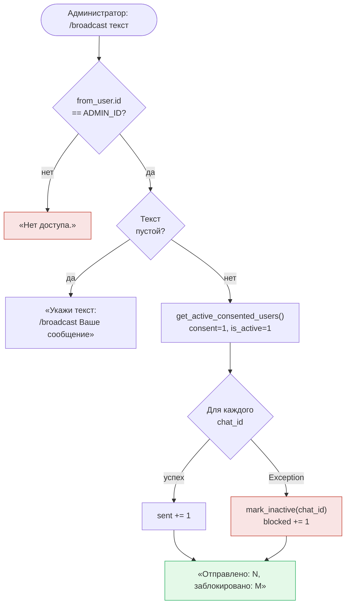

# Команды, /analyze, алерты, журнал сделок, доступ и рассылка

> Ссылки внутри текста вида «см. раздел „…“» ведут на разделы старого CLAUDE.md.
> Теперь они лежат в `памятки/` — ищи раздел по названию (обычно в
> `памятки/журнал-экспериментов.md`).

> Поправки к тексту ниже (сверено с кодом 26.09.2026):
> - при боевом ложном пробое (редакция 23 июня) `/analyze` показывает **пять** пунктов,
>   а не шесть — «силы отбоя» у этих правил нет;
> - в `/subscribe` сейчас три стратегии: 🔴 ложный пробой, 💧 ICT, 📈 пробой уровня
>   (метка ✅ «тренд» из текста про подписку снята 18.09.2026);
> - команды `/settings` в боте нет с 15.09.2026.

### Команды
| Команда | Что делает |
|---|---|
| `/analyze [код]` | **Расклад глазами движка**, а не описание рынка вообще: те же шесть условий и в том же порядке, в каком их проверяет детектор. См. «Команда /analyze». Плюс зоны ликвидности и стакан (DOM — у всех 21 инструмента движка) и AI-разбор поверх (ошибка LLM не критична). |
| `/alert` | Поставить алерт «уведоми при касании уровня»: инструмент (или своя пара — любая монета с BingX) → уровень → подтверждение. Быстрее — колокольчиком в `/analyze`. См. «Алерты». |
| `/myalerts` | Список активных алертов + кнопка удаления на каждый. Сработавший снимается сам. |
| `/subscribe` | Подписка на пару «инструмент + стратегия» (с 15.09.2026): сверху выбор стратегии (🔴 ложный пробой / 💧 ICT / 📈 пробой уровня), под ним «отметить все / снять все» и кнопки по всем 21 инструменту движка с метками обеих стратегий; нажатие переключает выбранную стратегию. Валютные пары в списке ЕСТЬ — с 3 сентября 2026 они снова в движке. |
| `/signals` | Последние сигналы с ценой заявки/стоп/цель, приоритетом и состоянием (📥 заявка стоит / ⏳ в сделке / ⏹ заявка снята / ✅ цель / 🛑 стоп / ⌛ истёк). |
| `/stats` | **Сводная статистика по сигналам** (по всей таблице `signals` пользователя, не по LIMIT): винрейт (tp/(tp+sl)), итог **в R** (риск на сделку = 1R: цель даёт +факт. R:R, стоп = −1R), профит-фактор (плюсы÷минусы; «∞ без стопов»), счётчики цель/стоп/ждём/истекло, **отдельный счётчик неисполненных заявок** и разбивка по инструментам. По умолчанию **за 30 дней**, кнопкой переключается на «за всё время». Ждём/истекло в винрейт и профит-фактор не входят (исход не определён), неисполненные — тоже, но по другой причине: сделки не было вовсе. Считает `bot.compute_signal_stats` над `database.get_signals_since`. |
| `/ict` | **ICT — свип ликвидности и разрыв на часовых свечах** (стратегия №6, в бою с 18.09.2026 вместо тренда; на M15 работала первый день): открытые сигналы и закрытые сделки с итогом в R. Сигналы приходят подписчикам инструмента по стратегии ICT (💧 в `/subscribe`). |
| `/trend` | **Тренд по недельному каналу** (стратегия №4, СНЯТА с боя 17.09.2026 и убрана из подписок 18.09.2026): позиции модели и закрытые сделки. Команда осталась, но из меню убрана — новых входов нет. |
| `/breakout` | **Пробой сильного уровня** (стратегия №5, в бою с 22.09.2026): сколько сигналов насчитано, открытые и закрытые, итог в R. Сигналы приходят подписчикам по крипте, золоту и нефти (📈 в `/subscribe`); по валютным парам считаются молча — см. «Стратегия №5». |
| `/trades` | Журнал сделок пользователя: список со статусом (⏳ открыта / ✅ цель / 🛑 стоп / ☑️ закрыта) + кнопка закрытия на каждую открытую. Записываются свободным текстом через NL-роутер (см. «LLM-интеграция»). |

### Команда `/analyze` — расклад глазами движка

До 20 августа 2026 отчёт описывал рынок вообще: тренд, списки уровней D1 и H1, зоны, стакан.
Полезно, но не отвечало на вопрос, который на самом деле волнует: **что здесь происходит с точки
зрения движка и чего не хватает для сигнала.** Теперь отвечает.

Отчёт идёт по тем же ШЕСТИ условиям и в том же порядке, в каком их проверяет `_detect`:

1. **Тренд дневки** и что он разрешает — «восходящий ↑ — движок берёт только ЛОНГИ».
2. **Ближайшие уровни** сверху и снизу (по три), с пометкой силы (⭐ = сильный), таймфрейма
   и **расстоянием в ATR**. Именно в ATR, а не в процентах: «0.1% от цены» у биткоина и у золота
   значит разное, а «0.1 ATR» — одно и то же. В этой же мерке заданы оба фильтра из `/settings`,
   так что владелец видит ту величину, которую сам и крутит.
3. **Объём последней закрытой свечи** против порога — «0.7× среднего (нужно ×1.5) ❌».
4. **Сила отбоя** — где свеча закрылась внутри своего размаха, отдельно по лонгу и по шорту
   (число у сторон РАЗНОЕ: лонгу нужно закрытие у максимума свечи, шорту — у минимума).
5. **Ложный пробой**: был ли прокол уровня и вернулась ли цена обратно — отдельно по лонгу и по
   шорту (для сторон, которые разрешает тренд).
6. **R:R при входе прямо сейчас** — с риском в ATR и с целью. С 2 сентября 2026 это
   **справка, а не порог**: ни галочки, ни слова «нужно» там больше нет, потому что фильтра
   R:R у движка нет. Число всё равно полезно — по нему видно, тесно впереди или просторно.

Ниже — **итог**: либо «СИГНАЛ ЕСТЬ» с ценой заявки, стопом и целью, либо список того, чего именно
не хватает («объём 0.7× среднего — порог ×1.5», «свеча не заходила за уровень», «риск сделки
1.85 ATR — фильтр «вдогонку» пускает до 0.5»). Затем строка о текущих фильтрах пользователя и
о порогах самого движка (прокол и стоп в ATR), зоны ликвидности и стакан.

Блокер «до ближайшей цели всего 1:X» из этого списка **убран** вместе с фильтром R:R. Зато
добавлен блокер «ATR нулевой»: в детекторе это ранний выход, значит и в разборе обязан быть
блокер — иначе отчёт скажет «условия сложились» там, где движок молчит.

**Колокольчики (26 августа 2026).** У каждой цены в пункте 2 стоит 🔔, а под отчётом — кнопка
на этот уровень: нажал и получишь уведомление, когда цена до него дойдёт. Уровни движок уже
посчитал, поэтому число не вводится руками. Если алерт на уровень уже стоит, вместо 🔔 стоит ✅,
и нажатие его снимет. Порядок кнопок и строк даёт общий `bot._alert_levels(ex)` — чтобы кнопка
и строка над ней не разъехались. Подробности — в разделе «Алерты».

**Как это устроено в коде.** Считает `pattern_detector.explain(df, levels, trend, settings)` —
те же проверки, те же числа, но вместо «сигнал / не сигнал» возвращается разбор с блокерами.
Формат отчёта — `bot._format_engine_view`, промпт для AI — `bot._analysis_prompt`.

Две страховки от того, чтобы `/analyze` начал врать:
- `explain` живёт в одном файле с `_detect` — правка условий там обязана отражаться здесь;
- тест `test_explain_agrees_with_detector` гоняет обе функции на одних данных при разных фильтрах
  и сверяет вердикт;
- вдобавок `_do_analyze` вызывает **настоящий детектор** и при сигнале печатает ЕГО числа
  (заявка/стоп/цель), а не собственные пересчёты.

**AI-разбор** (`llm.ANALYST_PROMPT`) переписан под этот отчёт: модели запрещено пересказывать
числа (пользователь их только что прочитал) — её просят объяснить расклад: далеко ли инструмент
от сетапа, какое событие его создаст (какой уровень проколоть, с каким объёмом), что его отменит
и стоит ли вообще сейчас держать инструмент на виду.


## Алерты
### Алерты «касание уровня» (убраны 20 августа 2026, вернулись 26 августа)

Алерт — это «скажи, когда цена дойдёт сюда». Он ничего не советует и с движком не связан:
сигналы Spring/Upthrust живут отдельно и по своим правилам. Убирались вместе со всем, что
не движок; возвращены по просьбе владельца — уже на биржевой цене.

**Главное отличие от прежней версии — источник цены.** Раньше касание проверялось по
минутным свечам Yahoo, а движок с 19 августа считает уровни по фьючерсам BingX. Это разные
графики: у золота, TON и валютных пар на BingX синтетические контракты (`NCCOGOLD2USD`,
`GRAMTON`, `NCFX*`), у Yahoo — свои котировки. Алерт на уровень из `/analyze` срабатывал бы
не там, где этот уровень нарисован. Теперь цена берётся тем же путём, что и уровни:

| инструмент | источник цены алерта |
|---|---|
| все 21 инструмента реестра | минутные свечи BingX (`config.ALERT_TIMEFRAME`) |
| «своя пара» (любой контракт BingX) | минутные свечи BingX по её символу |

Обе строки ведут в `scheduler.alert_window(pair)`, он же используется и в UI: показать одну
цену, а сработать по другой было бы враньём. С уходом Yahoo (26 августа, тот же день) развилка
внутри исчезла совсем — источник остался один.

**Как поставить — два пути:**
- **колокольчик в `/analyze`** — под отчётом кнопка на каждый показанный уровень, в тексте
  у каждой цены стоит 🔔 (или ✅, если алерт уже стоит). Число вводить не надо: движок эти
  уровни уже посчитал. Повторное нажатие снимает алерт. Цена едет в `callback_data`
  (`alrt:{код}:{цена}`), оттуда же берётся при перерисовке клавиатуры — пересчитывать весь
  отчёт ради одной галочки незачем;
- **вручную `/alert`** — FSM как был: инструмент (или своя пара — любая монета с BingX) →
  уровень → подтверждение. Плюс словами через NL-роутер: «алерт золото 2400», «мои алерты».

Список и удаление — `/myalerts`. Сработавший алерт снимается сам (`is_triggered = 1`).

**Правило срабатывания — `alerts.py`, и оно не про последнюю цену.** Проверка идёт раз в
5 минут; если цена за это время сходила к уровню фитилём и вернулась, точка это пропустит.
Поэтому смотрим ДИАПАЗОН минутных свечей за период: `touched` — уровень побывал внутри
[low; high]; `crossed` — цена оказалась по другую сторону, чем была (запасной признак на
разрыв, у валютных пар после выходных такое бывает).

**Первая проверка алерт ВЗВОДИТ, а не срабатывает** (`start_above IS NULL` → запоминаем
сторону цены). Это не задержка ради задержки: окно свечей смотрит назад, и без такого шага
свежий алерт сработал бы на диапазоне, который был ДО его постановки. Плата — касание в
первые 5 минут жизни алерта не поймается.

**Таблица `alerts` в боевой базе цела с прошлого раза** — её тогда намеренно не дропали
(`DROP` необратим), поэтому старые записи на месте, а `CREATE TABLE IF NOT EXISTS` их не
трогает. На свежей базе таблица создаётся заново.

**Доавгустовские алерты погашены разовой миграцией** (`init_db`, решение владельца): шесть
дней их никто не проверял, а сторона цены (`start_above`) записана у них ещё по котировкам
Yahoo — на биржевой цене половина сработала бы в первую же минуту после деплоя и завалила
людей уведомлениями по забытым уровням. Гасим (`is_triggered = 1`), а не удаляем: строки
остаются, `DELETE` так же необратим, как `DROP`. Условие `created_at < 2026-08-26` делает
миграцию самоограниченной — задеть алерт, поставленный после возврата функции, она не может,
поэтому спокойно выполняется при каждом старте и не нуждается во флаге «уже отработала».


## Подписка по стратегиям (раздел от 15.09.2026)

Из раздела «Ложный пробой: правила 23 июня и галочки стратегий».

**Подписка по стратегиям в `/subscribe`** — пара «инструмент + стратегия»: одну монету можно
вести по ложному пробою, другую по тренду (просьба владельца по скриншоту первой версии).
Сверху выбор стратегии, которую настраиваешь (👉 — выбрана; метки 🔴 ложный пробой и ✅
тренд — `bot.STRATEGY_MARK`, красной галочки среди эмодзи нет), под ним «отметить все /
снять все» и сетка инструментов. На кнопке инструмента видны метки ОБЕИХ стратегий
(«🔴✅ BTC»), нажатие переключает только выбранную. Выбранная стратегия едет в
`callback_data` (`subtab:` / `suball:` / `sub:`), состояния на сервере нет. NL-роутер
(«подпиши на эфир») подписывает по обеим. Рассылка — `database.get_subscribers(instrument,
strategy)`.

Хранение — таблица `signal_subscriptions`. Первая версия того же дня (общие галочки
стратегий поверх подписки на инструмент, таблица `strategy_off`) прожила несколько часов.
При создании `signal_subscriptions` старые подписки мигрируют **один раз**: каждая — по
обеим стратегиям, кроме выключенных в `strategy_off`. Условие — «таблицы ещё нет», а не
«таблица пустая»: иначе человек, снявший все подписки, получил бы их обратно при рестарте.
Таблица `subscriptions` с этого дня не пишется и не читается, но не дропнута.

Исход уже отправленного сигнала ложного пробоя уходит его владельцу и после отписки;
сообщения тренда о стопе и выходе — нет, они идут текущим подписчикам тренда.


## Доступ, согласие и рассылка (раздел «Архитектура»)
## Архитектура

Текущий функционал (команды, inline-меню) описан в [схема.md](схема.md).

### Система уведомлений (планировщик + рассылка)

Фоновых задач у бота теперь ровно шесть, и все они принадлежат движку (`scheduler.setup`) —
своего планировщика у `bot.py` больше нет. Подробности — в разделе «Планировщик».

#### Управление согласием и рассылка

| Команда | Кто | Что делает |
|---|---|---|
| `/start` | любой | `save_user()` + запрос согласия (inline-кнопки) |
| `/privacy` | любой | Текст политики конфиденциальности |
| `/unsubscribe` | любой | `set_consent(chat_id, 0)` — отключает уведомления |
| `/myid` | любой | Отвечает своим `chat_id` (нужен для настройки `ADMIN_ID`) |
| `/write` | одобренный | Написать админу: бот пересылает сообщение в чат `ADMIN_ID`. Админ отвечает обычным **reply** на это сообщение в боте — ответ уходит автору (адресат ищется по `(id …)` в тексте пересланного сообщения) |
| `/requests` | только ADMIN_ID | Список ожидающих заявок на доступ с кнопками одобрения/отклонения |
| `/users` | только ADMIN_ID | Список всех пользователей со статусами (⏳ ждёт / ✅ одобрен / 🚫 отклонён, 🔇 — заблокировал бота) + кнопка на каждого: бан одобренному / выдать доступ остальным |
| `/ban <id>` | только ADMIN_ID | Снять доступ у пользователя (`access='denied'`), уведомить его |
| `/unban <id>` | только ADMIN_ID | Вернуть доступ (`access='approved'`), уведомить пользователя |
| `/broadcast текст` | только ADMIN_ID | Рассылка всем `consent=1, is_active=1` пользователям |

#### Переменная `ADMIN_ID` в `.env`

```
ADMIN_ID=123456789   # Telegram ID администратора
```

Читается при старте: `ADMIN_ID = int(os.getenv("ADMIN_ID"))`. Если не задана — `/broadcast` недоступен всем. Узнать свой ID: команда `/myid` в боте.

#### Логика `/broadcast`



