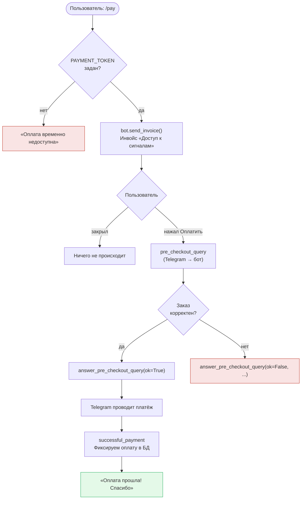

# Приём оплаты (`/pay`)

> Код есть (`bot.py`: `send_invoice`, `pre_checkout_query`), токен тестовый.

## Приём оплаты

### Общее

Telegram Payments — встроенный механизм оплаты внутри Telegram. Работает через платёжного провайдера (ЮKassa, Robokassa и др.). Бот выставляет инвойс, пользователь платит не выходя из мессенджера.

Цены передаются в **копейках** (целое число): 100 рублей = `10000`.

### Переменная `PAYMENT_TOKEN` в `.env`

```
PAYMENT_TOKEN=381764678:TEST:...   # тестовый токен от BotFather
```

- **Тестовый токен** — содержит `:TEST:` в середине. Деньги не списываются, карту можно указать любую из тестового набора Telegram.
- **Боевой токен** — получить через BotFather → Payments → выбрать провайдера (ЮKassa или Robokassa). Требуется статус самозанятого или ИП, договор с провайдером.

Читается при старте: `PAYMENT_TOKEN = os.getenv("PAYMENT_TOKEN")`. Если не задан — команда `/pay` отвечает «Оплата временно недоступна».

### Команда `/pay`

Отправляет пользователю инвойс через `bot.send_invoice()`:

| Параметр | Значение |
|---|---|
| `title` | Название продукта («Доступ к сигналам») |
| `description` | Краткое описание |
| `payload` | Внутренний идентификатор (`"signals_access_30d"`) |
| `provider_token` | `PAYMENT_TOKEN` из `.env` |
| `currency` | `"RUB"` |
| `prices` | Список `LabeledPrice` в копейках |

### Обработчики

| Обработчик | Тип | Что делает |
|---|---|---|
| `pre_checkout_query` | `PreCheckoutQuery` | Подтверждает корректность заказа — обязательно вызвать `answer_pre_checkout_query(ok=True)` в течение 10 сек, иначе платёж отменяется |
| `successful_payment` | `Message` (content_type=SUCCESSFUL_PAYMENT) | Фиксирует факт оплаты; `message.successful_payment` содержит детали транзакции |

### Схема флоу `/pay`



### Тестирование

В тестовом режиме (токен содержит `:TEST:`) Telegram показывает форму с тестовыми картами. Реальные деньги не списываются. Переключение на боевой режим — только замена `PAYMENT_TOKEN` в `.env`.

### Путь к боевому токену

1. Оформить статус самозанятого (приложение «Мой налог»).
2. Зарегистрироваться в ЮKassa или Robokassa и заключить договор.
3. В BotFather: **Payments** → выбрать провайдера → получить токен.
4. Заменить тестовый `PAYMENT_TOKEN` на боевой в `.env`.

