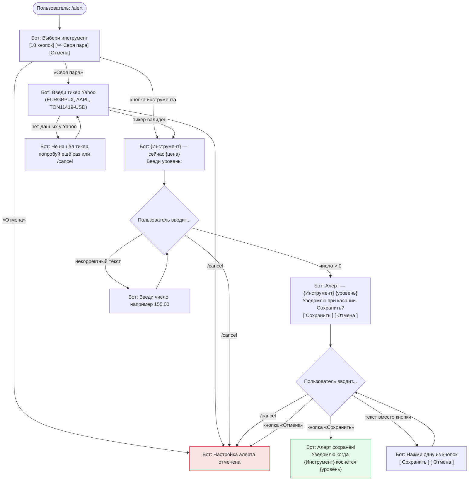

# Сценарий: настройка алерта /alert

Состояния FSM: `waiting_pair` → (`waiting_custom_pair`) → `waiting_rate` → `waiting_confirm`.
Алерт срабатывает при **касании** уровня (направление выбирать не нужно). Алертов можно поставить
сколько угодно, на разные инструменты. Управление — `/myalerts`.

## Заметки
- **Актуальная цена** показывается сразу после выбора инструмента (и для своей пары). Запрос к
  Yahoo делается только для выбранной пары — на этапе списка кнопок запросов нет.
- **Своя пара** — любой тикер Yahoo Finance. Проверяется на лету через `get_price_window`: если
  данных нет — отлуп с просьбой ввести заново.
- **Точность** уровня: фиксированная для реестровых пар (USD/JPY — 2 знака, EUR/USD — 4), для своей
  пары подбирается по величине цены (`infer_decimals`).
- Запись создаётся через `add_alert(user_id, pair, threshold)` со `start_above = NULL`; сторону цены
  относительно уровня проставит первая проверка планировщика.
