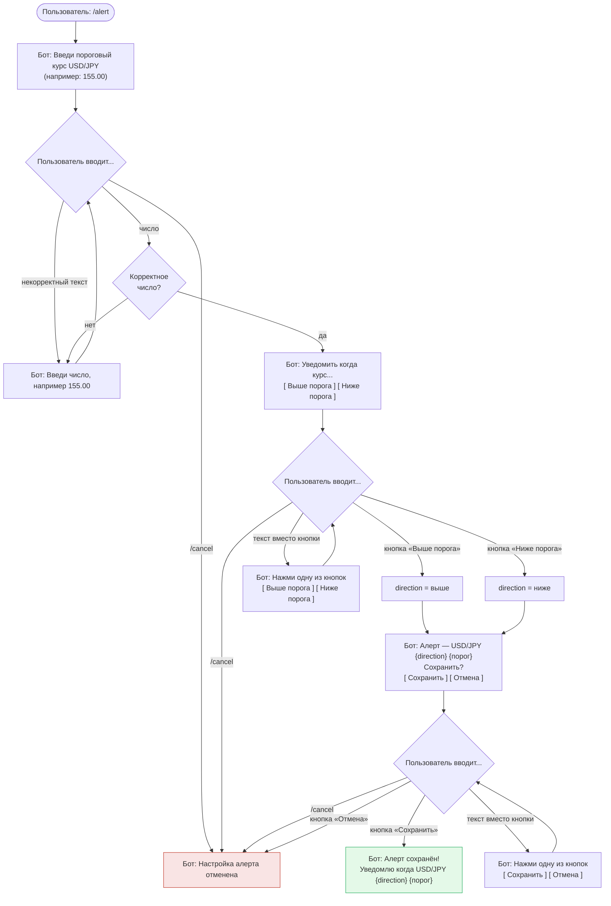

# Сценарий: настройка алерта /alert

```mermaid
flowchart TD
    START(["Пользователь: /alert"])

    START --> ASK_RATE["Бот: Введи пороговый курс USD/JPY\n(например: 155.00)"]

    ASK_RATE --> INPUT_RATE{Пользователь вводит...}

    INPUT_RATE -->|"/cancel"| CANCELLED["Бот: Настройка алерта отменена"]
    INPUT_RATE -->|число| VALIDATE{Корректное\nчисло?}
    INPUT_RATE -->|некорректный текст| ERR_RATE["Бот: Введи число, например 155.00"]
    ERR_RATE --> INPUT_RATE

    VALIDATE -->|нет| ERR_RATE
    VALIDATE -->|да| ASK_DIR["Бот: Уведомить когда курс...\n[ Выше порога ] [ Ниже порога ]"]

    ASK_DIR --> INPUT_DIR{Пользователь вводит...}

    INPUT_DIR -->|"/cancel"| CANCELLED
    INPUT_DIR -->|кнопка «Выше порога»| DIR_ABOVE["direction = выше"]
    INPUT_DIR -->|кнопка «Ниже порога»| DIR_BELOW["direction = ниже"]
    INPUT_DIR -->|текст вместо кнопки| ERR_DIR["Бот: Нажми одну из кнопок\n[ Выше порога ] [ Ниже порога ]"]
    ERR_DIR --> INPUT_DIR

    DIR_ABOVE --> CONFIRM
    DIR_BELOW --> CONFIRM

    CONFIRM["Бот: Алерт — USD/JPY {direction} {порог}\nСохранить?\n[ Сохранить ] [ Отмена ]"]

    CONFIRM --> INPUT_CONFIRM{Пользователь вводит...}

    INPUT_CONFIRM -->|"/cancel"| CANCELLED
    INPUT_CONFIRM -->|кнопка «Сохранить»| SAVED["Бот: Алерт сохранён!\nУведомлю когда USD/JPY {direction} {порог}"]
    INPUT_CONFIRM -->|кнопка «Отмена»| CANCELLED
    INPUT_CONFIRM -->|текст вместо кнопки| ERR_CONFIRM["Бот: Нажми одну из кнопок\n[ Сохранить ] [ Отмена ]"]
    ERR_CONFIRM --> INPUT_CONFIRM

    CANCELLED:::cancel
    SAVED:::success

    classDef cancel fill:#f9e4e4,stroke:#c0392b,color:#333
    classDef success fill:#e4f9e8,stroke:#27ae60,color:#333
```
