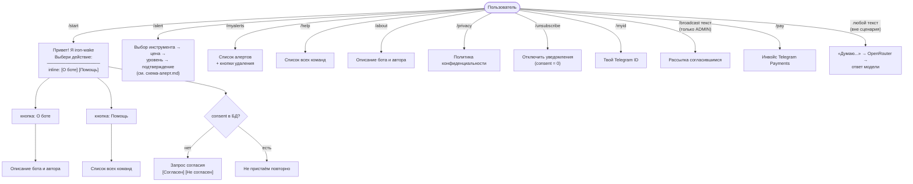
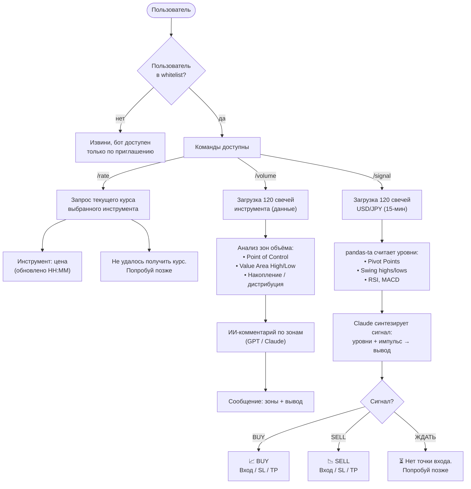

# Схема бота iron-wake

Текущее состояние + планируемый функционал.

## Статусы
- ✅ **готово** — реализовано и работает
- 🔲 **планируется** — в разработке

---

## Текущий функционал ✅

Фоном: `check_alerts()` каждые 5 минут проверяет активные алерты (см. CLAUDE.md → Система уведомлений).

---

## Планируемый функционал 🔲

---

## Заметки

### Текущий функционал
- **Алерты** на касание уровня, много на пользователя, по 10 готовым инструментам + своя пара
  (тикер Yahoo). Детали — `схема-алерт.md` и CLAUDE.md.
- Свободный текст (вне сценария) уходит в **OpenRouter** (LLM), не эхо.
- Согласие на обработку данных запрашивается один раз; повторный `/start` не пристаёт кнопкой.

### Планируемый функционал
- **Whitelist** — список разрешённых user_id хранится в конфиге или `.env`. Бот игнорирует всех, кого нет в списке.
- **`/rate`** — текущая цена выбранного инструмента по запросу (yfinance уже подключён).
- **`/volume`** — анализирует 120 свечей на выбранном таймфрейме, строит зоны объёма (POC, VAH, VAL), затем передаёт данные в ИИ для текстового вывода.
- **`/signal`** — запрашивает 120 свечей (15-мин), `pandas-ta` считает Pivot Points, swing highs/lows, RSI, MACD. Результаты передаются Claude — он синтезирует сигнал: BUY / SELL / ЖДАТЬ + точка входа + Stop Loss + Take Profit. Математику делает код, ИИ интерпретирует.
