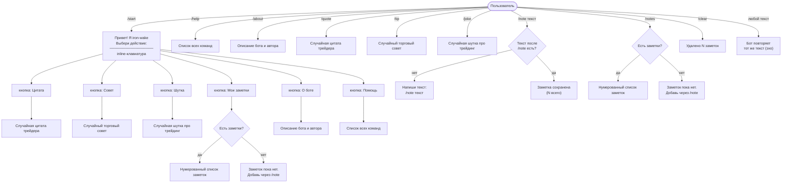
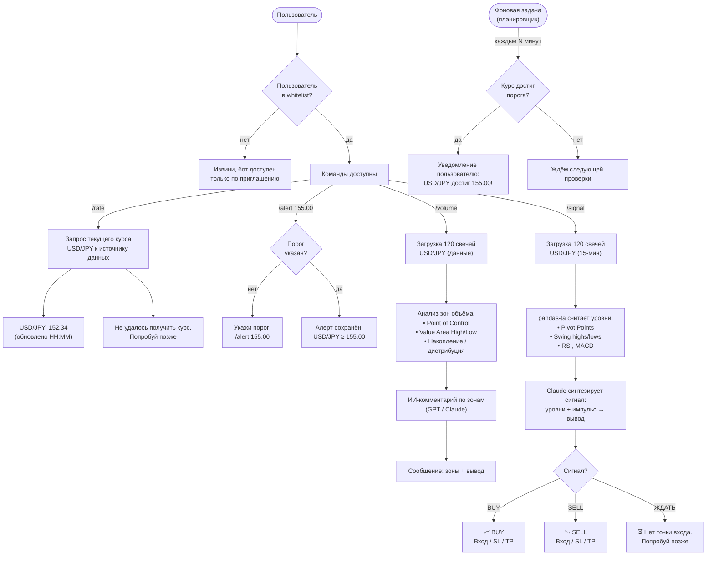

# Схема бота iron-wake

Текущее состояние + планируемый функционал.

## Статусы
- ✅ **готово** — реализовано и работает
- 🔲 **планируется** — в разработке

---

## Текущий функционал ✅

---

## Планируемый функционал 🔲

---

## Заметки

### Текущий функционал
- Заметки хранятся **в памяти процесса** — при перезапуске бота пропадают.
- Команды `/quote`, `/tip`, `/joke` и соответствующие inline-кнопки делают одно и то же.
- Эхо срабатывает на **любое текстовое сообщение**, которое не распознано как команда.

### Планируемый функционал
- **Whitelist** — список разрешённых user_id хранится в конфиге или `.env`. Бот игнорирует всех, кого нет в списке.
- **`/rate`** — источник данных TBD (ccxt, yfinance или другой). Курс запрашивается в момент команды.
- **`/alert`** — пороги хранятся per-user, фоновая задача проверяет курс периодически (например, раз в минуту). После срабатывания алерт сбрасывается или переспрашивает пользователя.
- **`/volume`** — анализирует 120 свечей на выбранном таймфрейме, строит зоны объёма (POC, VAH, VAL), затем передаёт данные в ИИ для текстового вывода.
- **`/signal`** — запрашивает 120 свечей (15-мин), `pandas-ta` считает Pivot Points, swing highs/lows, RSI, MACD. Результаты передаются Claude — он синтезирует сигнал: BUY / SELL / ЖДАТЬ + точка входа + Stop Loss + Take Profit. Математику делает код, ИИ интерпретирует.
