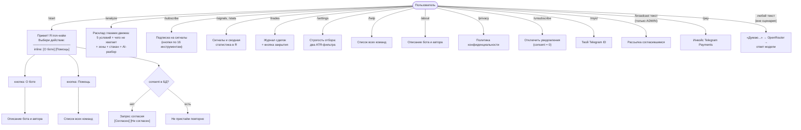
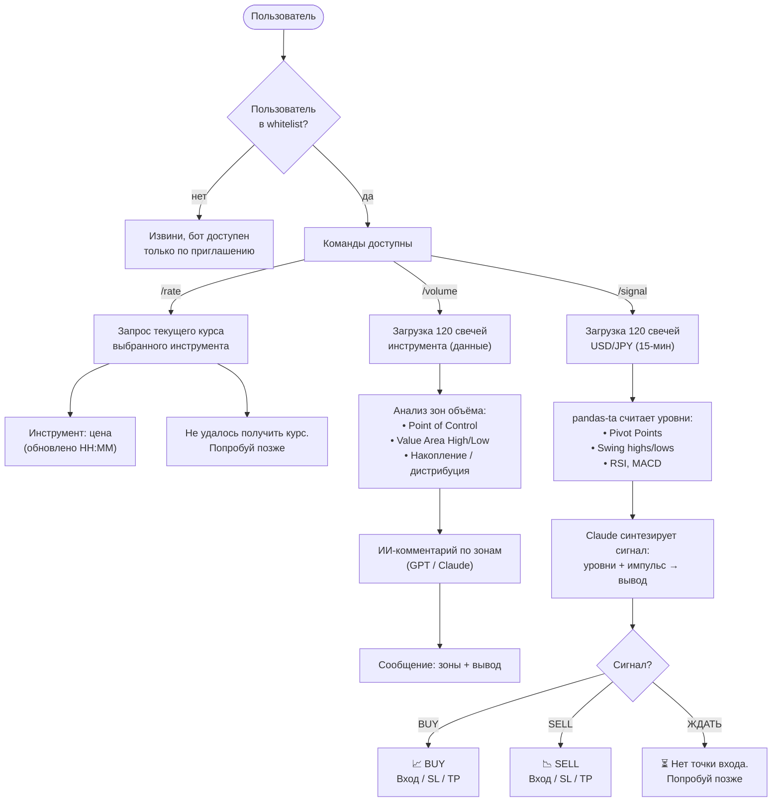

# Схема бота iron-wake

Текущее состояние + планируемый функционал.

## Статусы
- ✅ **готово** — реализовано и работает
- 🔲 **планируется** — в разработке

---

## Текущий функционал ✅

```mermaid
flowchart TD
    U(["Пользователь"])

    %% /start и inline-меню
    U -->|"/start"| START["Привет! Я iron-wake\nВыбери действие:\n─────────────────\ninline: [О боте] [Помощь]"]
    START --> BA["кнопка: О боте"]
    START --> BH["кнопка: Помощь"]
    BA --> RA["Описание бота и автора"]
    BH --> RH["Список всех команд"]

    %% Согласие
    START --> CONSENT{consent в БД?}
    CONSENT -->|нет| ASKC["Запрос согласия\n[Согласен] [Не согласен]"]
    CONSENT -->|есть| SKIP["Не пристаём повторно"]

    %% Торговый движок
    U -->|"/analyze"| ANALYZE["Расклад глазами движка:\n5 условий + чего не хватает\n+ зоны + стакан + AI-разбор"]
    U -->|"/subscribe"| SUB["Подписка на сигналы\n(кнопки по 16 инструментам)"]
    U -->|"/signals, /stats"| SIG["Сигналы и сводная\nстатистика в R"]
    U -->|"/trades"| TR["Журнал сделок\n+ кнопка закрытия"]
    U -->|"/settings"| SET["Строгость отбора:\nдва ATR-фильтра"]

    %% Команды
    U -->|"/help"| HELP["Список всех команд"]
    U -->|"/about"| ABOUT["Описание бота и автора"]
    U -->|"/privacy"| PRIV["Политика конфиденциальности"]
    U -->|"/unsubscribe"| UNSUB["Отключить уведомления\n(consent = 0)"]
    U -->|"/myid"| MYID["Твой Telegram ID"]
    U -->|"/broadcast текст\n(только ADMIN)"| BC["Рассылка согласившимся"]
    U -->|"/pay"| PAY["Инвойс Telegram Payments"]

    %% Свободный текст
    U -->|"любой текст\n(вне сценария)"| LLM["«Думаю...» → OpenRouter →\nответ модели"]
```

Фоном (планировщик движка, `scheduler.setup`): контекстный анализ раз в час, поиск сигналов,
трекинг их исхода и трекинг сделок журнала — каждые 5 минут (см. CLAUDE.md → Планировщик).

---

## Планируемый функционал 🔲

```mermaid
flowchart TD
    U(["Пользователь"])

    %% Whitelist
    U --> WL{Пользователь\nв whitelist?}
    WL -->|нет| DENY["Извини, бот доступен\nтолько по приглашению"]
    WL -->|да| CMD["Команды доступны"]

    %% /rate
    CMD -->|"/rate"| RATE["Запрос текущего курса\nвыбранного инструмента"]
    RATE --> RATE_OK["Инструмент: цена\n(обновлено HH:MM)"]
    RATE --> RATE_ERR["Не удалось получить курс.\nПопробуй позже"]

    %% /volume
    CMD -->|"/volume"| VOL["Загрузка 120 свечей\nинструмента (данные)"]
    VOL --> VOL_CALC["Анализ зон объёма:\n• Point of Control\n• Value Area High/Low\n• Накопление / дистрибуция"]
    VOL_CALC --> VOL_AI["ИИ-комментарий по зонам\n(GPT / Claude)"]
    VOL_AI --> VOL_OUT["Сообщение: зоны + вывод"]

    %% /signal
    CMD -->|"/signal"| SIG_FETCH["Загрузка 120 свечей\nUSD/JPY (15-мин)"]
    SIG_FETCH --> SIG_CALC["pandas-ta считает уровни:\n• Pivot Points\n• Swing highs/lows\n• RSI, MACD"]
    SIG_CALC --> SIG_AI["Claude синтезирует сигнал:\nуровни + импульс → вывод"]
    SIG_AI --> SIG_OUT{Сигнал?}
    SIG_OUT -->|BUY| SIG_BUY["📈 BUY\nВход / SL / TP"]
    SIG_OUT -->|SELL| SIG_SELL["📉 SELL\nВход / SL / TP"]
    SIG_OUT -->|ЖДАТЬ| SIG_WAIT["⏳ Нет точки входа.\nПопробуй позже"]
```

---

## Заметки

### Текущий функционал
- **Торговый движок** по 16 фьючерсам BingX: контекст, сигналы Spring/Upthrust с ценой лимитной
  заявки, трекинг исхода в две ступени, журнал сделок. Детали — CLAUDE.md.
- **Простые алерты «касание уровня» убраны** 20 августа 2026. Таблица `alerts` в боевой базе
  цела, но код в неё не ходит.
- Свободный текст (вне сценария) уходит в **OpenRouter** (LLM), не эхо.
- Согласие на обработку данных запрашивается один раз; повторный `/start` не пристаёт кнопкой.

### Планируемый функционал
- **Whitelist** — список разрешённых user_id хранится в конфиге или `.env`. Бот игнорирует всех, кого нет в списке.
- **`/rate`** — текущая цена выбранного инструмента по запросу (yfinance уже подключён).
- **`/volume`** — анализирует 120 свечей на выбранном таймфрейме, строит зоны объёма (POC, VAH, VAL), затем передаёт данные в ИИ для текстового вывода.
- **`/signal`** — запрашивает 120 свечей (15-мин), `pandas-ta` считает Pivot Points, swing highs/lows, RSI, MACD. Результаты передаются Claude — он синтезирует сигнал: BUY / SELL / ЖДАТЬ + точка входа + Stop Loss + Take Profit. Математику делает код, ИИ интерпретирует.
